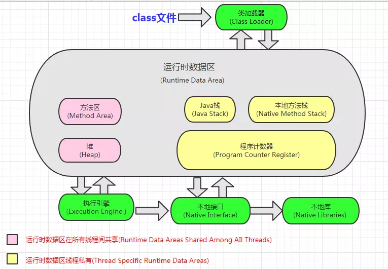
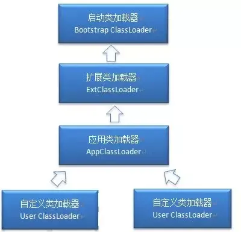
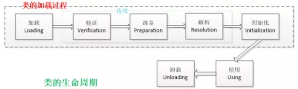

# JVM 面试的 30 个知识点

## 1. 什么是 Java 虚拟机？为什么 Java 被称作是 “平台无关的编程语言”？

Java 虚拟机（JVM）是一个可以执行 Java 字节码的虚拟机进程。Java 源文件被编译成能被 Java 虚拟机执行的字节码文件。

Java 被设计成允许应用程序可以运行在任意的平台，而不需要程序员为每一个平台单独重写或者是重新编译。Java 虚拟机让这个变为可能，因为它知道底层硬件平台的指令长度和其他特性。

## 2. Java 内存结构？



方法区和堆是所有线程共享的内存区域；而 Java 栈、本地方法栈和程序计数器是运行时线程私有的内存区域。

## 3. 内存模型以及分区，需要详细到每个区放什么？

JVM 分为堆区、栈区和方法区等。初始化的对象放在堆里面，引用放在栈里面，Class 类信息、常量池（`static` 常量和 `static` 变量）等放在方法区：

- **方法区（Method Area）**：线程共享。存储类信息、运行时常量池（包含 `static` 常量与变量）、编译后的 JIT 代码等。
- **堆（Heap）**：线程共享。存储初始化的对象实例与数组，是垃圾回收的主要区域。
- **Java 虚拟机栈（JVM Stack）**：线程私有。由栈帧组成，每个方法调用均压入一帧。栈帧包含局部变量表（存放 8 大基本类型与引用类型指针）、操作数栈、动态链接、方法出口等。
- **本地方法栈（Native Method Stack）**：线程私有。主要为虚拟机调用的 Native 方法服务。
- **程序计数器（Program Counter Register）**：线程私有。记录当前线程正在执行的字节码指令地址或行号。

## 4. 堆里面的分区：Eden，Survivor（From + To），老年代，各自的特点？

堆里面分为新生代和老生代（Java 8 取消了永久代，采用了 Metaspace）。新生代包含 Eden + Survivor 区，Survivor 区分为 From 和 To 区：

- 内存回收时，如果用的是复制算法，从 From 复制到 To，当经过一次或者多次 GC 之后，存活下来的对象会被移动到老年代；
- 当 JVM 内存不够用的时候，会触发 Full GC，清理老年代；
- 当新生代满了之后会触发 Young GC，先把存活的对象放到其中一个 Survivor 区，然后进行垃圾清理。

因为如果仅仅清理需要删除的对象，会导致内存碎片，因此一般会把 Eden 进行完全的清理，然后整理内存。下次 GC 的时候，就会使用下一个 Survivor，循环使用。

如果有特别大的对象，新生代放不下，就会使用老年代的担保，直接放到老年代里面。因为 JVM 认为，一般大对象的存活时间通常比较长。

## 5. 解释内存中的栈 (stack)、堆 (heap) 和方法区 (method area) 的用法

通常我们定义一个基本数据类型的变量、一个对象的引用，以及函数调用的现场保存都使用 JVM 中的栈空间；而通过 `new` 关键字和构造器创建的对象则放在堆空间。

堆是垃圾收集器管理的主要区域，由于现在的垃圾收集器都采用分代收集算法，所以堆空间还可以细分为新生代和老生代，再具体一点可以分为 Eden、Survivor（又可分为 From Survivor 和 To Survivor）、Tenured。

方法区和堆都是各个线程共享的内存区域，用于存储已经被 JVM 加载的类信息、常量、静态变量、JIT 编译器编译后的代码等数据；程序中的字面量（literal）如直接书写的 `100`、`"hello"` 和常量都是放在常量池中，常量池是方法区的一部分。

栈空间操作起来最快但是栈很小，通常大量的对象都是放在堆空间。栈和堆的大小都可以通过 JVM 的启动参数来进行调整，栈空间用光了会引发 `StackOverflowError`，而堆和常量池空间不足则会引发 `OutOfMemoryError`。

```java
String str = new String("hello");
```

上面的语句中变量 `str` 放在栈上，用 `new` 创建出来的字符串对象放在堆上，而 `"hello"` 这个字面量是放在方法区的。

- **补充 1**：较新版本的 Java（从 Java 6 的某个更新开始）中，由于 JIT 编译器的发展和“逃逸分析”技术的逐渐成熟，栈上分配、标量替换等优化技术使得对象一定分配在堆上这件事情已经变得不那么绝对了。
- **补充 2**：运行时常量池相当于 Class 文件常量池，具有动态性。Java 语言并不要求常量一定只有编译期间才能产生，运行期间也可以将新的常量放入池中，String 类的 `intern()` 方法就是这样的。试看如下代码：

```java
String s1 = new StringBuilder("go")
    .append("od").toString();
System.out.println(s1.intern() == s1);

String s2 = new StringBuilder("ja")
    .append("va").toString();
System.out.println(s2.intern() == s2);
```

## 6. GC 的两种判定方法？

- **引用计数法**：指的是如果某个地方引用了这个对象就 +1，如果失效了就 -1，当为 0 时就会回收。但是 JVM 没有用这种方式，因为无法解决相互循环引用（A 引用 B，B 引用 A）的情况。
- **可达性分析法（引用链法）**：通过一种被称为 GC Roots 的对象（如方法区中静态变量引用的对象等）作为起点开始向下搜索，如果一条链能够到达 GC Roots 就说明对象存活，如果不能到达 GC Roots 就说明可以回收。

## 7. SafePoint 是什么？

在 GC 的时候必须要等到 Java 线程都进入到 SafePoint 的时候 VMThread 才能开始执行 GC。SafePoint 的主要位置包括：

1. 循环的末尾（防止大循环的时候一直不进入 SafePoint，而其他线程在等待它进入 SafePoint）；
2. 方法返回前；
3. 调用方法的 call 之后；
4. 抛出异常的位置。

## 8. GC 的三种收集方法：标记清除、标记整理、复制算法的原理与特点，分别用在什么地方，如果让你优化收集方法，有什么思路？

- **标记-清除算法**：先标记，标记完毕之后再清除。效率不高，且会产生内存碎片。
- **复制算法**：将内存按比例划分为 Eden 区和 Survivor 区（如 8:1），在清理时将存活对象复制到另一块未使用的内存中。常用于新生代的 Young GC。
- **标记-整理算法**：标记完毕之后，让所有存活的对象向一端移动，然后直接清理掉端边界以外的内存。常用于老年代的 GC。

## 9. GC 收集器有哪些？CMS 收集器与 G1 收集器的特点？

- **串行收集器（Serial）**：使用一个单独的线程进行垃圾收集，GC 时服务有停顿时间；
- **并行收集器（Parallel）**：在次要回收（Young GC）中使用多线程来执行；
- **CMS 收集器**：基于“标记-清除”算法实现的，经过多次标记才会被清除，以获取最短回收停顿时间为目标；
- **G1 收集器**：从整体来看是基于“标记-整理”算法实现的收集器，从局部（两个 Region 之间）上来看是基于“复制”算法实现的。

## 10. Minor GC 与 Full GC 分别在什么时候发生？

- **Minor GC（YGC）**：在新生代内存不够用的时候发生；
- **Full GC（FGC）**：在老年代或整个 JVM 内存不够用的时候发生。

## 11. 几种常用的内存调试工具：jmap、jstack、jconsole、jhat？

- **jstack**：查看当前 Java 线程栈的情况；
- **jmap**：查看堆内存使用情况及生成堆 Dump 文件；
- **jhat**：进行 Dump 堆信息的分析；
- **MAT**：Eclipse Memory Analyzer 内存分析工具。

## 12. 什么是类的加载

类的加载指的是将类的 `.class` 文件中的二进制数据读入到内存中，将其放在运行时数据区的方法区内，然后在堆区创建一个 `java.lang.Class` 对象，用来封装类在方法区内的数据结构。

类的加载的最终产品是位于堆区中的 `Class` 对象，`Class` 对象封装了类在方法区内的数据结构，并且向 Java 程序员提供了访问方法区内的数据结构的接口。

## 13. 类加载器



- **启动类加载器（Bootstrap ClassLoader）**：负责加载存放在 `JDK\jre\lib` 下，或被 `-Xbootclasspath` 参数指定的路径中的，并且能被虚拟机识别的类库；
- **扩展类加载器（Extension ClassLoader）**：由 `sun.misc.Launcher$ExtClassLoader` 实现，它负责加载 `JDK\jre\lib\ext` 目录中，或者由 `java.ext.dirs` 系统变量指定的路径中的所有类库（如 `javax.*` 开头的类）；
- **应用程序类加载器（Application ClassLoader）**：由 `sun.misc.Launcher$AppClassLoader` 实现，它负责加载用户类路径（ClassPath）所指定的类。

## 14. 描述一下 JVM 加载 class 文件的原理机制？

JVM 中类的装载是由类加载器（ClassLoader）和它的子类来实现的，Java 中的类加载器是一个重要的 Java 运行时系统组件，它负责在运行时查找和装入类文件中的类。

由于 Java 的跨平台性，经过编译的 Java 源程序并不是一个可执行程序，而是一个或多个类文件。当 Java 程序需要使用某个类时，JVM 会确保这个类已经被加载、连接（验证、准备和解析）和初始化。

类的加载是指把类的 `.class` 文件中的数据读入到内存中，通常是创建一个字节数组读入 `.class` 文件，然后产生与所加载类对应的 Class 对象。当类被加载后就进入连接阶段，这一阶段包括验证、准备（为静态变量分配内存并设置默认的初始值）和解析（将符号引用替换为直接引用）三个步骤。最后 JVM 对类进行初始化：

1. 如果类存在直接的父类并且这个类还没有被初始化，那么就先初始化父类；
2. 如果类中存在初始化语句，就依次执行这些初始化语句。

从 Java 2（JDK 1.2）开始，类加载过程采取了双亲委派机制（PDM）。在 该机制中，JVM 自带的 Bootstrap 是根加载器，其他的加载器都有且仅有一个父类加载器。类的加载首先请求父类加载器加载，父类加载器无能为力时才由其子类加载器自行加载：

- **Bootstrap**：用本地代码实现，负责加载 JVM 基础核心类库（如 `rt.jar`）；
- **Extension**：从 `java.ext.dirs` 系统属性所指定的目录中加载类库，它的父加载器是 Bootstrap；
- **System**：又叫应用类加载器，其父类是 Extension。它从环境变量 classpath 或者系统属性 `java.class.path` 所指定的目录中加载类。

## 15. Java 对象创建过程

1. **类加载检查**：JVM 遇到一条新建对象的指令时，首先去检查这个指令的参数是否能在常量池中定位到一个类的符号引用，并检查这个类是否已被加载、解析和初始化；
2. **分配内存**：为对象分配内存。方法有“指针碰撞”和“空闲列表”，并发情况下可采用“本地线程分配缓冲（TLAB）”；
3. **初始化零值**：将除对象头外的对象内存空间初始化为 0；
4. **设置对象头**：对对象头进行必要的设置（如哈希码、GC 分代年龄、锁状态等）；
5. **执行构造方法**：执行 `<init>()` 方法，按程序员的意愿进行初始化。

## 16. 类的生命周期

类的生命周期包括加载、连接、初始化、使用和卸载，其中前三个阶段是类的加载过程：



Java 类加载过程：

- **加载**：类加载的第一个阶段，在此阶段完成三件事情：
  1. 通过一个类的全限定名获取该类的二进制字节流。
  2. 将该字节流中的静态存储结构转化为方法区运行时数据结构。
  3. 在内存中生成该类的 `Class` 对象，作为该类数据的访问入口。

- **验证**：确保 Class 文件的字节流符合 JVM 规范，包含四种验证：
  - **文件格式验证**：验证字节流是否符合 Class 文件规范（如主次版本号）。
  - **元数据验证**：对字节码描述的信息进行语义分析（如是否有父类、是否非法继承 final 类）。
  - **字节码验证**：通过数据流和控制流分析，确定程序语义是否合法。
  - **符号引用验证**：发生在解析阶段，确保符号引用能正确替换为直接引用。

- **准备**：为类的静态变量分配内存并将其初始化为默认零值（内存均在方法区分配）。

  ```java
  public static int value = 123;
  // 在准备阶段 value 初始值为 0，在初始化阶段才会真正被赋值为 123。
  ```

- **解析**：将常量池内的符号引用替换为直接引用的过程。

- **初始化**：类加载的最后一步，真正开始执行类中定义的 Java 程序代码（执行类构造器 `<clinit>()` 方法）。

## 17. 简述 Java 类加载机制？

虚拟机把描述类的数据从 Class 文件加载到内存，并对数据进行校验、解析和初始化，最终形成可以被虚拟机直接使用的 Java 类型。

## 18. Java 对象结构

Java 对象由三个部分组成：**对象头**、**实例数据**、**对齐填充**。

- **对象头**：由两部分组成。第一部分存储对象自身的运行时数据（Mark Word）：哈希码、GC 分代年龄、锁标识状态、线程持有的锁、偏向线程 ID；第二部分是类型指针（Klass Word），指向对象的类元数据类型。如果是数组对象，对象头中还有一部分用来记录数组长度。
- **实例数据**：用来存储对象真正的有效信息（包括父类继承下来的和自己定义的字段）。
- **对齐填充**：JVM 要求对象起始地址必须是 8 字节的整数倍（8 字节对齐），不足时进行补齐。

## 19. Java 对象的定位方式

主要有两种方式：**句柄池** 和 **直接指针**。

## 20. 如何判断一个对象是否存活？(或者 GC 对象的判定方法)

判断一个对象是否存活主要有两种方法:

1. **引用计数法**：
   给每一个对象设置一个引用计数器，每当有一个地方引用这个对象时，计数器就加一；引用失效时，计数器就减一。当计数器为零时，说明对象没有被引用，将被回收。

   *缺陷*：无法解决循环引用问题（例如对象 A 引用对象 B，对象 B 又引用对象 A），因此主流虚拟机均未采用此算法。

2. **可达性分析法（引用链法）**：
   从被称为 GC Roots 的对象开始向下搜索，如果一个对象到 GC Roots 没有任何引用链相连时，则说明此对象不可用。Java 中可以作为 GC Roots 的对象包括：
   - 虚拟机栈中引用的对象
   - 方法区类静态属性引用的对象
   - 方法区常量池引用的对象
   - 本地方法栈 JNI 引用的对象

   *对象的“死缓”过程*：即使在可达性分析中不可达，对象也不会立被回收，而是处于“死缓”阶段。要真正回收需要经历两次标记：如果对象在可达性分析后没有与 GC Roots 相连，会被第一次标记并筛选是否需要执行 `finalize()` 方法。如果对象覆盖了 `finalize()` 且未被执行过，会被放入 F-Queue 队列中由低优先级的 Finalizer 线程去执行。之后 GC 对 F-Queue 中的对象进行第二次标记，如果对象在 `finalize()` 中成功重新与 GC Roots 建立关联，则会被移出回收集合。

## 21. JVM 的永久代中会发生垃圾回收么？

垃圾回收会在永久代中发生。如果永久代满了或者是超过了临界值，会触发完全垃圾回收（Full GC）。

注：Java 8 中已经移除了永久代，改用本地内存中的元空间（Metaspace）代替。

## 22. 简述 Java 内存分配与回收策略以及 Minor GC 和 Major GC？

1. **对象优先在 Eden 区分配**。当 Eden 区没有足够空间进行分配时，虚拟机会发起一次 Minor GC。
2. **大对象直接进入老年代**。
3. **长期存活的对象将进入老年代**。对象在 Survivor 区每熬过一次 Minor GC，年龄就增加 1 岁，达到年龄阈值（默认 15）后进入老年代。

Minor GC（Young GC）发生在新生代，回收频率高且速度快；Major GC / Full GC 发生在老年代，通常伴随对整个堆的回收，耗时较长。

## 23. 判断一个对象应该被回收

- 该对象没有与 GC Roots 相连；
- 该对象没有重写 `finalize()` 方法或 `finalize()` 已经被执行过，则直接回收（第一次标记）；
- 否则将对象加入到 F-Queue 队列中进行第二次标记，若在 `finalize()` 中未建立引用关联则直接回收。

## 24. 回收方法区

方法区回收效率较低，主要回收废弃的常量和无用的类。判断一个类是否是“无用的类”需要满足以下 3 个条件：

1. 该类所有实例都被回收（Java 堆中不存在该类的任何实例）；
2. 加载该类的 ClassLoader 已经被回收；
3. 该类对应的 `java.lang.Class` 对象没有在任何地方被引用，无法在任何地方通过反射访问该类。

## 25. 垃圾收集算法

- **标记-清除算法**：分为“标记”和“清除”两个阶段，先标记出所有需要回收的对象，在标记完成后统一回收被标记的对象。
- **复制算法**：将内存按容量划分为大小相等的两块，每次只使用其中一块。当这块用完时，将存活对象复制到另一块上，再把已使用的空间一次清理掉。
- **标记-整理算法**：标记过程与“标记-清除”算法一致，但后续步骤是让所有存活的对象都向一端移动，然后直接清理掉端边界以外的内存。
- **分代收集算法**：把 Java 堆分为新生代和老年代，根据各个年代的特点采用最适当的收集算法。

## 26. 垃圾回收器

- **Serial 收集器**：单线程串行收集器，最古老且稳定，回收时会暂停所有用户线程（STW）。
- **ParNew 收集器**：Serial 收集器的多线程并行版本。
- **Parallel Scavenge 收集器**：关注系统吞吐量的多线程新生代收集器。
- **Parallel Old 收集器**：Parallel Scavenge 收集器的老年代版本，使用多线程和“标记-整理”算法。
- **CMS 收集器**：基于“标记-清除”算法实现的以获取最短回收停顿时间为目标的并发收集器。
- **G1 收集器**：面向服务端应用的并发垃圾收集器，按 Region 划分堆内存，能兼顾高吞吐量与低停顿时间。

## 27. GC 日志分析

摘录 GC 日志的一部分（前部分为年轻代 GC 回收，后部分为 Full GC 回收）：

```shell
2016-07-05T10:43:18.093+0800: 25.395: [GC [PSYoungGen: 274931K->10738K(274944K)] 371093K->147186K(450048K), 0.0668480 secs] [Times: user=0.17 sys=0.08, real=0.07 secs]
2016-07-05T10:43:18.160+0800: 25.462: [Full GC [PSYoungGen: 10738K->0K(274944K)] [ParOldGen: 136447K->140379K(302592K)] 147186K->140379K(577536K) [PSPermGen: 85411K->85376K(171008K)], 0.6763541 secs] [Times: user=1.75 sys=0.02, real=0.68 secs]
```

通过上面日志分析得出：`PSYoungGen`、`ParOldGen`、`PSPermGen` 属于 Parallel 收集器：

- `PSYoungGen` 表示 GC 回收前后年轻代的内存变化；
- `ParOldGen` 表示 GC 回收前后老年代的内存变化；
- `PSPermGen` 表示 GC 回收前后永久区的内存变化。

Young GC 主要是针对年轻代进行内存回收，频繁且耗时短；Full GC 会对整个堆内存进行回收，耗时长，因此一般尽量减少 Full GC 的次数。

## 28. 调优命令

Sun JDK 监控和故障处理命令有 `jps`、`jstat`、`jmap`、`jhat`、`jstack`、`jinfo`：

- **jps**（JVM Process Status Tool）：显示指定系统内所有的 HotSpot 虚拟机进程；
- **jstat**（JVM Statistics Monitoring Tool）：用于监视虚拟机运行时状态信息的命令，显示类装载、内存、垃圾收集、JIT 编译等运行数据；
- **jmap**（JVM Memory Map）：用于生成 Heap Dump 文件；
- **jhat**（JVM Heap Analysis Tool）：与 `jmap` 搭配使用，用来分析 Dump 文件，内置小型 HTTP 服务器可在浏览器查看；
- **jstack**：用于生成 Java 虚拟机当前时刻的线程快照；
- **jinfo**（JVM Configuration Info）：实时查看和调整虚拟机运行参数。

## 29. 调优工具

常用调优工具分为 JDK 自带监控工具与第三方工具：

- **jconsole**：从 Java 5 开始自带的监控和管理控制台，用于对内存、线程和类等的监控；
- **jvisualvm**：JDK 自带的全能工具，可以分析内存快照、线程快照，监控内存与 GC 变化；
- **MAT**（Memory Analyzer Tool）：基于 Eclipse 的 Java 堆分析工具，能帮助查找内存泄漏和减少内存消耗；
- **GChisto**：一款专业分析 GC 日志的图形化工具。

## 30. Minor GC 与 Full GC 分别在什么时候发生？

- **Minor GC（Young GC）**：在新生代 Eden 区内存不够分配时发生；
- **Full GC**：在老年代空间不足、永久代/元空间不足或系统显式调用 `System.gc()` 时发生。
