# 不可不说的 Java “锁” 事

## 前言

Java 提供了种类丰富的锁，每种锁因其特性的不同，在适当的场景下能够展现出非常高的效率。本文旨在对锁相关源码（源码来自 JDK 8 和 Netty 3.10.6）与使用场景进行举例，为读者介绍主流锁的知识点以及不同的锁的适用场景。

Java 中往往是按照是否含有某一特性来定义锁，我们通过特性将锁进行分组归类，再使用对比的方式进行介绍，帮助大家更快捷地理解相关知识。总体分类目录如下：

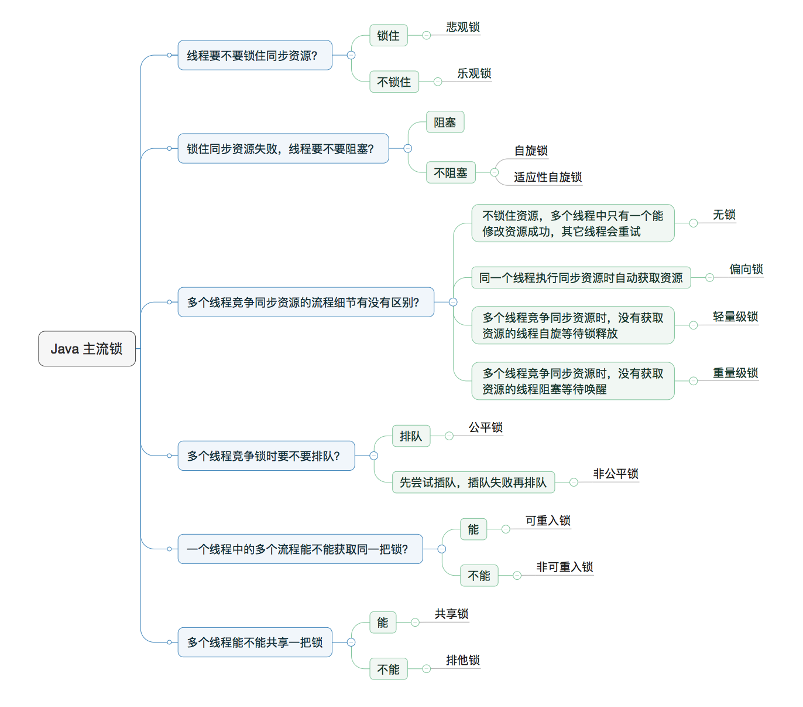

## 一、乐观锁 VS 悲观锁

乐观锁与悲观锁是一种广义上的概念，体现了看待线程同步的不同角度。在 Java 和数据库中都有此概念对应的实际应用。

- **悲观锁**：对于同一个数据的并发操作，悲观锁认为自己在使用数据的时候一定有别的线程来修改数据，因此在获取数据的时候会先加锁，确保数据不会被别的线程修改。Java 中，`synchronized` 关键字和 `Lock` 的实现类都是悲观锁。
- **乐观锁**：认为自己在使用数据时不会有别的线程修改数据，所以不会添加锁，只是在更新数据的时候去判断之前有没有别的线程更新了这个数据。如果数据未被更新，当前线程将自己修改的数据写入；如果数据已被其他线程更新，则根据实现方式执行报错或自动重试。乐观锁在 Java 中最常采用的是 CAS 算法，Java 原子类中的递增操作就是通过 CAS 自旋实现的。

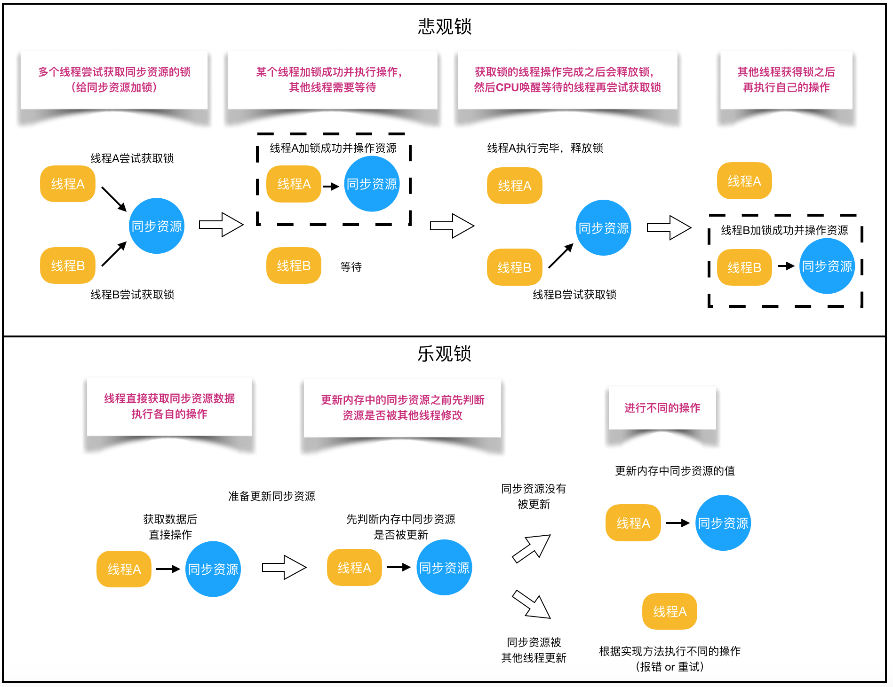

两种锁的适用场景：

- **悲观锁**适合写操作多的场景，先加锁可以保证写操作时数据正确；
- **乐观锁**适合读操作多的场景，不加锁的特点能够使其读操作的性能大幅提升。

调用方式示例：

```java
// ------------------------- 悲观锁的调用方式 -------------------------
// synchronized
public synchronized void testMethod() {
    // 操作同步资源
}
// ReentrantLock
private ReentrantLock lock = new ReentrantLock(); // 保证多个线程使用的是同一个锁
public void modifyPublicResources() {
    lock.lock();
    // 操作同步资源
    lock.unlock();
}

// ------------------------- 乐观锁的调用方式 -------------------------
private AtomicInteger atomicInteger = new AtomicInteger(); // 保证多个线程使用的是同一个 AtomicInteger
atomicInteger.incrementAndGet(); // 执行自增 1
```

### CAS 算法原理

CAS 全称 Compare And Swap（比较与交换），是一种无锁算法。在不使用锁（没有线程被阻塞）的情况下实现多线程之间的变量同步。`java.util.concurrent` 包中的原子类就是通过 CAS 来实现了乐观锁。

CAS 算法涉及到三个操作数：

- 需要读写的内存值 $V$；
- 进行比较的值 $A$；
- 要写入的新值 $B$。

当且仅当 $V$ 的值等于 $A$ 时，CAS 通过原子方式用新值 $B$ 来更新 $V$ 的值（“比较 + 更新” 整体是一个原子操作），否则不会执行任何操作。一般情况下，“更新” 是一个不断重试的过程。

以 `AtomicInteger` 的源码为例：

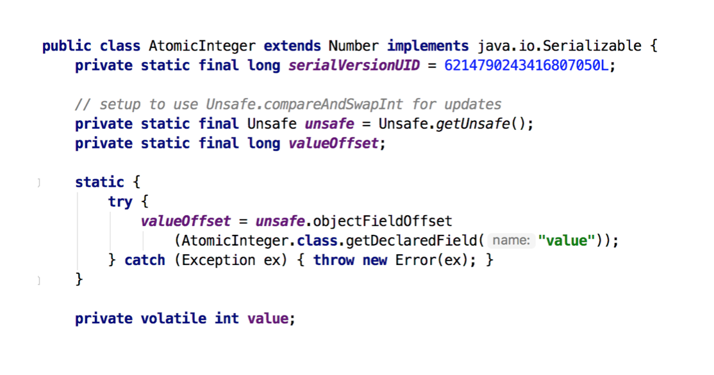

各属性的作用：

- `unsafe`：获取并操作内存的数据；
- `valueOffset`：存储 `value` 在 `AtomicInteger` 中的内存偏移量；
- `value`：存储 `AtomicInteger` 的 `int` 值，借助 `volatile` 关键字保证线程间可见。

查看 `incrementAndGet()` 方法源码：

```java
// ------------------------- JDK 8 AtomicInteger -------------------------
public final int incrementAndGet() {
    return unsafe.getAndAddInt(this, valueOffset, 1) + 1;
}

// ------------------------- OpenJDK 8 Unsafe.java -------------------------
public final int getAndAddInt(Object o, long offset, int delta) {
    int v;
    do {
        v = getIntVolatile(o, offset);
    } while (!compareAndSwapInt(o, offset, v, v + delta));
    return v;
}
```

`getAndAddInt()` 循环获取给定对象 $o$ 中偏移量处的值 $v$，然后判断内存值是否等于 $v$。如果相等则设置为 $v + \text{delta}$；否则重试，直到设置成功退出循环。“比较 + 更新” 操作封装在 `compareAndSwapInt()` 中，由 CPU 的 `cmpxchg` 指令原子完成。

### CAS 的三大缺点

1. **ABA 问题**：CAS 检查内存值是否改变，若原来是 A，变成 B，又变回 A，CAS 会误认为没变。解决方案是添加版本号（如 1A -> 2B -> 3A）。JDK 提供了 `AtomicStampedReference` 类通过对比引用与版本标志解决 ABA 问题；
2. **循环时间长开销大**：CAS 操作如果长时间不成功，自旋重试会给 CPU 带来较大开销；
3. **只能保证一个共享变量的原子操作**：对多个共享变量操作时无法保证原子性。JDK 提供了 `AtomicReference` 类把多个变量组合存入一个对象进行 CAS 操作。

## 二、自旋锁 VS 适应性自旋锁

阻塞或唤醒 Java 线程需要操作系统切换 CPU 状态，转换开销较大。若同步代码块内容极简单，状态转换消耗的时间可能超过代码执行时间。

自旋锁的原理是：当线程请求锁时，若锁被占用，当前线程不立即挂起，而是执行一段空循环（自旋），稍等片刻，看持有锁的线程是否很快释放锁。若释放则直接获取锁，避免线程切换开销。

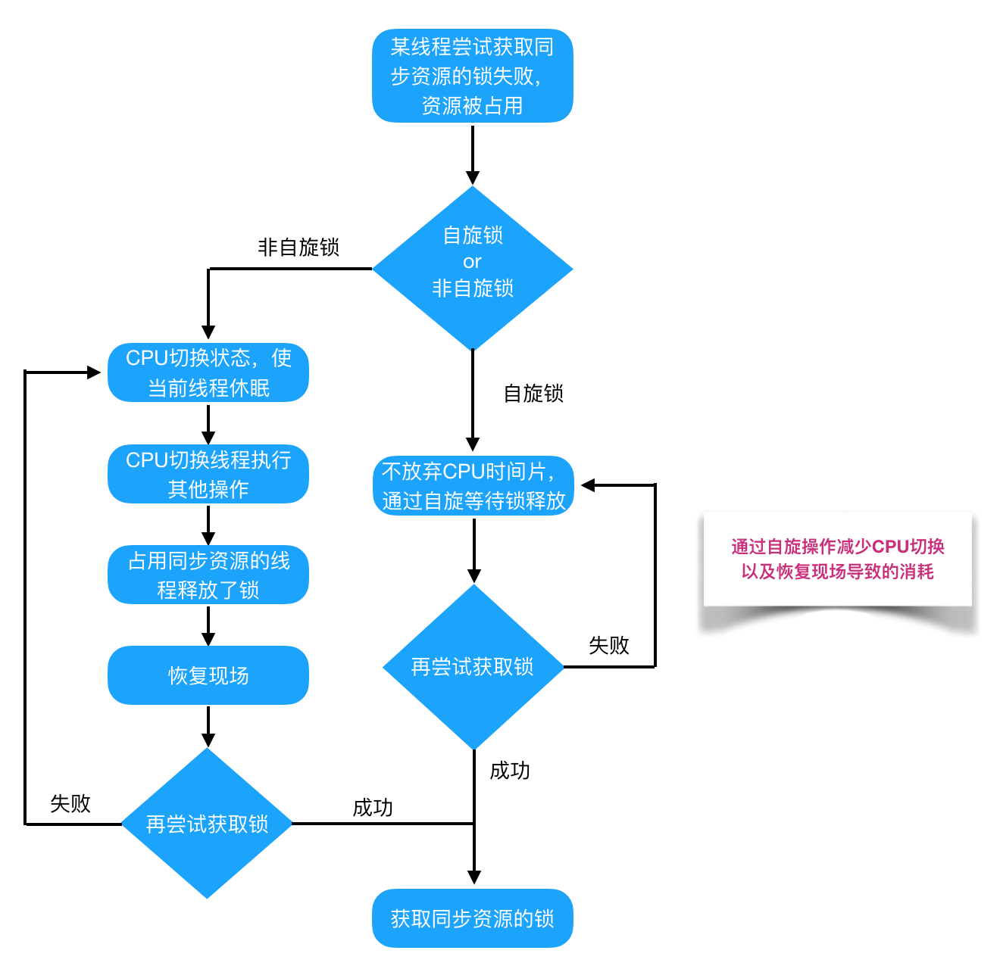

缺点：若锁占用时间长，自旋线程会白白浪费 CPU 资源。因此自旋超时（默认 10 次，可通过 `-XX:PreBlockSpin` 修改）未成功获取锁则挂起线程。

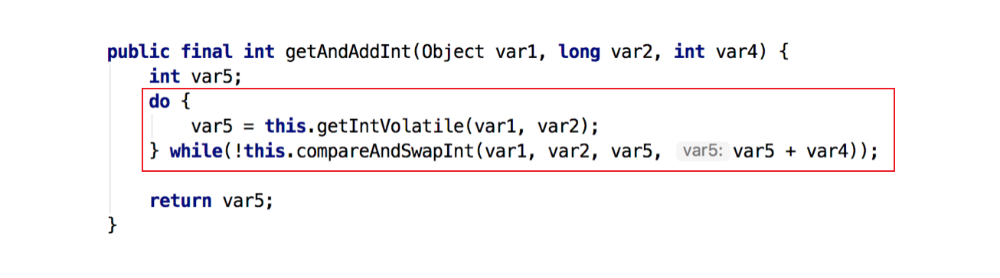

JDK 6 引入了 **自适应自旋锁**：自旋次数不再固定，由前一次在同一个锁上的自旋时间及锁拥有者的状态决定。若自旋频繁成功则增加自旋次数；若很少成功则直接阻塞，避免浪费 CPU。

## 三、无锁 VS 偏向锁 VS 轻量级锁 VS 重量级锁

这四种锁是指锁的状态，专门针对 `synchronized`。

### 1. Java 对象头与 Monitor

- **Java 对象头**：`synchronized` 的锁状态保存在对象头里。HotSpot 对象头包含 **Mark Word**（标记字段，存 HashCode、分代年龄、锁状态标志）和 **Klass Pointer**（类元数据指针）；
- **Monitor**：每一个 Java 对象都有一个隐式的 Monitor 监视器锁。依赖底层操作系统的 Mutex Lock（互斥锁）实现。操作系统切换线程状态开销大，属于重量级锁。

四种锁状态的 Mark Word 内容对比：

| 锁状态 | Mark Word 存储内容 | 锁标志位 |
| --- | --- | --- |
| **无锁** | 对象的 hashCode、分代年龄、是否是偏向锁（0） | 01 |
| **偏向锁** | 偏向线程 ID、偏向时间戳、分代年龄、是否是偏向锁（1） | 01 |
| **轻量级锁** | 指向栈中锁记录（Lock Record）的指针 | 00 |
| **重量级锁** | 指向重量级锁（互斥量 Mutex）的指针 | 10 |

### 2. 锁状态演进

- **无锁**：不锁定资源，循环内用 CAS 尝试修改；
- **偏向锁**：当一段同步代码一直被同一个线程访问，线程会自动获取锁。Mark Word 保存偏向线程 ID，后续无需 CAS 加锁；有竞争时撤销偏向锁；
- **轻量级锁**：当存在线程竞争偏向锁时升级为轻量级锁。线程在栈帧建立 Lock Record，通过 CAS 将 Mark Word 指向 Lock Record；竞争线程通过自旋等待；
- **重量级锁**：自旋次数过多或竞争激烈时升为重量级锁（标志位 `10`），未获取锁的线程全部进入阻塞状态。

整体锁状态升级流程：


## 四、公平锁 VS 非公平锁

- **公平锁**：按申请锁的顺序获取锁，线程在队列中排队。优点是不会产生线程饥饿，缺点是总体吞吐量低，唤醒阻塞线程开销大；
- **非公平锁**：线程加锁时直接尝试抢占锁，抢占失败才入队。优点是减少唤醒开销、吞吐量高，缺点是可能导致队列中的线程饥饿。

打水对比示意图：

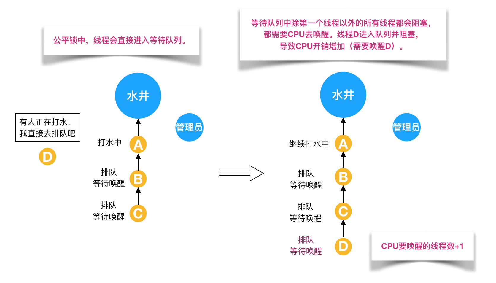

非公平锁插图：

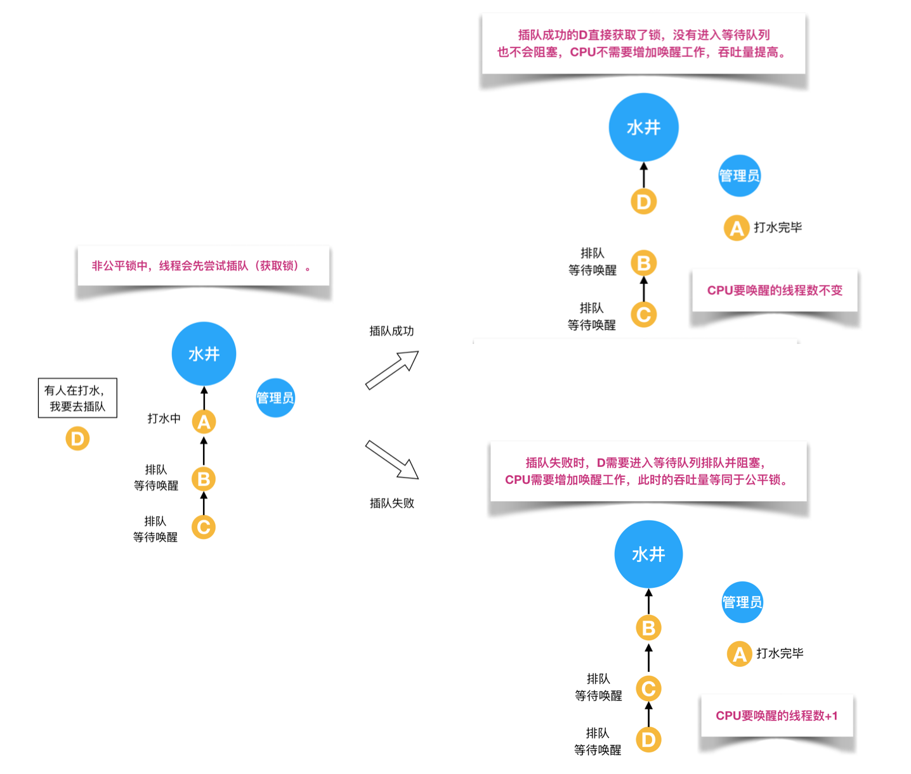

### ReentrantLock 源码解析

`ReentrantLock` 内部通过 `Sync`（继承 AQS）实现，包含 `FairSync`（公平锁）和 `NonfairSync`（非公平锁）两个子类：

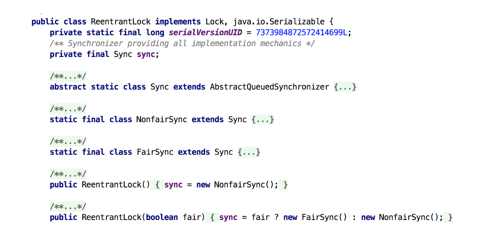

加锁对比：


公平锁与非公平锁 `lock()` 的关键区别在于公平锁多了一个 `hasQueuedPredecessors()` 判断：

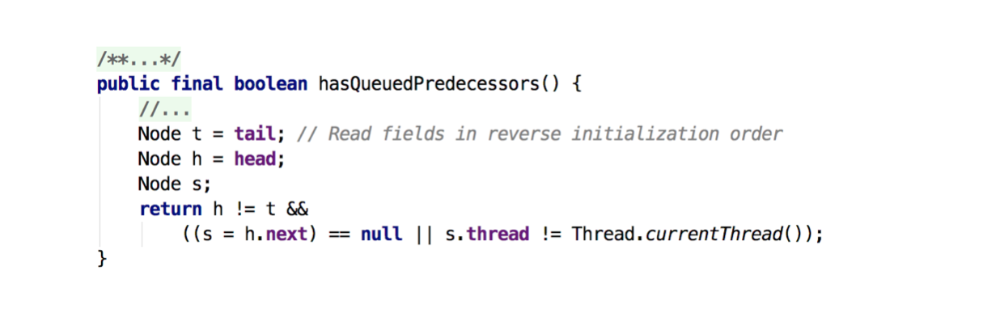

`hasQueuedPredecessors()` 用于判断当前线程是否位于同步队列的第一位，从而确保严格排队。

## 五、可重入锁 VS 非可重入锁

**可重入锁（递归锁）**：指同一个线程在外层方法获取锁后，再进入内层方法会自动获取该锁（前提是同一个锁对象），不会被阻塞。`ReentrantLock` 和 `synchronized` 均为可重入锁。

```java
public class Widget {
    public synchronized void doSomething() {
        System.out.println("方法 1 执行...");
        doOthers();
    }
    public synchronized void doOthers() {
        System.out.println("方法 2 执行...");
    }
}
```

水桶打水比喻：

可重入锁（允许一人带多个桶绑定锁打水）：

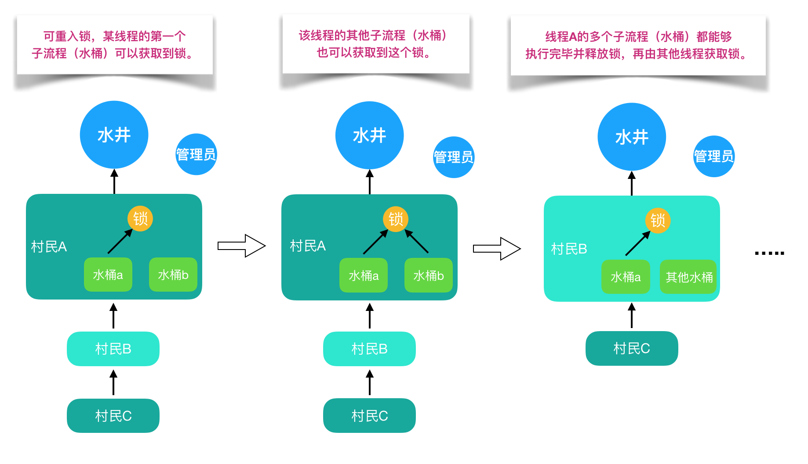

非可重入锁（一桶打完锁死，第二个桶无法打水产生死锁）：

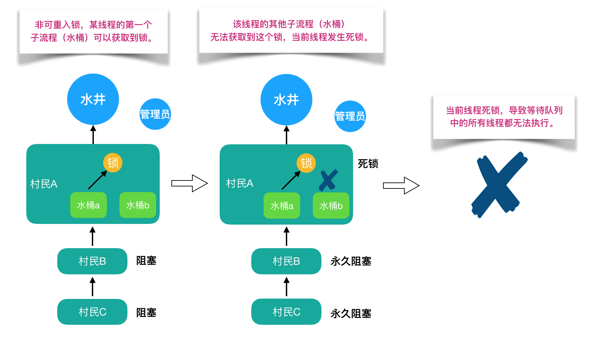

AQS 中维护 `state` 计数：

- **可重入锁**：判断当前线程是否持有锁，若是则 `state + 1` 成功重入；释放时 `state - 1`，归零时彻底释放锁；
- **非可重入锁**：再次获取直接失败并阻塞。


## 六、独享锁 VS 共享锁

- **独享锁（排他锁）**：锁一次只能被一个线程持有（如 `synchronized`、`ReentrantLock`）；
- **共享锁**：锁可被多个线程同时持有，并发读高效（如 `ReentrantReadWriteLock` 的 `ReadLock`）。


### ReentrantReadWriteLock 状态拆分

AQS 的 32 位 `state` 被按位切割：高 16 位表示读锁状态，低 16 位表示写锁状态。

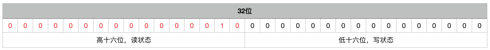

写锁 `tryAcquire()` 源码中：

```java
protected final boolean tryAcquire(int acquires) {
    Thread current = Thread.currentThread();
    int c = getState(); // 取到当前锁的个数
    int w = exclusiveCount(c); // 取写锁的个数 w (c & 0xFFFF)
    if (c != 0) {
        // 如果 c != 0 且 w == 0 说明存在读锁；或持有锁的不是当前线程，获取失败
        if (w == 0 || current != getExclusiveOwnerThread())
            return false;
        if (w + exclusiveCount(acquires) > MAX_COUNT)
            throw new Error("Maximum lock count exceeded");
        setState(c + acquires);
        return true;
    }
    if (writerShouldBlock() || !compareAndSetState(c, c + acquires))
        return false;
    setExclusiveOwnerThread(current);
    return true;
}
```

读锁 `tryAcquireShared()` 源码中，增加读锁状态需要使用 `1 << 16` 步长：

```java
protected final int tryAcquireShared(int unused) {
    Thread current = Thread.currentThread();
    int c = getState();
    if (exclusiveCount(c) != 0 && getExclusiveOwnerThread() != current)
        return -1; // 若其他线程持有写锁，读锁获取失败
    int r = sharedCount(c);
    if (!readerShouldBlock() && r < MAX_COUNT && compareAndSetState(c, c + SHARED_UNIT)) {
        // 成功获取读锁
        return 1;
    }
    return fullTryAcquireShared(current);
}
```

ReentrantLock 与读写锁对比：

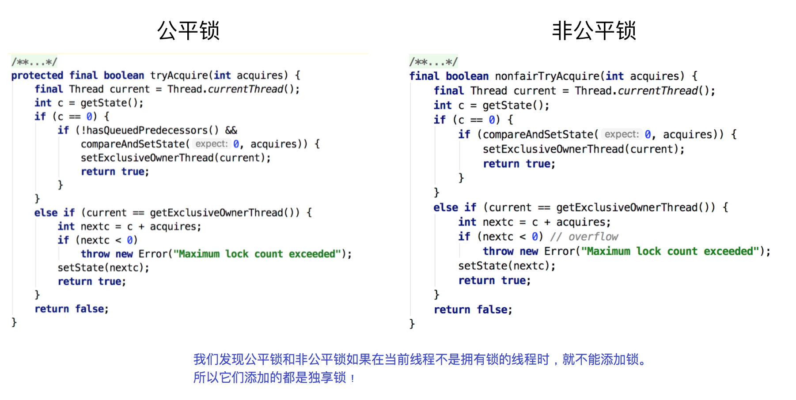

## 总结

Java 中提供了种类丰富的锁，每种锁都有其独特的应用场景与底层的优化机制。理解各种锁的实现原理（如 AQS、CAS、Mark Word、三级锁状态）能够帮助开发者在日常高并发编程中选择最适合的锁，提高系统的吞吐量与稳定性。

## 参考资料

1. 《Java 并发编程的艺术》
2. [Java 中的锁](https://blog.csdn.net/u013256816/article/details/51204385)
3. [Java CAS 原理剖析](https://juejin.im/post/5a73cbbff265da4e807783f5)
4. [Java 并发 —— 关键字 synchronized 解析](https://juejin.im/post/5b42c2546fb9a04f8751eabc)
5. [Java synchronized 原理总结](https://zhuanlan.zhihu.com/p/29866981)
6. [深入理解读写锁 — ReadWriteLock 源码分析](https://blog.csdn.net/qq_19431333/article/details/70568478)
