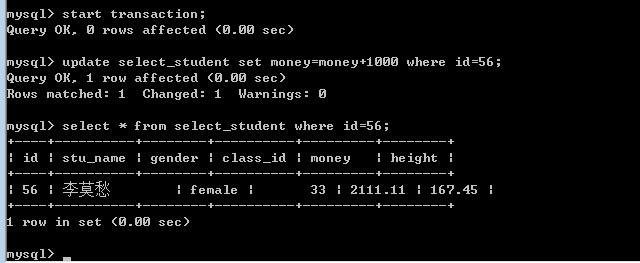
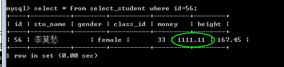

# MySQL 事务_事务隔离级别详解

## 使用事务语法

> 1. 开启事务 start transaction，可以简写为 begin
> 2. 然后记录之后需要执行的一组 sql
> 3. 提交 commit
> 4. 如果所有的 sql 都执行成功，则提交，将 sql 的执行结果持久化到数据表内。
> 5. 回滚 rollback
> 6. 如果存在失败的 sql，则需要回滚，将 sql 的执行结果，退回到事务开始之时
> 7. 无论回滚还是提交，都会关闭事务！需要再次开启，才能使用。
> 8. 还有一点需要注意，就是事务只针对当前连接。

**下面我们来进行演示：** > 使用第一个链接 A，开启事务后，执行一条 update 语句。 结果成功，数据已经变成修改之后！

> 
>
> 此时我们没有提交。 再从其他连接 B 来查看，发现数据末更改：
>
> 
>
> 此时如果连接 A 选择提交，**也就是 commit 操作。则连接 B 的数据也会发生变化。** >
> 而如果连接 A 选择回滚，**也就是 rollback 操作。则连接 A 再次查询则发现数据还原。**

______________________________________________________________________

## 基本原理

> 语法说完了，浮躁的人也不用继续看下去了。下面简单说一下事务的基本原理吧。**提交，就会将结果持久化，不提交就不会。** >
> 如果我们不开启事务，只执行一条 sql，马上就会持久化数据，可以看出，**普通的执行就是立即提交。这是因为 MySQL 默认对 sql 语句的执行是自动提交的。** >
> **也就是说，开启事务，实际上就是关闭了自动提交的功能，改成了 commit 手动提交！** >
> 我们可以通过简单的对是否自动提交加以设置，完成开启事务的目的！ 自动提交的特征是保存在服务的一个 autocommit 的变量内。可以进行修改：
>
> > **set autocommit = 0；关闭** > >
> > set autocommit = 1；开启
>
> 还需要注意一点，就是事务类似于外键约束，只被 innodb 引擎支持。

______________________________________________________________________

## 特点

> 下面来说说事务的特点 ACID。也就是原子性，一致性，隔离性和持久性。
>
> **原子性：** 事务的一组操作是原子的不可再分割的，这组操作要么同时完成要么同时不完成。类似于一个 CAS（compare and swap）（有时间会讲解 cas）
>
> **一致性：** 事务在执行前后数据的完整性保持不变。（例：原本的外键约束在进行事务成功后不会损坏）
>
> **隔离：** 当多个事务同时操作一个[数据库](http://lib.csdn.net/base/mysql)时，可能存在并发问题，此时应保证各个事务要进行隔离，事务之间不能互相干扰。
>
> **持久性：** 事务一旦被提交，就不可能再被回滚！

______________________________________________________________________

## 事务并发

事务并发会带来一些问题，所以才有了不同的事务隔离级别。要想了解事务的隔离级别，就必须首先了解事务并发会带来的问题。 一般来说，会出现三类数据读问题和数据更新问题。

### 脏读

一个事务正在对一条记录做修改但未提交，另一个事务读取了这些未提交的脏数据并进一步处理，就会产生未提交的数据依赖。典型演示流程如下表所示：

| 时间   | 转账事务 A                        | 取款事务 B                             |
|--------|-----------------------------------|----------------------------------------|
| **T1** | 开始事务                          | -                                      |
| **T2** | -                                 | 开始事务                               |
| **T3** | 查询账户余额为 1000 元            | -                                      |
| **T4** | -                                 | 取出 500 元把余额改为 500 元（未提交） |
| **T5** | 查询账户余额为 500 元（**脏读**） | -                                      |
| **T6** | -                                 | 撤销事务，余额恢复为 1000 元           |
| **T7** | 汇入 100 元把余额改为 600 元      | -                                      |
| **T8** | 提交事务                          | -                                      |

A 读取了 B 尚未提交的脏数据，导致最后余额结算错误为 600 元。

### 不可重复读

一个事务在不同时间多次读取同一记录，读取到的数据内容不一致。典型演示流程如下表所示：

| 时间   | 取款事务 A                   | 转账事务 B                                    |
|--------|------------------------------|-----------------------------------------------|
| **T1** | 开始事务                     | -                                             |
| **T2** | -                            | 开始事务                                      |
| **T3** | -                            | 查询账户余额为 1000 元                        |
| **T4** | 查询账户余额为 1000 元       | -                                             |
| **T5** | 取出 100 元把余额改为 900 元 | -                                             |
| **T6** | 提交事务                     | -                                             |
| **T7** | -                            | 查询账户余额为 900 元（**与 T3 读取不一致**） |

事务 B 在同一个事务内前后读取到了不同的账户余额数据。

### 幻读

幻读和不可重复读的概念类似，都是不同时间数据不一致。区别在于：不可重复读针对**数据更新/删除**，而幻读针对**新记录插入**。典型演示流程如下表所示：

| 时间   | 事务 A                                           | 事务 B                   |
|--------|--------------------------------------------------|--------------------------|
| **T1** | 开始事务                                         | -                        |
| **T2** | -                                                | 开始事务                 |
| **T3** | 查询用户 `id = 8` 数据为空，准备插入             | -                        |
| **T4** | -                                                | 新增一条 `id = 8` 的数据 |
| **T5** | -                                                | 提交事务                 |
| **T6** | 执行 `id = 8` 插入，提示主键冲突报错（**幻读**） | -                        |

______________________________________________________________________

## 隔离级别

事务的隔离级别是为了解决上述并发异常问题而设计的，不同的隔离级别提供不同程度的数据一致性保障。

### 查看与设置隔离级别

```sql
-- 查看当前隔离级别
SELECT @@tx_isolation;

-- 设置隔离级别 (0-3 分别对应 4 种级别)
SET tx_isolation = 2;
```

### 四种隔离级别详解

1. **Read Uncommitted（读未提交）**
   - 所有事务均可看到其他未提交事务的执行结果。极少用于实际生产环境，因为无法避免脏读。
2. **Read Committed（读已提交）**
   - 大多数数据库的默认隔离级别（Oracle/PostgreSQL）。一个事务只能看见已提交事务所做的修改，可避免脏读，但存在不可重复读。
3. **Repeatable Read（可重复读）**
   - **MySQL 默认的事务隔离级别**。确保同一事务的多个实例在并发读取数据时会看到同样的数据行。MySQL 通过 MVCC 与 Gap 锁/Next-Key 锁解决幻读问题。
4. **Serializable（可串行化）**
   - 最高隔离级别。通过强制事务串行排序执行，使之不可能相互冲突。读操作加共享锁，性能开销最大。

### 隔离级别与并发异常对照表

| 隔离级别                         | 读数据一致性                     | 脏读（Dirty Read） | 不可重复读（Non-repeatable Read） | 幻读（Phantom Read） |
|----------------------------------|----------------------------------|--------------------|-----------------------------------|----------------------|
| **读未提交（Read Uncommitted）** | 最低级别，只能保证不读取损坏数据 | **是**             | **是**                            | **是**               |
| **读已提交（Read Committed）**   | 语句级一致性                     | **否**             | **是**                            | **是**               |
| **可重复读（Repeatable Read）**  | 事务级一致性（MySQL 默认）       | **否**             | **否**                            | **是**               |
| **可串行化（Serializable）**     | 最高级别，强制串行               | **否**             | **否**                            | **否**               |
