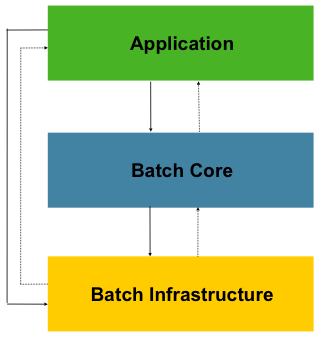
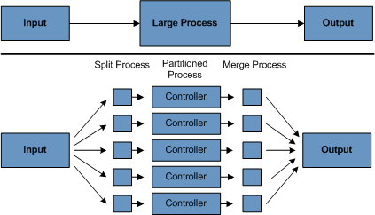
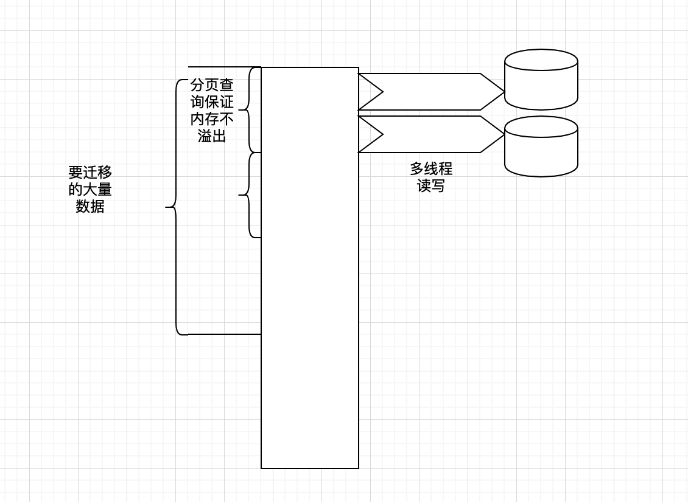

# MySQL 亿级别数据迁移实战代码分享

## 一、业务背景

某一项技术的出现是为了解决问题的，我们之所以要学习某个技术，是因为这个技术解决了我们工作中遇到的痛点。上亿条数据在 MySQL 中有索引的条件下，实际上单纯查询是没有太大问题的，在没有特别大的并发的情况下，只是插入特别慢。

在迁移大数据量的情况下面临的问题主要有如下几点：

1. 怎么保证在查询大数据量下没有性能瓶颈；
2. 不能影响正常的业务查询，不要有太多的性能损耗，可以灵活控制迁移的启动与停止；
3. 实际的迁移参数可以动态扩展，比如一次批量提交多少条数据，一次迁移多少，迁移过程中怎么转化数据；
4. 对于一些可以容忍的错误怎么跳过异常，比如可以容忍几条数据的失败；
5. 测试环境和生产环境的测试实际一般很难达到百分百一致，如何在线上对迁移的性能进行可配置的控制；
6. 事务的提交问题，因为数据量过大，不能将所有数据查询到内存之中，数据如何分而治之；
7. 迁移的过程需要记录，比如每次任务执行了多长时间，事务提交了多少次，这些都可以查询，根据这些指标再次动态调整。

针对上面提出的问题，我们自己去写这样一个功能完整且稳定的功能，实际中还是比较困难的。按照通常的 Service 和 DAO 的写法，满足不了我们的需求。

## 二、Spring Batch 核心功能介绍

Spring Batch 是 Spring 官方的一个专门用于处理大数据体量下数据迁移的开源框架，主要解决的问题就是我们上面所说的那些问题，通过分批读取和写数据，保证内存不会发生溢出。并且通过灵活的组件组合，可以满足数据迁移中的各种需求。

### 1. 核心功能和特点

- 事务管理
- 基于分块的处理（Chunk-oriented processing）
- 声明式 I/O
- 可灵活控制开始、停止、重启
- 重试和跳过
- 基于网页的后台管理 Spring Cloud Data Flow

Spring Batch 的文档很全面，但对于初学者来说，整个文档读完需要耗费比较长的时间。这里只看两张 Spring Batch 的架构图，后面我会通过实际工作中的迁移案例来讲解怎么使用它。

### 2. 架构图





第一张图是架构图，第二张是分区处理图。

从这两张图可以看到这正是我们迁移大数据量下的核心诉求：输入端是从数据源读取数据，数据源可以来源于文件或者数据库；中间的处理流程是对数据进行加工，因为有些数据我们需要进行转换和处理；输出端是写出数据，可以写入到文件或者数据库。

### 3. 核心组件

- **Reader**：负责数据的读取
- **Processor**：负责数据的处理
- **Writer**：负责数据的写出
- **Step**：流程编排
- **Job**：任务配置

这些业务组件用我们生活中的例子来理解的话，可以想象一下如下的场景：

> 数据迁移就好比从一个油田里运输原油到炼油厂，提炼完成后最终把成品油送到加油站的一个过程。原油在到成品油的过程中要经历很多的流程和运输步骤，就像我们的数据要经过转换一样。
>
> Reader 就好比从油田里将原油装上运输车，Processor 就好比将原油提炼出成品油，Writer 就好比将油运到加油站的油箱里，Step 就是这个装油 -> 提炼油 -> 运输到加油站流水线一样的处理步骤，Job 相当于任务。这个任务就是 Step 定义好的流程，任务可以执行多次，但是每一次都是按照提前定义好的 Step 来执行。

## 三、实际业务需求实现

源码下载地址：[https://gitee.com/smartGim/batchsrv](https://gitee.com/smartGim/batchsrv)

### 单表数据备份快速上手

这种场景多见于项目创建初期为了快速上线，没有做分库分表（在项目初期一般不会做分库分表），比如订单表、银行流水表、历史对账数据、支付记录数据表等。这种数据的特点为时间在半年或者一年以上将变为冷数据，数据查询的情况比较少，并且数据不会发生变化。通常情况下我们需要将时间大于一定时期的数据定时备份。还有一种情况就是接手一些历史遗留的项目，有些数据的单表已经达到了一个极限。

我们以一个数据库的数据 `db_source` 迁移到另外一个数据库 `db_target` 为例，迁移过程中同时删除已经迁移走的记录，并将迁移的过程和记录保存到 `db_source` 中。

#### 1. 新建 Spring Boot 工程并引入依赖

在 `pom.xml` 中引入依赖：

```xml
<dependency>
    <groupId>org.springframework.boot</groupId>
    <artifactId>spring-boot-starter-batch</artifactId>
</dependency>
```

启动类配置：

```java
@SpringBootApplication
@EnableBatchProcessing
public class BatchsrvApplication {
    public static void main(String[] args) {
        SpringApplication.run(BatchsrvApplication.class, args);
    }
}
```

在启动类上添加注解 `@EnableBatchProcessing`。

> **注意**：添加上了此注解，那么项目启动后 Spring Batch 就会自动初始化相关的数据库表，并且直接启动相关的迁移任务。在实际的线上迁移中是不会上线后就自动执行任务的，通常会先通过手动执行来看下执行情况，再动态配置一些指标，所以我们的项目会禁用自动执行，并且手动执行 Spring Batch 的数据库初始化脚本。脚本文件在 `spring-batch-core` 中，根据数据库类型进行选择即可。

禁用自动执行任务选项 `spring.batch.job.enabled = false`：

```yaml
server:
  port: 8096
spring:
  profiles:
    active: dev
  batch:
    job:
      enabled: false
```

#### 2. 多数据源配置

```java
package cn.gitchat.share.config;

import javax.sql.DataSource;
import org.springframework.beans.factory.annotation.Autowired;
import org.springframework.context.annotation.Bean;
import org.springframework.context.annotation.Configuration;
import org.springframework.context.annotation.Primary;
import org.springframework.core.env.Environment;
import org.springframework.jdbc.core.JdbcTemplate;
import org.springframework.jdbc.datasource.DriverManagerDataSource;

/**
 * @Author: Gim
 * @Date: 2019-12-04 17:05
 * @Description: 多数据源配置
 */
@Configuration
public class DataSourceConfig {
    @Autowired
    private Environment env;

    @Bean
    @Primary
    public DataSource primaryDatasource() {
        DriverManagerDataSource dataSource = new DriverManagerDataSource();
        dataSource.setDriverClassName(env.getProperty("source.driver-class-name"));
        dataSource.setUrl(env.getProperty("source.jdbc-url"));
        dataSource.setUsername(env.getProperty("source.username"));
        dataSource.setPassword(env.getProperty("source.password"));
        return dataSource;
    }

    @Bean
    public DataSource targetDatasource() {
        DriverManagerDataSource dataSource = new DriverManagerDataSource();
        dataSource.setDriverClassName(env.getProperty("target.driver-class-name"));
        dataSource.setUrl(env.getProperty("target.jdbc-url"));
        dataSource.setUsername(env.getProperty("target.username"));
        dataSource.setPassword(env.getProperty("target.password"));
        return dataSource;
    }

    @Bean
    public JdbcTemplate primaryTemplate() {
        return new JdbcTemplate(primaryDatasource());
    }

    @Bean
    public JdbcTemplate targetJdbcTemplate() {
        return new JdbcTemplate(targetDatasource());
    }
}
```

此处我们使用多数据源的配置，并且使用 `JdbcTemplate` 进行数据的读取。主数据源中配置 Spring Batch 的元数据表（如果不在意迁移记录可以使用内存数据库存取 Spring Batch 记录，能提高性能，但线上不建议这样做）。

**如何定制 Spring Batch 框架使用的元数据数据源？**

让配置类继承 `DefaultBatchConfigurer` 并重写 `createJobRepository` 方法：

```java
public class BatchConfig extends DefaultBatchConfigurer {
    @Autowired
    private DataSource primaryDatasource;

    // 将 Spring Batch 的记录存放在主数据源中
    @Override
    protected JobRepository createJobRepository() throws Exception {
        JobRepositoryFactoryBean factory = new JobRepositoryFactoryBean();
        factory.setDataSource(primaryDatasource);
        factory.setTransactionManager(this.getTransactionManager());
        factory.afterPropertiesSet();
        return factory.getObject();
    }
}
```

#### 3. 读取数据配置（Reader）

```java
/**
 * 数据读取：根据 ID 分页查询保证性能
 */
@Bean
@StepScope
public JdbcPagingItemReader<PayRecord> payRecordReader(
        @Value("#{jobParameters[minId]}") Long minId,
        @Value("#{jobParameters[maxId]}") Long maxId) throws Exception {

    JdbcPagingItemReader<PayRecord> reader = new JdbcPagingItemReader<>();
    final SqlPagingQueryProviderFactoryBean sqlPagingQueryProviderFactoryBean = new SqlPagingQueryProviderFactoryBean();
    sqlPagingQueryProviderFactoryBean.setDataSource(primaryDatasource);
    sqlPagingQueryProviderFactoryBean.setSelectClause("select *");
    sqlPagingQueryProviderFactoryBean.setFromClause("from pay_record");
    sqlPagingQueryProviderFactoryBean.setWhereClause("id > " + minId + " and id <= " + maxId);
    sqlPagingQueryProviderFactoryBean.setSortKey("id");

    reader.setQueryProvider(sqlPagingQueryProviderFactoryBean.getObject());
    reader.setDataSource(primaryDatasource);
    reader.setPageSize(config.getPageSize());
    reader.setRowMapper(new PayRecordRowMapper());
    reader.afterPropertiesSet();
    reader.setSaveState(true);
    return reader;
}
```

在读取配置中有几个关键要点：

1. **`@StepScope` 注解**：能够在 Job 执行时注入动态参数。通过 `@Value("#{jobParameters[minId]}")` 获取任务启动时传入的范围参数：

```java
@Scheduled(cron = "0 0 2 * * ?")
public void migratePayRecord() throws Exception {
    Map<String, Object> result = primaryJdbcTemplate
        .queryForMap("select * from job_config where config_key = ?", MigrateConstants.PAY_RECORD_JOB_CONFIG_KEY);
    String value = (String) result.get("config_value");
    JobExecuteConfig payRecordJobConfig = JSON.parseObject(value, JobExecuteConfig.class);
    JobParameters params = new JobParametersBuilder()
        .addLong("maxId", payRecordJobConfig.getExecuteMaxId())
        .addLong("minId", payRecordJobConfig.getMinId())
        .toJobParameters();
    jobLauncher.run(migratePayRecordJob, params);
}
```

2. **`JdbcPagingItemReader`**：采用分页方式读取数据，保证大数据量下不会内存溢出。`sortKey` 用来保证分页顺序的唯一性，断点续传时靠此字段定位。
3. **`pageSize` 与 `saveState`**：`pageSize` 用于控制每次分页读取的记录数，`saveState` 用于保存执行状态。

#### 4. 写入数据配置（Writer）

```java
/**
 * 写入到新目标库
 */
@Bean
public ItemWriter<? super PayRecord> targetPayRecordWriter() {
    return new JdbcBatchItemWriterBuilder<PayRecord>()
            .dataSource(targetDatasource)
            .itemSqlParameterSourceProvider(new BeanPropertyItemSqlParameterSourceProvider<>())
            .sql(
                "INSERT INTO `pay_record` ("
                + "`id`, `user_id`, `pay_detail`, `pay_status`, `create_time`, `update_time`"
                + ") VALUES ("
                + ":id, :userId, :payDetail, :payStatus, :createTime, :updateTime"
                + ")"
            )
            .build();
}

/**
 * 原库删除器
 */
@Bean
public ItemWriter<PayRecord> deletePayRecordWriter() {
    return new JdbcBatchItemWriterBuilder<PayRecord>()
            .dataSource(primaryDatasource)
            .itemSqlParameterSourceProvider(new BeanPropertyItemSqlParameterSourceProvider<>())
            .sql("delete from pay_record where id = :id")
            .build();
}

/**
 * 组合写入器：先写入目标库，再从源库删除
 */
@Bean
public CompositeItemWriter<PayRecord> compositePayRecordItemWriter(
        @Qualifier("deletePayRecordWriter") ItemWriter deleteWriter,
        @Qualifier("targetPayRecordWriter") ItemWriter targetPayRecordWriter) {

    CompositeItemWriter<PayRecord> compositeItemWriter = new CompositeItemWriter<>();
    List<ItemWriter<? super PayRecord>> list = new ArrayList<>();
    list.add(targetPayRecordWriter);
    list.add(deleteWriter);
    compositeItemWriter.setDelegates(list);
    return compositeItemWriter;
}
```

写入配置使用了 `JdbcBatchItemWriter` 进行批量高效插入。通过 `CompositeItemWriter` 可以将“写目标库”与“删源库”组合在一个步骤中完成。

#### 5. 流程编排配置（Step）

```java
@Bean
public Step migratePayRecordStep(
        @Qualifier("payRecordReader") JdbcPagingItemReader<PayRecord> payRecordReader,
        @Qualifier("compositePayRecordItemWriter") CompositeItemWriter compositeItemWriter) {

    return this.stepBuilderFactory.get("migratePayRecordStep")
            .<PayRecord, PayRecord>chunk(config.getChunkSize())
            .reader(payRecordReader)
            .processor(new PassThroughItemProcessor())
            .writer(compositeItemWriter)
            .taskExecutor(new SimpleAsyncTaskExecutor("migrate_thread"))
            .throttleLimit(config.getThreadSize())
            .build();
}
```

- **`chunk`**：设置分块大小，控制每次事务提交的记录数；
- **`processor`**：传参 `PassThroughItemProcessor` 表示不对数据做修改。如需清洗扩展数据，可自定义 `ItemProcessor`：

```java
@Component
public class PayRecordExtProcessor implements ItemProcessor<PayRecord, PayRecordExt> {
    @Override
    public PayRecordExt process(PayRecord payRecord) throws Exception {
        PayRecordExt ext = new PayRecordExt();
        // 转换与数据填充逻辑
        return ext;
    }
}
```

- **`taskExecutor` & `throttleLimit`**：配置线程池实现多线程并行迁移，`throttleLimit` 控制最大并发线程数。

#### 6. 任务配置（Job）

```java
@Bean
public Job migratePayRecordJob(@Qualifier("migratePayRecordStep") Step step) {
    return this.jobBuilderFactory.get("migratePayRecordJob")
            .start(step)
            .incrementer(new RunIdIncrementer())
            .build();
}
```

#### 7. 如何调度并启动 Job

在线上环境中，建议通过定时任务或手动调用来控制 Job 执行：

```java
@Component
@Slf4j
public class PayRecordTask {
    @Autowired
    private Job migratePayRecordJob;
    @Autowired
    private JobLauncher jobLauncher;
    @Autowired
    @Qualifier("primaryTemplate")
    private JdbcTemplate primaryJdbcTemplate;

    /**
     * 迁移任务：每天凌晨 2 点执行
     */
    @Scheduled(cron = "0 0 2 * * ?")
    public void migratePayRecord() throws Exception {
        Map<String, Object> result = primaryJdbcTemplate
            .queryForMap("select * from job_config where config_key = ?", MigrateConstants.PAY_RECORD_JOB_CONFIG_KEY);
        String value = (String) result.get("config_value");
        JobExecuteConfig payRecordJobConfig = JSON.parseObject(value, JobExecuteConfig.class);

        JobParameters params = new JobParametersBuilder()
            .addLong("maxId", payRecordJobConfig.getExecuteMaxId())
            .addLong("minId", payRecordJobConfig.getMinId())
            .toJobParameters();
        jobLauncher.run(migratePayRecordJob, params);
    }

    /**
     * 迁移配置初始化：每天凌晨 1 点计算迁移区间
     */
    @Scheduled(cron = "0 0 1 * * ?")
    public void initBillMigrateConfig() {
        // TODO: 动态计算每天要迁移的数据 ID 区间（如每日设定迁移 100 万条）
    }
}
```

#### 8. Job 的动态启动、停止与重启

除了 `JobLauncher`，还可以通过 `JobOperator` 控制 Job 运行。使用前需将 Job 注册到 `JobRegistry`：

```java
@Autowired
private JobRegistry registry;
@Autowired
private JobOperator jobOperator;

@PostConstruct
public void registry() throws DuplicateJobException {
    ReferenceJobFactory factory = new ReferenceJobFactory(migratePayRecordJob);
    registry.register(factory);
}

@PostMapping(value = "startJob")
@SneakyThrows
public ResponseEntity<String> startJob() {
    Properties properties = new Properties();
    properties.put("minId", "20");
    properties.put("maxId", "50");
    long executePayRecordId = jobOperator.start("migratePayRecordJob", PropertiesConverter.propertiesToString(properties));
    return ResponseEntity.ok("操作成功，JobId: " + executePayRecordId);
}

@PostMapping(value = "stopJob")
@SneakyThrows
public ResponseEntity<String> stopJob(Long executePayRecordId) {
    Assert.notNull(executePayRecordId, "执行 ID 不能为空！");
    jobOperator.stop(executePayRecordId);
    return ResponseEntity.ok("已停止 Job");
}

@PostMapping(value = "restartJob")
@SneakyThrows
public ResponseEntity<String> restartJob(Long executePayRecordId) {
    Assert.notNull(executePayRecordId, "执行 ID 不能为空！");
    jobOperator.restart(executePayRecordId);
    return ResponseEntity.ok("已重启 Job");
}
```

`JobOperator` 提供了丰富的控制 API：

```java
List<Long> getExecutions(long instanceId) throws NoSuchJobInstanceException;
List<Long> getJobInstances(String jobName, int start, int count) throws NoSuchJobException;
Set<Long> getRunningExecutions(String jobName) throws NoSuchJobException;
String getParameters(long executionId) throws NoSuchJobExecutionException;
Long start(String jobName, String parameters) throws NoSuchJobException, JobInstanceAlreadyExistsException, JobParametersInvalidException;
Long restart(long executionId) throws JobInstanceAlreadyCompleteException, NoSuchJobExecutionException, NoSuchJobException, JobRestartException, JobParametersInvalidException;
boolean stop(long executionId) throws NoSuchJobExecutionException, JobExecutionNotRunningException;
```

#### 9. 内存与性能调优总结

Spring Batch 定义了标准的读写与处理模板，事务管理、线程池并发、分批 Commit 以及内存控制全部由框架解决。

下图展示了 Spring Batch 是如何在海量数据下保持高性能且不发生内存溢出的：



## 四、其他业务场景的扩展

### 1. 多表合一的场景

在多表关联的场景下，主表与附表必须建有索引。查询逻辑保持在主表上，**切忌在亿级数据下使用 JOIN 联查**，否则会拖垮数据库。

此时需要将拼装逻辑放在 `Processor` 中。比如将 `User` 信息冗余到新表中，只需在 `PayRecordExtProcessor` 中注入 `UserService`，通过 `userService.getId(payRecord.getUserId())` 加载用户信息：

```java
@Component
public class PayRecordExtProcessor implements ItemProcessor<PayRecord, PayRecordExt> {
    @Autowired
    private UserService userService;

    @Override
    public PayRecordExt process(PayRecord payRecord) throws Exception {
        User user = userService.getId(payRecord.getUserId());
        PayRecordExt ext = new PayRecordExt();
        // 组装逻辑
        return ext;
    }
}
```

### 2. 单表拆分为多表的场景

如需将单表数据根据规则拆分写到多张表中（例如按 `user_id` 取模分片到 `pay_record_1` 和 `pay_record_2`），可以使用 `ClassifierCompositeItemWriter` 动态路由：

```sql
CREATE TABLE pay_record_1 LIKE pay_record;
CREATE TABLE pay_record_2 LIKE pay_record;
```

动态路由路由配置：

```java
@Bean
public ClassifierCompositeItemWriter<? super PayRecord> classifierItemWriter(
        @Qualifier("payRecordOneWriter") ItemWriter payRecordOneWriter,
        @Qualifier("payRecordTwoWriter") ItemWriter payRecordTwoWriter) {

    ClassifierCompositeItemWriter<PayRecord> classifierCompositeItemWriter = new ClassifierCompositeItemWriter<>();
    classifierCompositeItemWriter.setClassifier(
        (Classifier<PayRecord, ItemWriter<? super PayRecord>>) record -> {
            if (record.getId() % 2 == 0) {
                return payRecordOneWriter;
            } else {
                return payRecordTwoWriter;
            }
        }
    );
    return classifierCompositeItemWriter;
}

@Bean
public Step splitPayRecordStep(
        @Qualifier("payRecordReader") JdbcPagingItemReader<PayRecord> payRecordReader,
        @Qualifier("classifierItemWriter") ClassifierCompositeItemWriter itemWriter) {

    return this.stepBuilderFactory.get("splitPayRecordStep")
            .<PayRecord, PayRecord>chunk(config.getChunkSize())
            .reader(payRecordReader)
            .processor(new PassThroughItemProcessor())
            .writer(itemWriter)
            .taskExecutor(new SimpleAsyncTaskExecutor("migrate_thread"))
            .throttleLimit(config.getThreadSize())
            .build();
}

@Bean
public Job splitPayRecordJob(@Qualifier("splitPayRecordStep") Step step) {
    return this.jobBuilderFactory.get("splitPayRecordJob")
            .start(step)
            .incrementer(new RunIdIncrementer())
            .build();
}
```

### 3. 迁移过程中存在数据变更与增量的场景

针对频繁变更的增量场景，一般引入 **CDC（Change Data Capture）** 组件（如 Alibaba Canal、Debezium）监听 Binlog 变更。将变更实时写入新数据源，全量迁移完成后再使用 Spring Batch 进行数据比对与补全。

### 4. 部署多实例时的分布式锁控制

分布式部署时，为防止多个节点同时运行同一个 Job，可以使用 ShedLock 实现分布式任务锁：

```xml
<dependency>
    <groupId>net.javacrumbs.shedlock</groupId>
    <artifactId>shedlock-spring</artifactId>
    <version>4.1.0</version>
</dependency>
<dependency>
    <groupId>net.javacrumbs.shedlock</groupId>
    <artifactId>shedlock-provider-jdbc-template</artifactId>
    <version>4.0.4</version>
</dependency>
```

配置 LockProvider：

```java
@Bean
public LockProvider lockProvider(@Qualifier("primaryDatasource") DataSource dataSource) {
    return new JdbcTemplateLockProvider(dataSource);
}
```

### 5. 关键优化点

1. **动态参数调优**：每次读取条数 `pageSize`、事务提交数 `chunkSize` 以及线程数 `threadSize` 可抽离为配置项：

```java
@ConfigurationProperties(prefix = "migrate.config")
@Data
public class MigrateConfig {
    private Integer pageSize;
    private Integer chunkSize;
    private Integer threadSize;
}
```

2. **MySQL 参数调优**：迁移前调整连接数与缓冲池：

```sql
SHOW PROCESSLIST;
SET GLOBAL innodb_buffer_pool_size = 缓冲池大小;
SHOW VARIABLES LIKE 'max_connections';
SET GLOBAL max_connections = 最大连接数;
```

3. **内存数据库加速**：若无需持久化迁移记录，可使用 H2 / HSQLDB 等内存数据库替代 JobRepository 存储。

## 五、Spring Cloud Data Flow 简介

Spring Cloud Data Flow 是 Spring 官方的数据流处理框架。可通过 Docker 或 Jar 包方式部署管理分布式 Batch 任务。

Jar 包启动命令：

```shell
java -jar spring-cloud-skipper-server-2.1.2.RELEASE.jar
java -jar spring-cloud-dataflow-server-2.2.1.RELEASE.jar
```

控制台访问地址：`http://localhost:9393/dashboard/`

## 六、项目代码与参考资源

- **示例项目地址**：[https://gitee.com/smartGim/batchsrv](https://gitee.com/smartGim/batchsrv)
- **Spring Batch 拓展（ES / Excel 拓展）**：[https://github.com/spring-projects/spring-batch-extensions.git](https://github.com/spring-projects/spring-batch-extensions.git)
- **官方 Samples**：[https://github.com/spring-projects/spring-batch.git](https://github.com/spring-projects/spring-batch.git)
