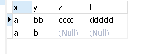
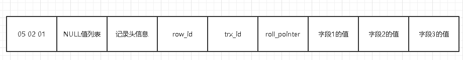
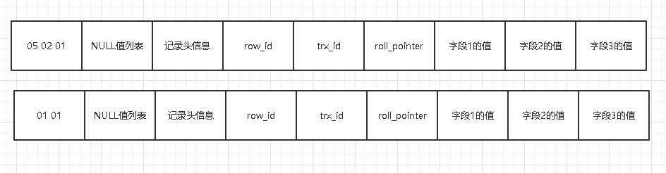
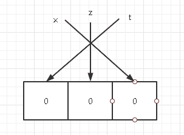
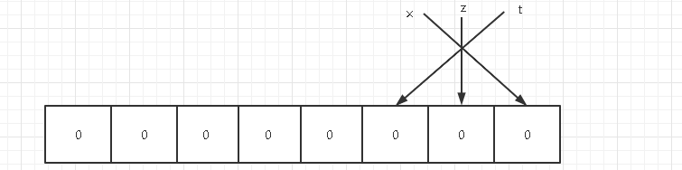
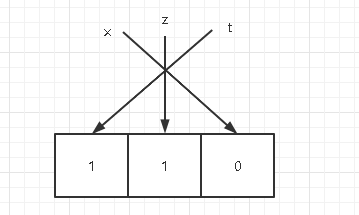
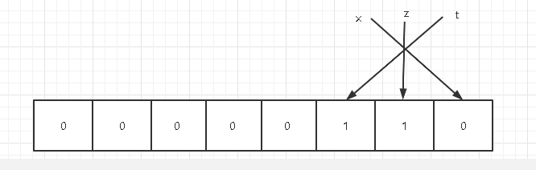
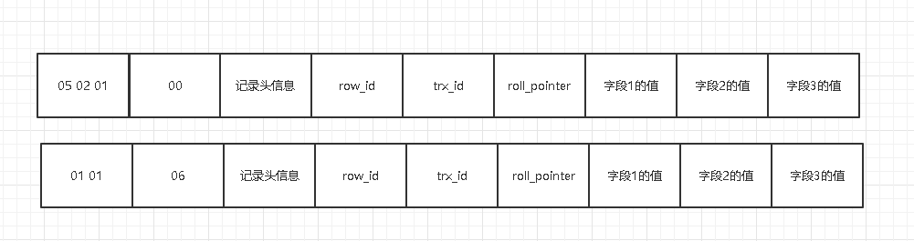
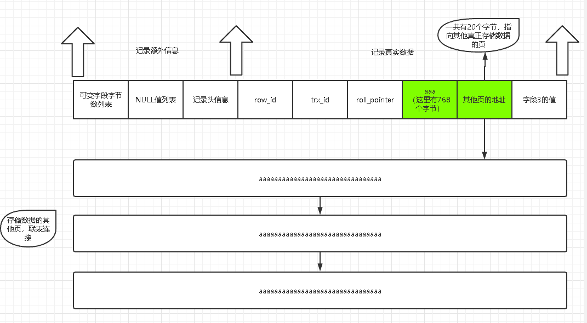

# MySQL 从一条数据说起 - InnoDB 行存储数据结构

先给大家讲一个故事：我刚参加工作，在一个小作坊里面当程序员，有一天老板从我背后走过，说了一句举世震惊的话：“我看你们的数据库和 Excel 一样，不就是一行行数据？人家 Excel 还可以对单元格进行美化，还有各种函数、生成各种报表，你们的数据库有什么复杂的？”我竟无力反驳。

为什么要说这个故事呢？当然是为了引出今天的话题——**InnoDB 行存储数据结构**。

做开发的各位或多或少都接触过数据库，但是数据库中的一行行数据到底是怎么存储的，存储的格式又是什么，就不是每个开发都知道的了。数据库对我们而言就是一个“黑盒子”，今天我就带着大家拆开这个神秘的黑盒子，一探究竟。

这次我们打开的盒子是 **InnoDB 存储引擎的数据结构**（Memory、MyISAM 等其它存储引擎不在本次讨论范围内）。

## InnoDB 页简介

InnoDB 是一个把数据存储在磁盘上的存储引擎，即使服务器重启，数据依然不会丢失。而真正的数据处理是发生在内存中的，所以 InnoDB 需要把磁盘上的数据加载到内存中，然后在内存中进行各种数据处理，最终在某个时机把内存中的数据刷新到磁盘。

由于磁盘的 I/O 处理速度远低于内存，如果 InnoDB 每次只从磁盘中读取一条数据，性能会极差。因此，**InnoDB 会把数据分成若干页，以“页（Page）”作为内存和磁盘之间交互的基本单位**。说的再直白点：InnoDB 读取数据不是一行一行读取，而是以页为最小单位读取数据。默认情况下，一页的大小是 **16 KB**。

## InnoDB 行格式

InnoDB 提供了 4 种行格式供我们选择，分别是 **Compact**、**Redundant**、**Dynamic** 和 **Compressed** 行格式。

我们在建表的时候，可以指定某种行格式：

```sql
CREATE TABLE table_name (列信息) ROW_FORMAT=行格式名称;
```

也可以修改已经存在的表的行格式：

```sql
ALTER TABLE table_name ROW_FORMAT=行格式名称;
```

## 准备工作

为了后面的演示顺利展开，我们先建一张表：

```sql
CREATE TABLE hero (
    `x` VARCHAR(10),
    `y` VARCHAR(10) NOT NULL,
    `z` CHAR(10),
    `t` VARCHAR(10)
) CHARSET=ASCII, ROW_FORMAT=COMPACT;
```

这里建立了一张表 `hero`，指定的行格式是 `COMPACT`，采用的字符集是 `ASCII`。现在向表中添加两行数据：

```sql
INSERT INTO hero(x, y, z, t) VALUES('a', 'bb', 'cccc', 'ddddd'), ('a', 'b', NULL, NULL);
```

现在表中的数据如下图所示：



下面我们就来分析在 COMPACT 行格式下，数据是如何在磁盘中存储的。

## COMPACT 行格式


从上图可以看到，一行数据被分为了两个部分：**记录的额外信息** 与 **记录的真实数据**。

### 1. 记录额外信息

#### 变长字段字节数列表

`CHAR(X)` 是定长的，`VARCHAR(X)` 是变长的。变长字段中存储多少字节的数据不是固定的，所以 InnoDB 在存储数据的时候，会把这些数据占用的真实字节数也保存下来。也就是说，变长字段占用了两部分空间来存储：

1. 真实的数据内容；
2. 占用的字节数。

在 COMPACT 行格式中，所有的变长字段所占用的字节数会 **逆序** 排放在“变长字段字节数列表”中。

看第一条数据：表中 `x`、`y`、`t` 三个字段都是变长字段（`VARCHAR`），所以这三个字段的字节数需要保存在列表中。数据表采用 `ASCII` 字符集，每一个字符占用 1 字节：

| 字段名称 | 内容 | 占用字节数（十进制） | 占用字节数（十六进制） |
| --- | --- | --- | --- |
| `x` | `a` | 1 | `0x01` |
| `y` | `bb` | 2 | `0x02` |
| `t` | `ddddd` | 5 | `0x05` |

所以，第一行数据 `x`、`y`、`t` 三个字段所占用的字节数分别是 1、2、5。InnoDB 会把所占用的字节数 **逆序排放**，十六进制表示如下：



到底使用 1 个字节还是 2 个字节来表示变长字段的长度？InnoDB 采用以下规则：

- 设定 $W$ 为指定字符集下最多需要的字节数（`ASCII` 中 $W=1$，`GBK` 中 $W=2$，`UTF-8` 中 $W=3$）；
- 设定 $M$ 为最多允许存储的字符数（如 `VARCHAR(50)` 中 $M=50$）；
- 设定 $L$ 为实际存储字符占用的字节数。

规则如下：

1. 如果 $M \times W \le 255$，用 **1 字节** 表示变长字段字节数。
2. 如果 $M \times W > 255$：
   - 当 $L \le 127$ 时，用 **1 字节** 表示；
   - 当 $L > 127$ 时，用 **2 字节** 表示。

简而言之：可变字段允许存储的最大字节数（$M \times W$）超过 255，且真实存储的字节数（$L$）超过 127，就用 **2 字节** 表示，否则用 **1 字节** 表示。

再看第二条数据：字段 `t` 的值为 `NULL`，**变长字段字节数列表只存储非 NULL 列内容占用的字节数**。对于第二条数据，变长字段字节数列表只要存储 `x` 和 `y` 所占用的字节数即可：



> **说明**：变长字段字节数列表不是必须的。如果一个表中所有的字段都不是变长类型，就没有该列表。如果采用 `UTF-8` 等变长字符集，即使是 `CHAR(M)` 也会被加入到变长字段字节数列表中。

#### NULL 值列表

如果表中有字段允许为 `NULL`，InnoDB 就会开辟一块空间来标识每个字段实际存储的数据是不是 `NULL`；如果表中的字段都不允许为 `NULL`（都带有 `NOT NULL` 约束），那么这块空间就不存在。

`NULL` 值列表的处理规则如下：

- 每个允许存储为 `NULL` 的字段对应一个二进制位；
- 如果字段实际存储的数据不为 `NULL`，二进制位填 **0**；
- 如果字段实际存储的数据为 `NULL`，二进制位填 **1**；
- 二进制位同样按照字段顺序 **逆序排放**，不足 8 位的高位补 0 凑足整字节。

对于 `hero` 表，`x`、`z`、`t` 三个字段允许为 `NULL`。第一条数据中三个字段都不为 `NULL`：



补齐 8 位后：



因此，第一条数据的 NULL 值列表十六进制表示为 `0x00`。

对于第二条数据，`z` 和 `t` 字段为 `NULL`：



高位补 0 后：



第二条数据的 NULL 值列表十六进制表示为 `0x06`。

两条数据的 NULL 值列表填充展示：



#### 记录头信息

记录头信息固定占用 5 字节，包含众多控制标记：

- `delete_mask`：标识此条记录是否被删除；
- `next_record`：下一条记录的相对位置偏移量；
- `record_type`：当前记录类型（0 表示普通记录，1 表示 B+ 树非叶子节点目录项记录，2 表示最小记录，3 表示最大记录）。

### 2. 记录真实数据

记录真实数据部分除了我们定义的列外，还有三个隐藏字段：

1. **`row_id`**：隐式主键，若未指定主键与唯一索引则自动生成（6 字节）；
2. **`trx_id`**：事务 ID，表示生成该记录的事务（6 字节）；
3. **`roll_pointer`**：回滚指针，指向 Undo Log 中的上一个版本（7 字节）。

## VARCHAR(M) 最多能存储的数据

用 2 个字节表示变长字段长度，最大能表示的数值是 65535。


我们尝试创建一个 `VARCHAR(65535)` 的表：

```sql
CREATE TABLE test_max (
    test VARCHAR(65535)
) CHARSET=ascii, ROW_FORMAT=COMPACT;
```

执行后报错：

```text
ERROR 1118 (42000): Row size too large. The maximum row size for the used table type, not counting BLOBs, is 65535. This includes storage overhead, check the manual. You have to change some columns to TEXT or BLOBs.
```

报错说明 MySQL 一行数据的最大长度不能超过 65535 字节，且该上限包含头部的 **Storage Overhead**（变长字段字节数列表和 NULL 值列表）。

字段允许为 `NULL` 时需要占用 1 字节记录 NULL 值列表，真实数据长度需要 2 字节保存，因此 `VARCHAR` 最大实际能声明的字符长度为：

$$65535 - 2 - 1 = 65532 \\text{ 字节}$$

测试创建 `VARCHAR(65532)`：

```sql
CREATE TABLE test_max (
    test VARCHAR(65532)
) CHARSET=ascii, ROW_FORMAT=COMPACT;
-- Query OK, 0 rows affected (0.02 sec)
```

在不同字符集下，`VARCHAR(M)` 的最大字符数取值如下：

- **ASCII**（1 字节/字符）：最大 $M = 65532 / 1 = 65532$；
- **GBK**（最多 2 字节/字符）：最大 $M = 65532 / 2 = 32766$；
- **UTF-8**（最多 3 字节/字符）：最大 $M = 65532 / 3 = 21844$。

如果包含多个列，所有列的实际数据大小 + 变长字段列表 + NULL 值列表的总和必须满足：

$$\\text{总字节数} \le 65535$$

## 行溢出

内存与磁盘交互的最小单位是“页”，默认大小为 16 KB（16384 字节）。当存储的 `VARCHAR` 字段数据远超过 16 KB 时，一页就无法容纳整条记录。

在 Compact 行格式中，如果某一列数据过大，在记录的真实数据处只会存储前 **768 字节** 内容，剩余的数据会分散存储到其它溢出页（Overflow Page）中，并在真实数据末尾保留一个 20 字节的指针指向这些页的地址：



## Dynamic 和 Compressed 行格式

- **Dynamic**（MySQL 5.7+ 默认行格式）和 **Compressed** 行格式与 COMPACT 非常相似；
- 在处理行溢出时，Dynamic 和 Compressed 不会在真实数据处保留 768 字节，而是将全部数据都存储在溢出页中，只在记录处存储 20 字节的溢出页地址指针；
- **Compressed** 行格式还会对存储的页数据采用 zlib 算法进行压缩。
