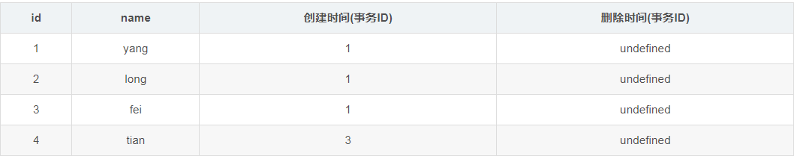
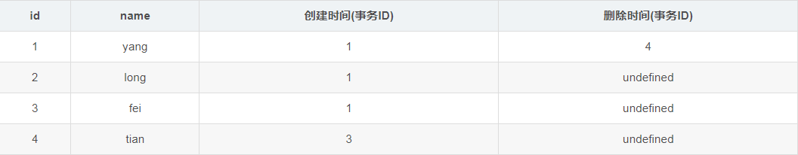
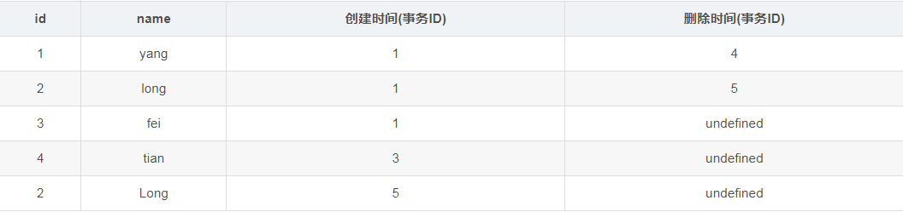

# MySQL 的 MVCC（多版本并发控制）

## 1. 什么是 MVCC

MVCC 全称是 **Multiversion Concurrency Control**（多版本并发控制），提供并发访问数据库时，对事务内读取到的内存做处理，用来避免写操作阻塞读操作的并发问题。

举个例子：程序员 A 正在读数据库中某些内容，而程序员 B 正在给这些内容做修改（假设是在一个事务内修改，大概持续 10s 左右），A 在这 10s 内则可能看到一个不一致的数据。在 B 没有提交前，如何让 A 能够一直读到的数据都是一致的呢？

常见的处理方法有两种：

1. **基于锁的并发控制**：程序员 B 开始修改数据时，给这些数据加上锁。程序员 A 这时再读，就发现读取不了，处于等待状态，只能等 B 操作完才能读数据。这保证 A 不会读到一个不一致的数据，但是会影响程序的运行效率；
2. **MVCC（多版本并发控制）**：每个用户连接数据库时，看到的都是某一特定时刻的数据库快照。在 B 的事务没有提交之前，A 始终读到的是某一特定时刻的数据库快照，不会读到 B 事务中的数据修改情况，直到 B 事务提交，才会读取到 B 的修改内容。

一个支持 MVCC 的数据库，在更新某些数据时，并非使用新数据覆盖旧数据，而是标记旧数据是过时的，同时在其他地方新增一个数据版本。因此，同一份数据有多个版本存储，但只有一个是最新的。

MVCC 提供了时间一致性的处理思路，在 MVCC 下读事务时，通常使用一个时间戳或者事务 ID 来确定访问哪个状态的数据库及哪些版本的数据。读事务跟写事务彼此是隔离开来的，彼此之间不会影响。

MVCC 有两种主要实现方式：

- 第一种实现方式是将数据记录的多个版本保存在数据库中，当这些不同版本数据不再需要时，垃圾收集器回收这些记录。如 PostgreSQL 和 Firebird；
- 第二种实现方式只在数据库保存最新版本的数据，但是会在使用 Undo Log 时动态重构旧版本数据。如 Oracle 和 MySQL InnoDB。

## 2. InnoDB 的 MVCC 实现机制

MVCC 可以认为是行级锁的一个变种，它可以在很多情况下避免加锁操作，因此开销更低。MVCC 的实现大都采用非阻塞读操作，写操作也只锁定必要的行。InnoDB 通过保存数据在某个时间点的快照实现 MVCC。**一个事务，不管执行多长时间，其内部看到的数据都是一致的。**

InnoDB 的 MVCC，**通过在每行记录后面保存两个隐藏的列来实现：一个保存了行的创建时间，一个保存行的过期时间（删除时间）。当然，这里的时间并不是时间戳，而是系统版本号，每开始一个新的事务，系统版本号就会递增**。

在 RR（可重复读）隔离级别下，MVCC 的具体操作如下：

### 1. SELECT 操作

InnoDB 会根据以下两个条件检查每行记录：

- **InnoDB 只查找版本早于（包含等于）当前事务版本的数据行**。可以确保事务读取的行，要么是事务开始前就已存在，或者事务自身插入或修改的记录；
- **行的删除版本要么未定义，要么大于当前事务版本号**。可以确保事务读取的行，在事务开始之前未被删除。只有同时满足上述两个条件的记录，才能作为查询结果返回。

### 2. INSERT 操作

将新插入的行保存当前系统版本号为行创建版本号。

### 3. DELETE 操作

将删除的行保存当前系统版本号为行删除标识（删除版本号）。

### 4. UPDATE 操作

变为 INSERT 和 DELETE 操作的组合：INSERT 的新行保存当前系统版本号为行创建版本号；原有旧行保存当前系统版本号为行删除标识。

> **Purge 操作**：由于旧数据并不真正立即删除，所以必须对这些数据进行清理。InnoDB 会开启一个后台线程执行清理工作，规则是将删除版本号小于当前系统版本的行彻底删除，这个过程叫做 Purge。

## 3. 示例说明

建表语句：

```sql
CREATE TABLE yang (
    id INT PRIMARY KEY AUTO_INCREMENT,
    name VARCHAR(20)
);
```

假设当前系统的版本号从 1 开始。

### 步骤 1：INSERT

InnoDB 为新插入的每一行保存当前系统版本号作为创建版本号。

执行第一个事务（事务 ID 为 1）：

```sql
START TRANSACTION;
INSERT INTO yang VALUES(NULL, 'yang');
INSERT INTO yang VALUES(NULL, 'long');
INSERT INTO yang VALUES(NULL, 'fei');
COMMIT;
```

对应在数据库表中的存储状态如下（后两列为隐藏列，`SELECT` 查询不可见）：


### 步骤 2：SELECT 与并发插入

执行第二个事务（事务 ID 为 2）：

```sql
START TRANSACTION;
SELECT * FROM yang; -- (1)
SELECT * FROM yang; -- (2)
COMMIT;
```

#### 假设 1：并发插入（INSERT）

假设在执行事务 2 的过程中，刚执行完 `(1)`，此时另一个事务 3（事务 ID 为 3）往表中插入了一条数据：

```sql
START TRANSACTION;
INSERT INTO yang VALUES(NULL, 'tian');
COMMIT;
```

此时数据库表中的物理数据如下：



接着执行事务 2 中的 `(2)`：由于 `id=4` 的数据的创建时间（事务 ID 为 3）大于当前事务 2 的 ID，而 InnoDB 只会查找创建事务 ID 小于等于当前事务 ID 的数据行，所以 `id=4` 的数据行并不会被检索出来。在事务 2 中 `(1)` 和 `(2)` 检索出来的数据都只有如下 3 条：


#### 假设 2：并发删除（DELETE）

假设在执行事务 2 的过程中，刚执行完 `(1)`，接着又执行了事务 4（事务 ID 为 4，进行删除）：

```sql
START TRANSACTION;
DELETE FROM yang WHERE id = 1;
COMMIT;
```

此时数据库表中的物理数据如下：



接着执行事务 2 中的 `(2)`：根据 `SELECT` 检索条件，它会检索创建事务 ID $\le 2$ 且删除事务 ID $> 2$（或未定义）的行。对于 `id=1` 的行，由于其删除事务 ID（4）大于当前事务 ID（2），所以事务 2 的 `(2)` 依然能把 `id=1` 的数据检索出来。

因此，事务 2 中两次 `SELECT` 检索到的结果保持一致：


#### 假设 3：并发更新（UPDATE）

假设在执行完事务 2 的 `(1)` 后，又有用户执行了事务 5（事务 ID 为 5，进行更新）：

```sql
START TRANSACTION;
UPDATE yang SET name = 'Long' WHERE id = 2;
COMMIT;
```

根据 UPDATE 原则，InnoDB 会生成新的一行，并在原有行的删除时间列上添加本事务 ID：



继续执行事务 2 的 `(2)`，根据 `SELECT` 检索条件，旧行 `id=2` 的删除事务 ID（5）大于当前事务 ID（2），符合条件；而新行 `id=2` 的创建事务 ID（5）大于当前事务 ID（2），被排除。

因此，事务 2 最终查到的结果依然保持一致：


与事务 2 中 `(1)` 检索到的结果完全相同，实现了可重复读（Repeatable Read）。
