# Kafka 源码阅读笔记

> **作者**：guolonglin，腾讯 IEG 后台开发工程师

## 一、Kafka 总览

Kafka 集群由 Broker 组成；每个 Broker 都拥有一个 Controller，基于 ZooKeeper 进行 Controller Leader 选举并存储集群核心元数据。Leader Controller 负责管理整个集群。

1. 整体架构包含 Producer、Broker 集群、ZooKeeper 和 Consumer Group；
2. 以 `Topic -> Partition -> Replication` 来存储生产者数据，每个 Partition 为一个 Log，Log 分段存储于文件中；
3. Kafka 集群管理消费者信息和消费者消费记录，这些信息也以内部 Topic 形式存储；
4. Kafka Broker 的整体结构如下图所示：

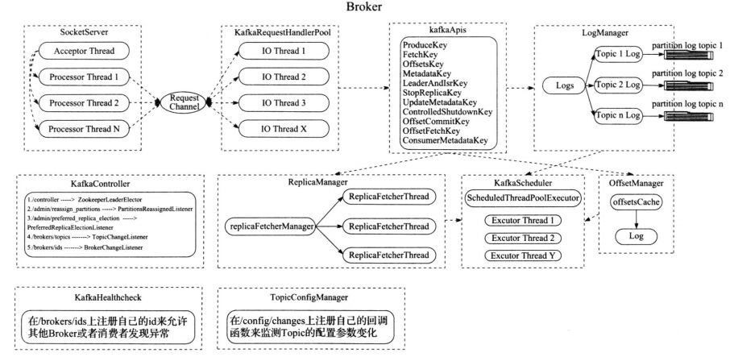

## 二、Broker 结构

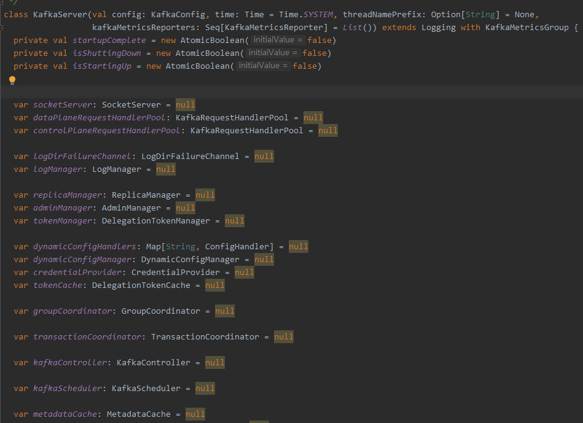

每个 Broker 进程都包含各个核心管理器：

- `SocketServer`：网络处理；
- `ReplicaManager`：副本管理器；
- `KafkaController`：集群管理器；
- `GroupCoordinator`：消费者数据管理器；
- `LogManager`：日志数据管理器；
- `KafkaScheduler`：定时器；
- `ZkClient`：与 ZooKeeper 通信管理器；
- `TransactionCoordinator`：事务协调器。

## 三、通信框架

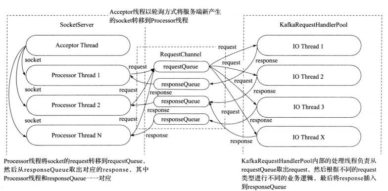

1. `SocketServer` 会启动一个 `Acceptor` 线程，用于接收和创建新 Socket，并轮询安排给 `Processor` 线程来处理后续的数据 I/O；
2. `Processor` 接收到数据后包装成 Request 请求放入单例 `RequestQueue` 队列，并由多个 I/O 逻辑处理线程从 `RequestQueue` 中获取 Request 并处理；
3. 根据 Request 类型调用 `KafkaApis` 完成业务逻辑处理；

   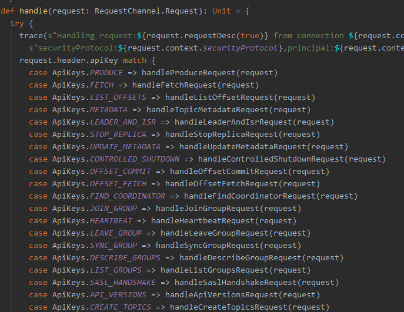

4. 处理完请求后，封装成 Response，根据 `ProcessorID` 放入对应的 `ResponseQueue`，最后由对应的 `Processor` 线程完成网络回复。

## 四、Log 结构

### Topic、Partition 与 Replica 的关系

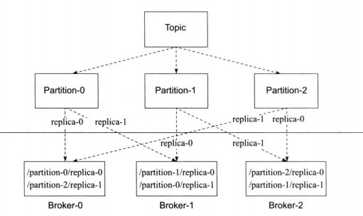

1. 每个 Topic 由多个 Partition 组成，通过 Key 的 Hash 值分配到不同的 Partition。每个 Partition 拥有多个副本（Replica）做主从模式，确保数据的安全性；
2. 每个 Partition 或 Replica 由 Log 结构存储数据，Log 由 `LogSegment` 组成，每个 `LogSegment` 由索引文件和数据文件组成；

   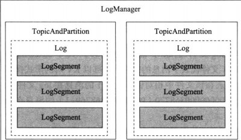

   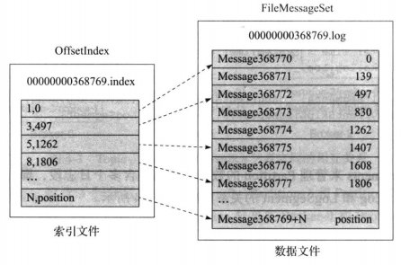

3. 当在 Log 中需要查找获取一条消息时，会根据 Offset 首先定位到处于哪个 `LogSegment` 文件，再根据索引文件定位。`LogSegment` 由跳跃表组成，便于快速搜索，最后再从数据文件读取实际消息；

   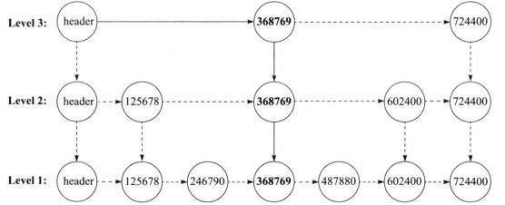

4. 索引文件由 `<K, V>` 组成：K 是相对文件中第几条消息，V 是文件中的绝对物理位置。索引文件可以用来做二分查找，从索引文件中找到位置之后，再从数据文件中顺序查找具体的字节数据。为了避免索引文件过大，会相隔一定字节才写入一条索引项；
5. 每个 Partition 会有多个 Replica 进行同步（1 个 Leader + 多个 Follower），副本的主从地位由 Leader Controller 负责处理。只有 Leader Replica 才能处理读写请求，其它 Follower 仅同步数据。

## 五、Controller

1. 每个 Broker 都拥有一个 `KafkaController`，Controller 主要负责管理整个集群，但是整个集群中只有一个 Leader Controller 有资格来管理集群；
2. Leader Controller 借助 ZooKeeper 来竞选：每个 Controller 初始化时都会向 ZooKeeper 注册竞争成为 Leader 的路径监听，第一个成功写入 ZooKeeper 的 Controller 将成为 Leader，其它 Controller 收到通知后将自己设为 Follower；
3. 当 Controller 成为 Leader 时，会向 ZooKeeper 注册相关监听（注册集群数据状态变化的监听，如增加 Topic、Partition、Replica 等）；

   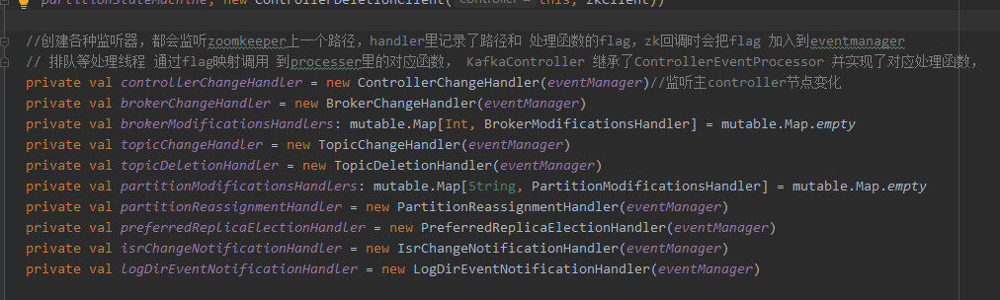

4. 当监听到集群数据发生变化，Leader Controller 就会得到通知并进行处理，处理完成后会同步相关元数据给其它 Follower Controller；
5. Controller 以单工作线程的形式运行，其它请求通过封装为 Job 投递到 Controller 处理线程；

   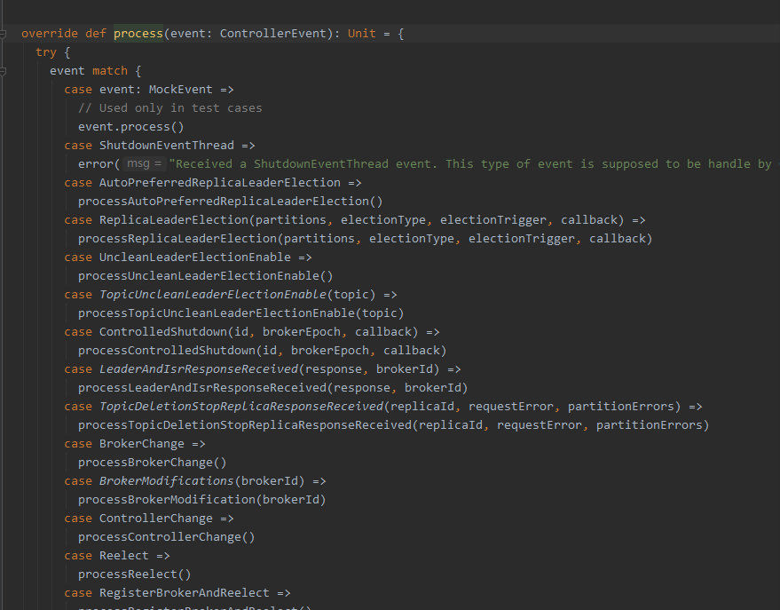

6. Broker 上下线、副本增加重分配、Topic 增加等操作，均通过 ZooKeeper 通知并创建 Job 投入 Job 队列等待工作线程处理；
7. 集群所有的元数据存放在 ZooKeeper 上。当 ZooKeeper 数据发生变化时，通知到 Leader Controller，Controller 处理数据并在内存中保存一份副本做差值更新。

## 六、Replica 管理

1. 所有 Partition 都有多个 Replica 来管理，使得数据更安全、不容易丢失；
2. Replica 的 Leader/Follower 地位由 Leader Controller 来统一调度管理；
3. Replica 有三种状态类型：无效副本、已分配副本（正在同步但还没达到一致状态）和在线副本（正常同步状态）；
4. Replica 数据的同步由 `ReplicaManager` 副本管理器处理，管理器会开启副本同步线程去 Leader Replica 抓取数据；
5. 当 Replica 下线时，Leader Controller 收到 ZooKeeper 通知后进行处理；如果是 Leader Replica 下线，则会重新发起选举，根据不同状态采用对应的选举策略选出新 Leader；
6. 选 Leader 的起因可能来自 Replica 下线、主动改变 Leader 或者为了负载均衡进行重分配。

## 七、GroupCoordinator 消费数据管理

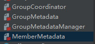

1. `GroupCoordinator` 提供访问消费者数据的接口，`GroupMetadataManager` 负责管理消费者组的数据，`GroupMetadata` 保存消费者组的数据，`MemberMetadata` 保存组内每个成员的数据；
2. Kafka 提供了两种存储消费者数据的方式：一种是保存在 ZooKeeper 上，另一种是保存在 Kafka Log 系统中。由于 ZooKeeper 的频繁写性能较低，因此 Kafka 默认推荐保存在内部 Log 中；
3. 当用户需要访问消费者数据时，会通过 Kafka Client 寻找一个相对空闲的 Broker，通过其 `GroupCoordinator` 找到 Leader 副本所在的地址并返回给 Client 连接。只有 Leader Replica 才提供服务；
4. 消费者数据是通过内置的一个固定 Topic（`__consumer_offsets`）来管理，通过用户 `(Topic, Partition, Consumer Group)` 的组合计算哈希值，存储到对应的 Log 分区中；
5. 当用户加入、新增或删除消费者组信息时，会将变更消息保存至 Log 中，并在内存中维护对应的组元数据结构。

## 八、生产者发送数据

1. 生产者通过 Topic 和 Key 决定往哪个 Partition 写入数据；
2. 生产者需要携带 `acks` 参数用来决定何时收到确认回复（`0`、`1`、`-1`）：
   - 当 `acks=0` 时，表示不需要等待 Broker 回复；
   - 当 `acks=1` 时，表示 Leader 副本写入成功即回复；
   - 当 `acks=-1`（`all`）时，需要所有 ISR（正常同步的副本）都接收并确认后才能回复。接收数据后会存入延迟执行队列，当检测到其它 ISR 来抓取数据并更新进度后，检查是否满足条件并回复生产者。

## 九、TransactionCoordinator 事务处理

1. Kafka 支持事务操作，并支持消费者设定 `read_committed` 和 `read_uncommitted` 读取隔离级别；
2. 用户提交的事务 Log 会保存在内置固定的 Topic 中，使用与消费者数据类似的方法，依赖 Replica 保证数据安全。执行的操作也会正常保存进消息 Log（非事务 Log），并带有标志标示消息状态（如正在事务中未提交、已废弃或已提交）；
3. 消费者数据中会记录当前已经完成事务处理的 Log 最大偏移量（LSO，Last Stable Offset），即此偏移量之前的数据要么是已提交的，要么是已撤销的；
4. 通过 LSO 保证读取 `read_committed` 的消费者不会读到未提交的事务数据；
5. 当用户回滚事务时，Kafka 会记录回滚信息至撤销 Log，同样由 Replica 管理。其中记录的信息是一个 Log 偏移区域内的 `producerId` 集合（由 Kafka 生成的全局唯一 ID），在消费者抓取数据时携带过去，消费者利用该数据过滤掉被放弃的事务消息；
6. 当用户提交事务时，事务协调器（`TransactionCoordinator`）会通知各个对应 Topic 所在的 Broker 正式提交数据。
