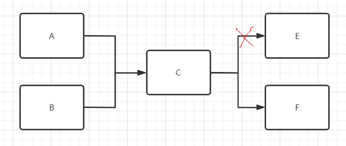
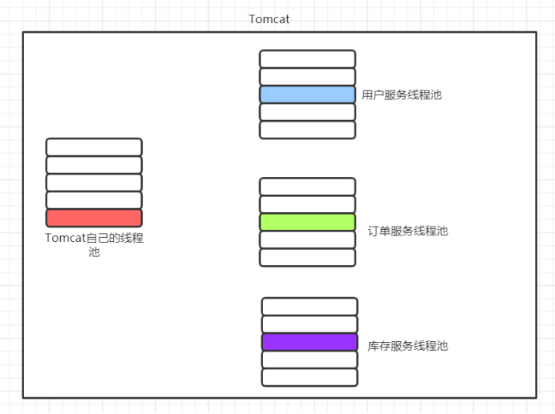
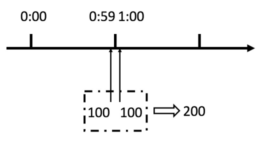
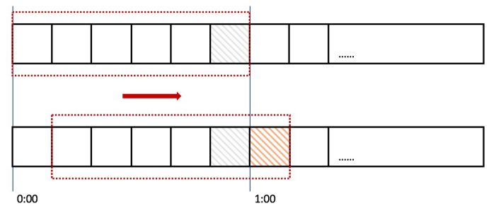
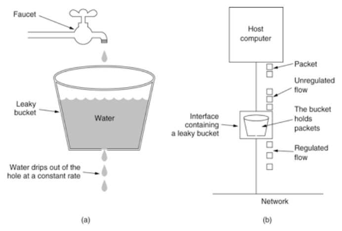
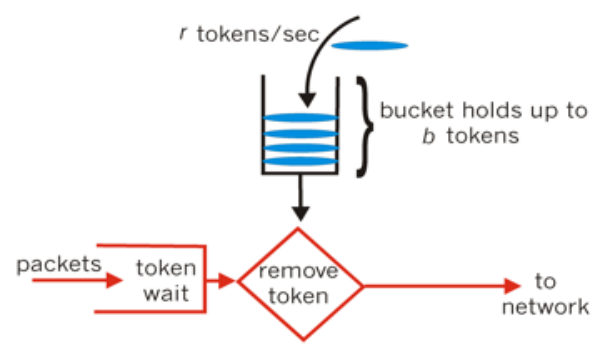
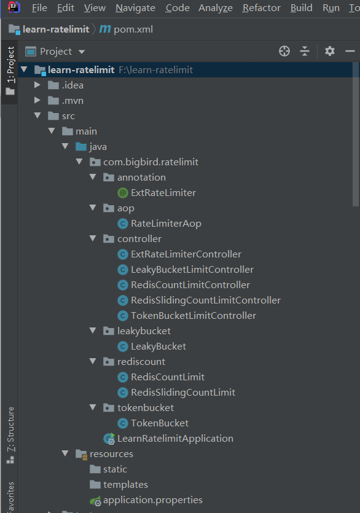

# 互联网并发限流实战

本文主要介绍互联网限流相关的概念与算法，并附带完整的 Java 代码实现，包括计数器法、滑动窗口计数法、漏桶算法、令牌桶算法。文末实现一个自定义限流注解以及基于 AOP 的限流拦截框架。

## 限流相关的基本概念

在介绍限流之前，先介绍几个容易混淆的概念：服务熔断、服务降级、服务隔离。

### 服务熔断

理解熔断之前先了解另一个概念：**微服务的雪崩效应**。熔断机制通常是作为应对雪崩效应的一种微服务链路保护机制。

在微服务架构中，一个微服务通常是完成单一业务功能的独立应用。这样做的好处是各个业务功能之间最大程度地解耦，每个微服务可以独立演进。通常一个应用会由很多个微服务组成，服务间通过 RPC 相互调用。假设有如下服务调用链路：



A、B 依赖 C 去调用 E、F。如果 E 服务不能正常提供服务了，C 的超时重试机制将会执行。同时新的调用不断产生，会导致 C 对 E 服务的调用大量积压，产生大量的调用等待和重试调用，慢慢耗尽 C 的资源（比如内存或 CPU），同时影响 C 调用 F，最终整个应用不可用。本例中由于链路上 E 的故障，对微服务 A、B 的调用就会占用越来越多的系统资源，进而引起系统崩溃，即所谓的“雪崩效应”。

熔断机制是应对雪崩效应的一种微服务链路保护机制。当调用链路的某个微服务不可用、响应时间太长或错误次数达到某个阈值时，会触发服务熔断，快速返回响应信息。当检测到该节点微服务调用恢复正常后，逐步恢复正常的调用链路。

### 服务降级

服务降级主要是指在服务器压力陡增的情况下，根据某种策略对一些非核心服务或页面不做处理或简单处理，从而释放服务器资源以保证核心业务正常运作。例如每年的双十一活动时，电商网站会将无关交易的服务降级（如查看历史订单、商品历史评论等业务只显示最近少量数据）。

### 服务隔离

隔离是指将服务或者资源隔离开来。服务隔离能够在服务发生故障时限定其影响范围，保证其它服务依然可用。资源隔离一般是指通过隔离减少服务间资源竞争。资源隔离的粒度有很多种，比如线程隔离、进程隔离、机房隔离等。线程隔离即隔离线程池资源，不同服务的执行使用不同的线程池。这样做的好处是即使其中一个服务线程池满了，也不会影响到其他的服务。



### 服务限流

服务限流是限制请求的数量，即限制某个时间窗口内的请求速率。一旦达到限制速率则可以拒绝服务（定向到错误页或告知系统忙）、排队等待（比如秒杀、用户评论、下单）、降级（返回兜底数据或默认数据）。

### 各概念对比

- **服务熔断与服务降级**：都是从系统的可用性角度考虑，防止系统响应延迟甚至崩溃而采用的技术性保护手段。服务熔断一般是由某个下游服务故障引起，而服务降级一般是从整体业务的负载情况考虑。
- **服务限流**：是对单位时间内请求次数的限制。三者都是通过某种手段保证流量过载时系统的可用性。
- **服务隔离**：则是让不同的业务使用各自独立的线程资源池，避免服务之间资源竞争的影响。

## 常见的限流手段

常见的限流手段包括：

- 限制总的请求并发数（比如数据库连接池、线程池）；
- 限制瞬时并发数（如 Nginx 的 `limit_conn` 模块，用来限制瞬时并发连接数）；
- 限制某个时间窗口内的平均速率（Guava `RateLimiter`、Nginx 的 `limit_req` 模块）；
- 限制 RPC 调用频率、限制 MQ 的消费速率等。

## 常用的限流算法

### 1. 简单计数法

计数器算法是在固定周期内累加访问次数，当达到设定的阈值时，触发限流策略；下一个周期开始时清零重置。例如 1 分钟内限制请求总数为 100，如果超过 100 则返回失败。

### 2. 滑动窗口计数法

简单计数法有一个致命的问题：**临界突发问题**。例如在 1 分钟限制 100 次的场景下，前 1 分钟的最后几秒突然来了 100 个请求，后 1 分钟的前几秒又立即来了 100 个请求。虽然分别在两个不同的时间区间内未超限，但在跨越临界的很短时间内实际上来了 200 个请求，导致限流失效。



滑动窗口算法将时间周期进一步划分为 $N$ 个小周期，分别记录每个小周期内的访问次数，并根据时间滑动删除过期的小周期。滑动窗口的单位区间划分越细，滑动窗口的滚动就越平滑，限流统计就会越精确。



### 3. 漏桶算法（Leaky Bucket）

漏桶算法的内部有一个容器，类似生活中的漏斗。当请求进来时相当于水倒入漏斗，然后从下方出水口匀速流出。不管进水速率如何增减，出水速率始终保持一致，直到漏桶为空。突发流量来不及处理就会在桶中累积，如果突破了桶容量就会溢出（丢弃请求）。



### 4. 令牌桶算法（Token Bucket）

令牌桶算法是对漏桶算法的改进，能够在限制请求平均速率的同时，允许一定程度的突发调用。在令牌桶算法中，存在一个用来存放固定数量令牌的桶。该算法以恒定的速率往桶中放入令牌。每次请求需要先获取到桶中的令牌才能继续执行，否则等待可用令牌或直接拒绝。

由于令牌生成是持续进行的，如果桶中令牌数达到上限，多余令牌会被丢弃。当突发流量到达时，请求可以直接拿到桶中积累的令牌立刻执行。



## 常用的限流算法 Java 实战

### 1. 工程结构概览



### 2. 基于 Redis 的简单计数法

#### 引入依赖 `pom.xml`

```xml
<properties>
    <java.version>1.8</java.version>
    <spring.version>2.3.1.RELEASE</spring.version>
</properties>
<dependencies>
    <dependency>
        <groupId>org.springframework.boot</groupId>
        <artifactId>spring-boot-starter-web</artifactId>
    </dependency>
    <dependency>
        <groupId>org.springframework.data</groupId>
        <artifactId>spring-data-redis</artifactId>
        <version>${spring.version}</version>
    </dependency>
    <dependency>
        <groupId>org.apache.commons</groupId>
        <artifactId>commons-pool2</artifactId>
        <version>2.8.0</version>
    </dependency>
    <dependency>
        <groupId>io.lettuce</groupId>
        <artifactId>lettuce-core</artifactId>
        <version>5.3.2.RELEASE</version>
    </dependency>
</dependencies>
```

#### 配置 `application.properties`

```properties
server.port=8888
# Redis 数据库索引（默认为 0）
spring.redis.database=0
# Redis 服务器地址
spring.redis.host=127.0.0.1
# Redis 服务器连接端口
spring.redis.port=6379
# Redis 服务器连接密码
spring.redis.password=
# 连接池配置
spring.redis.jedis.pool.max-active=20
spring.redis.jedis.pool.max-wait=1000
spring.redis.jedis.pool.max-idle=10
spring.redis.jedis.pool.min-idle=0
spring.redis.timeout=2000
```

#### 编写 `RedisCountLimit`

基于 Redis 的 `incr` 命令机制实现简单计数限流：

```java
package com.bigbird.ratelimit.rediscount;

import org.springframework.beans.factory.annotation.Autowired;
import org.springframework.data.redis.core.StringRedisTemplate;
import org.springframework.stereotype.Component;

import java.time.LocalTime;
import java.util.concurrent.TimeUnit;

/**
 * 基于 Redis 的计数法限流
 */
@Component
public class RedisCountLimit {

    public static final String KEY = "ratelimit_";
    public static final int LIMIT = 10;

    @Autowired
    private StringRedisTemplate redisTemplate;

    public boolean triggerLimit(String reqPath) {
        String redisKey = KEY + reqPath;
        Long count = redisTemplate.opsForValue().increment(redisKey, 1);
        System.out.println(LocalTime.now() + " " + reqPath + " " + count);

        if (count != null && count == 1) {
            redisTemplate.expire(redisKey, 60, TimeUnit.SECONDS);
        }
        // 防止并发场景未成功设置超时时间导致的 Key 永久不过期
        if (redisTemplate.getExpire(redisKey, TimeUnit.SECONDS) == -1) {
            redisTemplate.expire(redisKey, 60, TimeUnit.SECONDS);
        }

        if (count != null && count > LIMIT) {
            System.out.println(LocalTime.now() + " " + reqPath + " count is: " + count + ", 触发限流");
            return true;
        }
        return false;
    }
}
```

#### Controller 层集成

```java
package com.bigbird.ratelimit.controller;

import com.bigbird.ratelimit.rediscount.RedisCountLimit;
import org.springframework.beans.factory.annotation.Autowired;
import org.springframework.web.bind.annotation.RequestMapping;
import org.springframework.web.bind.annotation.RestController;

import javax.servlet.http.HttpServletRequest;
import java.time.LocalDateTime;

/**
 * 基于 Redis 的计数器限流 Controller Demo
 */
@RestController
public class RedisCountLimitController {

    @Autowired
    private RedisCountLimit redisCountLimit;

    @RequestMapping("/rediscount")
    public String redisCount(HttpServletRequest request) {
        String servletPath = request.getServletPath();
        boolean triggerLimit = redisCountLimit.triggerLimit(servletPath);
        if (triggerLimit) {
            return LocalDateTime.now() + " " + servletPath + " 系统忙，稍后再试";
        } else {
            return LocalDateTime.now() + " " + servletPath + " 请求成功";
        }
    }

    @RequestMapping("/rediscount2")
    public String redisCount2(HttpServletRequest request) {
        String servletPath = request.getServletPath();
        boolean triggerLimit = redisCountLimit.triggerLimit(servletPath);
        if (triggerLimit) {
            return LocalDateTime.now() + " " + servletPath + " 系统忙，稍后再试";
        } else {
            return LocalDateTime.now() + " " + servletPath + " 请求成功";
        }
    }
}
```

### 3. 基于 Redis ZSet 的滑动窗口计数法

#### 编写 `RedisSlidingCountLimit`

```java
package com.bigbird.ratelimit.rediscount;

import org.springframework.beans.factory.annotation.Autowired;
import org.springframework.data.redis.core.StringRedisTemplate;
import org.springframework.stereotype.Component;

import java.time.LocalTime;
import java.util.UUID;

/**
 * 基于 Redis ZSet 的滑动窗口计数法限流
 */
@Component
public class RedisSlidingCountLimit {

    public static final String KEY = "slidelimit_";
    public static final int LIMIT = 10;
    // 限流时间窗口（秒）
    public static final int PERIOD = 60;

    @Autowired
    private StringRedisTemplate redisTemplate;

    public boolean triggerLimit(String reqPath) {
        String redisKey = KEY + reqPath;
        long currentTime = System.currentTimeMillis();

        if (Boolean.TRUE.equals(redisTemplate.hasKey(redisKey))) {
            Long count = redisTemplate.opsForZSet().count(
                    redisKey,
                    currentTime - PERIOD * 1000L,
                    currentTime
            );
            System.out.println("当前窗口请求数: " + count);

            if (count != null && count > LIMIT) {
                System.out.println(LocalTime.now() + " " + reqPath + " count is: " + count + ", 触发限流");
                return true;
            }
        }

        redisTemplate.opsForZSet().add(redisKey, UUID.randomUUID().toString(), currentTime);
        // 清理窗口之前的过期历史数据
        redisTemplate.opsForZSet().removeRangeByScore(redisKey, 0, currentTime - PERIOD * 1000L);
        return false;
    }
}
```

#### Controller 层集成

```java
package com.bigbird.ratelimit.controller;

import com.bigbird.ratelimit.rediscount.RedisSlidingCountLimit;
import org.springframework.beans.factory.annotation.Autowired;
import org.springframework.web.bind.annotation.RequestMapping;
import org.springframework.web.bind.annotation.RestController;

import javax.servlet.http.HttpServletRequest;
import java.time.LocalDateTime;

/**
 * 基于 Redis 的滑动窗口计数器限流 Controller Demo
 */
@RestController
public class RedisSlidingCountLimitController {

    @Autowired
    private RedisSlidingCountLimit redisSlidingCountLimit;

    @RequestMapping("/slidecount")
    public String redisCount(HttpServletRequest request) {
        String servletPath = request.getServletPath();
        boolean triggerLimit = redisSlidingCountLimit.triggerLimit(servletPath);
        if (triggerLimit) {
            return LocalDateTime.now() + " " + servletPath + " 系统忙，稍后再试";
        } else {
            return LocalDateTime.now() + " " + servletPath + " 请求成功";
        }
    }
}
```

### 4. 漏桶算法实现

#### 编写 `LeakyBucket`

```java
package com.bigbird.ratelimit.leakybucket;

import java.time.LocalTime;

/**
 * 漏桶算法限流
 */
public class LeakyBucket {

    // 每秒处理数量（出水速率）
    private final int rate;
    // 桶容量
    private final int capacity;
    // 当前水量
    private int water;
    // 上次刷新时间
    private long refreshTime;

    public LeakyBucket(int rate, int capacity) {
        this.rate = rate;
        this.capacity = capacity;
        this.refreshTime = System.currentTimeMillis();
    }

    private void refreshWater() {
        long now = System.currentTimeMillis();
        // 计算流出的水
        water = (int) Math.max(0, water - (now - refreshTime) / 1000 * rate);
        refreshTime = now;
    }

    public synchronized boolean triggerLimit(String reqPath) {
        refreshWater();
        if (water < capacity) {
            water++;
            System.out.println(LocalTime.now() + " " + reqPath + " 可用容量: " + (capacity - water) + ", 水量: " + water + ", 请求成功");
            return false;
        } else {
            System.out.println(LocalTime.now() + " " + reqPath + " 可用容量: " + (capacity - water) + ", 水量: " + water + ", 触发限流");
            return true;
        }
    }
}
```

### 5. 令牌桶算法实现

基于 Guava `RateLimiter` 实现。

#### 引入 Guava 依赖

```xml
<dependency>
    <groupId>com.google.guava</groupId>
    <artifactId>guava</artifactId>
    <version>29.0-jre</version>
</dependency>
```

#### 编写 `TokenBucket`

```java
package com.bigbird.ratelimit.tokenbucket;

import com.google.common.util.concurrent.RateLimiter;

import java.time.LocalTime;
import java.util.concurrent.TimeUnit;

/**
 * 令牌桶算法限流
 */
public class TokenBucket {

    // QPS（每秒允许的请求数）
    private final int rate;
    private final RateLimiter rateLimiter;

    public TokenBucket(int rate) {
        this.rate = rate;
        this.rateLimiter = RateLimiter.create(rate);
    }

    public boolean triggerLimit(String reqPath) {
        // 尝试在 500ms 内获取令牌
        boolean acquireRes = rateLimiter.tryAcquire(500, TimeUnit.MILLISECONDS);
        if (acquireRes) {
            System.out.println(LocalTime.now() + " " + reqPath + ", 请求成功");
            return false;
        } else {
            System.out.println(LocalTime.now() + " " + reqPath + ", 触发限流");
            return true;
        }
    }
}
```

### 6. 自定义注解与 AOP 动态限流拦截

上述硬编码实现较为繁琐，实际工程中通常将其封装为自定义注解，并通过 AOP 切面实现 Controller 接口的自动限流。

#### 引入 AOP 依赖

```xml
<dependency>
    <groupId>org.springframework.boot</groupId>
    <artifactId>spring-boot-starter-aop</artifactId>
</dependency>
```

#### 编写自定义注解 `@ExtRateLimiter`

```java
package com.bigbird.ratelimit.annotation;

import java.lang.annotation.ElementType;
import java.lang.annotation.Retention;
import java.lang.annotation.RetentionPolicy;
import java.lang.annotation.Target;

/**
 * 自定义限流注解
 */
@Target(ElementType.METHOD)
@Retention(RetentionPolicy.RUNTIME)
public @interface ExtRateLimiter {
    /** QPS 速率 */
    double permitsPerSecond();
    /** 获取令牌的超时等待时间（毫秒） */
    long timeout();
}
```

#### 编写 AOP 切面 `RateLimiterAop`

```java
package com.bigbird.ratelimit.aop;

import com.bigbird.ratelimit.annotation.ExtRateLimiter;
import com.google.common.util.concurrent.RateLimiter;
import org.aspectj.lang.ProceedingJoinPoint;
import org.aspectj.lang.annotation.Around;
import org.aspectj.lang.annotation.Aspect;
import org.aspectj.lang.annotation.Pointcut;
import org.aspectj.lang.reflect.MethodSignature;
import org.springframework.stereotype.Component;
import org.springframework.web.context.request.RequestContextHolder;
import org.springframework.web.context.request.ServletRequestAttributes;

import javax.servlet.http.HttpServletResponse;
import java.io.IOException;
import java.io.PrintWriter;
import java.lang.reflect.Method;
import java.time.LocalTime;
import java.util.concurrent.ConcurrentHashMap;
import java.util.concurrent.TimeUnit;

/**
 * 基于 RateLimiter 的限流切面
 */
@Component
@Aspect
public class RateLimiterAop {

    /** 保存接口路径与对应 RateLimiter 的映射 */
    private final ConcurrentHashMap<String, RateLimiter> rateLimiters = new ConcurrentHashMap<>();

    @Pointcut("execution(public * com.bigbird.ratelimit.controller..*(..))")
    public void rateLimiterAop() {
    }

    /**
     * 环绕通知拦截 Controller 请求
     */
    @Around("rateLimiterAop()")
    public Object doBefore(ProceedingJoinPoint proceedingJoinPoint) throws Throwable {
        MethodSignature signature = (MethodSignature) proceedingJoinPoint.getSignature();
        Method method = signature.getMethod();
        if (method == null) {
            return null;
        }

        ExtRateLimiter extRateLimiter = method.getDeclaredAnnotation(ExtRateLimiter.class);
        if (extRateLimiter == null) {
            return proceedingJoinPoint.proceed();
        }

        double permitsPerSecond = extRateLimiter.permitsPerSecond();
        long timeout = extRateLimiter.timeout();

        ServletRequestAttributes requestAttributes = (ServletRequestAttributes) RequestContextHolder.getRequestAttributes();
        if (requestAttributes == null) {
            return proceedingJoinPoint.proceed();
        }

        String requestURI = requestAttributes.getRequest().getRequestURI();
        RateLimiter rateLimiter = rateLimiters.computeIfAbsent(requestURI, k -> RateLimiter.create(permitsPerSecond));

        boolean tryAcquire = rateLimiter.tryAcquire(timeout, TimeUnit.MILLISECONDS);
        if (!tryAcquire) {
            System.out.println(LocalTime.now() + " " + requestURI + " 触发限流");
            doFallback();
            return null;
        }

        System.out.println(LocalTime.now() + " " + requestURI + " 请求成功");
        return proceedingJoinPoint.proceed();
    }

    private void doFallback() {
        ServletRequestAttributes requestAttributes = (ServletRequestAttributes) RequestContextHolder.getRequestAttributes();
        if (requestAttributes == null) {
            return;
        }
        HttpServletResponse response = requestAttributes.getResponse();
        if (response == null) {
            return;
        }
        response.setContentType("text/html;charset=UTF-8");
        try (PrintWriter writer = response.getWriter()) {
            writer.println("系统忙，请稍后再试！");
        } catch (IOException e) {
            e.printStackTrace();
        }
    }
}
```

#### Controller 使用示例

```java
package com.bigbird.ratelimit.controller;

import com.bigbird.ratelimit.annotation.ExtRateLimiter;
import org.springframework.web.bind.annotation.RequestMapping;
import org.springframework.web.bind.annotation.RestController;

import javax.servlet.http.HttpServletRequest;
import java.time.LocalTime;

/**
 * 自定义注解限流测试 Controller
 */
@RestController
public class ExtRateLimiterController {

    @RequestMapping("/extRate1")
    @ExtRateLimiter(permitsPerSecond = 0.5, timeout = 500)
    public String extRate1(HttpServletRequest request) {
        return LocalTime.now() + " " + request.getRequestURI() + " 请求成功";
    }

    @RequestMapping("/extRate2")
    @ExtRateLimiter(permitsPerSecond = 2, timeout = 500)
    public String extRate2(HttpServletRequest request) {
        return LocalTime.now() + " " + request.getRequestURI() + " 请求成功";
    }
}
```

## 小结

本文详细介绍了互联网限流相关的基本概念（熔断、降级、隔离、限流）以及 4 种核心算法（简单计数法、滑动窗口计数法、漏桶算法、令牌桶算法），并给出了完整的 Java 代码实现与 AOP 动态限流注解封装。

示例代码下载地址：
> [https://github.com/bigbirditedu/learn-ratelimit](https://github.com/bigbirditedu/learn-ratelimit)
