# 如何设计一个亿级消息量的 IM 系统

本文不提供通用的 IM 架构方案，也不评判某种架构的好坏，而是讨论设计 IM 系统的常见难题与业界的通用解决方案。在真实的业务场景中，并没有所谓的通用方案，不同的技术方案都有其适用场景与优缺点。在有限的人力、物力跟时间资源下，一个能够快速迭代、方便扩展的系统才是好的系统。

## IM 核心概念

- **用户**：系统的使用者；
- **消息**：用户之间的沟通内容。在 IM 系统中通常包括文本消息、表情消息、图片消息、语音消息、视频消息、文件消息等；
- **会话**：两个用户之间因聊天而建立起的关联；
- **群**：多个用户之间因聊天而建立起的关联；
- **终端**：用户使用 IM 系统的机器或客户端（Android 端、iOS 端、Web 端、PC 客户端等）；
- **未读数**：用户尚未阅读的消息数量；
- **用户状态**：用户当前在线、离线、隐身或挂起等状态；
- **关系链**：用户与用户之间的社交关系（单向好友、双向好友、关注关系等）。关系链的存储可以使用图数据库（如 Neo4j），也可以使用关系型数据库；
- **单聊**：一对一私聊；
- **群聊**：多人群组聊天；
- **客服**：电商与服务领域中，用户与售前/售后人员的咨询通道；
- **消息分流**：当店铺有多个客服时，根据规则（客服是否在线、繁忙程度、咨询类型等）决定将用户消息分流给哪个客服；
- **信箱（Timeline）**：接收与发送消息的单向或双向有序队列。

## 读扩散 vs 写扩散

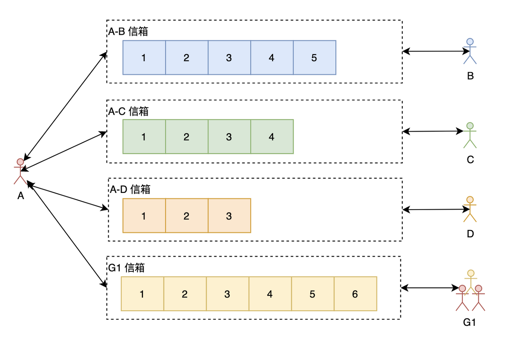

### 1. 读扩散（Read Fan-out / Pull）

如上图所示，用户 A 与每个聊天对象和群组都有一个独立信箱（Timeline）。A 在查看聊天信息时需要读取所有有新消息的信箱。

- **优点**：
  - **写操作很轻量**：无论是单聊还是群聊，发送方只需要向对应的信箱写入一次；
  - **历史记录天然有序**：每个信箱天然保存了双方的完整聊天记录，方便搜索与回溯。
- **缺点**：
  - **读操作很重**：接收方需要拉取所有相关信箱的数据，会产生多次读取操作。

### 2. 写扩散（Write Fan-out / Push）

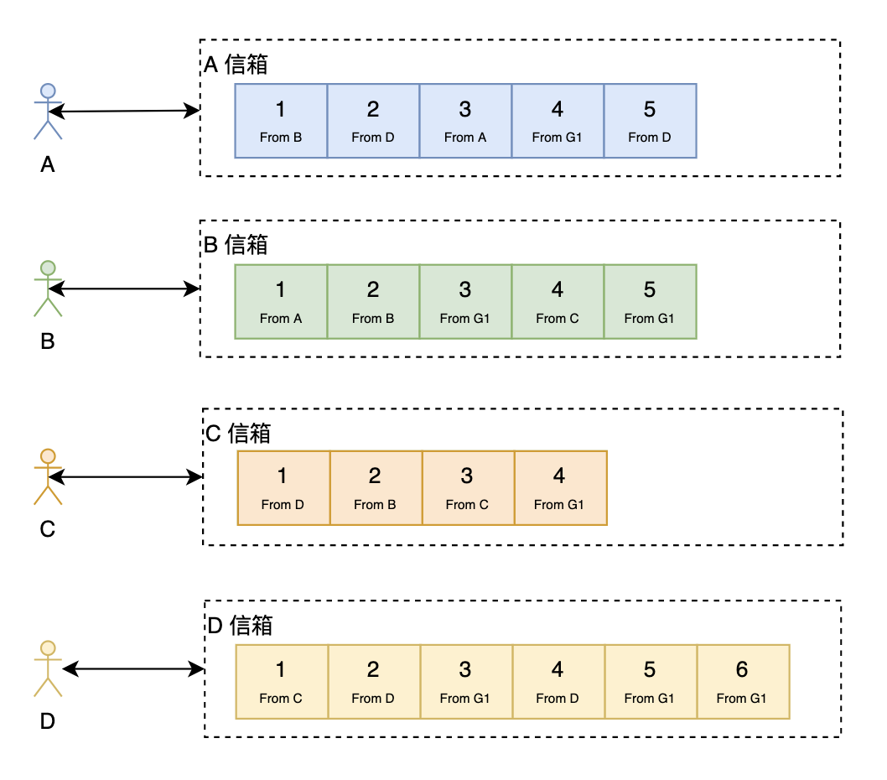

在写扩散中，每个人都只从自己的个人信箱中读取消息。发消息时的处理方式如下：

- **单聊**：向自己的信箱和对方的信箱各写一份消息；
- **群聊**：向所有群成员的个人信箱中各写一份消息。

- **优点**：
  - **读操作很轻量**：用户只需要读取自己的个人信箱；
  - **多终端同步简单**：方便按时间线做多端同步。
- **缺点**：
  - **写操作很重**：特别是对于大群聊，写操作会被大幅放大（Fan-out）。

## 唯一 ID 设计

在 IM 系统中需要生成唯一 ID 的主要场景有：**会话 ID** 与 **消息 ID**。

常见 ID 生成方案：

1. UUID
2. 基于 Snowflake（雪花算法）的 ID 生成方式
3. 基于数据库号段（Segment）的生成方式
4. 基于 Redis 或数据库自增 ID 生成方式
5. 基于特定业务规则拼接的唯一 ID

详见参考文章：[分布式唯一 ID 解析](https://xie.infoq.cn/article/6673de15fabf57e46017c12c4)

### 消息 ID 设计要点

1. **消息 ID 必须保持递增**：
   - 递增 ID 能够利用存储引擎（如 B+ 树或 LSM 树）的局部性原理，让相邻消息紧凑存储，大幅提升写入与范围读取性能；若随机或无序，会产生严重的随机 I/O 与存储碎片。
2. **全局递增 vs 用户级别递增 vs 会话级别递增**：
   - **全局递增**：消息 ID 在全系统按时间单调递增（如 Snowflake）。读扩散模式下可利用全局 ID 判断消息缺失；
   - **用户级别递增**：消息 ID 仅保证在单个用户的个人信箱中递增（典型代表：微信）；
   - **会话级别递增**：消息 ID 仅保证在单个会话内递增（典型代表：QQ）。
3. **连续递增 vs 单调递增**：
   - **连续递增**（1, 2, 3...）：客户端若发现接收到的 ID 不连续，可立刻感知消息丢失并向服务端补拉；
   - **单调递增**：只需保证后续 ID 大于此前 ID。

> **总结**：
> - **写扩散**：个人 Timeline ID 采用用户级别递增，消息 ID 全局递增且保证单调递增即可；
> - **读扩散**：消息 ID 采用会话级别递增，且最好保持连续递增。

### 会话 ID 设计要点

会话 ID 可采用全局递增 ID + 映射表保存 `from_user_id`、`to_user_id` 与 `conversation_id` 的关系。

对于 32 位整型用户 ID，可以通过位运算直接拼接：

```text
conversation_id = (min(from_id, to_id) << 32) | max(from_id, to_id)
```

注意：如果后续用户 ID 扩展至 64 位，该方案将无法继续使用，因此建议使用独立的全局自增号段来生成会话 ID。

## 推模式 vs 拉模式 vs 推拉结合模式

在 IM 系统中，新消息的获取通常有三种方式：

1. **推模式（Push）**：服务器有新消息时主动推送给客户端（基于 WebSocket 或 TCP 长连接）；
2. **拉模式（Pull）**：由客户端定期主动发起 HTTP 请求拉取新消息，通常用于获取历史消息；
3. **推拉结合模式（Push + Pull）**：服务器有新消息时仅推送一个轻量级的“新消息通知”，客户端收到通知后再向服务端拉取具体消息内容。

### 推模式示意图

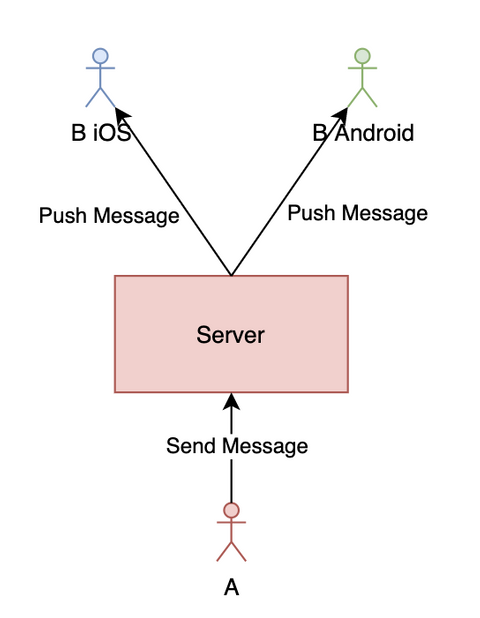

由于移动网络不稳定，基于长连接的推送可能会因客户端“假在线”而导致推送丢失。

### 推拉结合模式示意图

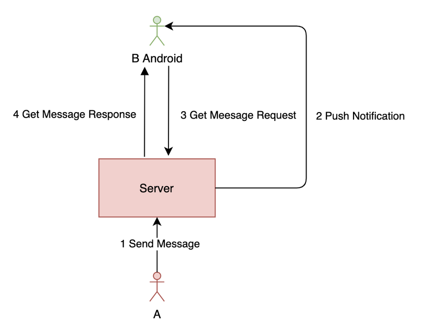

推拉结合模式通过推送通知 + 客户端定时兜底拉取，完美解决了纯推模式下可能丢失消息的问题。推拉结合模式通常推荐搭配 **写扩散** 使用。

## 业界主流解决方案

### 1. 微信

微信后台架构核心采用：**写扩散 + 推拉结合**。
由于群聊同样采用写扩散，因此微信对群人数设置了上限（如 500 人上限）。

微信采用了多数据中心与异地多活架构：

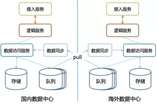

每个数据中心拥有全量数据，用户被路由归属于指定数据中心，保证单点读写与一致性。数据中心间通过消息队列同步，底层采用 PaxosStore 保证强一致。

序列号生成机制：采用 **基于申请 DB 步长的生成方式 + 用户级别递增**。

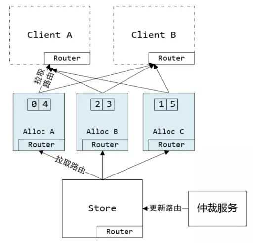

### 2. 钉钉

钉钉最开始采用写扩散模型，后针对超级大群优化为了读写结合/读扩散模型。在存储层，阿里引入了 Tablestore 支撑主键列自增，实现了用户级别的自增 ID 序列。

### 3. Twitter (Feeds)

Twitter 在 ID 生成上采用了著名的 **Snowflake** 算法（全局单调递增）：

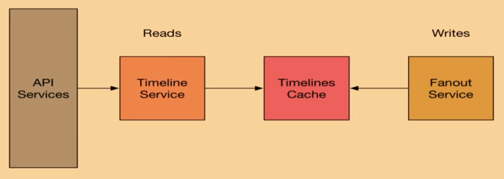

Twitter 最早采用纯写扩散模型：

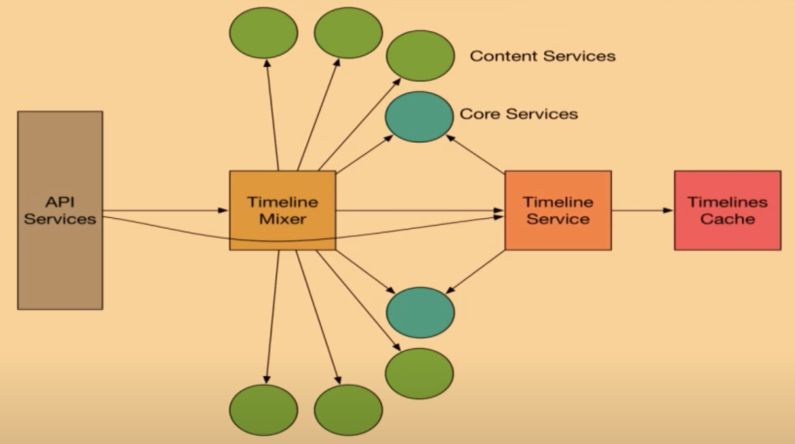

为了解决大 V（Followers 数极多）写扩散爆炸的问题，Twitter 演进为 **写扩散 + 读扩散结合** 的混合模型：普通用户采用写扩散，大 V 采用读扩散，在前端通过 Timeline Mixer 进行实时聚合。

### 4. 58 到家

58 到家实现了通用的实时消息平台：

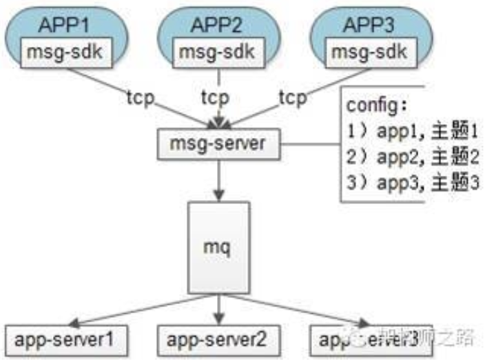

采用 ACK 确认机制保证消息可靠投递：消息落库 -> 推送客户端 -> 客户端 ACK 回执 -> 服务端删除暂存消息。

## IM 核心问题与实战技巧

### 1. 如何保证消息的实时性

- **协议选择**：TCP Socket 自定义协议、UDP 协议（QQ）、HTTP 长轮询/WebSocket；
- **并发度控制**：推送大群消息时必须引入线程池与 MQ 并行推送，防止队列前端阻塞后端。

### 2. 如何保证消息时序

- 前端异步发送时带上本地递增序号；
- 服务端 MQ 拆分时按 `from_user_id` 或 `conversation_id` 进行 Hash Sharding，确保同一个会话的消息在同一个队列中有序处理。

### 3. 用户在线状态管理

#### 方案 A：基于 Redis 管理在线状态

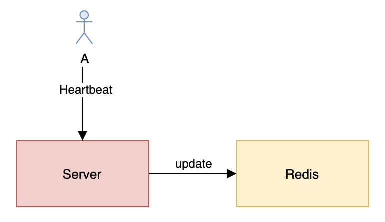

通过客户端定时心跳刷新 Redis 中的过期时间，避免连接异常断开导致的假在线。

#### 方案 B：基于分布式一致性哈希管理在线状态

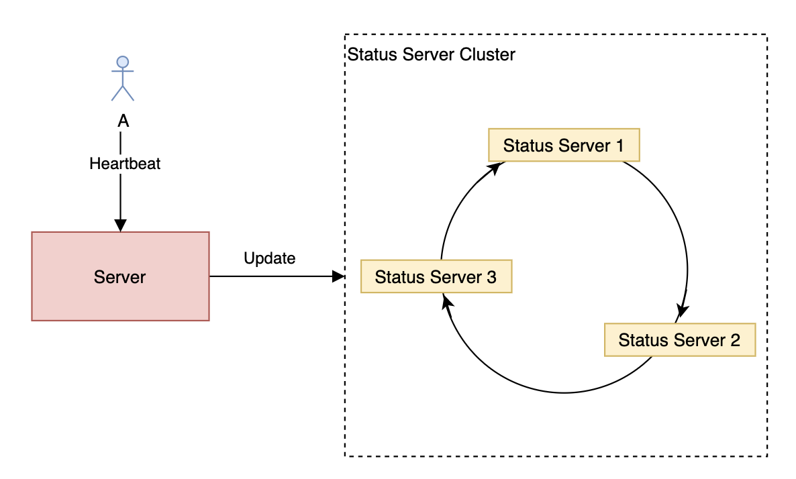

通过一致性哈希节点管理连接状态，注意扩缩容时需要做状态迁移与虚拟节点配置。

### 4. 多端同步实现

#### 读扩散多端同步

每个会话维护连续递增 ID。客户端收到推送后校验 ID 是否连续，若断层则向服务端补拉。

#### 写扩散多端同步

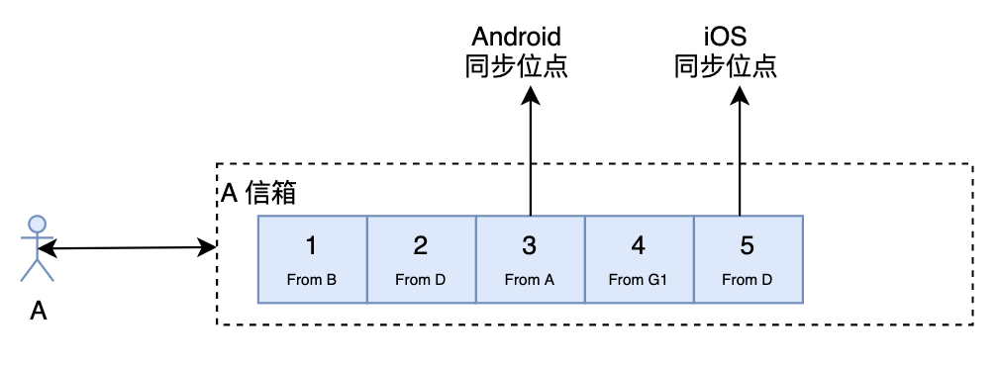

客户端保存上一次同步的全局位点（Sync Offset），同步时只需带上该 Offset，服务端返回大于该 Offset 的所有新消息并更新位点。

### 5. 未读数处理

- **读扩散**：在服务端原子维护会话未读数与总未读数（利用 Redis `multi` 事务或 Lua 脚本）；
- **写扩散**：服务端弱化会话概念，未读数交由客户端根据收到的消息与已读事件自行计算。

### 6. 数据冷热分离架构

对于历史消息，随时间推移访问概率剧烈下降。一般采用 **HWC（Hot-Warm-Cold）** 三级冷热分离架构：

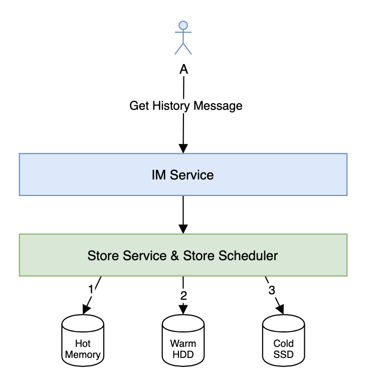

- **Hot 层**：近期热数据，保存在 Redis 内存中；
- **Warm 层**：近几个月数据，保存在 HBase / Tablestore / Cassandra 等 NoSQL 中；
- **Cold 层**：远古历史数据，归档到 HDFS / OSS / 归档数据库中。

### 7. 接入层长连接负载均衡

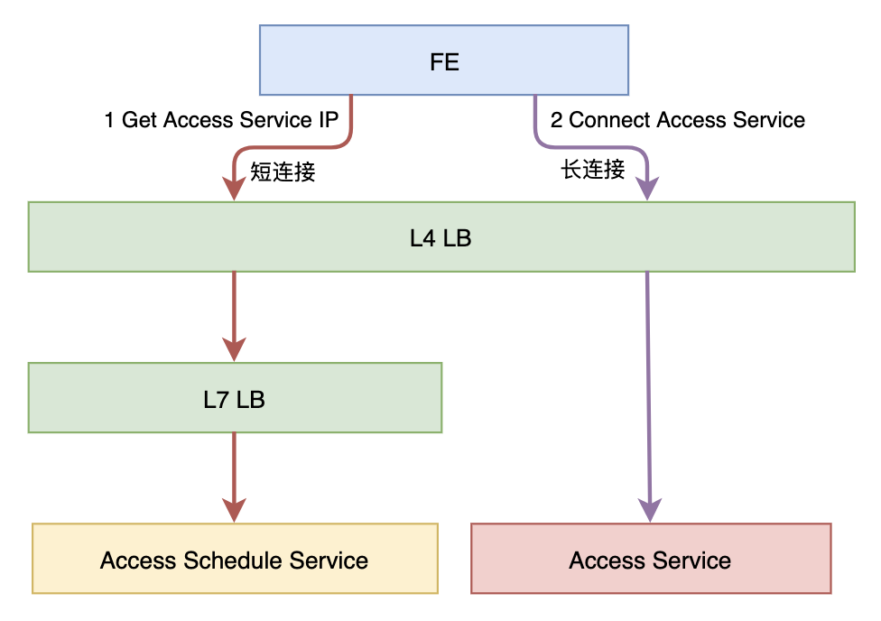

引入 **Access Schedule Service（调度服务）**，客户端先向调度服务请求分配的最佳接入节点（考虑就近接入、节点负载、灰度策略），再与具体的 Access Service 建立 TCP/WebSocket 长连接，避免配置 Reload 导致的连接大面积中断。

## 总结与架构心得

1. 灰度！灰度！灰度！
2. 监控！监控！监控！
3. 告警！告警！告警！
4. 缓存！缓存！缓存！
5. 限流！熔断！降级！
6. 低耦合，高内聚！
7. 避免单点，拥抱无状态！
8. 评估！评估！评估！
9. 压测！压测！压测！

## 参考资料

- [From 0 to 1: Evolution of WeChat Backend Architecture](https://mp.weixin.qq.com/s/fMF_FjcdLiXc_JVmf4fl0w)
- [WeChat Sequence Generator Architecture Design](https://mp.weixin.qq.com/s/JqIJupVKUNuQYIDDxRtfqA)
- [How We Learned to Stop Worrying and Love Fan-In at Twitter](https://www.youtube.com/watch?v=WEgCjwyXvwc&t=1971s)
- [Tablestore IM Architecture Design](https://help.aliyun.com/document_detail/143555.html)
