# 生成浏览器唯一稳定 ID 的探索

## 1. 背景

项目的 PC Web 端在不同浏览器有不同的登录态，同一浏览器多个窗口或 Tab 共用一个登录态（隐身无痕模式除外）。为了实现 PC 浏览器端设备管理功能，需要一种能够唯一区分不同浏览器的方法，在移动端 App 中这对应设备 ID。

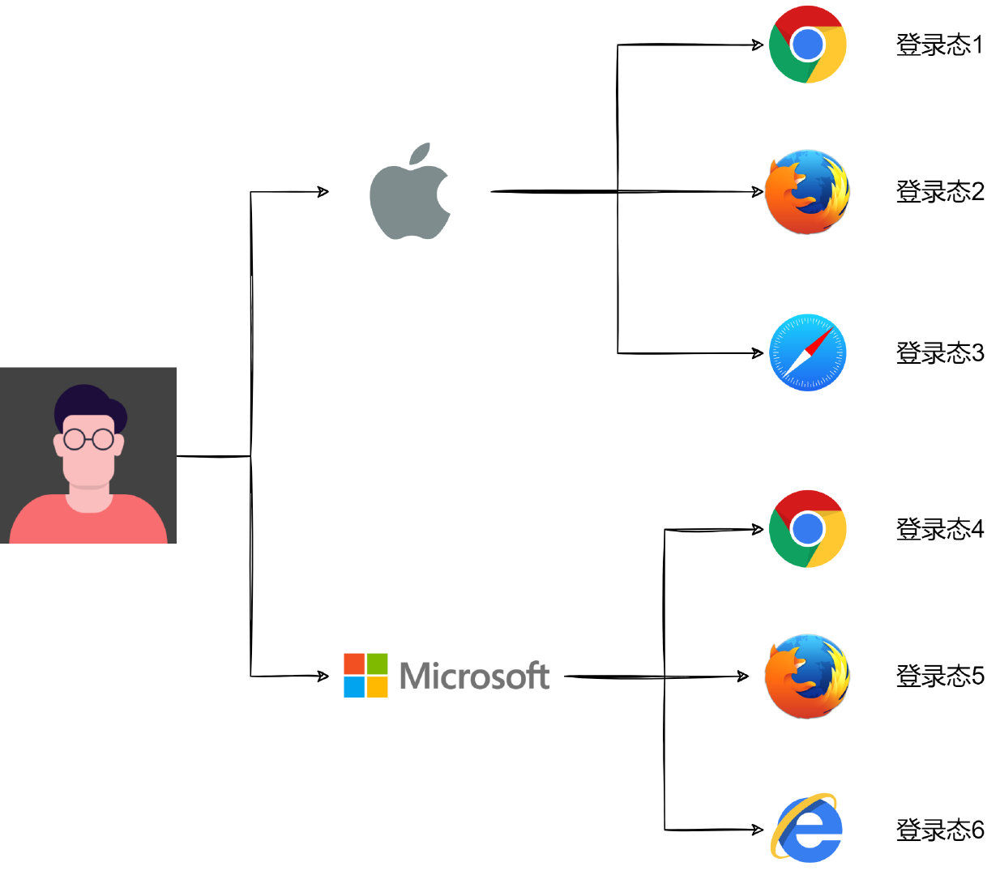

这里说的浏览器 ID 在业界早有研究，被称为 **浏览器指纹**（Browser Fingerprinting）。浏览器指纹是 EFF（电子前哨基金会）提出的一项追踪技术，通过浏览器对网站可见的公开配置来匿名识别浏览器。在 50 万份不同浏览器数据分析中，某些场景下 94% 的浏览器具有唯一的指纹。当时，EFF 通过提取浏览器的 8 个特征值：

$$\{ 	ext{user agent}, 	ext{plugins}, 	ext{fonts}, 	ext{video}, 	ext{supercookies}, 	ext{http accept}, 	ext{timezone}, 	ext{cookie enabled} \}$$

综合起来哈希生成一个指纹值。每项浏览器特征都包含不同 Bit 的信息熵，提取的八项特征共包含 18.1 Bits 的信息，这意味着在 286,777 个指纹中才会出现一个重复的浏览器指纹。

浏览器指纹是 **无状态** 的，无需用户授权即可收集信息，且不会像 Cookie 一样被用户轻松禁止或清除。只要指纹足够唯一，就能被精准识别与跟踪。浏览器指纹可广泛应用于反欺诈（防刷票、防黄牛、防机器人）、异地或可疑登录提醒、多设备管理，以及在注重隐私前提下的用户数据分析与体验提升。

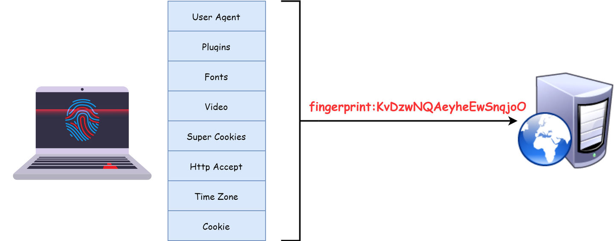

## 2. 分析

抛开业界已有的方案，我们可以先开脑洞去分析。目标是为指定设备的指定浏览器生成一个 **唯一** 且 **稳定** 的 ID。分析维度主要涵盖硬件、操作系统与浏览器三个层面。

### 2.1 一些参考维度

#### 2.1.1 MAC 地址
MAC 地址（物理地址/硬件地址）是网卡的唯一标识。如果能在浏览器端获取 MAC 地址，就能极高程度地保证唯一性与稳定性。然而在现代浏览器中出于安全隐私限制，网页 JavaScript **无法直接获取客户端 MAC 地址**；即使在服务端，HTTP 请求也只能拿到上一级路由器的 MAC 地址而非客户端本身。此外 MAC 地址在软件层面也是可被伪造的。

#### 2.1.2 IP 地址
设备连接网络时会被分配一个 IP 地址。服务端可从 HTTP 请求头中解析，浏览器端也可通过 WebRTC 的 `RTCPeerConnection` API 获取局域网 IP。但 IP 地址存在重复（同局域网共享公网 IP）和易变（频繁切换网络/代理）的问题。尽管如此，IP 地址碰撞率极低，可作为辅助维度提升指纹的区分度。

#### 2.1.3 Cookie & LocalStorage
Cookie 是存储在浏览器端的文本数据，常用于维持登录态。虽然 Cookie 本身易被清空或禁用（不能单独作为硬件指纹），但可作为辅助存储手段。当用户登录态失效或特征发生小幅抖动时，可优先从 Cookie/LocalStorage 读取历史生成的 ID 进行兜底。

#### 2.1.4 User Agent
`User-Agent`（UA）包含操作系统、CPU 架构、浏览器型号及版本等信息，提供约 5.34 Bits 的信息熵。UA 具有一定区分度但稳定性较差（浏览器升级会导致版本号变化）。可行策略是仅提取浏览器主型号而不包含小版本号，或结合其他特征共同计算。

综上所述，单一维度无法兼顾唯一性与稳定性，更高效的策略是将多个维度组合形成 **综合指纹**。目前业界领先的开源指纹库是 **FingerprintJS**。

### 2.2 FingerprintJS 探秘

FingerprintJS（简称 FPJS）是一个高度精密的浏览器指纹库，提供开源版与 Pro（付费）版。它能在隐身模式与清除数据后保持相当高的指纹稳定性。

#### 2.2.1 开源版本

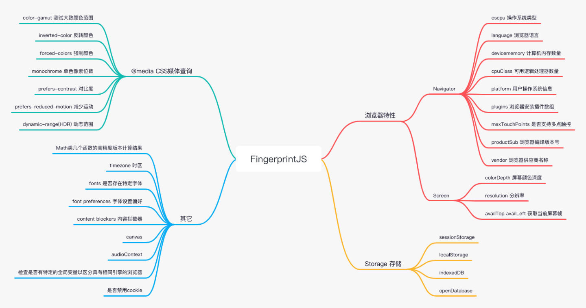

开源版本通过捕获浏览器的多项指标并结合哈希算法生成指纹。指标涵盖四大类：浏览器特性、存储支持、媒体查询、系统环境。GitHub 上拥有 14k+ Star 并被数万网站使用。

#### 2.2.2 唯一性与稳定性的平衡

- **唯一性**：不同设备/浏览器生成的指纹互不相同；
- **稳定性**：同一设备的同一浏览器在多次访问中生成的指纹保持不变。

在指标筛选中，需在唯一性与稳定性之间寻找平衡点：增加指标能提升唯一性，但若包含易变指标（如电池电量、屏幕旋转角），则会破坏稳定性。

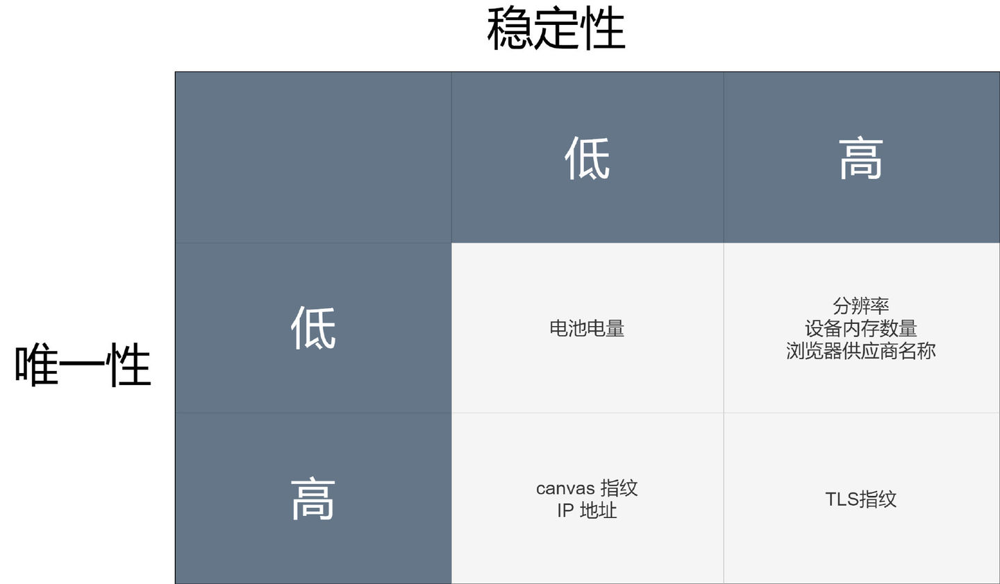

在四象限分析中，应优先剔除“低唯一性、低稳定性”的指标（如电池电量），保留高区分度与高稳定性的核心组合。

#### 2.2.3 核心特色指标

- **Canvas 指纹**：利用 HTML5 `<canvas>` 标签绘制隐形图形/文本。由于不同操作系统、显卡驱动、抗锯齿算法及字库渲染的微小差异，`canvas.toDataURL()` 导出的 Base64 编码具有极高的唯一性；
- **字体检测（Font Detection）**：通过建立隐藏的 `` 元素比较默认字体与目标字体的渲染宽高差，探测系统是否安装了特定字体；
- **Math 精度差异**：由于底层 CPU 架构与三角函数算法实现不同，在极值计算（如 `Math.sin(-1e300)`）时不同环境会产生微小的浮点数偏差；
- **AudioContext 音频指纹**：与 Canvas 原理类似，利用 Web Audio API 生成特定频率音频并提取硬件音频处理器的渲染差异。

#### 2.2.4 Pro 付费版本

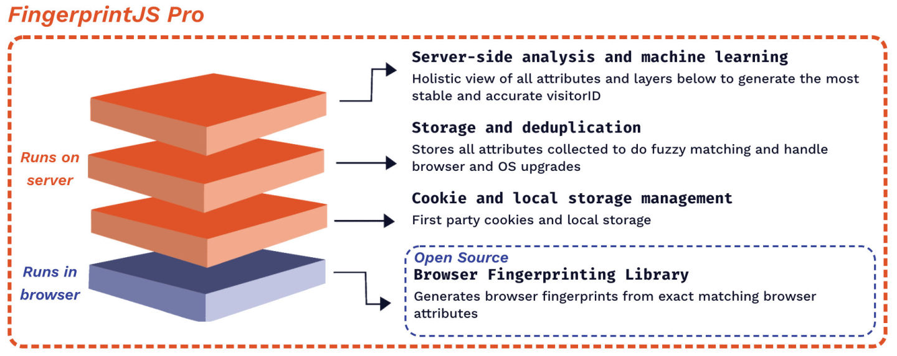

开源版仅在前端纯 JS 环境运行，当两台配置完全相同的设备访问时可能会产生指纹碰撞。而 Pro 专业版建立在开源版之上，引入了服务端辅助识别（IP 归属地匹配、历史行为模糊匹配、机器学习矫正与服务端持久化 Token）：

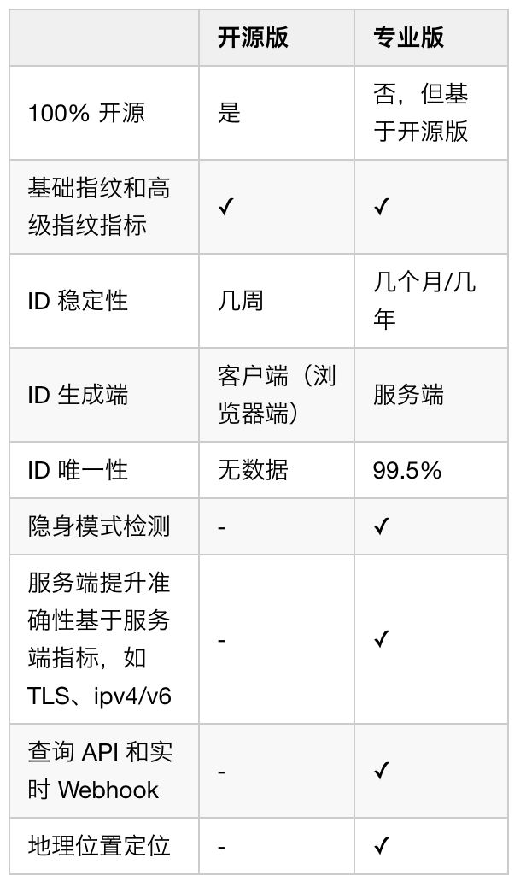

#### 2.3 分析与实验发现

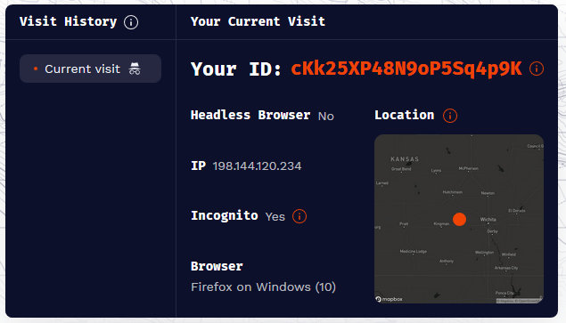

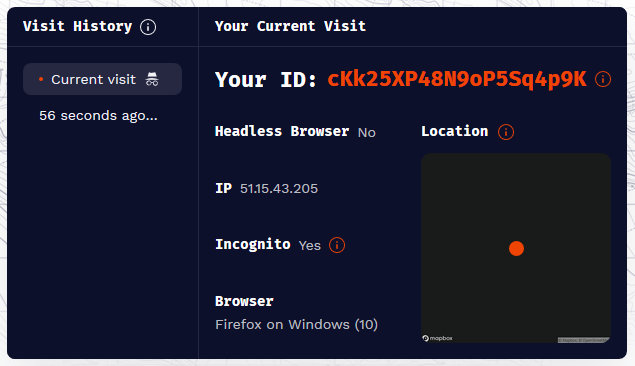

1. **IP 变化对指纹的影响**：通过 VPN 切换 IP 后，FPJS 生成的指纹依然保持稳定。说明 IP 仅用于服务端的风险辅助校验，而不作为生成核心指纹的硬性因子；
2. **指标伪造测试**：在普通模式下，修改部分参数后指纹并未改变。原因在于 Pro 版在 Cookie/LocalStorage 中保存了 Token，下一次优先读取 Cookie 进行历史匹配；

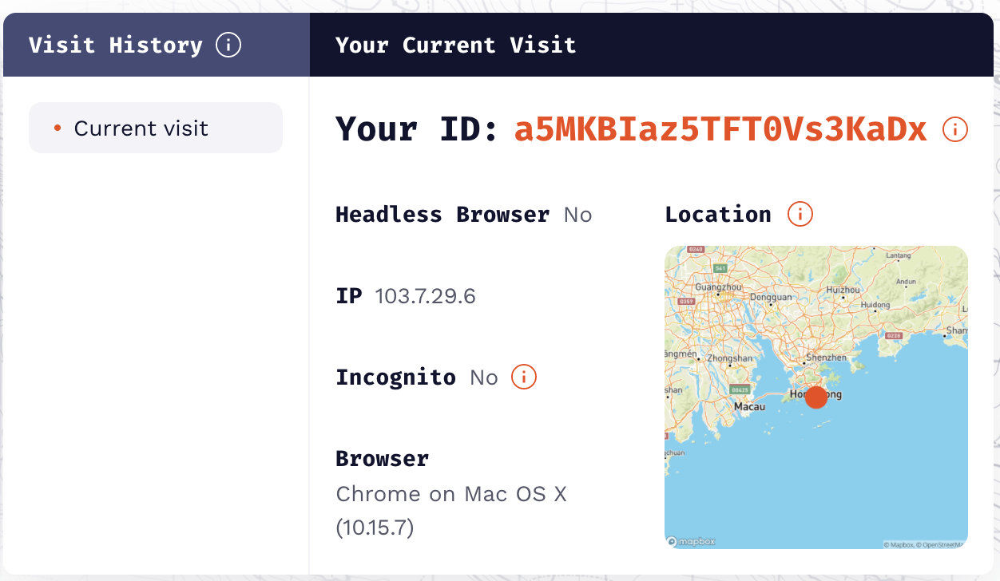

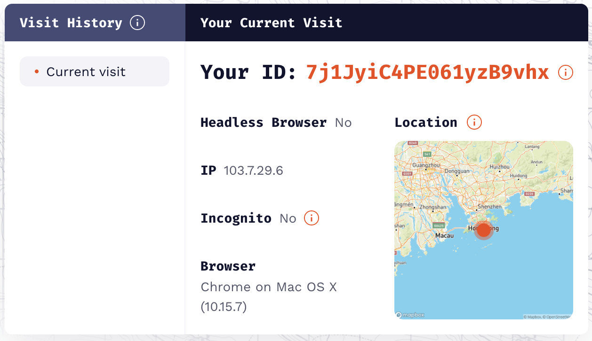

3. **清除 Cookie 后的伪造测试**：清空存储并伪造指标后指纹会发生改变。验证了存储层历史记录对维持指纹稳定性的关键作用；
4. **服务端智能矫正**：当故意将 `navigator.platform` 伪造为不匹配的值（如 Win10 上改成 `MacIntel`）时，指纹依然保持稳定，说明服务端模型识别出离群参数并进行了智能纠偏。

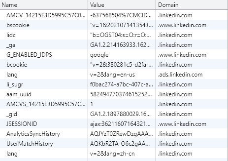

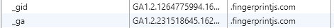

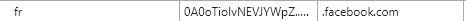

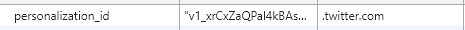

## 3. 落地采用的做法

在千万级用户量测试中，FPJS 的“独立用户数 / 独立指纹数”比值约 1.3（App 端设备 ID 比值约为 1.1~1.2）。该指标在千万级规模下依然表现稳定，能够很好地满足 Web 设备管理的需求。

最终技术方案架构如下：

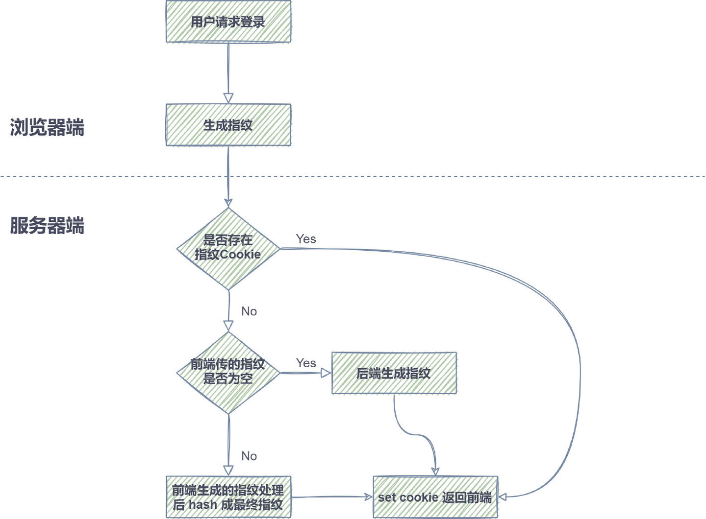

### 落地实现流程

1. **前端生成与上报**：用户登录时，前端通过 FPJS 库采集浏览器特征并生成 Hash 值，发送至后端；
2. **后端生成与 Cookie 写入**：后端结合 IP 及扩展信息二次 Hash 生成服务端指纹 Token，并通过 `Set-Cookie` 返回前端持久化存储；
3. **读取与降级机制**：后续请求优先读取 Cookie 中的 Token。若 Cookie 丢失，则根据前端特征重新生成并匹配历史记录；
4. **持续优化方向**：
   - 升级至 FingerprintJS 最新版以捕获更多新特性；
   - 建立历史指纹关联库，辅助验证 Cookie 有效性；
   - 引入 IP 频次与地理位置辅助防伪。

## 4. 反浏览器指纹与攻防

- **禁用 Cookie 或 JS**：能防御大部分追踪，但会导致现代 Web 应用无法正常使用；
- **无痕模式 + 随机身份插件**：退出无痕模式清空存储，结合 Fingerprint Spoofing 插件随机化 Canvas/UA 参数；
- **Tor 浏览器**：Tor 的核心策略是 **让所有 Tor 用户的浏览器指纹保持完全一致**，极大降低指纹唯一性，同时强制走多层匿名代理。

### 总结与展望

浏览器指纹技术根植于 Web 浏览器的基础机制中，完全消除它非常困难。作为技术开发者，我们应当建立合规的机制，在尊重用户隐私与授权的前提下，将浏览器指纹合理应用于反欺诈、安全风控与设备管理等正向业务场景中。
