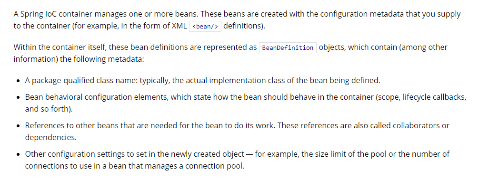
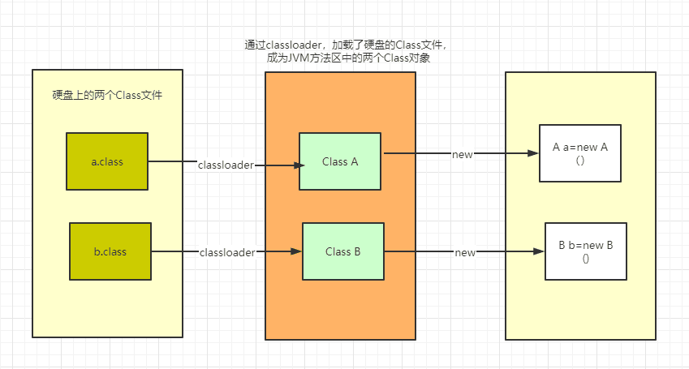
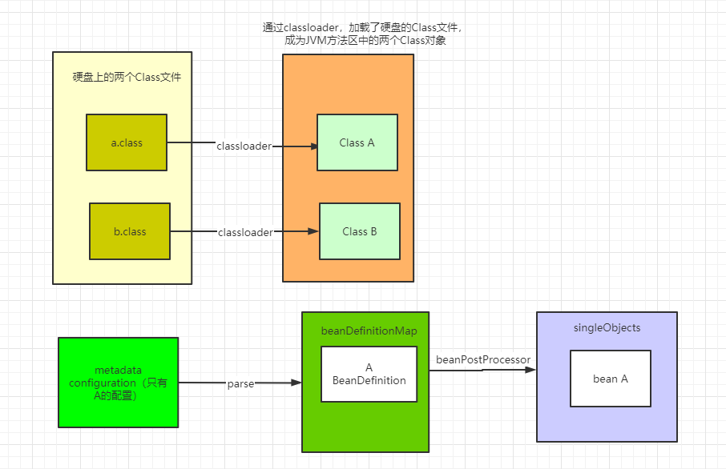
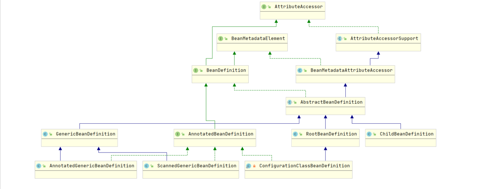
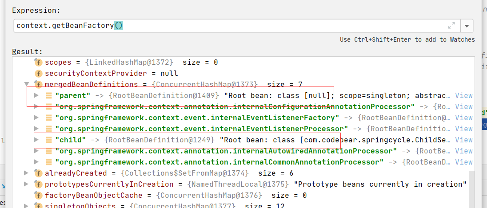
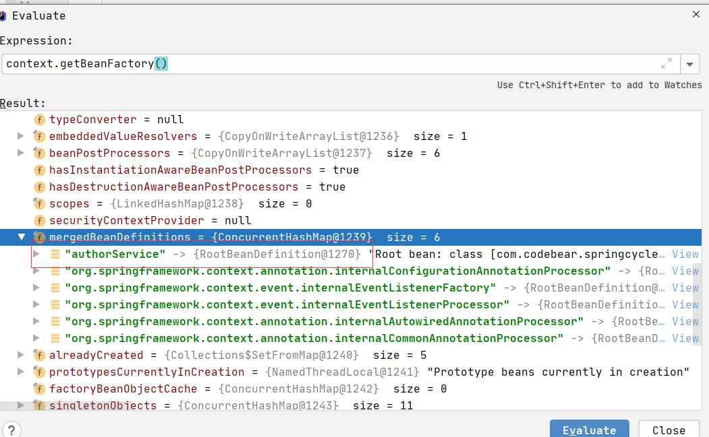

# Spring 中眼花缭乱的 BeanDefinition

## 引入主题

为什么要读 Spring 源码？有的人为了学习 Spring 中的先进思想，也有的人是为了更好的理解设计模式，当然也有很大一部分小伙伴是为了应付面试：Spring Bean 的生命周期、Spring AOP 的原理、Spring IoC 的原理等等。应付面试，看几篇博客，对照着看看源码，应该就没什么问题了；但是如果想真正地玩懂 Spring，需要花的时间真的很多，需要你沉下心，从最基础的看起。今天我们就来看看 Spring 中的基础——**BeanDefinition**。

### 什么是 BeanDefinition



Spring 官网中有详细的说明，我们来翻译下：

> Spring IoC 容器管理一个或多个 Bean，这些 Bean 通过我们提供给容器的配置元数据被创建出来（例如在 XML 中的定义）。
>
> 在容器中，这些 Bean 的定义用 `BeanDefinition` 对象来表示，包含以下元数据：
>
> - **全限定类名**：通常是 Bean 的实际实现类；
> - **Bean 行为配置元素**：说明 Bean 在容器中的行为（作用域、生命周期回调等等）；
> - **依赖项**：Bean 执行工作所需要的其他 Bean 的引用（协作者或依赖项）；
> - **其他配置信息**：例如管理连接池的 Bean 中，限制池的大小或者使用的连接数量。

Spring 官网中对 `BeanDefinition` 的解释还是很详细的，但如果用一句话简要概括：**BeanDefinition 就是用来描述一个 Bean 的定义**。

创建一个 Java Bean，大概是下面这个样子：



我们写的 Java 文件，会编译为 Class 文件；运行程序，类加载器会加载 Class 文件放入 JVM 的方法区，我们就可以愉快地 `new` 对象了。

创建一个 Spring Bean，大概是下面这个样子：



我们写的 Java 文件编译为 Class 文件被类加载器加载到 JVM 方法区后，Spring 会解析我们的配置类（或配置文件）。假设现在只配置了 A，解析后，Spring 会把 A 的 `BeanDefinition` 放到一个 Map 中去，随后由一个一个的 `BeanPostProcessor` 进行加工，最终把经历了完整 Spring 生命周期的 Bean 放入 `singletonObjects` 单例池中。

### BeanDefinition 类图鸟瞰



大家可以看到，Spring 中 `BeanDefinition` 的类图还是相当复杂的，刚开始读 Spring 源码的时候，觉得 `BeanDefinition` 应该是一个特别简单的东西，但后面发觉并不是那么回事。

下面我将对涉及到的类逐个进行解读。

#### 1. AttributeAccessor

`AttributeAccessor` 是一个接口：

```java
/**
 * Interface defining a generic contract for attaching and accessing metadata
 * to/from arbitrary objects.
 *
 * @author Rob Harrop
 * @since 2.0
 */
public interface AttributeAccessor {
    void setAttribute(String name, @Nullable Object value);
    Object getAttribute(String name);
    Object removeAttribute(String name);
    boolean hasAttribute(String name);
    String[] attributeNames();
}
```

类上面的注释说明：接口定义了通用的方法来保存或者读取元数据。

#### 2. BeanMetadataElement

`BeanMetadataElement` 也是一个接口，里面只定义了一个方法：

```java
/**
 * Interface to be implemented by bean metadata elements
 * that carry a configuration source object.
 *
 * @author Juergen Hoeller
 * @since 2.0
 */
public interface BeanMetadataElement {
    @Nullable
    Object getSource();
}
```

接口提供了一个方法来获取 Bean 的源对象（比如源配置类或定义文件）。我们可以写一段代码看下：

```java
@Configuration
@ComponentScan
public class AppConfig {
}

@Service
public class BookService {
}

public class Main {
    public static void main(String[] args) {
        AnnotationConfigApplicationContext context = new AnnotationConfigApplicationContext(AppConfig.class);
        System.out.println(context.getBeanDefinition("bookService").getSource());
    }
}
```

运行输出：

```text
file [D:\cycleinject\target\classes\com\codebear\springcycle\BookService.class]
```

#### 3. AttributeAccessorSupport

`AttributeAccessorSupport` 类是一个抽象类，实现了 `AttributeAccessor` 接口，定义了一个 Map 容器来具体实现元数据的保存与读取。

##### 为什么要有这个 Map？

元数据不应该是保存在 `BeanDefinition` 的 `beanClass`、`scope`、`lazyInit` 这些字段里面吗？这个 Map 不是多此一举吗？

其实，Spring 是为了方便扩展。如果不定义 Map，每当 `BeanDefinition` 需要支持新的特性就要新增字段；或者当开发者要扩展 Spring 时，已有的字段无法满足需求。

Spring 自己也在使用这个 Map 存储配置信息：

```java
public static void main(String[] args) {
    AnnotationConfigApplicationContext context = new AnnotationConfigApplicationContext(AppConfig.class);
    BeanDefinition appConfig = context.getBeanDefinition("appConfig");
    for (String item : appConfig.attributeNames()) {
        System.out.println(item + ":" + appConfig.getAttribute(item));
    }
}
```

运行输出：

```text
org.springframework.context.annotation.ConfigurationClassPostProcessor.configurationClass:full
org.springframework.aop.framework.autoproxy.AutoProxyUtils.preserveTargetClass:true
```

- 第一个 item 保存着这个配置类是否是一个 Full 配置类；
- 第二个 item 与 AOP 代理切面相关。

#### 4. BeanDefinition

`BeanDefinition` 是一个接口，继承了 `AttributeAccessor` 和 `BeanMetadataElement`。

`BeanDefinition` 定义了很多基础属性 Getter/Setter 方法，比如 `setBeanClassName`、`getBeanClassName`、`setScope`、`getScope`、`setLazyInit`、`isLazyInit` 等等。

#### 5. BeanMetadataAttributeAccessor

`BeanMetadataAttributeAccessor` 继承了 `AttributeAccessorSupport`，对保存或者读取元数据的方法进行了进一步的属性封装。

#### 6. AbstractBeanDefinition

`AbstractBeanDefinition` 是一个抽象类，继承了 `BeanMetadataAttributeAccessor`，实现了 `BeanDefinition` 定义的大部分抽象方法，同时定义了很多常量和默认值。

`AbstractBeanDefinition` 有三个常见子类，下面我们来看看这三个子类。

##### ChildBeanDefinition

从 Spring 2.5 开始，`ChildBeanDefinition` 已经不再推荐使用，取而代之的是 `GenericBeanDefinition`。

##### GenericBeanDefinition

`GenericBeanDefinition` 替代了 `ChildBeanDefinition`。难道 `BeanDefinition` 还有“父子关系”吗？当然有。示例如下：

```java
public class ParentService {
    private int id;
    private String name;

    public ParentService(int id, String name) {
        this.id = id;
        this.name = name;
    }
    public int getId() { return id; }
    public void setId(int id) { this.id = id; }
    public String getName() { return name; }
    public void setName(String name) { this.name = name; }
}

public class ChildService {
    private int id;
    private String name;

    public ChildService(int id, String name) {
        this.id = id;
        this.name = name;
    }
    public int getId() { return id; }
    public void setId(int id) { this.id = id; }
    public String getName() { return name; }
    public void setName(String name) { this.name = name; }
}

public class Main {
    public static void main(String[] args) {
        AnnotationConfigApplicationContext context = new AnnotationConfigApplicationContext();

        GenericBeanDefinition parentBeanDefinition = new GenericBeanDefinition();
        parentBeanDefinition.setScope(BeanDefinition.SCOPE_SINGLETON);
        parentBeanDefinition.setAttribute("name", "codebear");
        parentBeanDefinition.setAbstract(true);
        parentBeanDefinition.getConstructorArgumentValues().addGenericArgumentValue(1);
        parentBeanDefinition.getConstructorArgumentValues().addGenericArgumentValue("CodeBear");

        GenericBeanDefinition childBeanDefinition = new GenericBeanDefinition();
        childBeanDefinition.setParentName("parent");
        childBeanDefinition.setBeanClass(ChildService.class);

        context.registerBeanDefinition("parent", parentBeanDefinition);
        context.registerBeanDefinition("child", childBeanDefinition);
        context.refresh();

        BeanDefinition child = context.getBeanFactory().getMergedBeanDefinition("child");
        for (String s : child.attributeNames()) {
            System.out.println(s + ":" + child.getAttribute(s));
        }
        System.out.println("scope:" + child.getScope());
        System.out.println("-------------------");

        ChildService service = context.getBean(ChildService.class);
        System.out.println(service.getName());
        System.out.println(service.getId());
    }
}
```

运行结果：

```text
name:codebear
scope:singleton
-------------------
CodeBear
1
```

在上面的代码中，`childBeanDefinition` 继承了 `parentBeanDefinition` 的属性配置。

如果没有父子关系，单独作为 `BeanDefinition`，也可以直接用 `GenericBeanDefinition` 来表示：

```java
public class Main {
    public static void main(String[] args) {
        AnnotationConfigApplicationContext context = new AnnotationConfigApplicationContext();
        GenericBeanDefinition genericBeanDefinition = new GenericBeanDefinition();
        genericBeanDefinition.setBeanClass(AuthorService.class);
        genericBeanDefinition.setScope(BeanDefinition.SCOPE_PROTOTYPE);

        context.registerBeanDefinition("authorService", genericBeanDefinition);
        context.refresh();

        BeanDefinition mergedBeanDefinition = context.getBeanFactory().getMergedBeanDefinition("authorService");
        BeanDefinition beanDefinition = context.getBeanFactory().getMergedBeanDefinition("authorService");
        System.out.println(mergedBeanDefinition);
        System.out.println(beanDefinition);
    }
}
```

运行结果：

```text
Root bean: class [com.codebear.springcycle.AuthorService]; scope=prototype; abstract=false; lazyInit=false; autowireMode=0; dependencyCheck=0; autowireCandidate=true; primary=false; factoryBeanName=null; factoryMethodName=null; initMethodName=null; destroyMethodName=null
Root bean: class [com.codebear.springcycle.AuthorService]; scope=prototype; abstract=false; lazyInit=false; autowireMode=0; dependencyCheck=0; autowireCandidate=true; primary=false; factoryBeanName=null; factoryMethodName=null; initMethodName=null; destroyMethodName=null
```

可以看到，当没有父子关系时，`beanDefinition` 依旧会被合并保存在 `mergedBeanDefinitions` 中。

> **GenericBeanDefinition 总结**：
> `GenericBeanDefinition` 替代了低版本 Spring 的 `ChildBeanDefinition`，比 `ChildBeanDefinition` 和 `RootBeanDefinition` 更加灵活，既可以单独作为 `BeanDefinition`，也可以作为父 `BeanDefinition` 或子 `BeanDefinition`。

##### RootBeanDefinition

给第一个代码打上断点，观察 `mergedBeanDefinitions`，会发现 `parentBeanDefinition` 和 `childBeanDefinition` 在 `mergedBeanDefinitions` 中都变为了 `RootBeanDefinition`：



给第二个代码打上断点，观察 `mergedBeanDefinitions`，会发现 `authorService` 在 `mergedBeanDefinitions` 中也变为了 `RootBeanDefinition`：



说明在 `mergedBeanDefinitions` 中存放的最终都是 `RootBeanDefinition`。

`RootBeanDefinition` 也可以用来充当父 `BeanDefinition`：

```java
public static void main(String[] args) {
    AnnotationConfigApplicationContext context = new AnnotationConfigApplicationContext();
    RootBeanDefinition genericBeanDefinition = new RootBeanDefinition();
    genericBeanDefinition.setBeanClass(ParentService.class);
    genericBeanDefinition.setScope(BeanDefinition.SCOPE_PROTOTYPE);
    context.registerBeanDefinition("parent", genericBeanDefinition);

    GenericBeanDefinition rootBeanDefinition = new GenericBeanDefinition();
    rootBeanDefinition.setBeanClass(ChildService.class);
    rootBeanDefinition.setParentName("parent");
    context.refresh();
}
```

但是 `RootBeanDefinition` **不可以** 充当子 `BeanDefinition`：

```java
public static void main(String[] args) {
    AnnotationConfigApplicationContext context = new AnnotationConfigApplicationContext();
    RootBeanDefinition genericBeanDefinition = new RootBeanDefinition();
    genericBeanDefinition.setBeanClass(ParentService.class);
    genericBeanDefinition.setScope(BeanDefinition.SCOPE_PROTOTYPE);
    context.registerBeanDefinition("parent", genericBeanDefinition);

    RootBeanDefinition rootBeanDefinition = new RootBeanDefinition();
    rootBeanDefinition.setBeanClass(ChildService.class);
    rootBeanDefinition.setParentName("parent");
    context.refresh();
}
```

运行抛出异常：

```text
Exception in thread "main" java.lang.IllegalArgumentException: Root bean cannot be changed into a child bean with parent reference
    at org.springframework.beans.factory.support.RootBeanDefinition.setParentName(RootBeanDefinition.java:260)
    at com.codebear.springcycle.Main.main(Main.java:20)
```

源码实现如下：

```java
@Override
public void setParentName(@Nullable String parentName) {
    if (parentName != null) {
        throw new IllegalArgumentException("Root bean cannot be changed into a child bean with parent reference");
    }
}
```

> **RootBeanDefinition 总结**：
> `RootBeanDefinition` 可以作为其他 `BeanDefinition` 的父 `BeanDefinition`，也可以单独作为 `BeanDefinition`，但是 **不能** 作为其他 `BeanDefinition` 的子 `BeanDefinition`。在 `mergedBeanDefinitions` 中存储的最终都是 `RootBeanDefinition`。

#### 7. ScannedGenericBeanDefinition

```java
@Configuration
@ComponentScan
public class AppConfig {
}

@Service
public class AuthorService {
}

public class Main {
    public static void main(String[] args) {
        AnnotationConfigApplicationContext context = new AnnotationConfigApplicationContext(AppConfig.class);
        System.out.println(context.getBeanDefinition("authorService").getClass());
    }
}
```

运行结果：

```text
class org.springframework.context.annotation.ScannedGenericBeanDefinition
```

通过注解组件扫描（`@ComponentScan`）出来的 Bean 的 `BeanDefinition` 用 `ScannedGenericBeanDefinition` 来表示。

#### 8. AnnotatedGenericBeanDefinition

```java
public static void main(String[] args) {
    AnnotationConfigApplicationContext context = new AnnotationConfigApplicationContext(AppConfig.class);
    System.out.println(context.getBeanDefinition("appConfig").getClass());
}
```

运行结果：

```text
class org.springframework.beans.factory.annotation.AnnotatedGenericBeanDefinition
```

直接注册配置类的 `BeanDefinition` 用 `AnnotatedGenericBeanDefinition` 来表示。

#### 9. ConfigurationClassBeanDefinition

```java
public class AuthorService {
}

@Configuration
@ComponentScan
public class AppConfig {
    @Bean
    public AuthorService authorService() {
        return new AuthorService();
    }
}

public class Main {
    public static void main(String[] args) {
        AnnotationConfigApplicationContext context = new AnnotationConfigApplicationContext(AppConfig.class);
        System.out.println(context.getBeanDefinition("authorService").getClass());
    }
}
```

运行结果：

```text
class org.springframework.context.annotation.ConfigurationClassBeanDefinitionReader$ConfigurationClassBeanDefinition
```

用 `@Bean` 声明的方法产生的 Bean 的 `BeanDefinition` 用 `ConfigurationClassBeanDefinition` 来表示。

## 总结

一个看似简单的 `BeanDefinition` 在 Spring 内部可以衍生出如此丰富的层级与变体。搞清楚这些 `BeanDefinition` 的变体与作用场景，在阅读 Spring 源码时就不会因为各种不同的 `BeanDefinition` 类型而困惑了。
