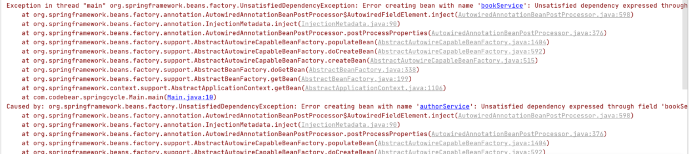
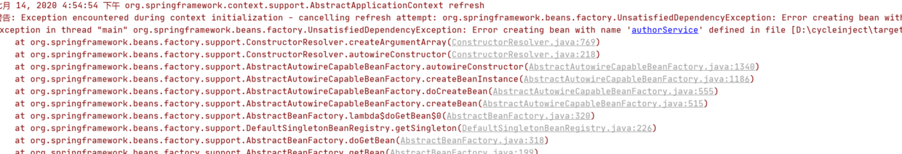
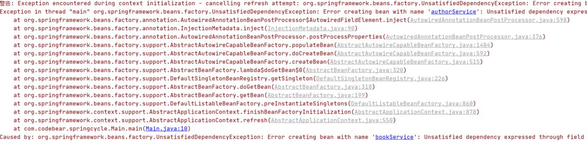

# Spring 帮助你更好的理解 Spring 循环依赖

网上关于 Spring 循环依赖的博客太多了，有很多都分析得很深入、写的很用心，甚至还画了时序图、流程图帮助读者理解。我看了后，感觉自己是懂了，但是闭上眼睛，总觉得还没有完全理解，总觉得还有一两个坎过不去。当时我就在想，如果哪一天我彻底理解了 Spring 循环依赖，一定要用自己的方式写篇博客，帮助大家更好的理解。在写本篇博客之前，我翻阅了好多关于 Spring 循环依赖的博客，网上应该还没有像我这样讲解的，现在就让我们开始吧。

## 一、什么是循环依赖

一言以蔽之：**两者相互依赖**。

在开发中，可能经常出现这种情况，只是我们平时并没有注意到原来我们写的两个类、甚至多个类相互依赖了。为什么注意不到呢？当然是因为没有报错，而且一点问题都没有。这一切都是 Spring 的功劳，它在后面默默地为我们解决了循环依赖的问题。

例如：

```java
@Configuration
@ComponentScan
public class AppConfig {
}

@Service
public class AuthorService {
    @Autowired
    BookService bookService;
}

@Service
public class BookService {
    @Autowired
    AuthorService authorService;
}

public class Main {
    public static void main(String[] args) {
        ApplicationContext context = new AnnotationConfigApplicationContext(AppConfig.class);
        BookService bookService = (BookService) context.getBean("bookService");
        System.out.println(bookService.authorService);
        AuthorService authorService = (AuthorService) context.getBean("authorService");
        System.out.println(authorService.bookService);
    }
}
```

运行结果：

```text
com.example.AuthorService@1a2b3c4d
com.example.BookService@5e6f7a8b
```

可以看到 `BookService` 中需要 `AuthorService`，`AuthorService` 中需要 `BookService`，类似于这样的就叫循环依赖，但是神奇的是竟然一点问题没有。

### 1. 任何循环依赖，Spring 都能解决吗？

**不行。**

如果是原型（Prototype）Bean 的循环依赖，Spring 无法解决：

```java
@Service
@Scope(BeanDefinition.SCOPE_PROTOTYPE)
public class BookService {
    @Autowired
    AuthorService authorService;
}

@Service
@Scope(BeanDefinition.SCOPE_PROTOTYPE)
public class AuthorService {
    @Autowired
    BookService bookService;
}
```

启动后，控制台就会抛出循环依赖异常：



如果是构造参数注入的循环依赖，Spring 同样无法解决：

```java
@Service
public class AuthorService {
    BookService bookService;
    public AuthorService(BookService bookService) {
        this.bookService = bookService;
    }
}

@Service
public class BookService {
    AuthorService authorService;
    public BookService(AuthorService authorService) {
        this.authorService = authorService;
    }
}
```

运行后同样会抛出异常：



### 2. 循环依赖可以关闭吗？

可以。Spring 提供了关闭循环依赖支持的功能：

```java
public class Main {
    public static void main(String[] args) {
        AnnotationConfigApplicationContext applicationContext = new AnnotationConfigApplicationContext();
        applicationContext.setAllowCircularReferences(false);
        applicationContext.register(AppConfig.class);
        applicationContext.refresh();
    }
}
```

再次运行后就会直接报错：



> **注意**：不能写成 `new AnnotationConfigApplicationContext(AppConfig.class)` 后再调用 `setAllowCircularReferences(false)`。因为容器在构造时就已经完成初始化了，之后再设置将无法生效。

### 3. 循环依赖的矛盾点在哪？

当 Bean A 与 Bean B 产生循环依赖时，逻辑上的矛盾点在于：

1. 创建 Bean A，发现依赖 Bean B；
2. 创建 Bean B，发现依赖 Bean A；
3. 创建 Bean A，发现依赖 Bean B；
4. 创建 Bean B，发现依赖 Bean A……

如此一来就陷入了死循环。循环依赖的矛盾点就在于：要创建 Bean A，需要先拿到 Bean B；而要创建 Bean B，又需要先拿到 Bean A，导致两个 Bean 都无法顺利创建。

## 二、如何手写解决循环依赖

如果你曾经看过 Spring 解决循环依赖的博客，应该知道它其中有好几个 Map，一个 Map 存放最完整的单例对象（称为 `singletonObjects`），一个 Map 存放提前暴露出来的对象（称为 `earlySingletonObjects`）。

这两个概念的作用如下：

- **`singletonObjects`（一级缓存 / 单例池）**：存放经历了 Spring 完整生命周期的 Bean，这里的 Bean 属性依赖都已经填充完毕；
- **`earlySingletonObjects`（二级缓存）**：存放刚刚实例化出来、尚未经历完整生命周期（属性尚未填充完毕）的半成品 Bean。

我们可以按照如下流程解决：

1. 当创建完 Bean A 的实例后，先把半成品 A 放到 `earlySingletonObjects` 中，发现自己需要 Bean B，于是去创建 Bean B；
2. 当创建完 Bean B 的实例后，把自己放到 `earlySingletonObjects` 中，发现自己需要 Bean A，去获取 Bean A；
3. 获取 Bean A 时，先去 `earlySingletonObjects` 查看，发现半成品 A 已经存在，直接返回；
4. Bean B 拿到了 Bean A 的引用，完成了属性填充与创建，将自己放入 `singletonObjects`；
5. Bean A 拿到 Bean B，完成了属性填充与创建，将自己放入 `singletonObjects`。整个过程结束。

下面我们手写代码来实现这个功能。首先自定义一个 `@CodeBearAutowired` 注解：

```java
@Retention(RetentionPolicy.RUNTIME)
public @interface CodeBearAutowired {
}
```

再创建两个相互依赖的类：

```java
public class OrderService {
    @CodeBearAutowired
    public UserService userService;
}

public class UserService {
    @CodeBearAutowired
    public OrderService orderService;
}
```

编写核心容器与循环依赖解决逻辑：

```java
public class Cycle {
    // 1. 单例池，里面放的是完整的 bean，已完成填充属性
    private final Map<String, Object> singletonObjects = new ConcurrentHashMap<>();
    // 2. 存放提前暴露出来的 bean，未完成填充属性
    private final Map<String, Object> earlySingletonObjects = new HashMap<>();

    static Map<String, Class<?>> map = new HashMap<>();
    static {
        map.put("orderService", OrderService.class);
        map.put("userService", UserService.class);
    }

    public void init() {
        for (Map.Entry<String, Class<?>> stringClassEntry : map.entrySet()) {
            createBean(stringClassEntry.getKey());
        }
    }

    public Object getBean(String beanName) {
        // 尝试从一级缓存 singletonObjects 中取
        Object singletonObject = this.singletonObjects.get(beanName);
        if (singletonObject != null) {
            return singletonObject;
        }
        // 尝试从二级缓存 earlySingletonObjects 中取
        singletonObject = this.earlySingletonObjects.get(beanName);
        if (singletonObject != null) {
            return singletonObject;
        }
        return createBean(beanName);
    }

    private Object createBean(String beanName) {
        Object singletonObject;
        try {
            // 实例化对象
            singletonObject = map.get(beanName).getConstructor().newInstance();
            // 把半成品放入二级缓存 earlySingletonObjects
            earlySingletonObjects.put(beanName, singletonObject);
            // 填充属性（注入依赖）
            populateBean(singletonObject);
            // 经历完整生命周期后，放入一级缓存 singletonObjects
            this.singletonObjects.put(beanName, singletonObject);
            return singletonObject;
        } catch (Exception ignore) {
        }
        return null;
    }

    private void populateBean(Object object) {
        Field[] fields = object.getClass().getDeclaredFields();
        for (Field field : fields) {
            if (field.getAnnotation(CodeBearAutowired.class) != null) {
                Object value = getBean(field.getName());
                try {
                    field.setAccessible(true);
                    field.set(object, value);
                } catch (IllegalAccessException ignored) {
                }
            }
        }
    }
}
```

测试预加载模式：

```java
public class Main {
    public static void main(String[] args) {
        Cycle cycle = new Cycle();
        cycle.init();
        UserService userService = (UserService) cycle.getBean("userService");
        OrderService orderService = (OrderService) cycle.getBean("orderService");
        System.out.println(userService.orderService);
        System.out.println(orderService.userService);
    }
}
```

测试懒加载模式：

```java
public class Main {
    public static void main(String[] args) {
        Cycle cycle = new Cycle();
        UserService userService = (UserService) cycle.getBean("userService");
        OrderService orderService = (OrderService) cycle.getBean("orderService");
        System.out.println(userService.orderService);
        System.out.println(orderService.userService);
    }
}
```

运行结果：

```text
com.example.OrderService@1a2b3c4d
com.example.UserService@5e6f7a8b
```

### 为什么无法解决原型（Prototype）与构造方法注入的循环依赖？

手写代码清楚地展示了核心是利用缓存解决问题的：

- 我们的 Bean 是单例的（Singleton），且采用字段注入（Setter 注入）。单例意味着只需要创建一次对象，后续直接从缓存获取；字段注入意味着实例化与依赖填充可以分为两个阶段；
- 如果是 **原型 Bean**，意味着每次获取都要重新创建对象，无法利用缓存；
- 如果是 **构造方法注入**，意味着实例化时就必须拿到依赖，无法把“实例化”与“依赖注入”拆开，自然也无法提前暴露半成品对象。

## 三、如果引入 AOP 该怎么处理？

上面的方案虽然解决普通 Bean，但如果 Bean 需要进行 AOP 代理“加工”呢？如果 Bean A 和【Bean B 的代理对象】产生循环依赖，或者【Bean A 的代理对象】和【Bean B 的代理对象】循环依赖怎么办？

如果直接把原始对象放到二级缓存，最终 Bean A 注入的将是未代理的原始对象。

Spring 的初衷是希望在 Bean 生命周期的最后阶段才去执行 AOP 代理。如果为了处理循环依赖在实例化后就直接创建代理，就违背了生命周期的设计。

为此，Spring 引入了三级缓存：`Map<String, ObjectFactory<?>> singletonFactories`。

`ObjectFactory` 是一个函数式接口。当创建完原始对象后，将“生成该对象（或其代理对象）的工厂 lambda”放入三级缓存 `singletonFactories` 中。只有真正发生循环依赖时，才会触发该工厂方法去生成代理对象并放入二级缓存。

改进后的完整代码实现如下：

```java
public class Cycle {
    // 1. 一级缓存：单例池，存放完整的 Bean
    private final Map<String, Object> singletonObjects = new ConcurrentHashMap<>();
    // 2. 三级缓存：存放生成 Bean/代理对象的工厂 lambda
    private final Map<String, ObjectFactory<?>> singletonFactories = new HashMap<>();
    // 3. 二级缓存：存放提前暴露出来的半成品/代理 Bean
    private final Map<String, Object> earlySingletonObjects = new HashMap<>();

    static Map<String, Class<?>> map = new HashMap<>();
    static {
        map.put("orderService", OrderService.class);
        map.put("userService", UserService.class);
    }

    public void init() {
        for (Map.Entry<String, Class<?>> stringClassEntry : map.entrySet()) {
            createBean(stringClassEntry.getKey());
        }
    }

    private Object createBean(String beanName) {
        Object instance = null;
        try {
            instance = map.get(beanName).getConstructor().newInstance();
        } catch (Exception ex) {
        }
        Object finalInstance = instance;

        // 放入三级缓存：延迟创建代理对象
        this.singletonFactories.put(beanName, () -> {
            // 此处可执行 AOP 代理创建逻辑
            return finalInstance;
        });

        populateBean(instance);
        this.singletonObjects.put(beanName, instance);
        return instance;
    }

    public Object getBean(String beanName) {
        // 尝试从一级缓存获取
        Object singletonObject = this.singletonObjects.get(beanName);
        if (singletonObject != null) {
            return singletonObject;
        }
        // 尝试从二级缓存获取
        singletonObject = this.earlySingletonObjects.get(beanName);
        if (singletonObject != null) {
            return singletonObject;
        }
        // 尝试从三级缓存获取工厂方法
        ObjectFactory<?> objectFactory = this.singletonFactories.get(beanName);
        if (objectFactory != null) {
            singletonObject = objectFactory.getObject();
            // 提升到二级缓存
            this.earlySingletonObjects.put(beanName, singletonObject);
            return singletonObject;
        }
        return createBean(beanName);
    }

    private void populateBean(Object object) {
        Field[] fields = object.getClass().getDeclaredFields();
        for (Field field : fields) {
            if (field.getAnnotation(CodeBearAutowired.class) != null) {
                Object value = getBean(field.getName());
                try {
                    field.setAccessible(true);
                    field.set(object, value);
                } catch (IllegalAccessException ignored) {
                }
            }
        }
    }
}
```

测试调用：

```java
public class Main {
    public static void main(String[] args) {
        Cycle cycle = new Cycle();
        cycle.init();
        System.out.println(((UserService) cycle.getBean("userService")).orderService);
        System.out.println(((OrderService) cycle.getBean("orderService")).userService);
    }
}
```

运行结果：

```text
com.example.OrderService@1a2b3c4d
com.example.UserService@5e6f7a8b
```

## 四、总结：二级缓存 vs 三级缓存

1. **二级缓存完全可以解决简单的循环依赖**：只要在实例化之后把原始对象（或提前创建代理）存入二级缓存即可。
2. **三级缓存的核心价值**：在于 **解耦与维持 Bean 生命周期规范**。它保证了在没有发生循环依赖时，AOP 代理依然在生命周期的最后阶段统一创建；只有发生循环依赖时，才通过三级缓存的 `ObjectFactory` 提前创建代理并提升至二级缓存。

理解了手写 `Cycle` 类的三级缓存逻辑后，再去阅读 Spring 源码中 `AbstractBeanFactory.doGetBean()` 与 `DefaultSingletonBeanRegistry` 就会发现思路完全一致。
