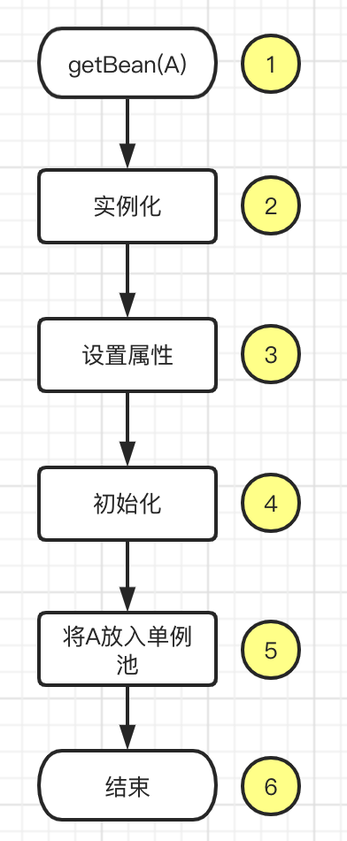
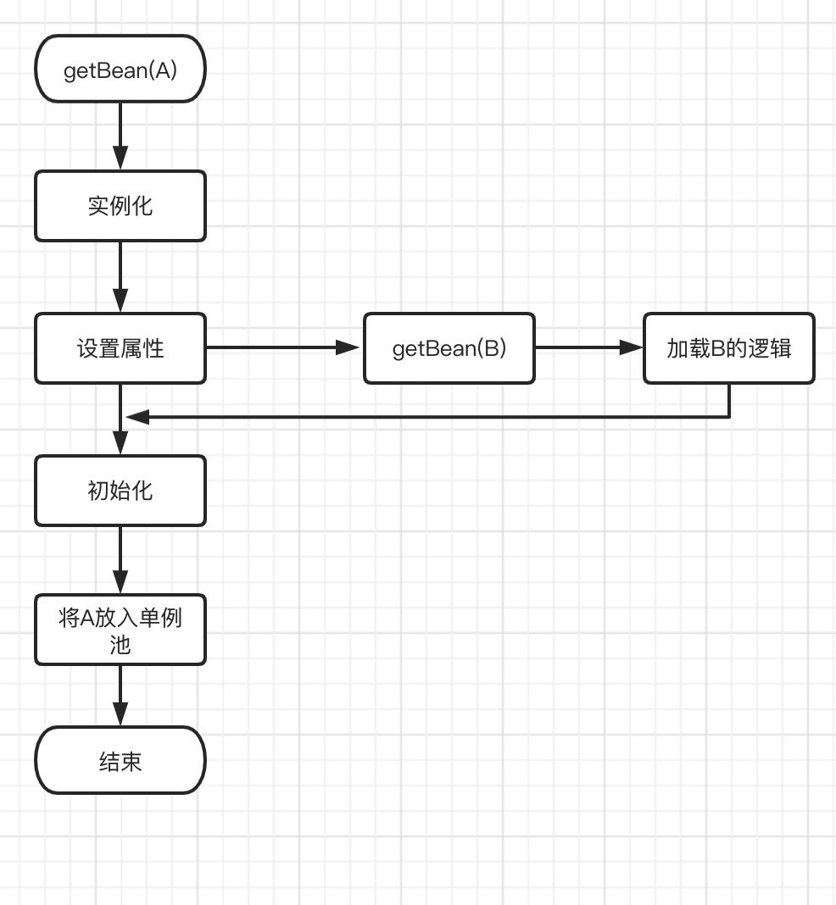
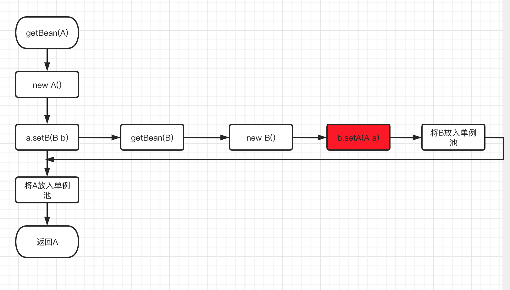
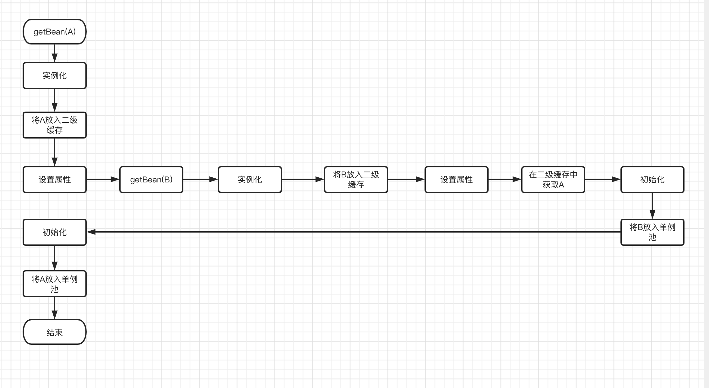
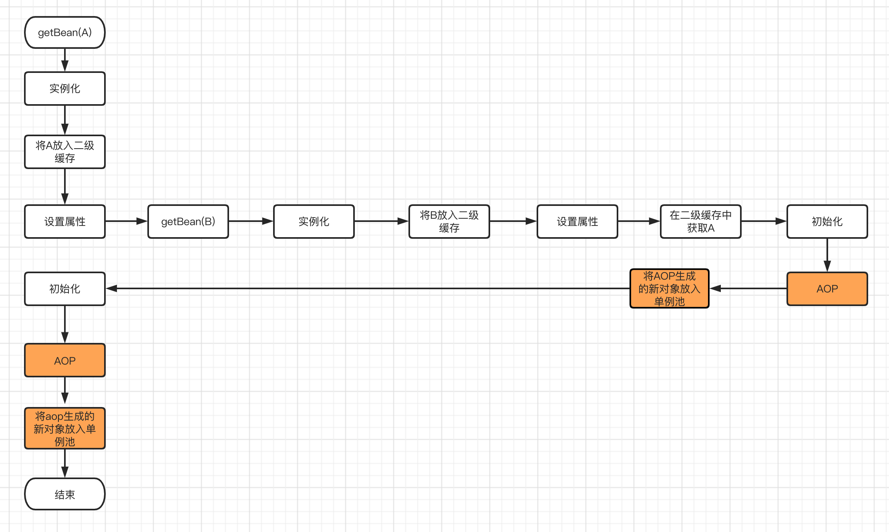

# Spring 循环依赖及解决方式

## 一、什么是循环依赖

Spring 中有一个非常经典的问题：**如何解决循环依赖**。

简单的循环依赖代码结构如下：

```java
@Component
public class A { 
    @Autowired
    private B b;
}

@Component
public class B { 
    @Autowired
    private A a;
}
```

### 1. Spring Bean 的生命周期



在 Spring 容器中，获取一个 Bean 的操作从 `getBean(String name)` 开始，核心步骤如下：

1. **`getBean(String name)`**：触发 Bean 的加载过程；
2. **实例化对象**：`A a = new A()`，执行构造方法；
3. **设置属性（`populateBean`）**：对依赖的字段进行属性注入；
4. **初始化（`initializeBean`）**：执行 PostConstruct、InitializingBean 及 BeanPostProcessor 回调；
5. **放入单例池**：将生成好的 Bean 添加到 `singletonObjects`（单例池 HashMap）；
6. **完成并返回**。

伪代码示意：

```java
public Object getBean(String name) {
    // 省略根据 name 获取 BeanDefinition 的过程
    A a = new A();
    populateBean("a", mbd, a);
    initializeBean("a", a, mbd);
    singletonObjects.put(name, a);
    return a;
}
```

### 2. A 依赖 B 时的单向加载流程



伪代码示意：

```java
public Object getBean(String name) {
    A a = new A(); // 1. 实例化 A
    a.setB((B) getBean("b")); // 2. 注入依赖：发现 a 依赖 b，先去获取 B；完成 B 的加载后再继续设置 a
    initializeBean("a", a, mbd); // 3. 执行初始化方法
    singletonObjects.put(name, a); // 4. 将 a 放入单例池
    return a;
}
```

### 3. A 与 B 相互依赖时的死锁困境



如上图所示，当 A 和 B 互相依赖且均为单例 Bean 时：在加载 B 阶段，B 依赖注入 A 的引用需要通过 `getBean("a")` 获得。如果沿用上述简单流程，`getBean("a")` 会重新触发 A 的创建过程，从而导致无限递归死锁。这就是循环依赖问题的根本成因。

---

## 二、Spring 解决循环依赖的三级缓存机制

### 1. 一级缓存：单例池 `singletonObjects`

```java
private final Map<String, Object> singletonObjects = new ConcurrentHashMap<>(256);
```

对于单例（Singleton）Bean，在整个 `ApplicationContext` 中仅存在一个共享实例。**完全创建完成** 的 Bean 会存放在 `singletonObjects` 这个 Map 中，即 **一级缓存**。

“创建完成”指完成了属性注入与初始化（步骤 6）。在加载 B 的过程中，A 尚未完成创建，无法放入一级缓存，因此仅凭一级缓存无法解决循环依赖。

### 2. 二级缓存：`earlySingletonObjects`

```java
private final Map<String, Object> earlySingletonObjects = new HashMap<>(16);
```

为此，需要引入 **二级缓存** 存放 **提前暴露的半成品 Bean 引用**。当实例化 A 完毕后，直接将未填充属性的原始对象放入 `earlySingletonObjects`：



1. 调用 `getBean("a")`；
2. 实例化 A：`A a = new A()`；
3. 将未填充属性的半成品 A 存入二级缓存：`earlySingletonObjects.put("a", a)`；
4. 填充 A 的属性，发现依赖 B，调用 `getBean("b")`；
5. 实例化 B，填充 B 的属性，发现依赖 A，从二级缓存 `earlySingletonObjects` 中获取半成品 A 的引用；
6. B 完成属性填充与初始化；
7. 将成熟的 B 放入一级缓存 `singletonObjects`；
8. 返回 B 给 A，A 完成属性填充与初始化；
9. 将成熟的 A 放入一级缓存 `singletonObjects`。

#### 为什么二级缓存无法完全解决 AOP 代理问题？

仅靠二级缓存看似解决了解析问题，但如果引入了 **AOP 动态代理**：



AOP 增强会在生命周期后期生成全新的代理对象。如果仅使用二级缓存，B 注入的将是原始未增强的 A，而最终放入单例池的则是代理后的 A。此时 B 引用的 A 与单例池中的 A 不一致。因此，二级缓存无法完美兼顾 AOP 代理的循环依赖。

### 3. 三级缓存架构对比

Spring 内部通过三级缓存机制协调单例 Bean 的创建与循环依赖处理，三级缓存的职责与特性总结如下：

| 缓存层级 | 数据结构 / 类型 | 存储对象状态 | 核心职责与作用 |
| --- | --- | --- | --- |
| **一级缓存 (`singletonObjects`)** | `ConcurrentHashMap<String, Object>` | **完全初始化完成的 Bean** | 单例池，存放依赖注入与初始化完毕的最终成熟 Bean 对象 |
| **二级缓存 (`earlySingletonObjects`)** | `HashMap<String, Object>` | **提前暴露的半成品 / 代理 Bean** | 存放已实例化但尚未填充属性的早期 Bean 引用（或 AOP 代理），避免重复代理 |
| **三级缓存 (`singletonFactories`)** | `HashMap<String, ObjectFactory<?>>` | **Bean 生成工厂对象 (`ObjectFactory`)** | 存放获取早期 Bean 引用的工厂 Lambda 表达式，在发生循环依赖时触发提前 AOP |

---

## 三、Spring 源码剖析

### 1. `doGetBean` 核心流程

```java
protected <T> T doGetBean(
        final String name, @Nullable final Class<T> requiredType,
        @Nullable final Object[] args, boolean typeCheckOnly) throws BeansException {

    Object bean;
    // 尝试先从缓存中获取 Bean
    Object sharedInstance = getSingleton(beanName);
    
    if (sharedInstance != null) {
        bean = getObjectForBeanInstance(sharedInstance, name, beanName, null);
    } else {
        final RootBeanDefinition mbd = getMergedLocalBeanDefinition(beanName);
        if (mbd.isSingleton()) {
            // 单例 Bean 的加载逻辑
            sharedInstance = getSingleton(beanName, () -> {
                try {
                    return createBean(beanName, mbd, args);
                } catch (BeansException ex) {
                    destroySingleton(beanName);
                    throw ex;
                }
            });
            bean = getObjectForBeanInstance(sharedInstance, name, beanName, mbd);
        } else if (mbd.isPrototype()) {
            // 原型域 Bean 无法解决循环依赖
            Object prototypeInstance = null;
            try {
                beforePrototypeCreation(beanName);
                prototypeInstance = createBean(beanName, mbd, args);
            } finally {
                afterPrototypeCreation(beanName);
            }
            bean = getObjectForBeanInstance(prototypeInstance, name, beanName, mbd);
        }
    }
    return (T) bean;
}
```

### 2. 三级缓存提取逻辑 `getSingleton(beanName, allowEarlyReference)`

```java
public Object getSingleton(String beanName) {
    return getSingleton(beanName, true);
}

protected Object getSingleton(String beanName, boolean allowEarlyReference) {
    // 1. 先去一级缓存（单例池）获取
    Object singletonObject = this.singletonObjects.get(beanName);
    
    // 2. 如果一级缓存不存在，且该 Bean 正在创建中，说明发生循环依赖
    if (singletonObject == null && isSingletonCurrentlyInCreation(beanName)) {
        synchronized (this.singletonObjects) {
            // 3. 去二级缓存获取（早期提前暴露的对象/代理）
            singletonObject = this.earlySingletonObjects.get(beanName);
            
            // 4. 如果二级缓存也不存在，且允许提前访问三级引用
            if (singletonObject == null && allowEarlyReference) {
                // 去三级缓存中获取工厂 Lambda
                ObjectFactory<?> singletonFactory = this.singletonFactories.get(beanName);
                if (singletonFactory != null) {
                    // 执行 Lambda 触发提前 AOP，获取代理/早期对象
                    singletonObject = singletonFactory.getObject();
                    // 升到二级缓存，并删除三级缓存（防止重复执行 AOP）
                    this.earlySingletonObjects.put(beanName, singletonObject);
                    this.singletonFactories.remove(beanName);
                }
            }
        }
    }
    return singletonObject;
}
```

### 3. 单例池入库逻辑 `getSingleton(beanName, singletonFactory)`

```java
public Object getSingleton(String beanName, ObjectFactory<?> singletonFactory) {
    Assert.notNull(beanName, "Bean name must not be null");
    synchronized (this.singletonObjects) {
        Object singletonObject = this.singletonObjects.get(beanName);
        if (singletonObject == null) {
            // 标记当前 Bean 正在创建中
            beforeSingletonCreation(beanName);
            // 执行内部 createBean 逻辑
            singletonObject = singletonFactory.getObject();
            // 移除创建中标记
            afterSingletonCreation(beanName);
            // 加入到一级缓存单例池，并移除二、三级缓存
            addSingleton(beanName, singletonObject); 
        }
        return singletonObject;
    }
}
```

### 4. Bean 实例化与三级缓存暴露 `doCreateBean`

```java
protected Object doCreateBean(final String beanName, final RootBeanDefinition mbd, final @Nullable Object[] args)
        throws BeanCreationException {

    BeanWrapper instanceWrapper = createBeanInstance(beanName, mbd, args);
    final Object bean = instanceWrapper.getWrappedInstance();

    // 判断是否允许提前暴露三级缓存（单例 + 允许循环引用 + 正在创建中）
    boolean earlySingletonExposure = (mbd.isSingleton() && this.allowCircularReferences &&
            isSingletonCurrentlyInCreation(beanName));
            
    if (earlySingletonExposure) {
        // 将获取早期引用的 Lambda 工厂函数添加到三级缓存
        addSingletonFactory(beanName, () -> getEarlyBeanReference(beanName, mbd, bean));
    }

    Object exposedObject = bean;
    try {
        // 依赖注入（循环依赖在此触发）
        populateBean(beanName, mbd, instanceWrapper);
        // 初始化 Bean 及正常 AOP 代理
        exposedObject = initializeBean(beanName, exposedObject, mbd);
    } catch (Throwable ex) {
        throw ex;
    }

    if (earlySingletonExposure) {
        // 尝试从二级缓存中获取（如果循环依赖期间触发了提前 AOP，这里会拿到代理对象）
        Object earlySingletonReference = getSingleton(beanName, false);
        if (earlySingletonReference != null) {
            if (exposedObject == bean) {
                exposedObject = earlySingletonReference;
            }
        }
    }
    return exposedObject;
}

protected void addSingletonFactory(String beanName, ObjectFactory<?> singletonFactory) {
    Assert.notNull(singletonFactory, "Singleton factory must not be null");
    synchronized (this.singletonObjects) {
        if (!this.singletonObjects.containsKey(beanName)) {
            this.singletonFactories.put(beanName, singletonFactory);
            this.earlySingletonObjects.remove(beanName);
            this.registeredSingletons.add(beanName);
        }
    }
}
```

---

## 四、A、B 循环依赖完整步骤总结

1. **`getBean(A)`**：查询一级缓存无，二级缓存无，三级缓存无，开始创建 A；
2. **`beforeSingletonCreation(A)`**：将 A 标记为正在创建状态；
3. **`new A()`**：实例化对象 A；
4. **`addSingletonFactory`**：将 A 放入三级缓存（`() -> getEarlyBeanReference(...)`）；
5. **`populateBean(A)`**：设置 A 的属性，发现依赖 B，调用 `getBean(B)`；
6. **`getBean(B)`**：查询一、二、三级缓存均无，开始创建 B；
7. **`beforeSingletonCreation(B)`**：将 B 标记为正在创建状态；
8. **`new B()`**：实例化对象 B；
9. **`addSingletonFactory`**：将 B 放入三级缓存；
10. **`populateBean(B)`**：设置 B 的属性，发现依赖 A，调用 `getBean(A)`；
11. **`getBean(A)` 再次触发**：查询一级无，二级无；发现 A 处于正在创建中，匹配到三级缓存；
12. **执行三级缓存 Lambda**：调用 `getEarlyBeanReference` 触发提前 AOP（若需要），生成 A 的代理引用（或原对象），将 A 存入二级缓存，并删除三级缓存；
13. **返回 A 引用给 B**：B 完成 `populateBean` 与 `initializeBean`；
14. **`addSingleton(B)`**：B 创建完成，放入一级缓存单例池，返回成熟的 B 对象；
15. **A 继续执行 `populateBean`**：A 成功拿到注入的 B 对象；
16. **A 执行 `initializeBean`**：由于 A 已在循环依赖中提前完成了 AOP，正常初始化后直接从二级缓存取出该代理引用作为 `exposedObject`；
17. **`addSingleton(A)`**：A 创建完成，放入一级缓存单例池，清除二级与三级缓存。
