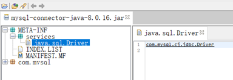
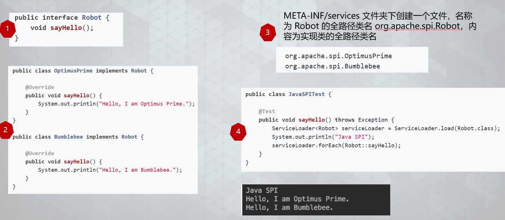

# Spring Boot 教程：如何开发一个 starter

## 导语

熟悉 Spring Boot 的同学都知道，Spring Boot 提供了很多开箱即用的 starter，比如 `spring-boot-starter-mail`、`spring-boot-starter-data-redis` 等等。使用这些 starter 非常简单：引入依赖，再在配置文件中配置相关属性即可。

本教程教您如何开发一个自定义的 starter。掌握了这个技能后，您可以在工作中将通用的业务组件或中间件封装为开箱即用的 starter。

## 如何开发一个自定义的 starter

开发一个 starter 简单来说分为以下几步：

1. 创建一个/多个自定义配置的属性配置类（`@ConfigurationProperties`，可选）；
2. 创建一个/多个自动配置类（`@Configuration`）；
3. 将自动配置类写入到 Spring Boot 的 SPI 配置文件 `META-INF/spring.factories`（Spring Boot 3.0+ 为 `META-INF/spring/org.springframework.boot.autoconfigure.AutoConfiguration.imports`）。

## Java SPI 机制简介

Spring Boot 的 starter 核心就是通过 SPI 机制自动装配配置类。在学习 Spring Boot 的自动装配前，我们先了解一下 Java 标准的 SPI 机制。

SPI 全称 **Service Provider Interface**（服务提供者接口），是 Java 提供的一套用来被第三方实现或扩展的 API，它可以用来启用框架扩展和替换组件。

SPI 的大致调用流程为：

> 调用方 –> 标准服务接口 –> 本地服务发现（配置文件） –> 具体实现类

因此，Java SPI 实际上是 **“基于接口的编程 ＋ 策略模式 ＋ 配置文件”** 组合实现的动态加载机制。

一个典型的 SPI 案例就是 JDBC 驱动：Java JDBC 定义接口规范（`java.sql.Driver`），各个数据库厂商（MySQL / Oracle / SQL Server 等）完成具体的实现，然后通过 SPI 配置文件引入具体的实现类。流程如下图所示：



## Java SPI 机制示例

一个简单的 Java SPI 开发步骤：

1. 定义一个业务接口；
2. 编写接口实现类；
3. 创建 SPI 的配置文件，将实现类全限定名写入配置文件中；
4. 通过 `java.util.ServiceLoader` 进行动态加载与调用。



## Spring Boot SPI 机制底层实现

了解了 Java 的 SPI 机制后，Spring Boot 的自动装配原理就很好理解了，整体流程类似：

> 读取配置文件 –> 将具体的配置类装配到 Spring Boot 的上下文环境中

Java 标准 SPI 与 Spring Boot 的 SPI 机制对比如下表所示：

| 对比维度 | Java 标准 SPI | Spring Boot SPI 机制 |
| --- | --- | --- |
| **配置文件位置** | `META-INF/services/接口全限定名` | `META-INF/spring.factories` |
| **配置内容格式** | 具体的实现类全限定名列表 | `Key-Value` 映射（`AutoConfiguration` = 自动配置类列表） |
| **核心加载类** | `java.util.ServiceLoader` | `SpringFactoriesLoader` / `AutoConfigurationImportSelector` |
| **条件装配支持** | 不支持（全量扫描并实例化） | 强大且高度灵活的 `@ConditionalOnXXX` 条件注解 |

接下来我们从源码中查找答案。

启动类上的 `@SpringBootApplication` 是一个组合注解，包含 `@SpringBootConfiguration`、`@EnableAutoConfiguration` 和 `@ComponentScan`：

```java
@Target(ElementType.TYPE)
@Retention(RetentionPolicy.RUNTIME)
@Documented
@Inherited
@SpringBootConfiguration
@EnableAutoConfiguration
@ComponentScan(excludeFilters = {
        @Filter(type = FilterType.CUSTOM, classes = TypeExcludeFilter.class),
        @Filter(type = FilterType.CUSTOM, classes = AutoConfigurationExcludeFilter.class) })
public @interface SpringBootApplication {
    ...
}
```

其中 `@EnableAutoConfiguration` 通过 `@Import(AutoConfigurationImportSelector.class)` 导入 selector 来加载自动配置类：

```java
@Target(ElementType.TYPE)
@Retention(RetentionPolicy.RUNTIME)
@Documented
@Inherited
@AutoConfigurationPackage
@Import(AutoConfigurationImportSelector.class)
public @interface EnableAutoConfiguration {
    ...
}
```

继续看 `AutoConfigurationImportSelector.selectImports()` 源码，该方法就是用来装配自动配置类的：

```java
@Override
public String[] selectImports(AnnotationMetadata annotationMetadata) {
    if (!isEnabled(annotationMetadata)) {
        return NO_IMPORTS;
    }
    // 加载自动配置元数据配置文件
    AutoConfigurationMetadata autoConfigurationMetadata = AutoConfigurationMetadataLoader
            .loadMetadata(this.beanClassLoader);
    // 加载自动配置类，合并元数据
    AutoConfigurationEntry autoConfigurationEntry = getAutoConfigurationEntry(
            autoConfigurationMetadata, annotationMetadata);
    return StringUtils.toStringArray(autoConfigurationEntry.getConfigurations());
}
```

继续跟踪源码链路：

> `getAutoConfigurationEntry` –> `getCandidateConfigurations` –> `SpringFactoriesLoader.loadFactoryNames` –> `loadSpringFactories` –> `classLoader.getResources(FACTORIES_RESOURCE_LOCATION)`

找到关键常量：

```java
public static final String FACTORIES_RESOURCE_LOCATION = "META-INF/spring.factories";
```

至此便清晰展示了 Spring Boot 的装配流程：在 `META-INF/spring.factories` 下定义的配置类会被自动读取并装配到 Spring 容器中。

## 实战：开发一个自定义 Email Starter

了解了自动装配机制后，我们来开发一个自定义的 Email Starter。这里对 Spring Boot 提供的 `spring-boot-starter-mail` 进行二次封装。

### 1. 创建模块并引入依赖

新建 `email-spring-boot-starter` 模块，在 `pom.xml` 中引入如下依赖：

```xml
<dependencies>
    <!-- 邮件发送支持 -->
    <dependency>
        <groupId>org.springframework.boot</groupId>
        <artifactId>spring-boot-starter-mail</artifactId>
    </dependency>
    <!-- 模板邮件 -->
    <dependency>
        <groupId>org.springframework.boot</groupId>
        <artifactId>spring-boot-starter-freemarker</artifactId>
    </dependency>
    <dependency>
        <groupId>org.springframework.boot</groupId>
        <artifactId>spring-boot-starter-web</artifactId>
        <scope>provided</scope>
    </dependency>
</dependencies>
```

### 2. 编写邮件发送模板工具类

添加开启开关 `@ConditionalOnProperty`：

```java
package com.dragon.boot.mail.service;

import lombok.extern.slf4j.Slf4j;
import org.springframework.beans.factory.annotation.Autowired;
import org.springframework.beans.factory.annotation.Value;
import org.springframework.boot.autoconfigure.condition.ConditionalOnProperty;
import org.springframework.context.annotation.Configuration;
import org.springframework.mail.javamail.JavaMailSender;
import org.springframework.mail.javamail.MimeMessageHelper;
import org.springframework.ui.freemarker.FreeMarkerTemplateUtils;
import org.springframework.web.servlet.view.freemarker.FreeMarkerConfigurer;

import javax.mail.internet.MimeMessage;
import java.io.File;
import java.util.Arrays;
import java.util.List;
import java.util.Map;
import java.util.stream.Collectors;

@Slf4j
@Configuration
@ConditionalOnProperty(name = "dragon.boot.email.enable", havingValue = "true")
public class MailSenderTemplate {

    @Autowired
    private JavaMailSender mailSender;

    @Value("${spring.mail.from}")
    private String from;

    @Autowired
    private FreeMarkerConfigurer freeMarkerConfigurer;

    public Result send(String to, String content, String subject) {
        return send(MailDto.builder().to(to).content(content).subject(subject).build());
    }

    public Result send(String to, String content, String subject, String cc) {
        return send(MailDto.builder().to(to).content(content).subject(subject).cc(cc).build());
    }

    public Result sendTemplate(String to, Map<String, Object> model, String template, String subject) {
        return send(MailDto.builder().to(to).content(getTemplateStr(model, template)).subject(subject).build());
    }

    public Result sendTemplate(String to, Map<String, Object> model, String template, String subject, String cc) {
        return send(MailDto.builder().to(to).content(getTemplateStr(model, template)).subject(subject).cc(cc).build());
    }

    private String getTemplateStr(Map<String, Object> model, String template) {
        try {
            return FreeMarkerTemplateUtils.processTemplateIntoString(
                    freeMarkerConfigurer.getConfiguration().getTemplate(template), model);
        } catch (Exception e) {
            log.error("获取模板数据异常：{}", e.getMessage(), e);
        }
        return "";
    }

    public Result send(MailDto mailDto) {
        if (StringUtils.isAnyBlank(mailDto.getTo(), mailDto.getContent())) {
            return new Result(false, 1001, "接收人或邮件内容不能为空");
        }
        String[] tos = filterEmail(mailDto.getTo().split(","));
        if (tos == null) {
            log.error("邮件发送失败，接收人邮箱格式不正确：{}", mailDto.getTo());
            return new Result(false, 1002, "接收人邮箱格式不正确");
        }
        MimeMessage mimeMessage = mailSender.createMimeMessage();
        try {
            MimeMessageHelper helper = new MimeMessageHelper(mimeMessage, true);
            helper.setFrom(from);
            helper.setTo(tos);
            helper.setText(mailDto.getContent(), true);
            helper.setSubject(mailDto.getSubject());
            
            // 抄送
            String[] ccs = filterEmail(mailDto.getCc().split(","));
            if (ccs != null) {
                helper.setCc(ccs);
            }
            // 密送
            String[] bccs = filterEmail(mailDto.getBcc().split(","));
            if (bccs != null) {
                helper.setBcc(bccs);
            }
            // 定时发送
            if (mailDto.getSendDate() != null) {
                helper.setSentDate(mailDto.getSendDate());
            }
            // 附件
            File[] files = mailDto.getFiles();
            if (files != null && files.length > 0) {
                for (File file : files) {
                    helper.addAttachment(file.getName(), file);
                }
            }
            mailSender.send(mimeMessage);
        } catch (Exception e) {
            log.error("邮件发送异常：{}", e.getMessage(), e);
            return new Result(false, 1099, "邮件发送异常：" + e.getMessage());
        }
        return new Result();
    }

    private String[] filterEmail(String[] emails) {
        List<String> list = Arrays.asList(emails);
        if (CollectionUtil.isEmpty(list)) {
            return null;
        }
        list = list.stream().filter(this::checkEmail).collect(Collectors.toList());
        return list.toArray(new String[0]);
    }

    private boolean checkEmail(String email) {
        return ReUtil.isMatch("^[A-Za-z0-9._%+-]+@[A-Za-z0-9.-]+\.[A-Za-z]{2,}$", email);
    }
}
```

### 3. 编写 SPI 配置文件

在 `src/main/resources` 下新建 `META-INF` 目录，创建 `spring.factories` 文件：

```properties
org.springframework.boot.autoconfigure.EnableAutoConfiguration=  com.dragon.boot.mail.service.MailSenderTemplate
```

### 4. 使用与测试

在使用该 starter 的工程中直接引入依赖，并在 `application.properties` 中添加对应配置即可：

```properties
# 邮件发送配置
spring.mail.host=mail.xxx.com
spring.mail.username=xx
spring.mail.password=xx
spring.mail.protocol=smtp
spring.mail.properties.mail.smtp.auth=true
spring.mail.properties.mail.smtp.port=465
spring.mail.properties.mail.smtp.from=sender@example.com
spring.mail.properties.mail.smtp.starttls.enable=true
spring.mail.properties.mail.smtp.starttls.required=true
spring.mail.properties.mail.smtp.ssl.enable=true
spring.mail.properties.mail.smtp.socketFactory.class=javax.net.ssl.SSLSocketFactory
spring.mail.properties.mail.smtp.socketFactory.fallback=false
spring.mail.default-encoding=utf-8
spring.mail.from=sender@example.com

# 附件限制
spring.mail.maxUploadSize=104857600
spring.mail.maxInMemorySize=4096

# 启用 email 模块
dragon.boot.email.enable=true
```

## 自定义 starter 的高级优化技巧

### 1. 配置属性自动提示

在使用官方 starter 时，IDE 输入配置项会有智能提示。要实现这个功能，只需引入 `spring-boot-configuration-processor` 依赖。打包时它会自动解析 `@ConfigurationProperties` 类生成 `META-INF/spring-configuration-metadata.json`：

```xml
<dependency>
    <groupId>org.springframework.boot</groupId>
    <artifactId>spring-boot-configuration-processor</artifactId>
    <optional>true</optional>
</dependency>
```

### 2. 自动配置元数据提速

引入该依赖插件还会在打包时生成 `META-INF/spring-autoconfigure-metadata.properties` 文件，供 `AutoConfigurationImportSelector` 在启动时快速过滤不满足条件的自动配置类，大幅提升应用启动速度。

## 总结

依托 Spring Boot 强大的自动装配（AutoConfiguration）与条件装配（`@ConditionalOnXXX`）能力，我们可以轻松封装出各种通用的自定义 starter，实现组件的开箱即用与解耦！
