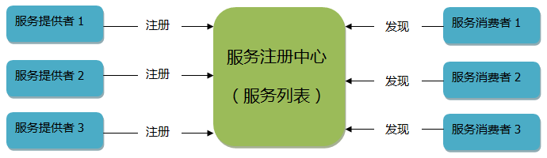
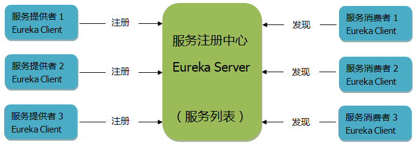
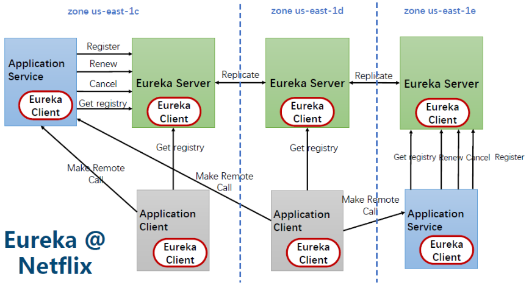
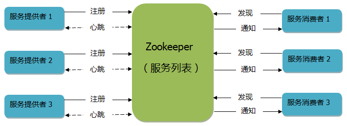
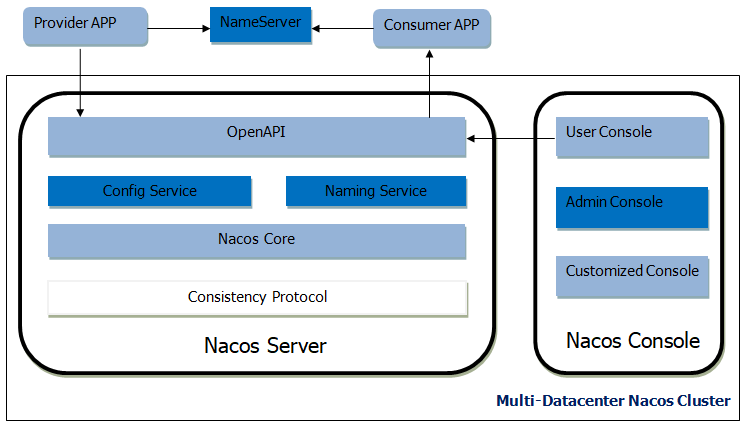
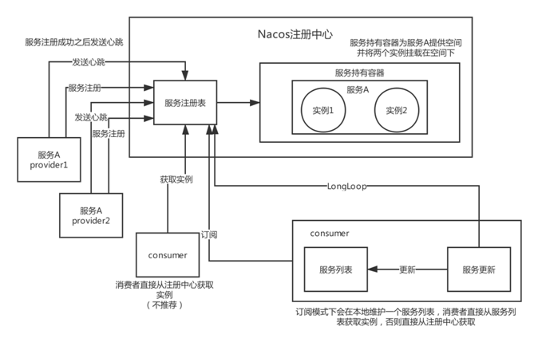
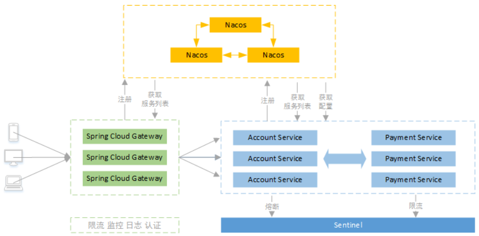

# 服务注册与发现原理剖析（Eureka、Zookeeper、Nacos）

## 注册中心介绍

服务注册中心，是一个给服务提供者注册服务（产生服务列表）、给服务消费者获取服务信息（获取服务列表）的一个地方。服务列表记录着 IP、端口、服务名等信息，服务消费者通过这些信息进行远程调用。这里我画了一张图来描述服务注册中心、服务提供者和服务消费者的关系。

在微服务架构当中，服务注册中心是必不可少的组件之一。比如 Dubbo 使用 ZooKeeper 作为服务注册中心、目前大多数公司都会使用 Eureka 作为 Spring Cloud 微服务的注册中心等等。

在 Spring Cloud 中，除了可以使用 Eureka 作为注册中心外，还可以使用 ZooKeeper 作为注册中心，还可以使用 Nacos 作为注册中心。

根据 CAP 定律，分布式系统不能同时支持 C（一致性）、A（可用性）、P（分区容错性），只能同时支持两种，比如 ZooKeeper 支持 CP（更注重一致性），Eureka 支持 AP（更注重可用性），Nacos 在 1.x 版本既支持 AP、也支持 CP。

## Eureka（出自于 Spring 家族）

### 介绍

Spring Cloud Eureka 是在 Netflix 的 Eureka 基础上进行二次开发的，采用 C-S 设计架构。Spring Cloud Eureka 提供 Eureka Server 服务端与 Eureka Client 客户端：服务端是 Eureka 服务注册中心，客户端完成微服务向 Eureka 服务的注册与发现。服务端和客户端均采用 Java 语言编写。

网上很多人说 Eureka 闭源，其实没有，只是 Eureka 2.x 分支不再维护，官方依然在维护 Eureka 1.x，Spring Cloud 仍然使用 1.x 版本的 Eureka。就算 Eureka 真的闭源，Spring Cloud 还可以使用 ZooKeeper、Consul、Nacos 等组件实现服务治理。比如使用 ZooKeeper 替代 Eureka，只需修改几行配置并更换依赖。

**Eureka Server 与 Eureka Client 的关系：**

### 服务端（Eureka Server）

Eureka Server 是服务注册中心，负责管理每个 Eureka Client 的服务信息（IP、端口等）和状态。服务端主要提供以下功能：

- **提供服务注册：** 提供统一的服务列表。Eureka Client 应用启动时，会将自己的服务注册到这里。
- **提供注册表：** 为 Eureka Client 提供服务列表。客户端首次获取服务列表后会在本地缓存，并定时更新；下次调用时可直接使用缓存中的服务信息进行远程调用，提高效率。
- **服务剔除（Eviction）：** 如果 Eureka Client 超过 90 秒（默认）不向 Eureka Server 上报心跳，Eureka Server 会剔除该实例；但只有在自我保护机制未触发时才会剔除，以避免误删。
- **自我保护机制：** 如果网络不稳定，Eureka Client 仍可能正常提供服务。即使超过 90 秒没有上报心跳，Eureka Server 也不会立即剔除该实例，而是进入自我保护状态，暂停删除服务；网络恢复稳定后，再解除自我保护并恢复正常。

### 客户端（Eureka Client）

Eureka Client 可以作为服务提供者，也可以作为服务消费者，主要提供以下功能：

- **服务注册（Register）：** 作为服务提供者，将自己的服务（IP、端口等）注册到服务注册中心。
- **自动刷新缓存（GetRegistry）：** 作为服务消费者，从服务注册中心获取服务列表并缓存在本地，每 30 秒刷新一次。
- **服务续约（Renew）：** Eureka Client 每 30 秒（默认，可配置）向 Server 端发送 HTTP 心跳，报告自身状态。如果 Server 端在 90 秒（默认，可配置）内没有收到心跳，且自我保护机制未触发，则会剔除该实例。
- **远程调用（Remote Call）：** 作为服务消费者，根据服务列表中的信息发起远程调用。如果存在多个服务提供者实例，默认使用 Ribbon 的轮询策略调用服务。
- **服务下线（Cancel）：** 作为服务提供者，在应用关闭时向服务端发送请求，由服务端接收请求并剔除该实例。

### 注册与发现的工作流程

1. 假设 Eureka Server 已经启动，Eureka Client（服务提供者）启动时把服务注册到 Eureka Server；
2. Eureka Client（服务提供者）每 30 秒（默认可配置）向 Eureka Server 发送 HTTP 请求（即心跳），即服务续约；
3. 如果 Eureka Server 90 秒没有收到 Eureka Client（服务提供者）的心跳请求，就统计 15 分钟内是否有 85% 的 Eureka Client（服务提供者）没有发送心跳。如果是，则进入自我保护状态（例如网络不稳定）；如果不是，则剔除该 Eureka Client 实例；
4. Eureka Client（服务消费者）定时调用 Eureka Server 接口获取服务列表更新本地缓存；
5. Eureka Client（服务消费者）远程调用服务时，先从本地缓存找，如果找到则直接发起服务调用，如果没有则到 Eureka Server 获取服务列表缓存到本地后再发起服务调用；
6. Eureka Client（服务提供者）应用关闭时会向 Eureka Server 发送 HTTP 请求，服务端接收请求后将该实例剔除。

### 集群

单个 Eureka Server 节点情况下，假如宕机了，Eureka Client（服务消费者）还是可以继续工作，因为每个 Eureka Client 都会缓存一份服务列表到本地，但是一旦新服务上线，Eureka Client（服务消费者）就无法调用新服务了，因此还是需要搭建 Eureka Server 集群来实现高可用。下图是由 3 个节点组成的高可用集群：

Eureka Server 集群当中的每个节点都是 **通过 Replicate（即复制）来同步数据**，没有主节点和从节点之分，所有节点都是平等而且数据都保持一致。因为结点之间是通过 **异步方式** 进行同步数据，不保证强一致性，保证可用性，所以是 AP。

假如其中一个 Eureka Server 节点宕机了，不影响 Eureka Client 正常工作，Eureka Client 的请求由其他正常的 Eureka Server 节点接收，当出现宕机的那个 Eureka Server 节点正常启动后，复制其他节点的最新数据（服务列表）后，又可以正常提供服务了。

## ZooKeeper（出自于 Apache）

### 介绍

ZooKeeper 既可以当作服务注册中心，也可以当作服务协调者（比如 hadoop 集群）。此处仅介绍服务注册中心，类似 Eureka，也是服务提供者向 ZK 注册服务，服务消费者获取 ZK 的服务列表进行远程调用，比如 Dubbo。服务注册中心、服务提供者和服务消费者的关系如下：

### 原理

ZK 的文件结构类似于 Linux 系统的树状结构，注册服务时，即在 ZK 中创建一个唯一的 znode 节点来保存服务的 IP、端口、服务名等信息；发现服务时，遍历树状结构文件找到具体的 znode 节点或者服务相关信息进行远程调用。

#### 注册与发现的工作流程

1. 假设 ZK 已经启动，服务提供者启动时把服务注册到 ZK 注册中心；
2. ZK 注册中心和服务提供者之间建立一个 Socket 长连接，ZK 注册中心定时向每个服务提供者发数据包，如果服务提供者没响应，则剔除该服务提供者实例，把更新后的服务列表发送给所有服务消费者（即通知）；
3. 服务消费者启动时到 ZK 注册中心获取一份服务列表缓存到本地供以后使用；
4. 服务消费者远程调用服务时，先从本地缓存找，如果找到则直接发起服务调用，如果没有则到 ZK 注册中心获取服务列表缓存到本地后再发起服务调用；
5. 当其中一个服务提供者宕机或正常关闭时，ZK 注册中心会把该节点剔除，并通知所有服务消费者更新本地缓存；
6. 当这个服务提供者正常启动后，ZK 注册中心也能感知到，并通知所有服务消费者更新本地缓存。

#### ZooKeeper 和 Eureka 的区别

1. 根据 CAP 定律，ZooKeeper 支持 CP，Eureka 支持 AP。因为 ZK 集群中如果有节点宕机则需要选举 leader，选举过程需要 30 至 120 秒，选举过程时集群不可用，牺牲时间来保证数据一致性，因此支持 CP；而 Eureka 每个节点的数据都一致，没有主从节点之分，不需选举，如果其中一个节点宕机则马上切换到另外一个健康的节点上，保证可用性，因此支持 AP。
2. 微服务架构当中，可用性比一致性更重要些，Eureka 比 ZooKeeper 更合适，而 ZooKeeper 更适合做分布式协调服务，比如：hadoop 集群。

## Nacos（出自于阿里）

### 介绍

在 2018 年 7 月份阿里发布了 Nacos，是一个后起之秀，它吸取了 Eureka、ZooKeeper 等注册中心的优点，还支持 k8s、Dubbo、兼容 Spring Cloud 等无缝对接各大生态。既能作为服务注册中心、也能作为配置中心，在 CAP 定律中既支持 AP 也支持 CP。Nacos 服务端需要独立部署，也有自己的后台管理界面。好像无所不能一样，出自阿里必为精品。

### 架构图

### 主要功能点

- **服务注册与发现：** 类似 Eureka、ZooKeeper、Consul 等组件，既支持 HTTP、HTTPS 服务的注册与发现，也支持 RPC 服务的注册与发现，例如 Dubbo。Nacos 也出自阿里，可用于替代 Eureka、ZooKeeper、Consul。
- **动态配置服务：** 类似 Spring Cloud Config + Bus、Apollo 等组件。提供后台管理界面，统一管理服务和应用配置；修改公共配置后，无需重启应用程序即可生效。

### 注册与发现的工作流程

1. 假设 Nacos Server 已经启动，服务提供者启动时把服务注册到 Nacos 注册中心；
2. 服务提供者注册成功后，定时发 http 请求（即心跳）到注册中心，证明自身服务实例可用；
3. 如果注册中心长时间没有收到服务提供者的心跳请求，则剔除该实例；
4. 服务消费者发现服务支持两种方式，一种是主动请求注册中心获取服务列表（不推荐），一种是订阅注册中心的服务并提交一个 Listener，如果注册中心的服务有变更，由 Listener 来通知服务消费者更新本地服务列表；
5. 服务消费者获取服务相关信息进行远程调用。

### 负载均衡

Nacos 的客户端负载均衡是使用 Feign 实现，Feign 是使用接口 + 注解的方式来调用 HTTP 接口，底层是使用接口的动态代理（即 jdk 的动态代理）机制实现。默认使用轮询策略，还可以加权轮询、IP 哈希、最少连接数、最少连接数慢启动时间等策略可以选择。

### 集群

Nacos 的单节点，即 standalone 模式，配置的数据默认存储到内嵌的数据库 Derby 中，搭建集群时是不能使用内嵌的数据库，不然数据无法共享，可以使用 Mysql 进行数据存储。最好采用 3 个或 3 个以上 Nacos 节点来搭建集群，如图：

### Eureka、ZooKeeper、Nacos 区别

Eureka 不能支撑大量服务实例，因为 Eureka 的每个节点数据都一致，会产生大量的心跳检查等等导致并发性能低下，ZooKeeper 的频繁上下线通知会导致性能下降，而 Nacos 可以支持大量服务实例又不丢性能，据说服务数量能达到 10 万以上。

## Eureka、ZooKeeper、Nacos、Consul 对比

- Eureka 适用于服务实例数量不大的服务注册中心；
- ZooKeeper 相对服务注册中心来说更适用于分布式协调服务；
- Nacos 既适用于大量服务实例的服务注册中心，也可以作为配置中心；
- Consul 更适用于 Service Mesh 架构，使用 Go 语言开发，不方便排查 Bug。
