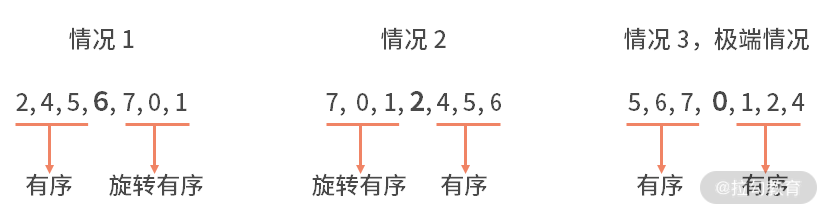
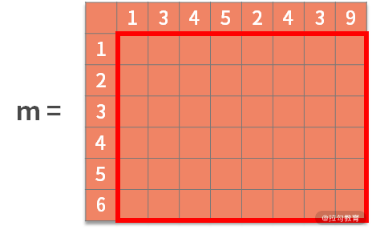
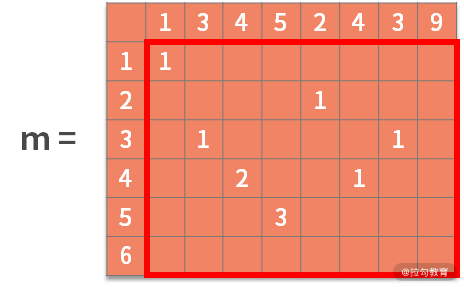

# 16 真题案例（一）：算法思维训练

你好，欢迎进入第 16 课时的学习。在前面课时中，我们已经学习了解决代码问题的方法论。宏观上，它可以分为以下 4 个步骤：

1. **复杂度分析**：估算问题中复杂度的上限和下限。
2. **定位问题**：根据问题类型，确定采用何种算法思维。
3. **数据操作分析**：根据增、删、查和数据顺序关系去选择合适的数据结构，利用空间换取时间。
4. **编码实现**。

这套方法论的框架，是解决绝大多数代码问题的基本步骤。本课时，我们将在一些更开放的题目中进行演练，继续训练你的算法思维。

## 算法思维训练题

### 例题 1：斐波那契数列

> **【题目】**
> 写一个函数，输入 $x$，输出斐波那契数列中第 $x$ 位的元素。例如，输入 4，输出 2；输入 9，输出 21。
> **要求**：需要用递归的方式来实现。

斐波那契数列是：0，1，1，2，3，5，8，13，21，34，55，89，144……。你会发现，这个数列中元素的性质是，某个数等于它前面两个数的和；也就是 $a[n+2] = a[n+1] + a[n]$。至于起始两个元素，则分别为 0 和 1。在这个数列中的数字，就被称为斐波那契数。

**【解析】**

按照解决代码问题的方法论进行详细分析：

- **复杂度分析**：题目要求用递归的方式来实现，而递归的次数与 $x$ 的具体数值有非常强的关系。因此，此时的时间复杂度应该是关于输入变量 $x$ 的数值大小的函数。
- **问题定位**：因为题目中已经明确了要采用递归去解决，所以不用再去做额外的分析和判断。如何使用递归呢？我们需要依赖斐波那契数列的重要性质“某个数等于它前面两个数的和”。也就是说，要求出某个位置 $x$ 的数字，需要先求出 $x-1$ 的位置是多少和 $x-2$ 的位置是多少。递归同时还需要终止条件，对应于斐波那契数列的性质，就是起始两个元素，分别为 0 和 1。
- **数据操作分析**：斐波那契数列需要对数字进行求和。而且所有的计算，都是依赖最原始的 0 和 1 进行。因此，这道题是不需要设计什么复杂的数据结构的。
- **编码实现**：我们围绕递归的性质进行开发，试着写出递归体和终止条件。代码如下：

```java
public static void main(String[] args) {
    int x = 20;
    System.out.println(fun(x));
}

private static int fun(int n) {
    if (n == 1) {
        return 0;
    }
    if (n == 2) {
        return 1;
    }
    return fun(n - 1) + fun(n - 2);
}
```

**代码解读：**

在主函数中，定义输入变量 `x`，并调用 `fun(x)` 去计算第 `x` 位的斐波那契数列元素。在 `fun()` 函数内部，采用了递归去完成计算：
- **递归体**：即当输入变量 `n` 比 2 大的时候，递归地调用 `fun()` 函数，并传入 `n-1` 和 `n-2`，即 `return fun(n - 1) + fun(n - 2)`；
- **终止条件**：定义了当 `n` 为 1 或 2 的时候，直接返回 0 或 1。

---

### 例题 2：判断一个数组中是否存在某个数

> **【题目】**
> 给定一个经过任意位数的旋转后的排序数组，判断某个数是否在里面。
> 例如，对于一个给定数组 `{4, 5, 6, 7, 0, 1, 2}`，它是将一个有序数组的前三位旋转地放在了数组末尾。假设输入的 `target` 等于 0，则输出答案是 4，即 0 所在的位置下标是 4。如果输入 3，则返回 -1。

**【解析】**

- **复杂度分析**：这个问题就是判断某个数字是否在数组中，因此，复杂度极限就是全部遍历地去查找，也就是 $O(n)$ 的复杂度。
- **问题定位**：判断某个数是否在数组里面，这就是一个查找问题。
- **数据操作分析**：原数组是经过某些处理的排序数组，也就是说原数组是有序的。有序和查找，会让你很快地想到，这个问题极有可能用二分查找的方式去解决，时间复杂度是 $O(\log n)$，相比 $O(n)$ 有显著提高。在利用二分查找时，没有数据的增删操作，因此不需要定义复杂的数据结构。

采用二分查找的方法，在 $O(\log n)$ 的时间复杂度下去解决这个问题。二分查找可以通过递归来实现。而每次递归的关键点在于，根据切分的点（最中间的数字），确定是向左走还是向右走。

在旋转后的有序数组中，利用中间元素作为切分点得到的两个子数组中，一定存在一个数组是有序的。如下图所示：



对于有序的一边，我们更容易判断目标值是否在这个区间内。如果在其中，也说明了目标值不在另一边的旋转有序组里；反之亦然。当我们知道了目标值在左右哪边之后，就可以递归地调用旋转有序的二分查找了。直到不断二分后，搜索空间只有 1 位数字，直接判断是否找到即可。

**编码实现：**

```java
public static void main(String[] args) {
    int[] arr = { 4, 5, 6, 7, 0, 1, 2 };
    int target = 7;
    System.out.println(bs(arr, target, 0, arr.length - 1));
}

private static int bs(int[] arr, int target, int begin, int end) {
    if (begin == end) {
        if (target == arr[begin]) {
            return begin;
        } else {
            return -1;
        }
    }
    int middle = (begin + end) / 2;
    if (target == arr[middle]) {
        return middle;
    }
    if (arr[begin] <= arr[middle - 1]) {
        if (arr[begin] <= target && target <= arr[middle - 1]) {
            return bs(arr, target, begin, middle - 1);
        } else {
            return bs(arr, target, middle + 1, end);
        }
    } else {
        if (arr[middle + 1] <= target && target <= arr[end]) {
            return bs(arr, target, middle + 1, end);
        } else {
            return bs(arr, target, begin, middle - 1);
        }
    }
}
```

**代码解读：**

主函数中，定义数组和 `target`，并且执行二分查找。二分查找包括二分策略与终止条件：
- **二分策略**：计算分裂点的索引值，进行目标值与分裂点的判断。如果相等则返回；不等就要继续二分。在二分的过程中，判断左右子数组哪边是有序的。如果左边有序且 `target` 在有序区间内，递归调用 `bs(arr, target, begin, middle-1)`；否则调用 `bs(arr, target, middle+1, end)`。
- **终止条件**：经过层层二分，当 `begin` 和 `end` 相等时，判断最后剩下的 1 个元素是否与 `target` 相等：若相等返回索引，不等返回 -1。

---

### 例题 3：求解最大公共子串

> **【题目】**
> 输入两个字符串，用动态规划的方法，求解出最大公共子串。
> 例如，输入 `a = "13452439"`, `b = "123456"`。由于字符串 `"345"` 同时在 `a` 和 `b` 中出现，且是同时出现在 `a` 和 `b` 中的最长的子串，因此输出 `"345"`。

**【解析】**

动态规划的基本方法是：**分阶段、找状态、做决策、状态转移方程、定目标、寻找终止条件**。下面分析具体步骤：

- **阶段**：对于一个可能的起点，它后面的每个字符都是一个阶段。
- **状态**：当前寻找到的相匹配的字符。
- **决策**：当前找到的字符是否相等（相等则进入到公共子串中）。
- **状态转移方程**：$s_{k+1} = u_k(s_k)$。若 $s_k = 	ext{"123"}$ 是公共子串且后面字符相等，则 $s_{k+1} = 	ext{"1234"}$。
- **目标**：公共子串长度最长。
- **终止条件**：决策到了不相等的结果。

采用二维数组（矩阵）保存状态。每一行或每一列对应输入字符串 `a` 和 `b` 的每个字符：



每个可能的起点字符，都应该同时出现在字符串 `a` 和 `b` 中。距离初始化如下：


利用状态转移方程寻找最优子结构：如果 $b[i] = a[j]$，则 $m[i,j] = m[i-1,j-1] + 1$：



检索这个矩阵，得到的最大数字就是最大公共子串的长度。

**编码实现：**

```java
public static void main(String[] args) {
    String a = "13452439";
    String b = "123456";
    getCommenStr(a, b);
}

public static void getCommenStr(String a, String b) {
    char[] c1 = a.toCharArray();
    char[] c2 = b.toCharArray();
    int[][] m = new int[c2.length + 1][c1.length + 1];
    for (int i = 1; i <= c2.length; i++) {
        for (int j = 1; j <= c1.length; j++) {
            if (c2[i - 1] == c1[j - 1])
                m[i][j] = m[i - 1][j - 1] + 1;
        }
    }
    int max = 0;
    int index = 0;
    for (int i = 0; i <= c2.length; i++) {
        for (int j = 0; j <= c1.length; j++) {
            if (m[i][j] > max) {
                max = m[i][j];
                index = i;
            }
        }
    }
    String s = "";
    for (int i = index - max; i < index; i++)
        s += b.charAt(i);
    System.out.println(s);
}
```

**代码解读：**

1. `getCommenStr()` 函数中，定义了 7x9 的二维数组 `m`（包含全零矢量作为起始条件）。
2. 利用双重循环完成状态转移计算，更新矩阵。
3. 从矩阵 `m` 中找到最大值为 3，在字符串 `b` 中的索引值为 4。
4. 根据终点索引 4 和长度 3，截取字符串 `b` 中 2~4 的位置，即输出 `"345"`。

---

## 总结与思考

本课时重点训练了算法思维与解题步骤。

**思考题**：

如果现在是个线上实时交互的系统，客户端输入 $x$，服务端返回斐波那契数列中的第 $x$ 位。那么，这个问题使用上面的解法是否可行？如果不可行，原因是什么？我们又该如何解决？

> **提示**：实时系统中，用户提交 $x$ 后若数秒内未响应会极大地影响体验。考虑计算复杂度 $O(2^x)$ 带来的性能瓶颈以及预计算/缓存（如动态规划表或哈希表）的优化思路。
