# 02 认知：Elastic Stack 生态和场景方案

## 1. Elastic Stack 生态架构

Elastic Stack 的核心组件包含：**Beats + Logstash + Elasticsearch + Kibana**。

下图展现了 Elastic Stack 技术生态及其上层核心业务应用场景：

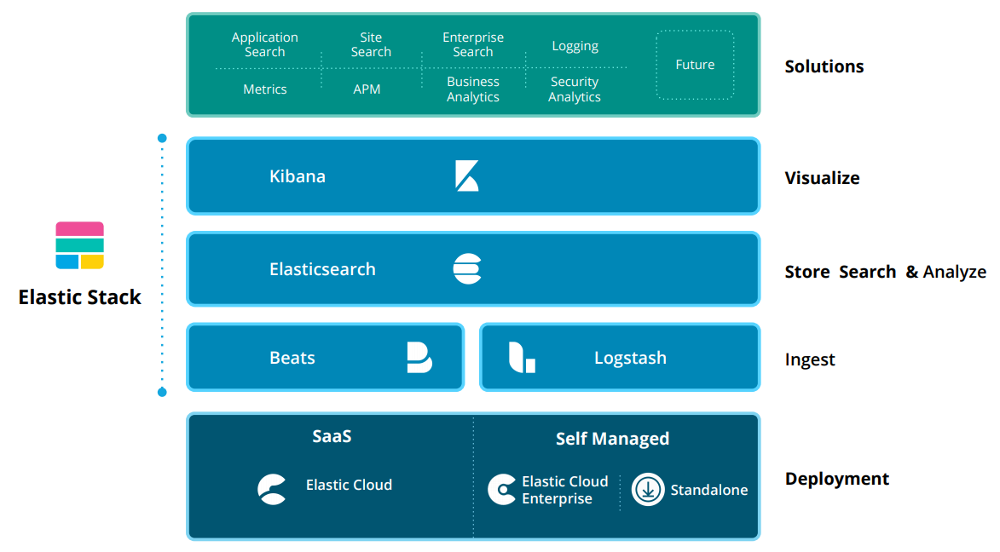

结合 Elastic 商业化扩展组件 X-Pack，其整体功能划分如下：

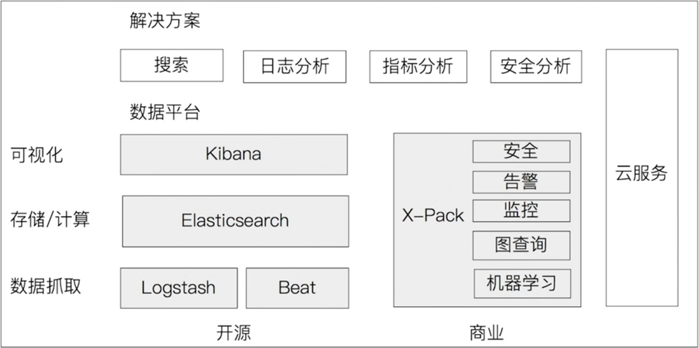

### Beats

Beats 是一个面向 **轻量级数据采集** 的客户端平台。它可以安装在边缘服务器上向 Logstash 或 Elasticsearch 直接发送数据。Beats 采用 Go 语言开发，运行效率高、内存占用低。不同的 Beat 组件对应不同的数据源采集：

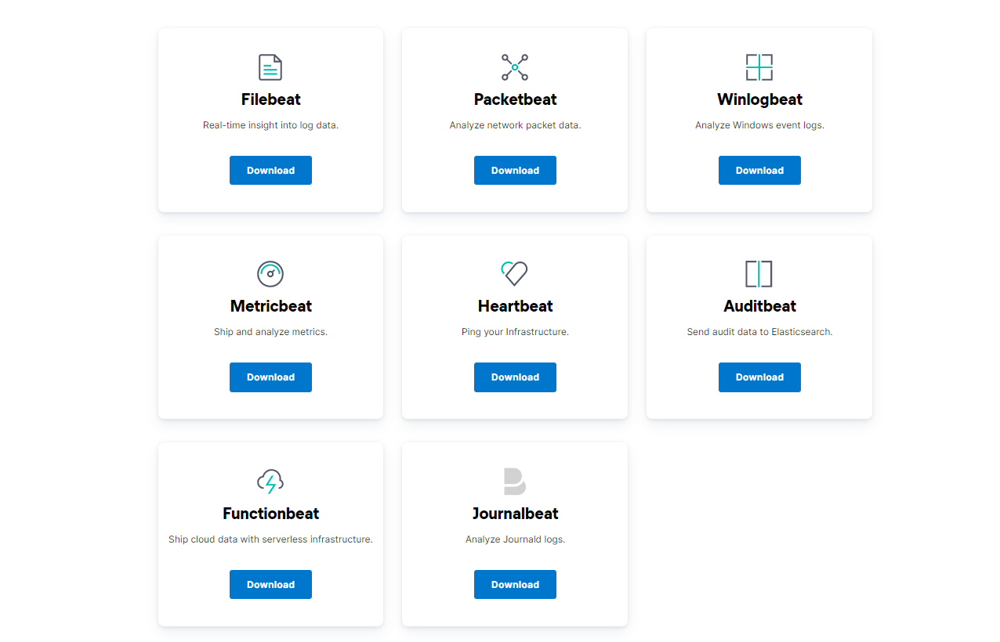

### Logstash

Logstash 是 **动态数据收集管道**，拥有可扩展的插件生态系统（支持 200+ 插件），支持从不同的数据源采集数据、实时转换过滤，并将数据清洗后发送到不同的存储介质中。

- **实时解析与转换**：支持结构化与非结构化日志转换；
- **高可靠性与安全性**：通过基于磁盘的持久化队列保证至少一次（At-Least-Once）投递，支持传输加密；
- **监控与运维**：提供管道运行状态监控。

### Elasticsearch

Elasticsearch 是基于 Lucene 构建的 **分布式搜索、分析与存储引擎**，专门为实现水平可扩展性、高可用性和易管理性而设计：

1. 客户端提交 JSON 数据到 Elasticsearch；
2. 通过分词器（Tokenizer）对文本字段进行分词与倒排索引构建；
3. 将词项频次与权重存入倒排索引，搜索时根据算法计算相关度得分（Relevance Score）并实时返回结果。

### Kibana

Kibana 提供 **数据可视化与管理界面**，能够将 Elasticsearch 中的数据以仪表盘、直方图、地图等形式展现，同时支持机器学习异常检测与集群监控管理。

---

## 2. 从日志收集系统看 Elastic Stack 的演进

一个完整的日志收集系统通常包含五个阶段：

- **采集**：收集多种来源的日志；
- **传输**：稳定解析、过滤并传输日志；
- **存储**：持久化日志数据；
- **分析**：UI 交互式查询分析；
- **告警**：异常报告与监控通知。

### 架构方案 A：Beats + Elasticsearch + Kibana

由 Beats 直接采集数据并写入 Elasticsearch，Kibana 负责可视化展示。适合日志清洗需求简单、负载较低的轻量级场景。

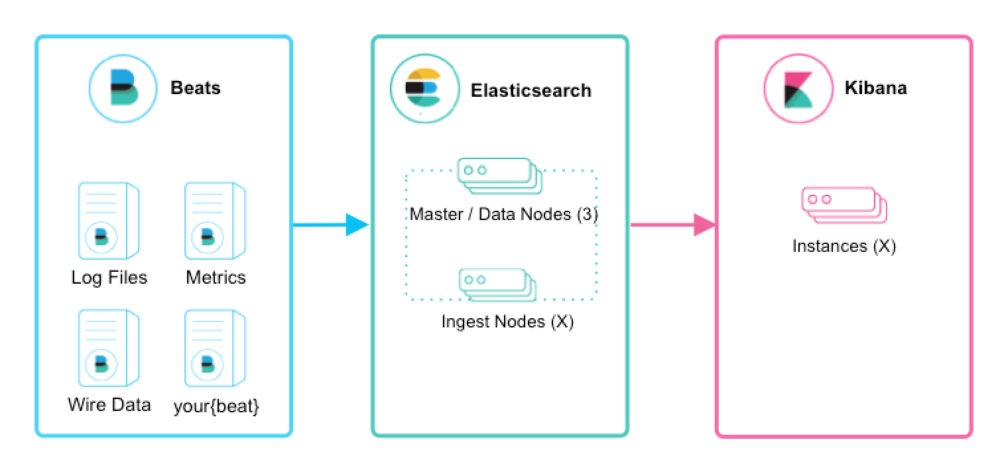

### 架构方案 B：Beats + Logstash + Elasticsearch + Kibana

在 Beats 和 Elasticsearch 之间引入 Logstash 进行复杂的数据过滤与转换。

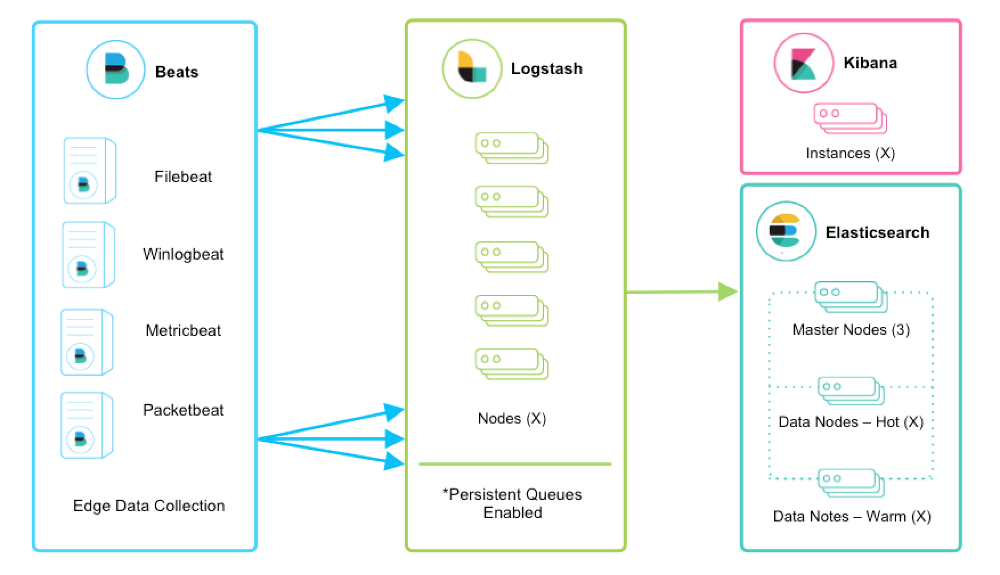

#### 引入 Logstash 的优势

1. **自适应缓冲**：利用基于磁盘的持久队列吸收突发流量，防止对底层存储造成冲击；
2. **多源接入与多端输出**：支持从数据库、S3、消息队列等多种来源提取，并写入 S3、HDFS 或文件；
3. **复杂管道**：支持使用条件分支逻辑构建复杂的数据处理流；
4. **高可用与扩展性**：Beats 与 Logstash 节点之间支持负载均衡与故障转移；
5. **安全传输**：传输链路全面支持 TLS 加密、PKI、LDAP 及基本身份验证。

支持引入多数据源（TCP、UDP、HTTP 协议输入）：

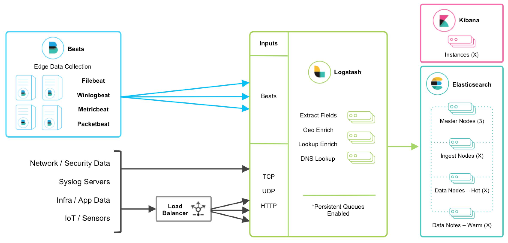

### 架构方案 C：Beats + MQ + Logstash + Elasticsearch + Kibana

在 Beats 与 Logstash 之间引入缓冲中间件（如 Kafka、RabbitMQ、Redis）：

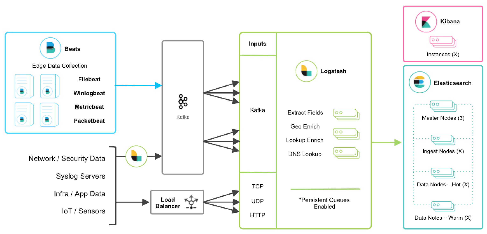

#### 引入 MQ 的好处

- **降低业务节点负载**：业务服务器仅运行轻量 Beats，消耗资源极少；
- **削峰填谷**：在日志量暴涨时通过消息队列解耦与缓冲，保护后续集群不被冲垮；
- **解耦统一处理**：Logstash 作为 Indexer 集中消费 MQ，便于统一代码修改与集中部署。

---

## 3. Elastic Stack 官方最佳实践场景

### 1. 基础日志收集与消息中间件组合

基础日志收集方案：

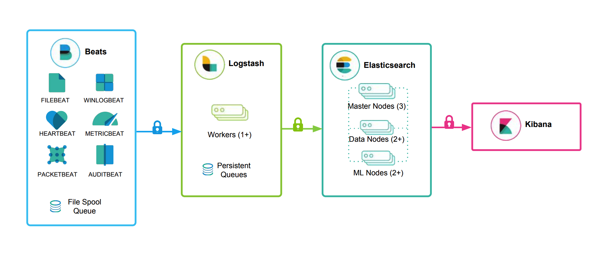

多数据源与 MQ 削峰方案：

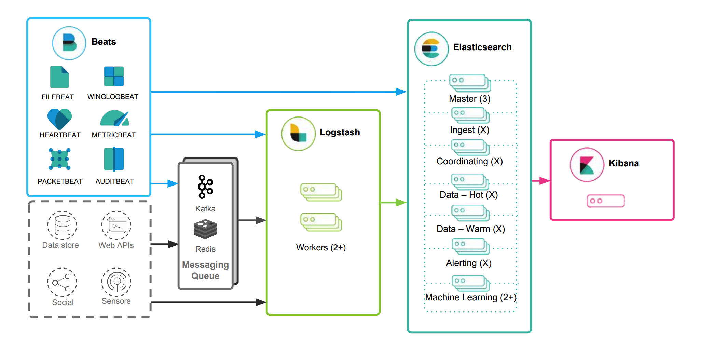

### 2. Metric 指标收集与 APM 性能监控

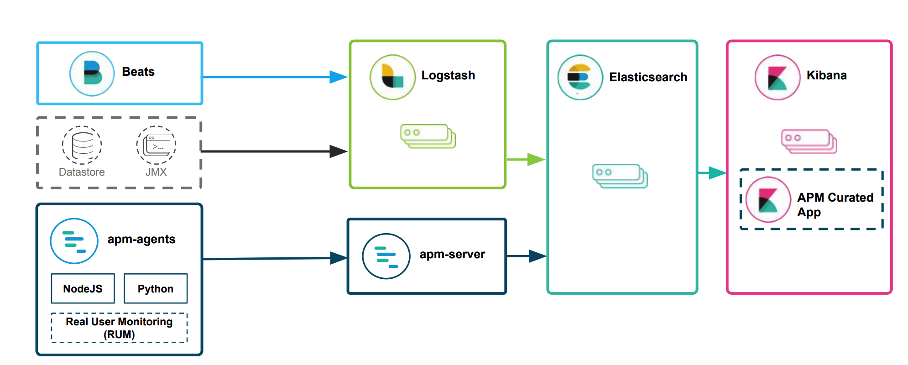

### 3. 多数据中心与跨集群搜索方案

通过数据冗余实现高可用：

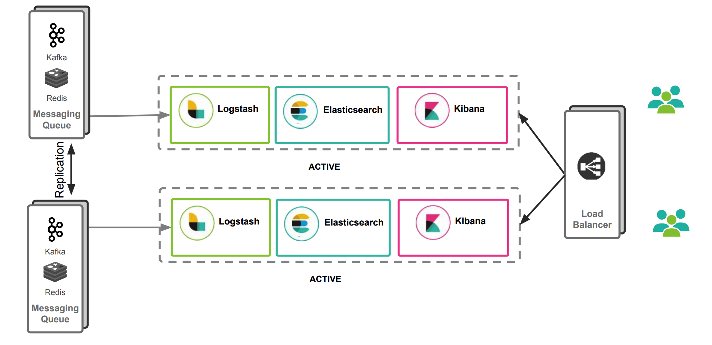

双数据采集中心汇聚：

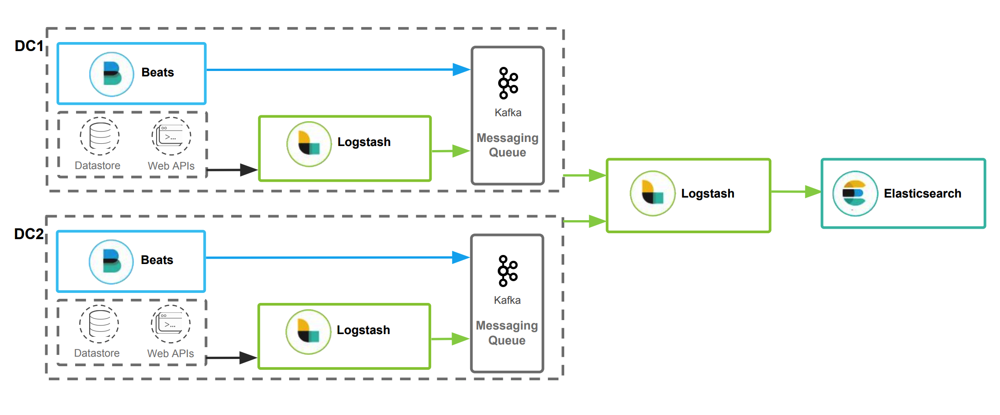

数据分散与跨集群搜索（Cross-Cluster Search）：

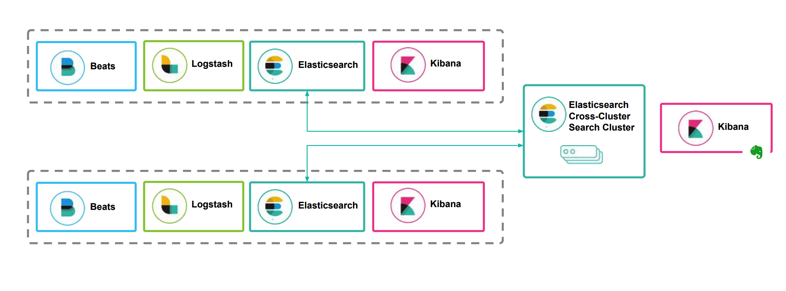

---

## 4. 参考资料

- [Elasticsearch 官方文档](https://www.elastic.co/cn/elasticsearch/)
- [Elastic Stack 架构最佳实践 PDF](https://www.elastic.co/pdf/architecture-best-practices.pdf)
- [Logstash 部署与扩展指南](https://www.elastic.co/guide/en/logstash/current/deploying-and-scaling.html)
