# 09 查询：DSL 查询之 Term 详解

## Term 查询引入

如前文所述，查询分基于文本查询和基于词项的查询:

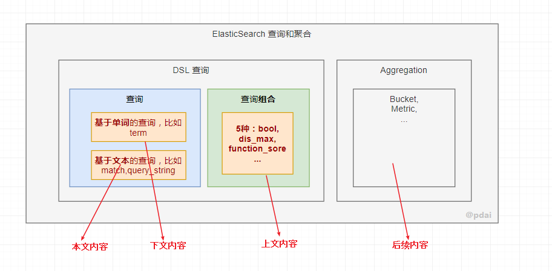

本文主要讲基于词项的查询。

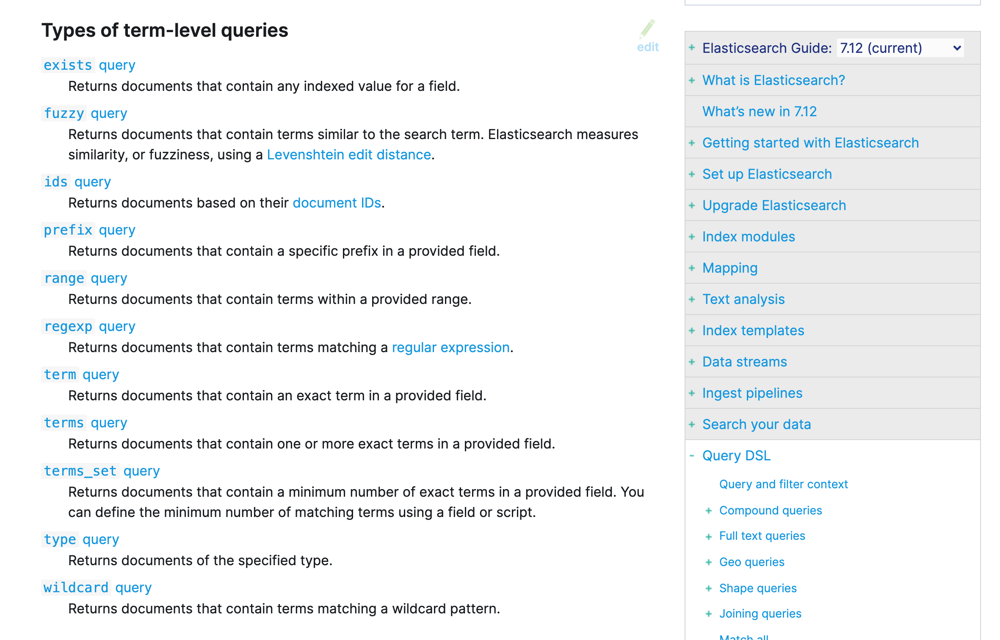

## Term 查询

> 很多比较常用，也不难，就是需要结合实例理解。这里综合官方文档的内容，我设计一个测试场景的数据，以覆盖所有例子。@pdai

准备数据

```shell
PUT /test-dsl-term-level
{
  "mappings": {
    "properties": {
      "name": {
        "type": "keyword"
      },
      "programming_languages": {
        "type": "keyword"
      },
      "required_matches": {
        "type": "long"
      }
    }
  }
}
POST /test-dsl-term-level/_bulk
{ "index": { "_id": 1 }}
{"name": "Jane Smith", "programming_languages": [ "c++", "java" ], "required_matches": 2}
{ "index": { "_id": 2 }}
{"name": "Jason Response", "programming_languages": [ "java", "php" ], "required_matches": 2}
{ "index": { "_id": 3 }}
{"name": "Dave Pdai", "programming_languages": [ "java", "c++", "php" ], "required_matches": 3, "remarks": "hello world"}
```

### 字段是否存在:exist

由于多种原因，文档字段的索引值可能不存在：

- 源 JSON 中的字段是 null 或[]
- 该字段已"index" : false 在映射中设置
- 字段值的长度超出 ignore_above 了映射中的设置
- 字段值格式错误，并且 ignore_malformed 已在映射中定义

所以 exist 表示查找是否存在字段。

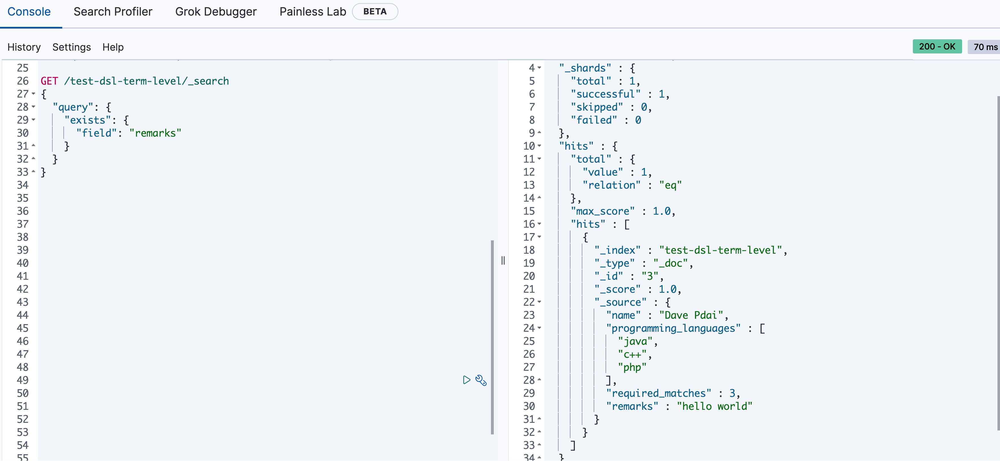

### id 查询:ids

ids 即对 id 查找

```shell
GET /test-dsl-term-level/_search
{
  "query": {
    "ids": {
      "values": [3, 1]
    }
  }
}
```

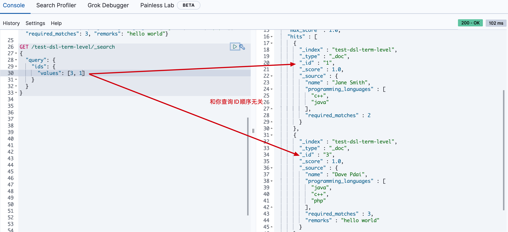

### 前缀:prefix

通过前缀查找某个字段

```shell
GET /test-dsl-term-level/_search
{
  "query": {
    "prefix": {
      "name": {
        "value": "Jan"
      }
    }
  }
}
```

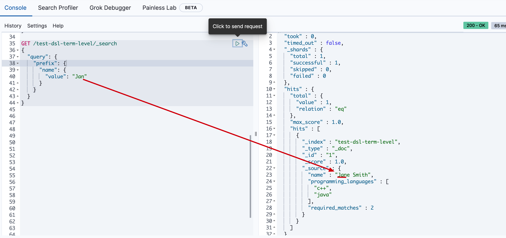

### 分词匹配:term

前文最常见的根据分词查询

```shell
GET /test-dsl-term-level/_search
{
  "query": {
    "term": {
      "programming_languages": "php"
    }
  }
}
```

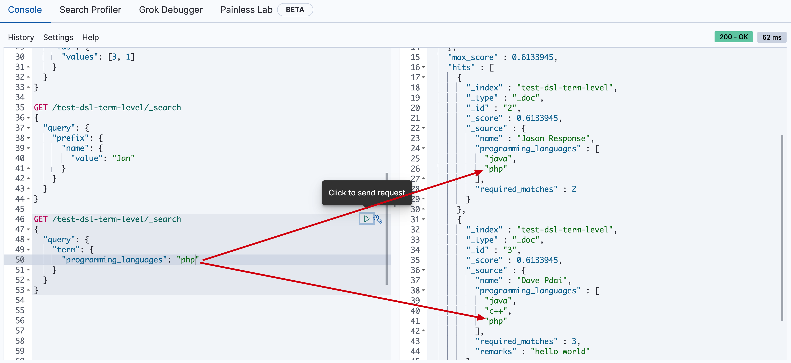

### 多个分词匹配:terms

按照读个分词 term 匹配，它们是 or 的关系

```shell
GET /test-dsl-term-level/_search
{
  "query": {
    "terms": {
      "programming_languages": ["php","c++"]
    }
  }
}
```

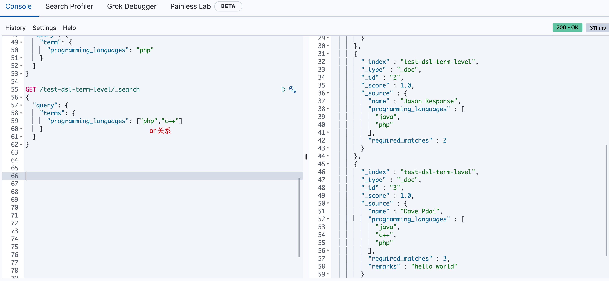

### 按某个数字字段分词匹配:term set

设计这种方式查询的初衷是用文档中的数字字段动态匹配查询满足 term 的个数

```shell
GET /test-dsl-term-level/_search
{
  "query": {
    "terms_set": {
      "programming_languages": {
        "terms": [ "java", "php" ],
        "minimum_should_match_field": "required_matches"
      }
    }
  }
}
```

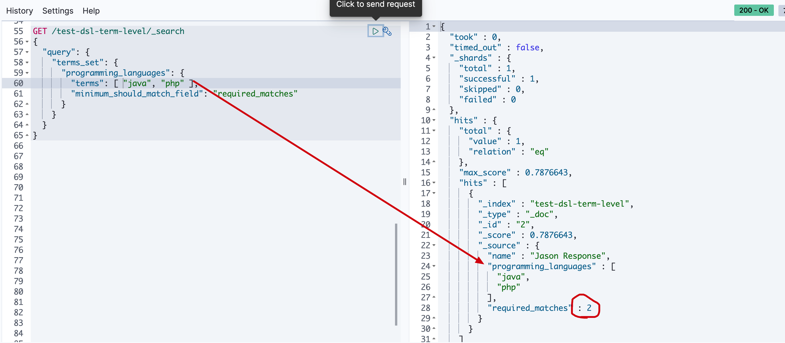

### 通配符:wildcard

通配符匹配，比如`*`

```shell
GET /test-dsl-term-level/_search
{
  "query": {
    "wildcard": {
      "name": {
        "value": "D*ai",
        "boost": 1.0,
        "rewrite": "constant_score"
      }
    }
  }
}
```

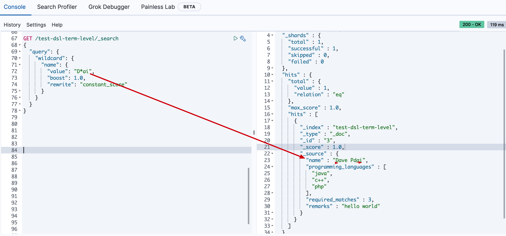

### 范围:range

常常被用在数字或者日期范围的查询

```shell
GET /test-dsl-term-level/_search
{
  "query": {
    "range": {
      "required_matches": {
        "gte": 3,
        "lte": 4
      }
    }
  }
}
```

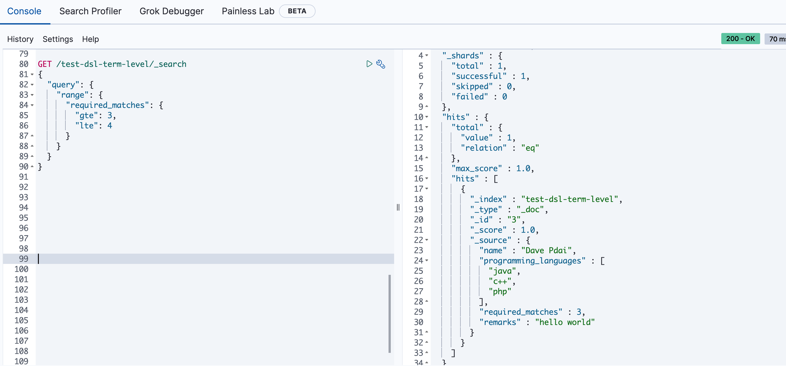

### 正则:regexp

通过[正则表达式]查询

以"Jan"开头的 name 字段

```shell
GET /test-dsl-term-level/_search
{
  "query": {
    "regexp": {
      "name": {
        "value": "Ja.*",
        "case_insensitive": true
      }
    }
  }
}
```

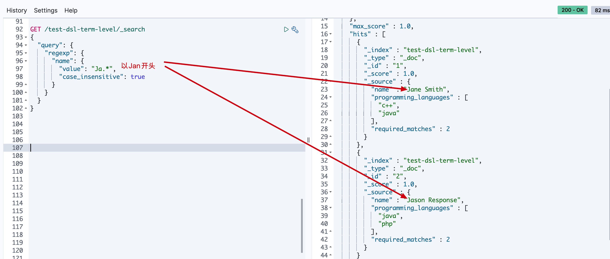

### 模糊匹配:fuzzy

官方文档对模糊匹配：编辑距离是将一个术语转换为另一个术语所需的一个字符更改的次数。这些更改可以包括：

- 更改字符（box→ fox）
- 删除字符（black→ lack）
- 插入字符（sic→ sick）
- 转置两个相邻字符（act→ cat）

```shell
GET /test-dsl-term-level/_search
{
  "query": {
    "fuzzy": {
      "remarks": {
        "value": "hell"
      }
    }
  }
}
```

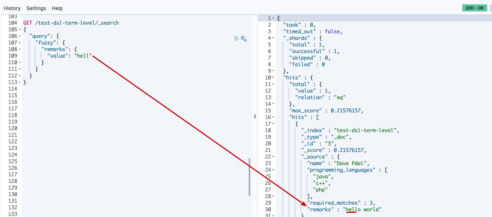

## 参考文章

<https://www.elastic.co/guide/en/elasticsearch/reference/current/term-level-queries.html>
