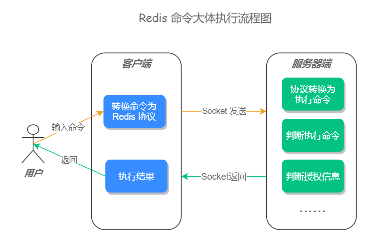
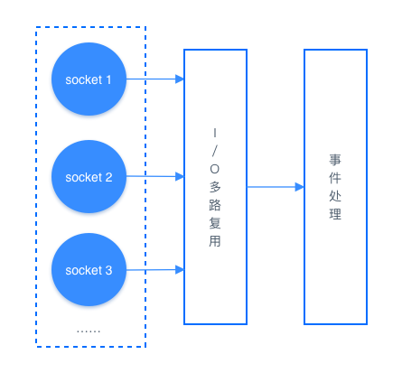
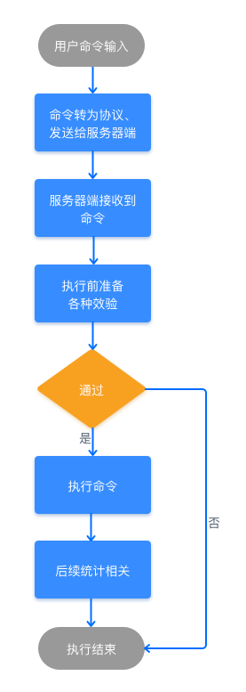

# 01 Redis 是如何执行的

在以往的面试中，当问到一些面试者：Redis 是如何执行的？收到的答案往往是：客户端发命令给服务器端，服务端收到执行之后再返回给客户端。然而对于执行细节却「避而不谈」 ，当继续追问服务器端是如何执行的？能回答上来的人更是寥寥无几，这未免让人有些遗憾，一个我们每天都在用的技术，知道原理的人却寥若晨星。

对于任何一门技术，如果你只停留在「会用」的阶段，那就很难有所成就，甚至还有被裁员和找不到工作的风险，我相信能看此篇文章的你，一定是积极上进想有所作为的人，那么借此机会，我们来深入的解一下 Redis 的执行细节。

## 命令执行流程

一条命令的执行过程有很多细节，但大体可分为：客户端先将用户输入的命令，转化为 Redis 相关的通讯协议，再用 socket 连接的方式将内容发送给服务器端，服务器端在接收到相关内容之后，先将内容转化为具体的执行命令，再判断用户授权信息和其他相关信息，当验证通过之后会执行最终命令，命令执行完之后，会进行相关的信息记录和数据统计，然后再把执行结果发送给客户端，这样一条命令的执行流程就结束了。如果是集群模式的话，主节点还会将命令同步至子节点，下面我们一起来看更加具体的执行流程。



**步骤一：用户输入一条命令**  **步骤二：客户端先将命令转换成 Redis 协议，然后再通过 socket 连接发送给服务器端**

客户端和服务器端是基于 socket 通信的，服务器端在初始化时会创建了一个 socket 监听，用于监测链接客户端的 socket 链接，源码如下：

```c
void initServer(void) {
    //......
    // 开启 Socket 事件监听
    if (server.port != 0 &&
        listenToPort(server.port,server.ipfd,&server.ipfd_count) == C_ERR)
        exit(1);
    //......
}
```

> socket 小知识：每个 socket 被创建后，会分配两个缓冲区，输入缓冲区和输出缓冲区。 写入函数并不会立即向网络中传输数据，而是先将数据写入缓冲区中，再由 TCP 协议将数据从缓冲区发送到目标机器。一旦将数据写入到缓冲区，函数就可以成功返回，不管它们有没有到达目标机器，也不管它们何时被发送到网络，这些都是 TCP 协议负责的事情。 注意：数据有可能刚被写入缓冲区就发送到网络，也可能在缓冲区中不断积压，多次写入的数据被一次性发送到网络，这取决于当时的网络情况、当前线程是否空闲等诸多因素，不由程序员控制。 读取函数也是如此，它也是从输入缓冲区中读取数据，而不是直接从网络中读取。

当 socket 成功连接之后，客户端会先把命令转换成 Redis 通讯协议（RESP 协议，REdis Serialization Protocol）发送给服务器端，这个通信协议是为了保障服务器能最快速的理解命令的含义而制定的，如果没有这个通讯协议，那么 Redis 服务器端要遍历所有的空格以确认此条命令的含义，这样会加大服务器的运算量，而直接发送通讯协议，相当于把服务器端的解析工作交给了每一个客户端，这样会很大程度的提高 Redis 的运行速度。例如，当我们输入 `set key val` 命令时，客户端会把这个命令转换为 `*3\r\n$3\r\nSET\r\n$4\r\nKEY\r\n$4\r\nVAL\r\n` 协议发送给服务器端。 更多通讯协议，可访问官方文档：[https://redis.io/topics/protocol](https://redis.io/topics/protocol)

### 扩展知识：I/O 多路复用

Redis 使用的是 I/O 多路复用功能来监听多 socket 链接的，这样就可以使用一个线程链接来处理多个请求，减少线程切换带来的开销，同时也避免了 I/O 阻塞操作，从而大大提高了 Redis 的运行效率。

I/O 多路复用机制如下图所示： 

综合来说，此步骤的执行流程如下：

- 与服务器端以 socket 和 I/O 多路复用的技术建立链接；
- 将命令转换为 Redis 通讯协议，再将这些协议发送至缓冲区。

### Redis 命令执行 7 大核心阶段总结

一条 Redis 命令从客户端发送到接收结果的全生命周期可划分为以下 7 个阶段：

| 处理阶段   | 阶段名称               | 核心职责与操作流程                                                               | 关键校验与底层细节机制                                 |
|------------|------------------------|----------------------------------------------------------------------------------|--------------------------------------------------------|
| **阶段一** | 用户命令输入           | 用户在 CLI、Web 或应用程序 SDK 中发起原始命令                                    | 如：`SET key value`                                    |
| **阶段二** | 协议转换与 Socket 发送 | 客户端将命令转为 **RESP 通讯协议**（如 `*3\r\n...`），通过 Socket 写入发送缓冲区 | 借由 **I/O 多路复用** 处理并发链接，减轻服务端解析开销 |
| **阶段三** | 服务端接收与解析       | 服务端读取 Socket 输入缓冲区，解析参数生成 `Client` 结构体                       | 校验输入缓冲区上限（默认 1GB），超限直接强制关闭连接   |
| **阶段四** | 执行前 15 项安全预检   | 执行权限、集群重定向、OOM 内存限制、持久化状态、主从只读等校验                   | 未 Auth 拒绝、内存超限触发淘汰、慢日志监控准备         |
| **阶段五** | 执行最终命令           | 查找 `redisCommand` 匹配字典，调用对应的 `proc` 函数执行逻辑                     | 纯内存高效读写                                         |
| **阶段六** | 统计与数据传播         | 记录慢查询 Slowlog、累加 `calls` 统计、追加 AOF 缓冲区、同步至 Slave 节点        | 保证主从一致性与日志可追溯                             |
| **阶段七** | 结果返回客户端         | 将执行结果写入 Socket 输出缓冲区，经 TCP 传输给客户端解码展示                    | 客户端收到响应并展示                                   |

当服务器经过以上操作之后，就可以执行真正的操作命令了。接下来看完整的总体架构流转。

### 小结

当用户输入一条命令之后，客户端会以 socket 的方式把数据转换成 Redis 协议，并发送至服务器端，服务器端在接受到数据之后，会先将协议转换为真正的执行命令，在经过各种验证以保证命令能够正确并安全的执行，但验证处理完之后，会调用具体的方法执行此条命令，执行完成之后会进行相关的统计和记录，然后再把执行结果返回给客户端，整个执行流程，如下图所示：



更多执行细节，可在 Redis 的源码文件 `server.c` 中查看。
