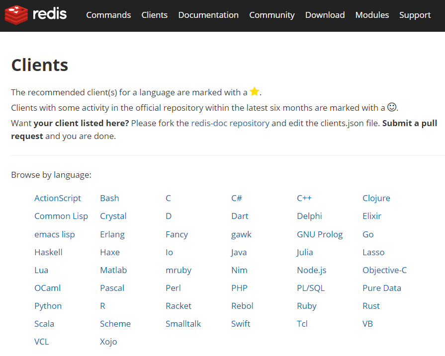
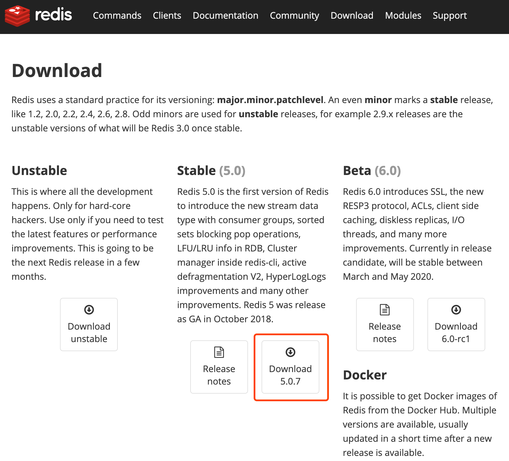
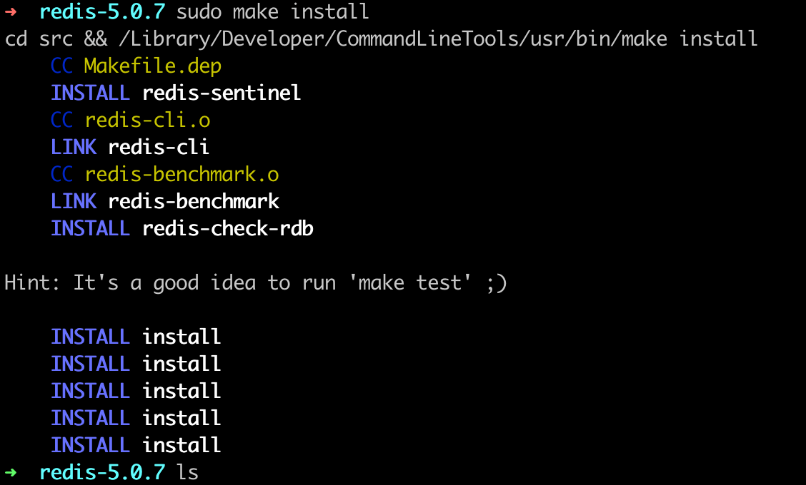
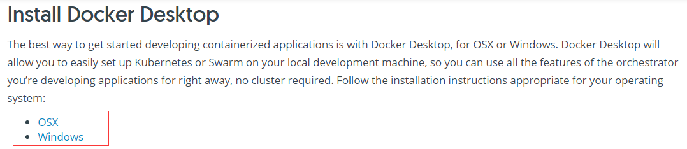
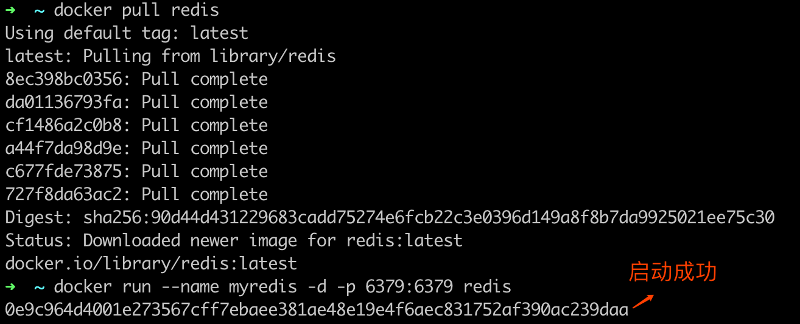
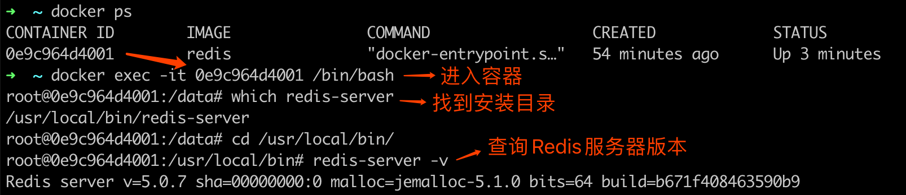
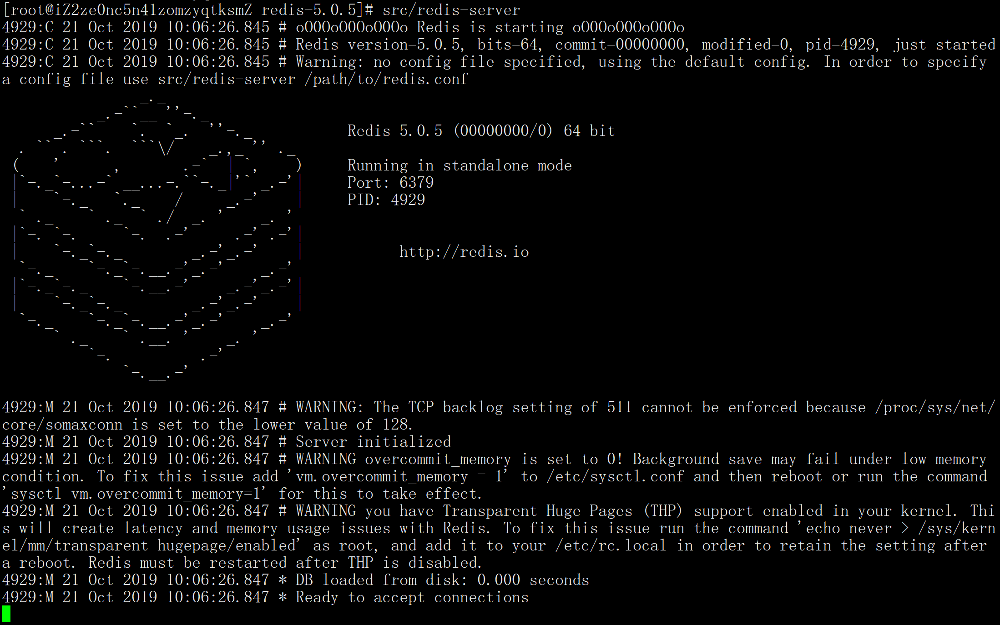
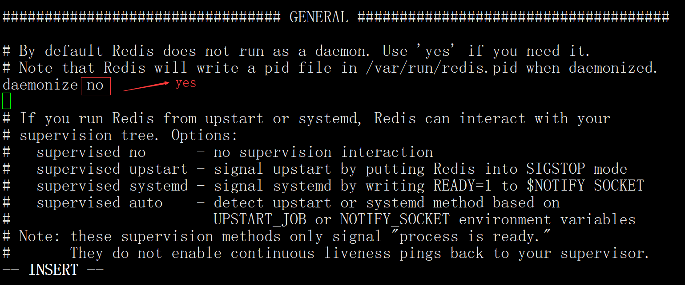
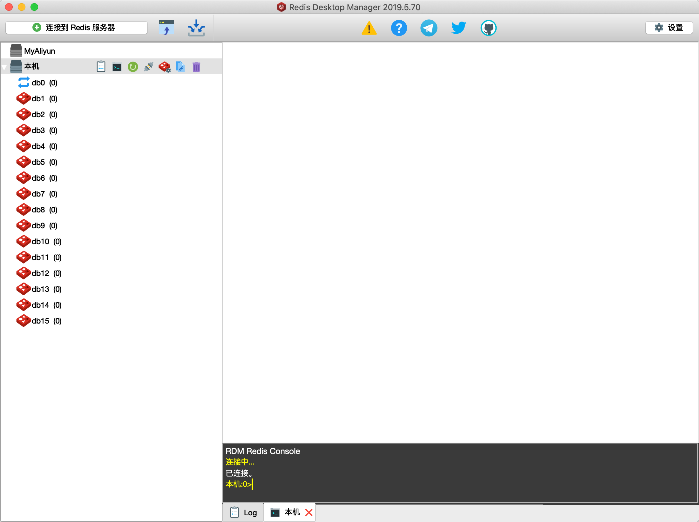
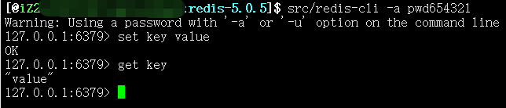

# 02 Redis 快速搭建与使用

Redis 是由 C 语言开发的开源高性能内存数据存储系统，经常被用作数据库、缓存以及消息中间件等。Redis 因其强大的功能和极简的设计，深受广大开发者和企业的喜爱，在内存数据库领域占据着主导地位。

## 1. Redis 核心特性

### 1.1 多种数据结构支持

Redis 支持丰富的内置数据结构，包括字符串（String）、哈希（Hash）、列表（List）、集合（Set）、有序集合（Sorted Set）、HyperLogLog、Geospatial（地理坐标）以及 Stream（流）。丰富的数据结构能够完美满足多样化的业务场景需求。

### 1.2 功能完善

除了基础数据读写外，Redis 还提供了消息队列、Key 自动过期删除、事务、数据持久化（RDB & AOF）、分布式锁、Pub/Sub 发布订阅、慢查询分析、Sentinel 高可用架构以及 Redis Cluster 分布式集群等全套功能。

### 1.3 极致的性能

作为一款基于内存运行的数据库，Redis 在性能方面拥有天然的优势（内存读写延迟远远低于磁盘）。此外，底层采用了高效的 C 语言数据结构与算法设计，最大限度提升了吞吐量。

### 1.4 广泛的语言生态

主流编程语言均有丰富的 Redis 客户端支持，客户端列表可在官网 [https://redis.io/clients](https://redis.io/clients) 查询：



几乎所有常见的编程语言都有成熟稳定的 Redis 客户端驱动。

### 1.5 极简的使用与运维

Redis 的 API 设计清晰易用，官方提供了详尽的开发文档。

### 1.6 高度活跃的社区

Redis 保持着极高的社区活跃度与频繁的迭代更新（GitHub 项目地址：[https://github.com/redis/redis](https://github.com/redis/redis)）。

### 1.7 I/O 多路复用模型

Redis 采用了高效的 **I/O 多路复用** 架构。“多路”指多个网络 Socket 连接，“复用”指复用同一个工作线程。通过事件驱动机制，单线程即可高效并发处理海量网络连接，消除了线程创建、销毁与上下文切换的开销。

---

## 2. Redis 发展历程

- **2009 年 5 月**：Salvatore Sanfilippo 发布 Redis 初始版本；
- **2012 年**：发布 Redis 2.6，重构核心代码，移除了早期不成熟的集群实现；
- **2013 年 11 月**：发布 Redis 2.8，完善了主从复制（Replication）与 Sentinel 高可用机制；
- **2015 年 4 月**：发布 Redis 3.0，正式推出官方分布式集群（Redis Cluster）；
- **2017 年 7 月**：发布 Redis 4.0，优化复制机制，引入混合持久化与模块化（Modules）扩展；
- **2018 年 10 月**：发布 Redis 5.0，引入 Stream 流式数据类型；
- **2020 年**：发布 Redis 6.0，引入多线程 I/O 读写与 ACL 权限控制体系。

---

## 3. Redis 安装实战

Redis 官方原生提供 Linux 与 macOS 平台的安装包。由于 Linux 是生产环境的主流部署平台，下面首先介绍源码安装与 Docker 安装。

### 3.1 源码编译安装（Linux / macOS）

#### 1. 下载源码包

访问 Redis 官网下载页面：[https://redis.io/download](https://redis.io/download)，选择需要安装的版本：



#### 2. 解压与编译

在终端中执行解压、切换目录与编译安装：

```shell
tar zxvf redis-5.0.7.tar.gz
cd redis-5.0.7
make
sudo make install
```

编译与安装完成输出：



无报错信息即代表编译成功。`make install` 默认会将可执行文件安装至 `/usr/local/bin` 路径下。

### 3.2 Docker 容器化安装

使用 Docker 可以快速部署标准化的 Redis 实例。对于非 Linux 平台，需先安装 Docker Desktop（下载地址：[https://docs.docker.com/get-started/](https://docs.docker.com/get-started/)）：



#### 1. 拉取 Redis 镜像

```shell
docker pull redis:5.0.7
```

#### 2. 运行 Redis 容器

```shell
docker run --name myredis -d -p 6379:6379 redis:5.0.7
```

参数解释：

- `--name myredis`：指定容器名称；
- `-d`：后台运行容器；
- `-p 6379:6379`：将宿主机的 6379 端口映射到容器的 6379 端口。

启动运行结果：



查询容器中 Redis 的版本信息：

```shell
docker exec -it myredis redis-server -v
```

截图示例如下：



#### 3. 命令行交互

使用 `docker exec` 直接调起容器内部的 `redis-cli` 工具：

```shell
docker exec -it myredis redis-cli
```

### 3.3 包管理器在线安装

- **macOS (Homebrew)**：`brew install redis`
- **Ubuntu / Debian**：`sudo apt-get install redis-server`
- **CentOS / RHEL**：`sudo yum install redis`

### 3.4 Windows 环境安装方案

官方并未原生支持 Windows 平台。对于 Windows 开发者，推荐使用以下方案：

1. **Docker 方式**（推荐，与 Linux 体验一致）；
2. **WSL2 (Windows Subsystem for Linux)**：在 Win11/Win10 的 Linux 子系统中原生运行；
3. **第三方编译版本**：使用微软开源维护的 Win64 Redis 版本（如 [MicrosoftArchive/redis](https://github.com/MicrosoftArchive/redis/releases)），下载 `.msi` 或 `.zip` 解压安装。

---

## 4. Redis 可执行文件与基本使用

Redis 安装完成后，会在 `src/` 或 `/usr/local/bin` 目录下提供以下核心工具程序：

| 可执行文件 | 核心功能与作用描述 |
| --- | --- |
| **`redis-server`** | Redis 服务端启动程序 |
| **`redis-cli`** | Redis 命令行交互客户端 |
| **`redis-benchmark`** | Redis 性能基准测试工具 |
| **`redis-check-aof`** | AOF 持久化文件日志检查与修复工具 |
| **`redis-check-dump`** | RDB 快照持久化文件检查与修复工具 |
| **`redis-sentinel`** | Redis Sentinel 哨兵高可用集群启动程序 |

### 4.1 启动 Redis 服务

直接运行 `redis-server` 前台启动服务：

```shell
redis-server
```

启动控制台输出：



由于默认前台启动会随终端窗口关闭而终止，需编辑配置 `redis.conf`，将守护进程参数修改为后台模式：

```text
daemonize yes
```

配置修改如下：



指定配置文件启动后台服务：

```shell
redis-server /path/to/redis.conf
```

### 4.2 使用 GUI 可视化工具连接

可以通过 Redis Desktop Manager、Another Redis Desktop Manager 或 TablePlus 等图形化客户端连接 Redis：



> **切换数据库说明**：
>
> Redis 默认开启 16 个逻辑数据库索引（`db0` ~ `db15`）。不同于关系型数据库，Redis 的连接串是统一的。在 CLI 或 GUI 中通过 `SELECT n` 命令切换数据库：
>
> ```text
> 127.0.0.1:6379> SELECT 1
> OK
> 127.0.0.1:6379[1]>
> ```
>
> 注意：`FLUSHALL` 命令会清空所有数据库中的全部 key。

### 4.3 使用 `redis-cli` 命令行工具

通过 `redis-cli` 连接本地服务：

```shell
redis-cli
```

交互式控制台示范：



---

## 5. 小结

本课时介绍了 Redis 的核心特性与演进历史，以及在 Linux、macOS 和 Windows 系统下的多种安装方式（源码编译、Docker 容器化、在线安装）。掌握了 `redis-server` 的后台启动配置及 `redis-cli` 命令行工具的基本使用，为后续深入研究 Redis 核心数据类型打下了坚实基础。
