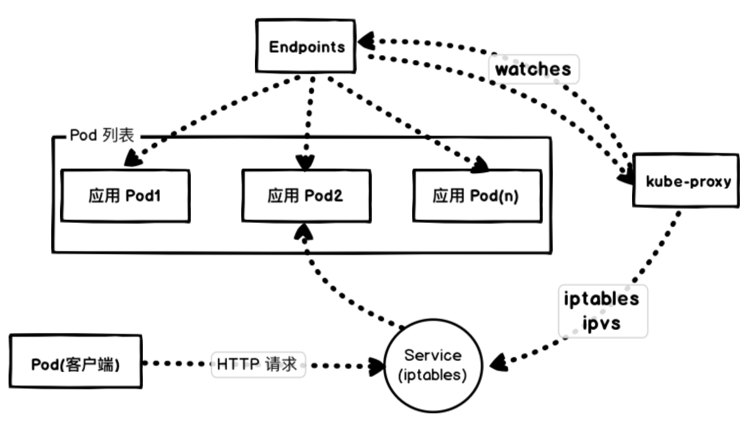

# 04 微服务应用场景下落地 K8s 的困难分析

近些年企业应用开发架构发生了深刻的变化。根据康威定律，由于企业组织架构的变化，导致微服务应用体系在企业开发中迅速流行开来，成为数字化转型技术选型中的核心方案之一。

在这个背景下，DevOps 团队迫切需要使用一套统一的基础设施来维护微服务应用的全生命周期，这就带来了新的挑战 —— **如何在微服务应用场景下平稳、快速地落地 Kubernetes 集群系统**。

---

## 一、基于 Kubernetes 的微服务注册中心部署难题

经典微服务体系通常以注册中心（如 Eureka、Nacos、Consul 等）为核心，通过 C/S 模式让客户端向注册中心注册，实现服务发现与调用。

引入 Kubernetes 后，K8s 提供了基于 CoreDNS 的域名服务发现及容器 Pod 级别的虚拟网络网格，直接打破了传统物理网络架构，导致经典网络中的微服务与 K8s 集群中的微服务难以直接互联互通。为了破解这一困局，技术团队通常采取以下两种探索方案：

### 方案 A：创建大二层网络，让 Pod 与物理网络互联互通

该思路的核心是不改变现有经典网络架构，强制让 K8s 的网络适应经典物理网络。为每一个 Pod 分配可路由的公网/内网 IP（常用技术如 Macvlan、Calico BGP、Contiv 等）。

这种做法违背了 Kubernetes 的云原生设计哲学，把 K8s 退化为了单纯运行容器的资源池，导致 Service、Ingress、CoreDNS 等云原生核心特性无法配合使用，增加了网络维护成本。

### 方案 B：注册中心部署于 K8s 集群内，集群外服务采用 NodePort 直连注册

这是目前较为流行且兼顾遗留系统的过渡方案。利用 StatefulSet 与 Headless Service 搭建 AP 型注册中心集群。

1. **集群内部微服务**：直接通过 Headless 域名通信：

   ```yaml
   eureka:
     client:
       serviceUrl:
         defaultZone: http://eureka-0.eureka.default.svc.cluster.local:8761/eureka,http://eureka-1.eureka.default.svc.cluster.local:8761/eureka,http://eureka-2.eureka.default.svc.cluster.local:8761/eureka
   ```

2. **集群外部遗留微服务**：通过映射出来的 `NodeIP:NodePort` 地址通信：

   ```yaml
   eureka:
     client:
       serviceUrl:
         defaultZone: http://<node-ip>:30030/eureka
   ```

### 破解之道：单元化与服务网格架构

Kubernetes 设计初衷是作为现代数据中心的基础设施，并未原生设计兼容传统网络的过渡逻辑。因此在混合迁移阶段，更科学的方案是：**以 API 网关为边界划定应用单元**，将整套微服务单元整体上架至 K8s。K8s 集群内部遵循云原生 DNS 发现，对集群外部的服务则采用异构的 RPC/HTTP API 接口进行调用，从而规避破坏 Kubernetes 云原生网络架构。

---

## 二、微服务核心能力的优化设计

经典微服务架构依靠 Spring Cloud Feign、Dubbo RPC、gRPC 等框架及注册中心实现服务发现。然而在 K8s 中，通过内置的 CoreDNS 和 Service 机制，同 Namespace 下的服务直接通过 Service 域名即可完成服务发现。换言之，将微服务全面迁移至 K8s 后，原有的 Eureka 等传统注册中心在很大程度上变为了冗余组件。

在云原生架构演进中，我们完全可以基于 K8s 原生能力构建微服务：

1. **下沉通用能力（Sidecar 模型）**：将限流、熔断、mTLS 安全加密、灰度发布等通用控制面能力沉淀到独立的 Sidecar Proxy（服务网格模式，如 Istio），让业务开发者聚焦于纯粹的业务逻辑；
2. **可观测性体系建构**：依托 K8s 基础设施生态，采用 ELK/EFK 收集业务日志，结合 Prometheus 与 Grafana 构建指标监控与大屏可视化，形成完整的服务治理闭环。

---

## 三、微服务应用部署策略痛点与实战

### 1. StatefulSet 的合理运用

许多团队部署微服务时盲目选用 `Deployment`，而忽视了 `StatefulSet` 的优势。StatefulSet 不仅适用于有状态挂盘应用，更通过固定编号和有序控制，为分布式微服务提供了极其平滑的按序号滚动升级能力。



### 2. 避免单点故障的反亲和性配置

微服务部署在 K8s 上并不天然意味着高可用，必须显式配置 Pod 间反亲和性（Pod Anti-Affinity），防止微服务的多个副本落到同一个物理节点上：

```yaml
affinity:
  podAntiAffinity:
    preferredDuringSchedulingIgnoredDuringExecution:
    - weight: 100
      podAffinityTerm:
        labelSelector:
          matchExpressions:
          - key: k8s-app
            operator: In
            values:
            - kube-dns
        topologyKey: kubernetes.io/hostname
```

### 3. 就绪探测与优雅下线

微服务滚动更新时，端点的摘除与路由生效存在短暂延迟。必须配置 `readinessProbe` 与 `preStop` hook 以实现零中断平滑发布：

```yaml
apiVersion: apps/v1
kind: Deployment
metadata:
  name: nginx-microservice
spec:
  replicas: 2
  selector:
    matchLabels:
      component: nginx
  template:
    metadata:
      labels:
        component: nginx
    spec:
      containers:
      - name: nginx
        image: "nginx:latest"
        ports:
        - name: http
          containerPort: 80
        readinessProbe:
          httpGet:
            path: /healthz
            port: 80
            httpHeaders:
            - name: X-Custom-Header
              value: Awesome
          initialDelaySeconds: 15
          timeoutSeconds: 1
        lifecycle:
          preStop:
            exec:
              command: ["/bin/bash", "-c", "sleep 30"]
```

### 4. PodDisruptionBudget (PDB) 运维保护

随着微服务数量剧增，在节点维护、驱逐或集群升级时，可以通过配置 `PodDisruptionBudget` 限制最小可用副本数，防止运维操作引发业务中断：

```yaml
apiVersion: policy/v1beta1
kind: PodDisruptionBudget
metadata:
  name: zk-pdb
spec:
  minAvailable: 2
  selector:
    matchLabels:
      app: zookeeper
```

---

## 总结

Kubernetes 中的 `Service` 对象与传统微服务架构中的“微服务”概念并不能简单地等同。在落地过程中，不应死板地生搬硬套原有架构，而是应当深度统筹微服务治理与 Kubernetes 原生特性。在 CI/CD 与发布流程中充分利用 Pod 亲和性、就绪检查、优雅下线及 PDB 等最佳实践，才能摆脱历史包袱，最大化发挥云原生的架构价值。
