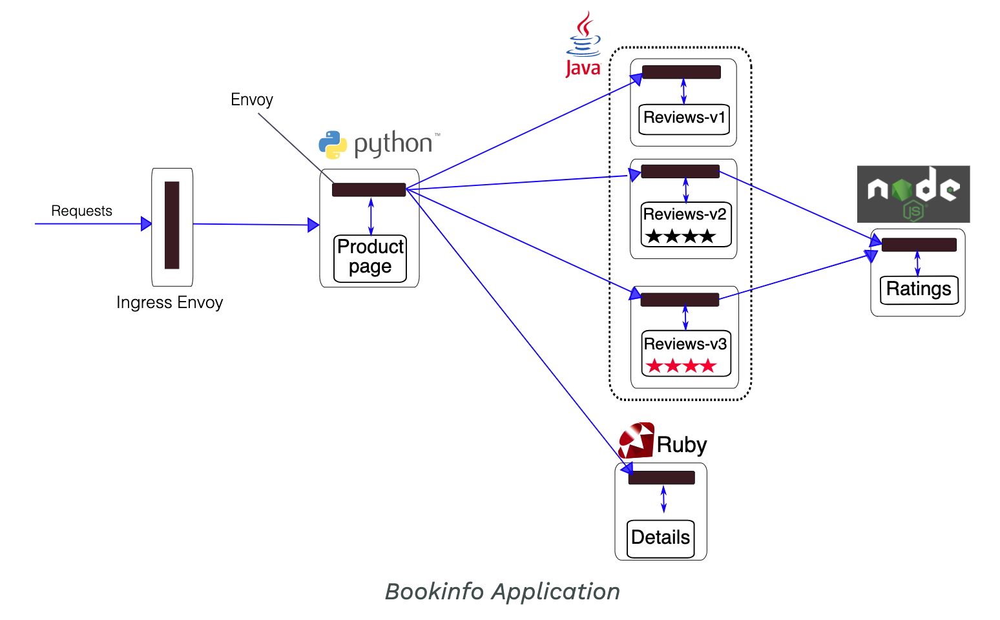
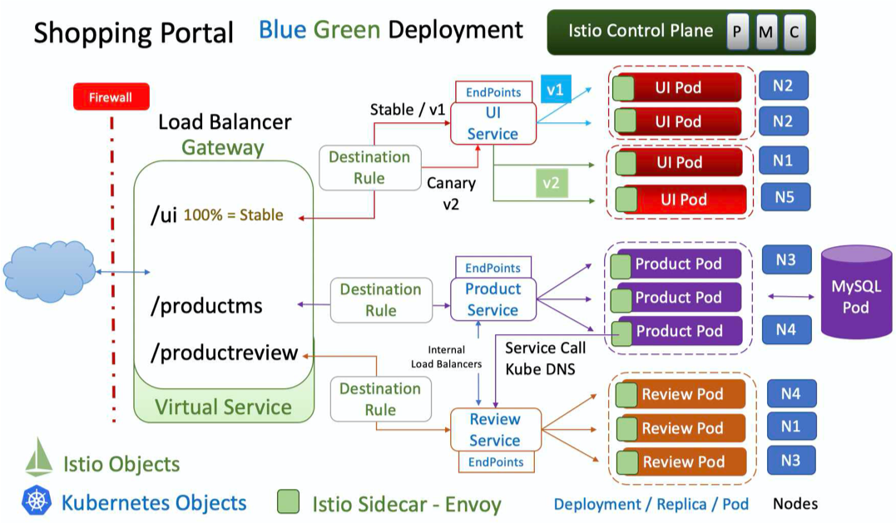
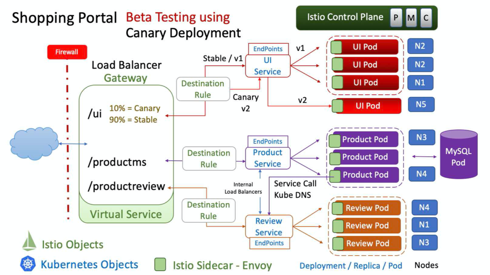
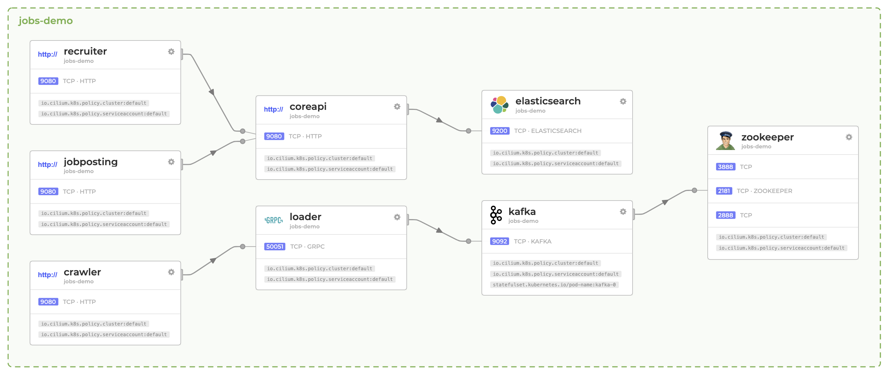
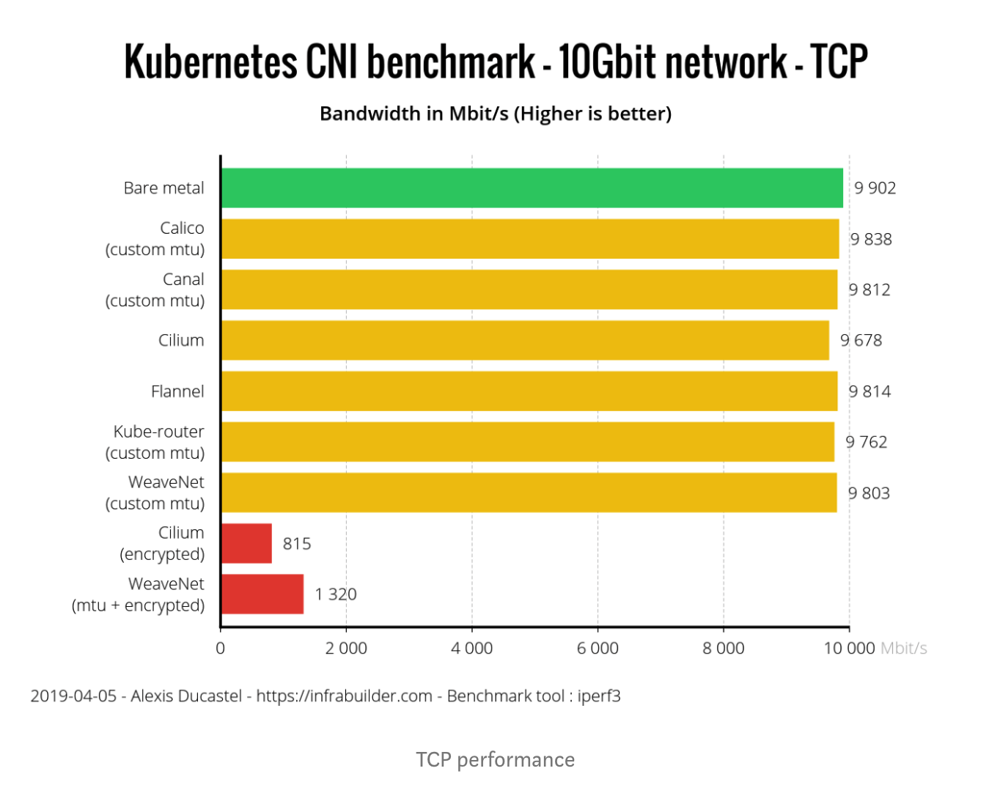

# 06 练习篇：K8s 核心实践知识掌握

经过前面章节的介绍，我们把 Kubernetes 的核心组件、应用编排落地、DevOps 场景以及微服务场景下的实践等核心知识点讲解了一遍。

许多读者在搭建高可用 Kubernetes 集群初期经常碰壁，陷入死磕底层的误区。其实在 CKA（Certificated Kubernetes Administrator）认证考察与企业生产落地中，重点是使用 `kubectl` 命令行工具高效解决业务编排与运维需求，而非沉溺于繁琐的底层自建。把 80% 的精力放在日常使用与实战演练上，才能更快地为企业产出价值。

本文通过 5 个典型的实践场景，带你巩固 K8s 核心技能。

---

## 练习 1：使用命令行运行 Pod 容器

使用 `kubectl` 命令创建并运行 Pod 实例：

```shell
$ kubectl run --image=nginx nginx-app
deployment.apps/nginx-app created
```

查看 Pod 状态与分布 Node 信息：

```shell
$ kubectl get po -o wide
NAME                        READY   STATUS    RESTARTS   AGE     IP            NODE                                                 NOMINATED NODE   READINESS GATES
nginx-app-d65f68dd5-rv4wz   1/1     Running   0          3m41s   10.4.47.234   gke-us-central1-cloud-okteto-com-pro-a09dced8-jxp8   <none>           <none>
```

使用 `kubectl describe` 查看 Pod 详细事件日志（Events 是排查 Pod 启动异常的关键）：

```shell
$ kubectl describe po nginx-app-d65f68dd5-rv4wz
Name:               nginx-app-d65f68dd5-rv4wz
Namespace:          default
Node:               gke-us-central1-cloud-okteto-com-pro-a09dced8-jxp8/10.128.0.133
Start Time:         Sat, 02 May 2020 13:28:15 +0800
Status:             Running
IP:                 10.4.47.234
Events:
  Type    Reason     Age    From                                                         Message
  ----    ------     ----   ----                                                         -------
  Normal  Scheduled  5m19s  default-scheduler                                            Successfully assigned default/nginx-app-d65f68dd5-rv4wz
  Normal  Pulling    5m17s  kubelet, gke-us-central1-cloud-okteto-com-pro-a09dced8-jxp8  Pulling image "nginx"
  Normal  Pulled     5m17s  kubelet, gke-us-central1-cloud-okteto-com-pro-a09dced8-jxp8  Successfully pulled image "nginx"
  Normal  Created    5m17s  kubelet, gke-us-central1-cloud-okteto-com-pro-a09dced8-jxp8  Created container nginx-app
  Normal  Started    5m16s  kubelet, gke-us-central1-cloud-okteto-com-pro-a09dced8-jxp8  Started container nginx-app
```

> **实战建议**：建议把官方 [Kubectl Cheat Sheet](https://kubernetes.io/docs/reference/kubectl/cheatsheet/) 收藏并熟练掌握常用简写指令。

---

## 练习 2：多租户账号与权限资源隔离

默认的 `kubeconfig` 使用超级管理员权限的证书账号，直接共享给团队存在巨大的安全隐患。我们需要给成员分配独立权限与 Namespace 资源隔离。

典型的 `kubeconfig` 配置文件结构如下：

```yaml
apiVersion: v1
kind: Config
preferences: {}
clusters:
- cluster:
    name: development
- cluster:
    name: production
users:
- name: developer
- name: experimenter
contexts:
- context:
    cluster: development
    user: developer
  name: dev-context
```

设置与清除用户的凭据命令：

```shell
# 设置用户凭据
kubectl config --kubeconfig=config-demo set-credentials developer --client-certificate=fake-cert-file --client-key=fake-key-seefile

# 清除指定用户
kubectl --kubeconfig=config-demo config unset users.developer
```

因为手动配置原生 RBAC 较为繁琐，推荐使用 **Kiosk 多租户管理套件**：

```shell
# 使用 Helm 安装 Kiosk
kubectl create namespace kiosk
helm install kiosk --repo https://charts.devspace.sh/ kiosk --namespace kiosk --atomic

# 确认 Kiosk 运行
kubectl get pod -n kiosk

# 应用用户权限策略
kubectl apply -f https://raw.githubusercontent.com/kiosk-sh/kiosk/master/examples/account.yaml
```

结合 Service Account 生成 Token 并构建租户配置：

```shell
USER_NAME="john"
kubectl -n kiosk create serviceaccount $USER_NAME

# 为 john 生成限定权限的 kubeconfig
KUBECONFIG_PATH="$HOME/.kube/config-kiosk"
kubectl config view --minify --raw > $KUBECONFIG_PATH
export KUBECONFIG=$KUBECONFIG_PATH

CLUSTER_NAME=$(kubectl config view -o jsonpath="{.clusters[].name}")
SA_NAME=$(kubectl -n kiosk get serviceaccount $USER_NAME -o jsonpath="{.secrets[0].name}")
SA_TOKEN=$(kubectl -n kiosk get secret $SA_NAME -o jsonpath="{.data.token}" | base64 -d)

kubectl config set-credentials $USER_NAME --token=$SA_TOKEN
kubectl config set-context kiosk-user --cluster=$CLUSTER_NAME --user=$USER_NAME
kubectl config use-context kiosk-user
```

---

## 练习 3：基于编排策略实现灰度、蓝绿发布

在 Kubernetes 中，七层 Ingress 控制器（如 Nginx Ingress Controller）支持基于 Header 和 Weight 的流量切分与灰度发布（Canary）：

```text
nginx.ingress.kubernetes.io/canary: "true"
nginx.ingress.kubernetes.io/canary-by-header: "new-feature"
nginx.ingress.kubernetes.io/canary-by-header-value: "always"
nginx.ingress.kubernetes.io/canary-weight: "20"
```

灰度发布 Canary Ingress 配置示例：

```yaml
apiVersion: extensions/v1beta1
kind: Ingress
metadata:
  name: demo-canary-ingress
  namespace: demo-canary
  annotations:
    nginx.ingress.kubernetes.io/canary: "true"
    nginx.ingress.kubernetes.io/canary-by-header: "X-Canary-Test"
    nginx.ingress.kubernetes.io/canary-by-header-value: "true"
spec:
  rules:
  - host: canary.example.com
    http:
      paths:
      - path: /
        backend:
          serviceName: demo-canary-service
          servicePort: 80
```

更高级且弹性的微服务灰度流量管理方案是结合 **Service Mesh 服务网格（如 Istio）**。

Istio Bookinfo 部署示例架构：



Istio 蓝绿发布控制 Header 路由：



Istio 动态修改 Header 比例实现灰度发布：



> **实战建议**：借助于 Service Mesh，除了流量切分外，还能无缝实现熔断、限流、黑白名单等高级治理能力。

---

## 练习 4：网络方案选择与流量可视化

网络插件的性能损耗在现代 CNI 中已不再是瓶颈。利用 Kernel 4.9+ 的 **eBPF（Extended Berkeley Packet Filter）** 特性，可以在内核层高效转发数据包并提供强大的网络可观测性。

借助基于 eBPF 的 Hubble/Cilium 项目，可以直观可视化容器间网络调用：



主流 CNI 网络插件性能对比（Calico vs Cilium）：



> **实战建议**：CNI 网络方案推荐选用具备 eBPF 能力的新一代方案（如 **Cilium**），不仅提供高性能连通性，还具备原生流量可视化及替代 Kube-proxy 的能力。

---

## 练习 5：善用官方社区资源与技术蓝图

Kubernetes 保持着高效的迭代频率。面对复杂的云原生生态体系，建议直接查阅：

1. **官方权威文档**：[Kubernetes Docs](https://kubernetes.io/docs)
2. **CNCF 云原生全景蓝图**：[CNCF Landscape](https://landscape.cncf.io/)

---

## 总结

掌握 Kubernetes 技术的最佳途径是在本地进行场景演练。从企业自身的真实业务与网络现状出发，切忌盲目照搬大厂经验，循序渐进地完成云原生架构转换。
