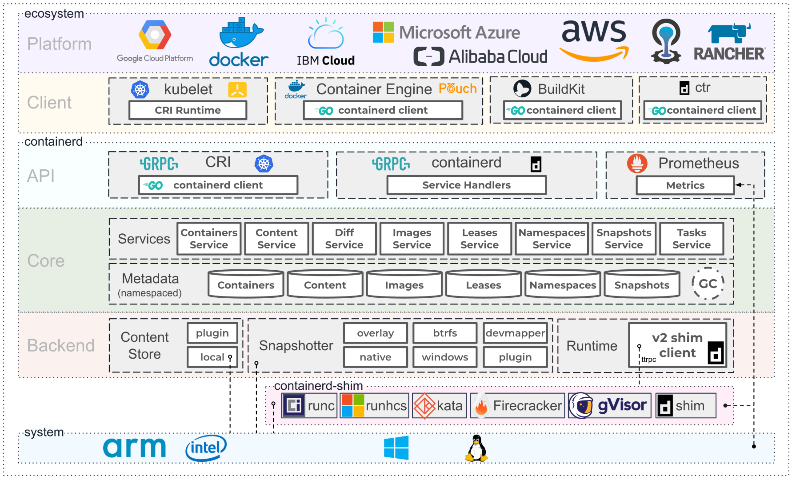

# 07 容器引擎 containerd 落地实践

Docker 公司在 2013 年发布容器引擎 Docker 后，持续改进其功能。随着容器标准逐步建立，Docker 引擎架构也从单体架构演进为微服务架构，并将 containerd 拆分为独立的容器运行时组件。它在整个容器技术架构中的位置如下：



图 6-1：containerd 架构图，图片来源于 [containerd 官方网站](https://containerd.io/)。

## containerd 使用初体验

从官方仓库下载 containerd 的可执行文件。由于 containerd 依赖 runc，因此需要一并下载并安装：

```shell
# 下载 containerd 二进制文件
wget -q --show-progress --https-only --timestamping \
  https://github.com/opencontainers/runc/releases/download/v1.0.0-rc10/runc.amd64 \
  https://github.com/containerd/containerd/releases/download/v1.3.4/containerd-1.3.4.linux-amd64.tar.gz \
  https://github.com/kubernetes-sigs/cri-tools/releases/download/v1.18.0/crictl-v1.18.0-linux-amd64.tar.gz
sudo mv runc.amd64 runc
# 安装二进制文件
tar -xvf crictl-v1.18.0-linux-amd64.tar.gz
chmod +x crictl runc
sudo cp crictl runc /usr/local/bin/
mkdir containerd
tar -xvf containerd-1.3.4.linux-amd64.tar.gz -C containerd
sudo cp containerd/bin/* /bin/
```

containerd 提供了默认的配置文件 `config.toml`，默认放在 `/etc/containerd/config.toml`：

```toml
[plugins]
  [plugins.cri.containerd]
    snapshotter = "overlayfs"
    [plugins.cri.containerd.default_runtime]
      runtime_type = "io.containerd.runtime.v1.linux"
      runtime_engine = "/usr/local/bin/runc"
      runtime_root = ""
```

containerd 通常以后台守护进程方式运行。Linux 系统可以通过 systemd 管理该服务：

```shell
# 配置 containerd.service
sudo cat <<EOF | sudo tee /etc/systemd/system/containerd.service
[Unit]
Description=containerd container runtime
Documentation=https://containerd.io
After=network.target
[Service]
ExecStartPre=/sbin/modprobe overlay
ExecStart=/bin/containerd
Restart=always
RestartSec=5
Delegate=yes
KillMode=process
OOMScoreAdjust=-999
LimitNOFILE=1048576
LimitNPROC=infinity
LimitCORE=infinity
[Install]
WantedBy=multi-user.target
EOF
#启动
sudo systemctl daemon-reload
sudo systemctl enable containerd
sudo systemctl start containerd
#配置 crictl 客户端
sudo crictl config runtime-endpoint unix:///var/run/containerd/containerd.sock
```

至此，containerd 的基础安装、服务启动和客户端配置就完成了。

## 通过客户端深入了解 containerd

containerd 启动后，可以使用客户端命令行工具查看和管理容器。常用工具有两个：

- `crictl`：Kubernetes 社区提供的 CRI 客户端，适合日常管理容器；
- `ctr`：containerd 自带的调试和管理客户端，主要用于测试和排障，不保证命令在不同版本间保持兼容。

ctr 工具运行如下：

```shell
   ctr - 
        __
  _____/ /______
 / ___/ __/ ___/
/ /__/ /_/ /
___/__/_/
containerd CLI
USAGE:
   ctr [global options] command [command options] [arguments...]
VERSION:
   v1.3.4
DESCRIPTION:
ctr is an unsupported debug and administrative client for interacting
with the containerd daemon. Because it is unsupported, the commands,
options, and operations are not guaranteed to be backward compatible or
stable from release to release of the containerd project.
COMMANDS:
   plugins, plugin            provides information about containerd plugins
   version                    print the client and server versions
   containers, c, container   manage containers
   content                    manage content
   events, event              display containerd events
   images, image, i           manage images
   leases                     manage leases
   namespaces, namespace, ns  manage namespaces
   pprof                      provide golang pprof outputs for containerd
   run                        run a container
   snapshots, snapshot        manage snapshots
   tasks, t, task             manage tasks
   install                    install a new package
   shim                       interact with a shim directly
   help, h                    Shows a list of commands or help for one command
GLOBAL OPTIONS:
   --debug                      enable debug output in logs
   --address value, -a value    address for containerd's GRPC server (default: "/run/contai
nerd/containerd.sock")
   --timeout value              total timeout for ctr commands (default: 0s)
   --connect-timeout value      timeout for connecting to containerd (default: 0s)
   --namespace value, -n value  namespace to use with commands (default: "default") [$CONTA
INERD_NAMESPACE]
   --help, -h                   show help
   --version, -v                print the version
```

crictl 运行命令如下：

```plaintext
NAME:
   crictl - client for CRI
USAGE:
   crictl [global options] command [command options] [arguments...]
VERSION:
   v1.18.0
COMMANDS:
   attach              Attach to a running container
   create              Create a new container
   exec                Run a command in a running container
   version             Display runtime version information
   images, image, img  List images
   inspect             Display the status of one or more containers
   inspecti            Return the status of one or more images
   imagefsinfo         Return image filesystem info
   inspectp            Display the status of one or more pods
   logs                Fetch the logs of a container
   port-forward        Forward local port to a pod
   ps                  List containers
   pull                Pull an image from a registry
   run                 Run a new container inside a sandbox
   runp                Run a new pod
   rm                  Remove one or more containers
   rmi                 Remove one or more images
   rmp                 Remove one or more pods
   pods                List pods
   start               Start one or more created containers
   info                Display information of the container runtime
   stop                Stop one or more running containers
   stopp               Stop one or more running pods
   update              Update one or more running containers
   config              Get and set crictl options
   inspecti            Return the status of one or more images
   imagefsinfo         Return image filesystem info
   inspectp            Display the status of one or more pods
   logs                Fetch the logs of a container
   port-forward        Forward local port to a pod
   ps                  List containers
   pull                Pull an image from a registry
   run                 Run a new container inside a sandbox
   runp                Run a new pod
   rm                  Remove one or more containers
   rmi                 Remove one or more images
   rmp                 Remove one or more pods
   pods                List pods
   start               Start one or more created containers
   info                Display information of the container runtime
   stop                Stop one or more running containers
   stopp               Stop one or more running pods
   update              Update one or more running containers
   config              Get and set crictl options
   stats               List container(s) resource usage statistics
   completion          Output shell completion code
   help, h             Shows a list of commands or help for one command
GLOBAL OPTIONS:
   --config value, -c value            Location of the client config file. If not specified
 and the default does not exist, the program's directory is searched as well (default: "/et
c/crictl.yaml") [$CRI_CONFIG_FILE]
   --debug, -D                         Enable debug mode (default: false)
   --image-endpoint value, -i value    Endpoint of CRI image manager service [$IMAGE_SERVIC
E_ENDPOINT]
   --runtime-endpoint value, -r value  Endpoint of CRI container runtime service (default: 
"unix:///var/run/dockershim.sock") [$CONTAINER_RUNTIME_ENDPOINT]
   --timeout value, -t value           Timeout of connecting to the server (default: 2s)
   --help, -h                          show help (default: false)
   --version, -v                       print the version (default: false)
```

从功能对比来看，`crictl` 比 `ctr` 更适合日常使用。下面将 `crictl` 与 Docker 命令进行对照：

### 镜像相关命令

| 操作 | Docker | containerd / crictl |
| --- | --- | --- |
| 显示本地镜像列表 | `docker images` | `crictl images` |
| 下载镜像 | `docker pull` | `crictl pull` |
| 上传镜像 | `docker push` | 不支持，需直接与镜像仓库交互 |
| 删除本地镜像 | `docker rmi` | `crictl rmi` |
| 查看镜像详情 | `docker inspect IMAGE-ID` | `crictl inspecti IMAGE-ID` |

> 注意：上传镜像功能属于和镜像仓库服务的交互，crictl 没有提供此功能可以减轻不少代码逻辑负担。

### 容器相关命令

| 操作 | Docker | containerd / crictl |
| --- | --- | --- |
| 显示容器列表 | `docker ps` | `crictl ps` |
| 创建容器 | `docker create` | `crictl create` |
| 启动容器 | `docker start` | `crictl start` |
| 停止容器 | `docker stop` | `crictl stop` |
| 删除容器 | `docker rm` | `crictl rm` |
| 查看容器详情 | `docker inspect` | `crictl inspect` |
| 附加到容器 | `docker attach` | `crictl attach` |
| 执行命令 | `docker exec` | `crictl exec` |
| 查看日志 | `docker logs` | `crictl logs` |
| 查看资源使用情况 | `docker stats` | `crictl stats` |

从以上清单可以看出，containerd 与 Docker 的基础容器管理能力相近。在生产环境使用 containerd，可以减少对 Docker daemon 的依赖。

Docker 作为 K8s 容器运行时，调用关系如下：

```text
kubelet --> docker shim （在 kubelet 进程中） --> dockerd --> containerd
```

containerd 作为 K8s 容器运行时，调用关系如下：

```text
kubelet --> cri plugin（在 containerd 进程中） --> containerd
```

`dockerd` 是 Docker 原生容器引擎提供的代理服务，内置 Swarm、镜像构建、镜像推送和 Docker API 等扩展功能。在以 Kubernetes 为主的生产环境中，这些功能可以由独立组件承担。

## Docker 与 containerd 的日志、网络配置

### 容器日志对比

| 对比项 | Docker | containerd |
| --- | --- | --- |
| 日志落盘 | Docker 将日志保存到类似 `/var/lib/docker/containers/$CONTAINER_ID` 的目录，Kubelet 再在 `/var/log/pods` 和 `/var/log/containers` 下创建软链接。 | Kubelet 负责将日志保存到 `/var/log/pods/$CONTAINER_NAME`，并在 `/var/log/containers` 下创建软链接。 |

### CNI 网络对比

| 对比项 | Docker | containerd |
| --- | --- | --- |
| 谁负责调用 CNI | Kubelet 内部的 docker-shim | containerd 内置的 CRI plugin（containerd 1.1 及以后） |
| 如何配置 CNI | Kubelet 参数 `--cni-bin-dir` 和 `--cni-conf-dir` | containerd TOML 配置中的 `[plugins.cri.cni]`，例如 `bin_dir = "/opt/cni/bin"`、`conf_dir = "/etc/cni/net.d"` |

### 总结

containerd 是 Docker 容器落地实践过程中标准化的产物，经过了全球无数企业应用场景的锤炼。所以它的稳定性是值得开发者信赖的工具。虽然当前业界对 Docker 公司的产品采取回避策略，但是 containerd 是当前最佳的生产环境的容器引擎，值得继续关注场景的使用和支持。
