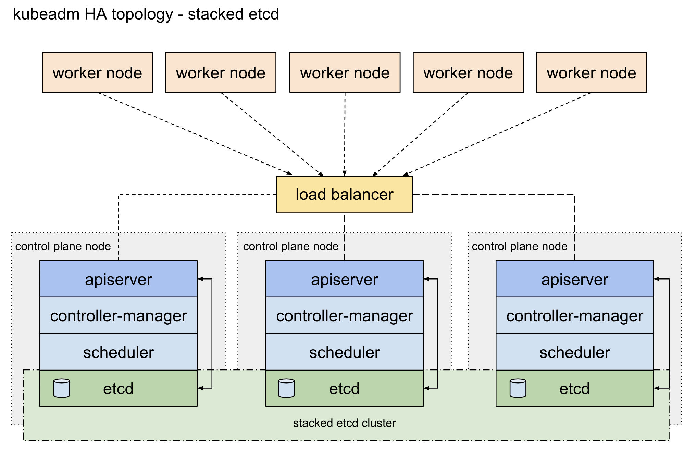
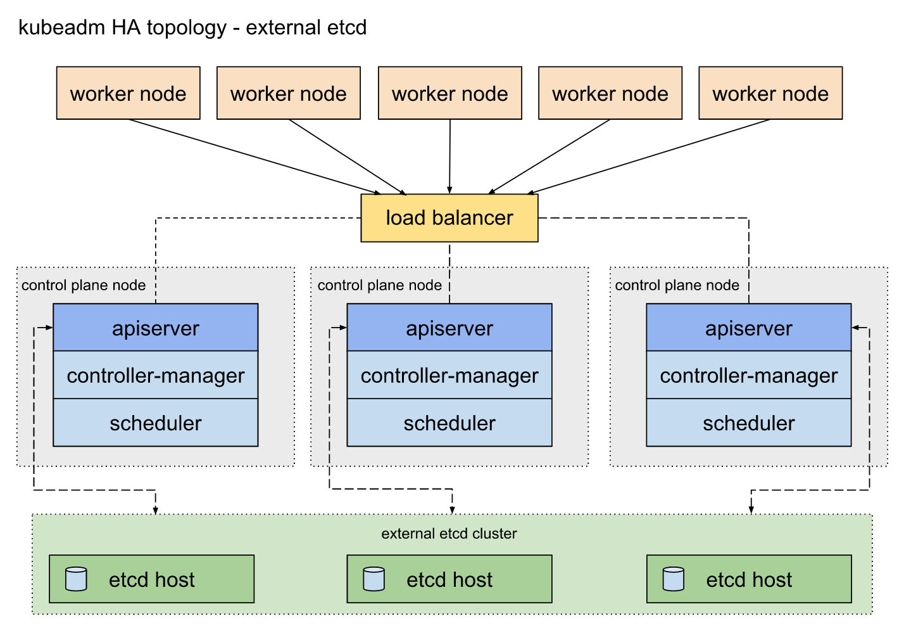
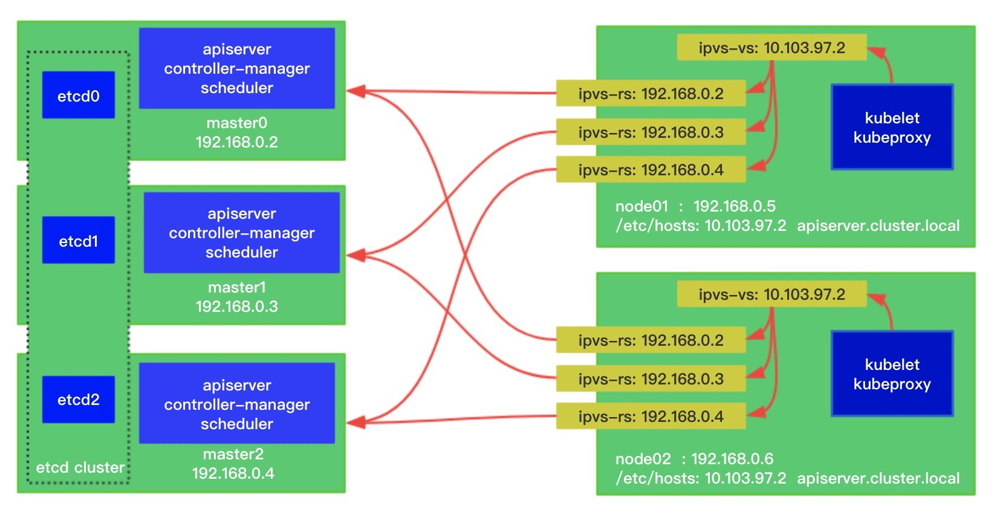

# 08 K8s 集群安装工具 kubeadm 的落地实践

kubeadm 是 Kubernetes 项目官方维护的支持一键部署安装 Kubernetes 集群的命令行工具。使用过它的读者肯定对它仅仅两步操作就能轻松组建集群的方式印象深刻：`kubeadm init` 以及 `kubeadm join` 这两个命令可以快速创建 Kubernetes 集群。当然这种便捷的操作并不能在生产环境中直接使用，我们要考虑组件的高可用布局，并且还需要考虑可持续的维护性。这些更实际的业务需求迫切需要我们重新梳理一下 kubeadm 在业界的使用情况，通过借鉴参考前人的成功经验可以帮助我们正确的使用好 kubeadm。

首先，经典的 Kubernetes 高可用集群的架构图在社区官方文档中定义如下：



从上图架构中可知，Kubernetes 集群的控制面使用 3 台节点把控制组件堆叠起来，形成冗余的高可用系统。其中 etcd 系统作为集群状态数据存储的中心，采用 Raft 一致性算法保证了业务数据读写的一致性。细心的读者肯定会发现，控制面节点中 apiserver 是和当前主机 etcd 组件进行交互的，这种堆叠方式相当于把流量进行了分流，在集群规模固定的情况下可以有效的保证组件的读写性能。

因为 etcd 键值集群存储着整个集群的状态数据，是非常关键的系统组件。官方还提供了外置型 etcd 集群的高可用部署架构：



kubeadm 同时支持以上两种技术架构的高可用部署，两种架构对比起来，最明显的区别在于外置型 etcd 集群模式需要的 etcd 数据面机器节点数量不需要和控制面机器节点数量一致，可以按照集群规模提供 3 个或者 5 个 etcd 节点来保证业务高可用能力。社区的开发兴趣小组 k8s-sig-cluster-lifecycle 还发布了 etcdadm 开源工具来自动化部署外置 etcd 集群。

## 安装前的基准检查工作

集群主机首要需要检查的就是硬件信息的唯一性，防止集群信息的冲突。确保每个节点上 MAC 地址和 product_uuid 的唯一性。检查办法如下：

- 您可以使用命令 `ip link` 或 `ifconfig -a` 来获取网络接口的 MAC 地址
- 可以使用 `sudo cat /sys/class/dmi/id/product_uuid` 命令对 product_uuid 校验

检查硬件信息的唯一性，主要是为了应对虚拟机模板创建后产生的虚拟机环境重复导致，通过检查就可以规避。

另外，我们还需要确保默认的网卡是可以联网的，毕竟 Kubernetes 组件通过默认路由进行组网。

还有一个问题是在主流 Linux 系统中 nftables 当前可以作为内核 iptables 子系统的替代品。导致 iptables 工具充当了一层兼容层，nftables 后端目前还无法和 kubeadm 兼容，nftables 会导致生成重复防火墙规则并破坏 kube-proxy 的工作。目前主流系统如 CentOS 可以通过如下配置解决：

```shell
update-alternatives --set iptables /usr/sbin/iptables-legacy
```

### 检查端口

#### 控制平面节点

| 协议 | 方向 | 端口范围 | 作用 | 使用者 |
| --- | --- | --- | --- | --- |
| TCP | 入站 | `6443*` | Kubernetes API 服务器 | 所有组件 |
| TCP | 入站 | `2379-2380` | etcd server client API | kube-apiserver、etcd |
| TCP | 入站 | `10250` | Kubelet API | kubelet 自身、控制平面组件 |
| TCP | 入站 | `10251` | kube-scheduler | kube-scheduler 自身 |
| TCP | 入站 | `10252` | kube-controller-manager | kube-controller-manager 自身 |

`*` 标记的端口号可以被覆盖，因此需要确保自定义端口已开放。

#### 工作节点

| 协议 | 方向 | 端口范围 | 作用 | 使用者 |
| --- | --- | --- | --- | --- |
| TCP | 入站 | `10250` | Kubelet API | kubelet 自身、控制平面组件 |
| TCP | 入站 | `30000-32767` | NodePort 服务 | 所有组件 |

NodePort 服务默认使用 `30000-32767` 端口范围。

注意在企业部署集群的时候，大部分情况会初始化一个小规模集群来开局，所以外部单独配置 etcd 集群的情况属于特例。把 etcd 集群堆叠部署在控制面节点上是小规模集群的首选方案。

另外，Pod 容器网络插件会启用一些自定义端口，需要参阅他们各自的文档对端口要求进行规划。

### 安装容器运行时引擎

kubelet 本身不负责实现容器运行时，因此每个集群节点都需要统一部署容器运行时引擎。从 v1.6.0 起，Kubernetes 默认支持 CRI（容器运行时接口）；从 v1.14.0 起，kubeadm 会通过已知的 UNIX 域套接字自动检测 Linux 节点上的容器运行时。

| 运行时 | UNIX 域套接字 |
| --- | --- |
| Docker | `/var/run/docker.sock` |
| containerd | `/run/containerd/containerd.sock` |
| CRI-O | `/var/run/crio/crio.sock` |

如果同时检测到 Docker 和 containerd，kubeadm 会优先选择 Docker。考虑到业界逐步从 Docker daemon 迁移到 containerd，生产环境需要提前规划容器运行时的升级路径。

### 安装 kubeadm、kubelet 和 kubectl

采用 kubeadm 安装集群时，kubeadm 不会替集群管理员管理 kubectl 的版本。需要确保 kubeadm、kubelet 和 kubectl 的版本兼容，避免版本偏差导致预料之外的错误。

官方推荐通过操作系统包管理器（如 yum）安装这些组件。但在网络受限的环境中可能遇到下载失败，因此建议提前准备对应的软件包；如果无法使用包管理器，也可以采用二进制文件部署。

在使用 RHEL/CentOS 等系统时，需要根据集群安全策略配置 SELinux。旧版安装流程通常会通过 `setenforce 0` 临时切换到 permissive 模式，并修改配置文件；生产环境应结合当前 Kubernetes 版本和安全要求决定是否采用该方式。

一些 RHEL/CentOS 7 用户曾遇到 iptables 被绕过、流量无法正确路由的问题。应确保 `sysctl` 配置中的 `net.bridge.bridge-nf-call-iptables` 设置为 1。

```shell
cat <<EOF >  /etc/sysctl.d/k8s.conf
net.bridge.bridge-nf-call-ip6tables = 1
net.bridge.bridge-nf-call-iptables = 1
EOF
sysctl --system
```

执行上述配置前，请先加载 `br_netfilter` 模块。可以使用 `lsmod | grep br_netfilter` 检查；如果未加载，则执行 `modprobe br_netfilter`。

另外，控制平面节点还需要关注 kubelet 与容器运行时的 cgroup 驱动。除了默认的 `cgroupfs`，也可以选择 `systemd`；在使用 systemd 的主流操作系统上，建议让 containerd 与 kubelet 使用一致的驱动。

### 使用 kubeadm 安装高可用集群

#### 为 kube-apiserver 创建负载均衡

工作节点和控制面节点通过 kube-apiserver 同步集群状态，因此需要通过反向代理将请求负载均衡到多个控制面节点。常见方案是使用 HAProxy 和 Keepalived；也可以利用 Linux 内核的 IPVS，通过动态维护 IPVS 规则实现 apiserver 负载均衡。具体配置如下图所示：



### 实践总结

Kubernetes 生态中有多种集群安装方案，环境差异也让工具选型变得复杂。kubeadm 适合标准化、可重复的集群初始化，但生产环境仍需额外规划高可用、容器运行时、网络插件、版本兼容和后续升级。只有把这些前置条件纳入自动化流程，才能降低集群长期运维成本。

参考文章：

- [Options for Highly Available topology](https://kubernetes.io/docs/setup/production-environment/tools/kubeadm/ha-topology/)
- [Creating Highly Available clusters with kubeadm](https://kubernetes.io/docs/setup/production-environment/tools/kubeadm/high-availability/)
- [安装 kubeadm](https://kubernetes.io/zh/docs/setup/production-environment/tools/kubeadm/install-kubeadm/)
