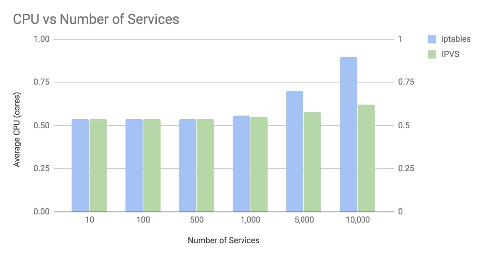
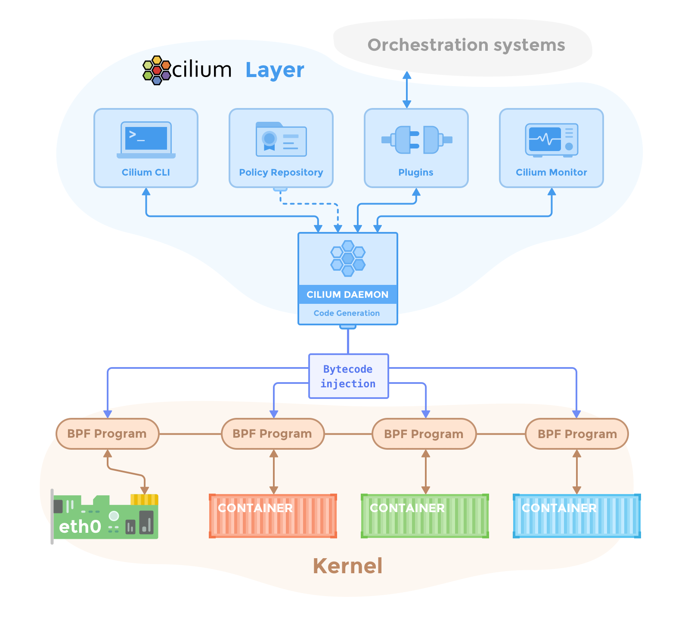

# 09 南北向流量组件 IPVS 的落地实践

我们知道 Kubernetes 工作节点的流量管理都是由 kube-proxy 来管理的。kube-proxy 利用了 iptables 的网络流量转换能力，在整个集群的数据层面创建了一层集群虚拟网络，也就是大家在 Service 对象中会看到的术语 ClusterIP，即集群网络 IP。既然 iptables 已经很完美的支持流量的负载均衡，并能实现南北向流量的反向代理功能，为什么我们还要让用户使用另外一个系统组件 IPVS 来代替它呢？

主要原因还是 iptables 能承载的 Service 对象规模有限，超过 1000 个以上就开始出现性能瓶颈了。目前 Kubernetes 默认推荐代理就是 IPVS 模式，这个推荐方案迫使我们需要开始了解 IPVS 的机制，熟悉它的应用范围和对比 iptables 的优缺点，让我们能有更多的精力放在应用开发上。

## 一次大规模的 Service 性能评测引入的 IPVS

iptables 一直是 Kubernetes 集群依赖的系统组件，它同时也是 Linux 内核中的网络过滤机制。日常实践中，我们通常不会明显感知到它的性能问题。KubeCon 2018 上，社区开发者提出了一个问题：

> 在超大规模如 10000 个 Service 的场景下，kube-proxy 的南北向流量转发性能还能保持高效吗？

通过测试数据发现，答案是否定的。在 Pod 实例规模达到上万个实例的时候，iptables 就开始对系统性能产生影响了。我们需要知道哪些原因导致 iptables 不能稳定工作。

首先，IPVS 模式和 iptables 模式都基于 Netfilter。生成负载均衡规则时，IPVS 通过哈希表转发流量，而 iptables 需要从上到下逐条匹配规则。随着规则规模扩大，iptables 的 CPU 消耗会增加，转发效率也会下降；IPVS 的哈希查表范围更小，因此在大规模 Service 场景下通常具有更好的转发性能。

其次，这里我们要清楚的是，iptables 毕竟是为防火墙模型配置的工具，和专业的负载均衡组件 IPVS 的实现目标不同，这里并不能说 IPVS 就比 iptables 优秀，因为 IPVS 模式启用之后，仅仅只是取代南北向流量的转发，东西向流量的 NAT 转换仍然需要 iptables 来支撑。为了让大家对它们性能对比的影响有一个比较充分的理解，可以看下图：



从图中可以看到，当 Service 对象实例超过 1000 的时候，iptables 和 IPVS 对 CPU 的影响才会产生差异，规模越大影响也越明显。很明显这是因为它们的转发规则的查询方式不同导致了性能的差异。

除了规则匹配的检索优势，IPVS 相比 iptables 还提供了更灵活的负载均衡算法：

| 调度器 | 含义 |
| --- | --- |
| `rr` | 轮询调度 |
| `lc` | 最小连接数 |
| `dh` | 目标地址散列 |
| `sh` | 源地址散列 |
| `sed` | 最短期望延迟 |
| `nq` | 最少队列 |

而在 iptables 中我们默认只有轮询调度特性。

IPVS（IP Virtual Server）是构建在 Linux Netfilter 模块之上的内核级负载均衡组件，负责南北向流量的四层转发。它将 Service 的虚拟 IP 绑定到后端 Pod IP 集合，实现流量分发，因此符合 Kubernetes 对 Service 的实现模型。

### IPVS 使用简介

安装 ipvsadm，这是 LVS 的管理工具：

```shell
sudo apt-get install -y ipvsadm
```

创建虚拟服务：

```shell
sudo ipvsadm -A -t 100.100.100.100:80 -s rr
```

使用容器创建 2 个实例：

```shell
$ docker run -d -p 8000:8000 --name first -t jwilder/whoami
cd977829ae0c76236a1506c497d5ce1628f1f701f8ed074916b21fc286f3d0d1
$ docker run -d -p 8001:8000 --name second -t jwilder/whoami
5886b1ed7bd4095cb02b32d1642866095e6f4ce1750276bd9fc07e91e2fbc668
```

查出容器地址：

```shell
$ docker inspect -f '{{range .NetworkSettings.Networks}}{{.IPAddress}}{{end}}' first
172.17.0.2
$ docker inspect -f '{{range .NetworkSettings.Networks}}{{.IPAddress}}{{end}}' second
172.17.0.3
$ curl 172.17.0.2:8000
I'm cd977829ae0c
```

配置 IP 组绑定到虚拟服务 IP 上：

```shell
$ sudo ipvsadm -a -t 100.100.100.100:80 -r 172.17.0.2:8000 -m
$ sudo ipvsadm -a -t 100.100.100.100:80 -r 172.17.0.3:8000 -m
$ ipvsadm -l
IP Virtual Server version 1.2.1 (size=4096)
Prot LocalAddress:Port Scheduler Flags
  -> RemoteAddress:Port           Forward Weight ActiveConn InActConn
TCP  100.100.100.100:http rr
  -> 172.17.0.2:8000              Masq    1      0          0
  -> 172.17.0.3:8000              Masq    1      0          0
```

到此，IPVS 的负载配置步骤就给大家演示完了，kube-proxy 也是如此操作 IPVS 的。

### kube-proxy 的 IPVS 模式配置参数

| 参数 | 作用 |
| --- | --- |
| `--proxy-mode=ipvs` | 启用 IPVS NAT 转发模式，实现 Service 流量负载均衡。 |
| `--ipvs-scheduler` | 设置负载均衡策略，默认是 `rr`（轮询）。 |
| `--cleanup-ipvs` | 启动 IPVS 前清理历史遗留规则。 |
| `--ipvs-sync-period`、`--ipvs-min-sync-period` | 设置规则同步周期，周期必须大于 0。 |
| `--ipvs-exclude-cidrs` | 过滤自定义 IPVS 规则，保留已有的负载均衡流量。 |

### IPVS 模式下的例外情况

IPVS 主要负责负载均衡，在包过滤、端口回流和 SNAT 等场景下仍需要依靠 iptables。此外，以下情况可能使 IPVS 模式回退到 iptables 模式：

- kube-proxy 启用 `--masquerade-all=true`；
- kube-proxy 启动时定义了集群网络；
- 使用 LoadBalancer 类型的 Service；
- 使用 NodePort 类型的 Service。

为了减少 iptables 规则数量，kube-proxy 还会使用 ipset。下面是 IPVS 模式下维护的常见 ipset 规则：

| set name | members | usage |
| --- | --- | --- |
| `KUBE-CLUSTER-IP` | All Service IP + port | 对 `masquerade-all=true` 或配置 `clusterCIDR` 的流量执行 masquerade。 |
| `KUBE-LOOP-BACK` | All Service IP + port + IP | 解决 hairpin 流量问题。 |
| `KUBE-EXTERNAL-IP` | Service External IP + port | 对发往外部 IP 的数据包执行 masquerade。 |
| `KUBE-LOAD-BALANCER` | Load Balancer ingress IP + port | 对发往 LoadBalancer 类型 Service 的数据包执行 masquerade。 |
| `KUBE-LOAD-BALANCER-LOCAL` | Load Balancer ingress IP + port，且 `externalTrafficPolicy=local` | 接受符合 `externalTrafficPolicy=local` 的 LoadBalancer 流量。 |
| `KUBE-LOAD-BALANCER-FW` | Load Balancer ingress IP + port，且配置 `loadBalancerSourceRanges` | 丢弃不符合来源范围的 LoadBalancer 流量。 |
| `KUBE-LOAD-BALANCER-SOURCE-CIDR` | Load Balancer ingress IP + port + source CIDR | 接受符合 `loadBalancerSourceRanges` 的 LoadBalancer 流量。 |
| `KUBE-NODE-PORT-TCP` | NodePort 类型 Service 的 TCP 端口 | 对 NodePort TCP 流量执行 masquerade。 |
| `KUBE-NODE-PORT-LOCAL-TCP` | NodePort TCP 端口，且 `externalTrafficPolicy=local` | 接受符合 `externalTrafficPolicy=local` 的 NodePort TCP 流量。 |
| `KUBE-NODE-PORT-UDP` | NodePort 类型 Service 的 UDP 端口 | 对 NodePort UDP 流量执行 masquerade。 |
| `KUBE-NODE-PORT-LOCAL-UDP` | NodePort UDP 端口，且 `externalTrafficPolicy=local` | 接受符合 `externalTrafficPolicy=local` 的 NodePort UDP 流量。 |

### 使用 IPVS 的注意事项

Kubernetes 使用 IPVS 模式可以覆盖大部分流量负载场景，但长连接 TCP 请求的水平扩展仍需要额外处理。IPVS 本身无法限制 `keepalive_requests`，可以临时将长连接转换为短连接：服务端在处理一定数量的请求（例如 1000 个）后，通过 HTTP Header 返回 `Connection: close`，通知客户端关闭当前连接并重新建立连接。

长期方案是在集群前置部署 Nginx 或 HAProxy 集群，由代理层限制长连接请求数量，从而实现流量的弹性扩容。

### 实践总结

IPVS 是面向大规模 Service 场景的性能优化方案，通过内核中的 IPVS 模块替代 iptables 的主要负载均衡逻辑。需要注意的是，IPVS 的行为和性能会受到 Linux 内核版本影响，部署前应验证内核、kube-proxy 和网络插件的兼容性。

与此同时，Linux 社区也在推进 eBPF 技术，Cilium 等容器网络方案已经基于 eBPF 实现流量转发和网络互连：



基于 eBPF 的方案正在逐步扩展其能力，未来可能进一步减少对 iptables 和 IPVS 的依赖。
