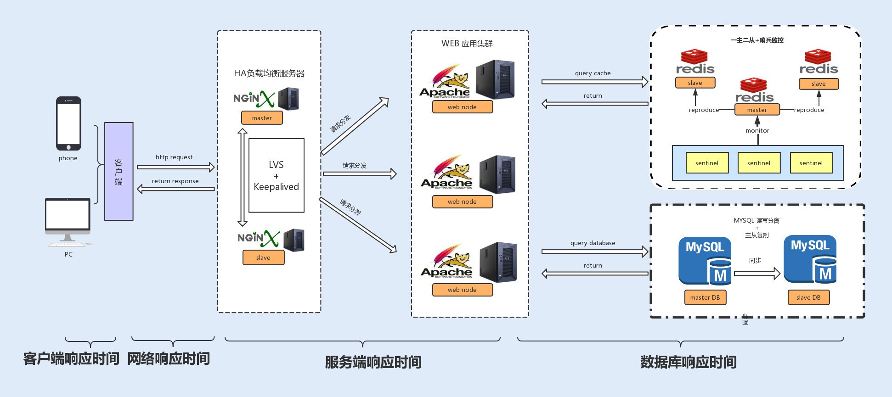

# 01 如何制定性能调优标准？

你好，我是刘超。

我有一个朋友，有一次他跟我说，他们公司的系统从来没有经过性能调优，功能测试完成后就上线了，线上也没有出现过什么性能问题呀，那为什么很多系统都要去做性能调优呢？

当时我就回答了他一句，如果你们公司做的是 12306 网站，不做系统性能优化就上线，试试看会是什么情况。

如果是你，你会怎么回答呢？今天，我们就从这个话题聊起，希望能跟你一起弄明白这几个问题：我们为什么要做性能调优？什么时候开始做？做性能调优是不是有标准可参考？

## 为什么要做性能调优？

一款线上产品如果没有经过性能测试，那它就好比是一颗定时炸弹，你不知道它什么时候会出现问题，你也不清楚它能承受的极限在哪儿。

有些性能问题是时间累积慢慢产生的，到了一定时间自然就爆炸了；而更多的性能问题是由访问量的波动导致的，例如，活动或者公司产品用户量上升；当然也有可能是一款产品上线后就半死不活，一直没有大访问量，所以还没有引发这颗定时炸弹。

现在假设你的系统要做一次活动，产品经理或者老板告诉你预计有几十万的用户访问量，询问系统能否承受得住这次活动的压力。如果你不清楚自己系统的性能情况，也只能战战兢兢地回答老板，有可能大概没问题吧。

所以，要不要做性能调优，这个问题其实很好回答。所有的系统在开发完之后，多多少少都会有性能问题，我们首先要做的就是想办法把问题暴露出来，例如进行压力测试、模拟可能的操作场景等等，再通过性能调优去解决这些问题。

比如，当你在用某一款 App 查询某一条信息时，需要等待十几秒钟；在抢购活动中，无法进入活动页面等等。你看，系统响应就是体现系统性能最直接的一个参考因素。

那如果系统在线上没有出现响应问题，我们是不是就不用去做性能优化了呢？再给你讲一个故事吧。

曾经我的前前东家系统研发部门来了一位大神，为什么叫他大神，因为在他来公司的一年时间里，他只做了一件事情，就是把服务器的数量缩减到了原来的一半，系统的性能指标，反而还提升了。

好的系统性能调优不仅仅可以提高系统的性能，还能为公司节省资源。这也是我们做性能调优的最直接的目的。

## 什么时候开始介入调优？

解决了为什么要做性能优化的问题，那么新的问题就来了：如果需要对系统做一次全面的性能监测和优化，我们从什么时候开始介入性能调优呢？是不是越早介入越好？

其实，在项目开发的初期，我们没有必要过于在意性能优化，这样反而会让我们疲于性能优化，不仅不会给系统性能带来提升，还会影响到开发进度，甚至获得相反的效果，给系统带来新的问题。

我们只需要在代码层面保证有效的编码，比如，减少磁盘 I/O 操作、降低竞争锁的使用以及使用高效的算法等等。遇到比较复杂的业务，我们可以充分利用设计模式来优化业务代码。例如，设计商品价格的时候，往往会有很多折扣活动、红包活动，我们可以用装饰模式去设计这个业务。

在系统编码完成之后，我们就可以对系统进行性能测试了。这时候，产品经理一般会提供线上预期数据，我们在提供的参考平台上进行压测，通过性能分析、统计工具来统计各项性能指标，看是否在预期范围之内。

在项目成功上线后，我们还需要根据线上的实际情况，依照日志监控以及性能统计日志，来观测系统性能问题，一旦发现问题，就要对日志进行分析并及时修复问题。

## 有哪些参考因素可以体现系统的性能？

上面我们讲到了在项目研发的各个阶段性能调优是如何介入的，其中多次讲到了性能指标，那么性能指标到底有哪些呢？

在我们了解性能指标之前，我们先来了解下哪些计算机资源会成为系统的性能瓶颈。

### 影响系统性能的 7 大核心资源瓶颈

| 资源 / 瓶颈维度      | 核心表现与瓶颈原因                             | 典型诱发场景 / 代码问题                                     | 常见优化与应对手段                                |
|----------------------|------------------------------------------------|-------------------------------------------------------------|---------------------------------------------------|
| **CPU 资源**         | CPU 占用率达 100%，其他线程无法抢占 CPU 时间片 | 无限递归/死循环、正则回溯、JVM 频繁 Full GC、上下文切换过高 | 算法降阶、消除死循环、JVM 参数调优                |
| **内存 (RAM)**       | JVM 堆空间耗尽，出现 OOM 溢出或频繁 GC         | 内存泄漏、未设置上限的集合缓存、一次性加载超大文件          | Dump 堆分析、设置缓存容量与淘汰策略               |
| **磁盘 I/O**         | 磁盘 IOPS 或吞吐量达瓶颈，读写严重卡顿         | 频繁同步写磁盘日志、小文件频繁读写、全表扫描                | 使用 SSD、异步日志落盘、批处理、优化 SQL 索引     |
| **网络 (Network)**   | 带宽挤满、网络丢包或延迟陡增                   | 传输巨型 JSON 响应、无节制高频跨服务 RPC                    | 数据压缩、协议裁剪、使用 HTTP/2 或长连接          |
| **异常 (Exception)** | 异常捕获抛出消耗大量 CPU 构建堆栈              | 滥用 `try-catch` 做常规业务流程分支控制                     | **禁止使用异常控制业务流程**，改用错误码或 Result |
| **数据库 (DB)**      | 连接池排队、慢 SQL 导致磁盘与锁瓶颈            | 慢查询、全表扫描、长事务阻塞连接                            | SQL 索引优化、读写分离、引入 Redis 缓存           |
| **锁竞争 (Lock)**    | 线程大量进入 Blocked 状态，上下文切换剧烈      | 大粒度锁同步块、在锁内执行长耗时 I/O                        | 减小锁粒度、锁分离（读写锁）、CAS 无锁化          |

了解了上面这些基本内容，我们可以得到下面几个指标，来衡量一般系统的性能。

### 响应时间

响应时间是衡量系统性能的重要指标之一，响应时间越短，性能越好，一般一个接口的响应时间是在毫秒级。在系统中，我们可以把响应时间自下而上细分为以下几种：

- 数据库响应时间：数据库操作所消耗的时间，往往是整个请求链中最耗时的；
- 服务端响应时间：服务端包括 Nginx 分发的请求所消耗的时间以及服务端程序执行所消耗的时间；
- 网络响应时间：这是网络传输时，网络硬件需要对传输的请求进行解析等操作所消耗的时间；
- 客户端响应时间：对于普通的 Web、App 客户端来说，消耗时间是可以忽略不计的，但如果你的客户端嵌入了大量的逻辑处理，消耗的时间就有可能变长，从而成为系统的瓶颈。

### 吞吐量

在测试中，我们往往会比较注重系统接口的 TPS（每秒事务处理量），因为 TPS 体现了接口的性能，TPS 越大，性能越好。在系统中，我们也可以把吞吐量自下而上地分为两种：磁盘吞吐量和网络吞吐量。

我们先来看 **磁盘吞吐量**，磁盘性能有两个关键衡量指标。

一种是 IOPS（Input/Output Per Second），即每秒的输入输出量（或读写次数），这种是指单位时间内系统能处理的 I/O 请求数量，I/O 请求通常为读或写数据操作请求，关注的是随机读写性能。适应于随机读写频繁的应用，如小文件存储（图片）、OLTP 数据库、邮件服务器。

另一种是数据吞吐量，这种是指单位时间内可以成功传输的数据量。对于大量顺序读写频繁的应用，传输大量连续数据，例如，电视台的视频编辑、视频点播 VOD（Video On Demand），数据吞吐量则是关键衡量指标。

接下来看 **网络吞吐量**，这个是指网络传输时没有帧丢失的情况下，设备能够接受的最大数据速率。网络吞吐量不仅仅跟带宽有关系，还跟 CPU 的处理能力、网卡、防火墙、外部接口以及 I/O 等紧密关联。而吞吐量的大小主要由网卡的处理能力、内部程序算法以及带宽大小决定。

### 计算机资源分配使用率

通常由 CPU 占用率、内存使用率、磁盘 I/O、网络 I/O 来表示资源使用率。这几个参数好比一个木桶，如果其中任何一块木板出现短板，任何一项分配不合理，对整个系统性能的影响都是毁灭性的。

### 负载承受能力

当系统压力上升时，你可以观察，系统响应时间的上升曲线是否平缓。这项指标能直观地反馈给你，系统所能承受的负载压力极限。例如，当你对系统进行压测时，系统的响应时间会随着系统并发数的增加而延长，直到系统无法处理这么多请求，抛出大量错误时，就到了极限。

## 总结

通过今天的学习，我们知道性能调优可以使系统稳定，用户体验更佳，甚至在比较大的系统中，还能帮公司节约资源。

但是在项目的开始阶段，我们没有必要过早地介入性能优化，只需在编码的时候保证其优秀、高效，以及良好的程序设计。

在完成项目后，我们就可以进行系统测试了，我们可以将以下性能指标，作为性能调优的标准，响应时间、吞吐量、计算机资源分配使用率、负载承受能力。

回顾我自己的项目经验，有电商系统、支付系统以及游戏充值计费系统，用户级都是千万级别，且要承受各种大型抢购活动，所以我对系统的性能要求非常苛刻。除了通过观察以上指标来确定系统性能的好坏，还需要在更新迭代中，充分保障系统的稳定性。

这里，**给你延伸一个方法，** 就是将迭代之前版本的系统性能指标作为参考标准，通过自动化性能测试，校验迭代发版之后的系统性能是否出现异常，这里就不仅仅是比较吞吐量、响应时间、负载能力等直接指标了，还需要比较系统资源的 CPU 占用率、内存使用率、磁盘 I/O、网络 I/O 等几项间接指标的变化。
