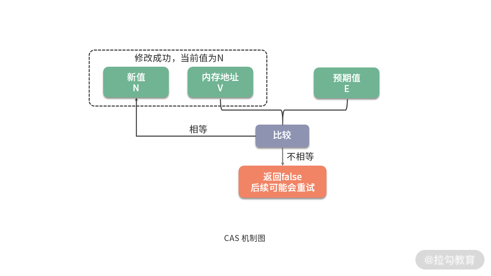
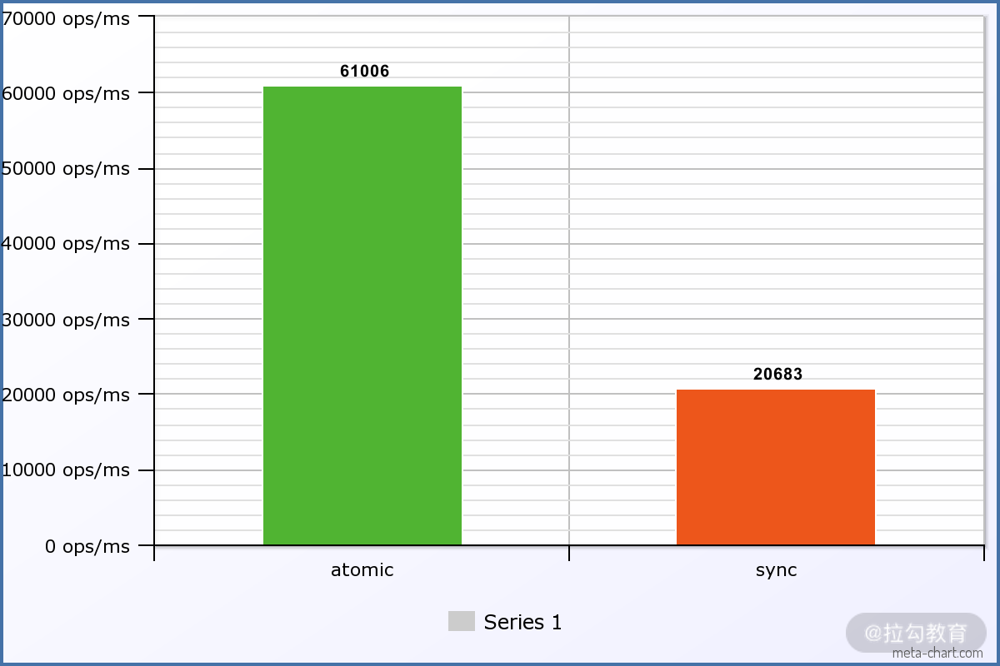
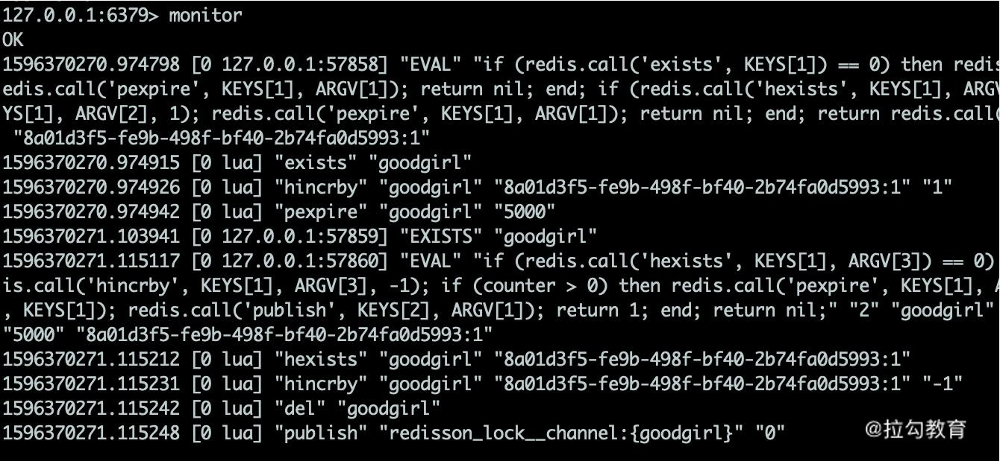

# 14 案例分析：乐观锁和无锁

上一课时，我们提到了 `java.util.concurrent.locks` 下的 Lock，了解到它可以在 API 级别对共享资源进行更细粒度的控制。Lock 通常基于 AQS（AbstractQueuedSynchronizer）实现。AQS 使用一个 int 成员变量表示 state（同步状态），并通过内置的 FIFO 队列完成资源获取线程的排队。

使用 **synchronized** 加锁时，竞争线程可能在 BLOCKED 和 RUNNABLE 状态之间切换；在操作系统层面，这可能带来用户态与内核态之间的切换开销。

与 synchronized 的实现方式不同，**AQS** 中许多数据结构的更新依赖 CAS，而 **CAS 是乐观并发控制的一种实现**。

## CAS

CAS 是 Compare And Swap 的缩写，意思是 **比较并替换**。

如下图，CAS 机制当中使用了 3 个基本操作数：内存地址 V、期望值 E、要修改的新值 N。更新一个变量的时候，只有当变量的预期值 E 和内存地址 V 的真正值相同时，才会将内存地址 V 对应的值修改为 N。



如果本次修改不成功，怎么办？很多情况下，它将一直重试，直到修改为期望的值。

拿 AtomicInteger 类来说，相关的代码如下：

```java
public final boolean compareAndSet(int expectedValue, int newValue) {
    return U.compareAndSetInt(this, VALUE, expectedValue, newValue);
}
```

**比较和替换是两个动作，CAS 是如何保证这两个操作的原子性呢？** 我们继续向下追踪，发现是 **jdk.internal.misc.Unsafe** 类实现的，循环重试就是在这里发生的：

```java
@HotSpotIntrinsicCandidate
public final int getAndAddInt(Object o, long offset, int delta) {
    int v;
    do {
        v = getIntVolatile(o, offset);
    } while (!weakCompareAndSetInt(o, offset, v, v + delta));
    return v;
}
```

追踪到 JVM 内部，在 Linux 机器上可以参照 `os_cpu/linux_x86/atomic_linux_x86.hpp`。最底层的调用是汇编指令，其中最重要的是 **cmpxchgl**。到这里无法继续追踪 Java 代码，因为 CAS 的原子性实际上由 CPU 硬件保证。

```cpp
template<>
template<typename T>
inline T Atomic::PlatformCmpxchg<4>::operator()(T exchange_value, T volatile* dest, T compare_value, atomic_memory_order /* order */) const {
STATIC_ASSERT(4 == sizeof(T)); asm volatile ("lock cmpxchgl %1,(%3)" : "=a" (exchange_value)
            : "r" (exchange_value), "a" (compare_value), "r" (dest)
            : "cc", "memory");
return exchange_value;
}
```

那 CAS 实现的原子类，性能能提升多少呢？我们开启了 20 个线程，对共享变量进行自增操作。

从测试结果得知，针对频繁的写操作，原子类的性能是 synchronized 方式的 3 倍。



**CAS 原理在近几年面试中的考察率越来越高，主要是由于乐观锁在读多写少的互联网场景中使用得越来越频繁。** 你可能发现了一些乐观锁的变种，但最基础的思想都是一样的，即基于**比较并替换**。

关于 Atomic 类，还有一个小细节，那就是它的主要变量，使用了 volatile 关键字进行修饰。代码如下，你知道它是用来干什么的吗？

```java
private volatile int value;
```

答案：`volatile` 为变量提供可见性和有序性保证：一个线程的写入对其他线程可见，并能抑制相关指令重排序。但它本身不保证复合操作的原子性，因此 Atomic 类仍需要配合 CAS 才能安全地完成更新。

### 乐观锁

从上面的描述可以看出，**乐观锁** 严格来说，并不是一种锁，它提供了一种检测冲突的机制，并在有冲突的时候，采取重试的方法完成某项操作。假如没有重试操作，乐观锁就仅仅是一个判断逻辑而已。

从这里可以看出乐观锁与悲观锁的一些区别。悲观锁每次操作数据的时候，都会认为别人会修改，所以每次在操作数据的时候，都会加锁，除非别人释放掉锁。

乐观锁在检测到冲突的时候，会有多次重试操作，所以之前我们说，乐观锁适合用在读多写少的场景；而在资源冲突比较严重的场景，乐观锁会出现多次失败的情况，造成 CPU 的空转，所以悲观锁在这种场景下，会有更好的性能。**为什么读多写少的情况，就适合使用乐观锁呢？悲观锁在读多写少的情况下，不也是有很少的冲突吗？** 其实，问题不在于冲突的频繁性，而在于 **加锁这个动作** 上。

* 悲观锁需要遵循下面三种模式：一锁、二读、三更新，即使在没有冲突的情况下，执行也会非常慢；
* 如之前所说，乐观锁本质上不是锁，它只是一个判断逻辑，资源冲突少的情况下，它不会产生任何开销。

我们上面谈的 CAS 操作，就是一种典型的乐观锁实现方式，我们顺便看一下 CAS 的缺点，也就是乐观锁的一些缺点。

* 在并发量比较高的情况下，有些线程可能会一直尝试修改某个资源，但由于冲突比较严重，一直更新不成功，这时候，就会给 CPU 带来很大的压力。JDK 1.8 中新增的 LongAdder，通过把原值进行拆分，最后再以 sum 的方式，减少 CAS 操作冲突的概率，性能要比 AtomicLong 高出 10 倍左右。
* CAS 操作的对象，只能是单个资源，如果想要保证多个资源的原子性，最好使用 synchronized 等经典加锁方式
* ABA 问题：在 CAS 操作时，其他线程先将变量的值由 A 改成 B，再改回 A；当前线程发现值仍然是 A，于是执行交换操作。这种情况在某些场景下可以不必过度关注，例如 AtomicInteger；但在链表等场景中可能导致问题，必须避免。可以使用 AtomicStampedReference 为引用附加整型版本戳。

### 乐观锁实现余额更新

对余额的操作，是交易系统里最常见的操作了。先读出余额的值，进行一番修改之后，再写回这个值。

对余额的任何更新，都需要进行加锁。因为读取和写入操作并不是原子性的，如果同一时刻发生了多次与余额的操作，就会产生不一致的情况。

举一个比较明显的例子。你同时发起了一笔消费 80 元和 5 元的请求，经过操作之后，两个支付都成功了，但最后余额却只减了 5 元。相当于花了 5 块钱买了 85 元的东西。请看下面的时序：

```text
请求A：读取余额100
请求B：读取余额100
请求A：花掉5元，临时余额是95
请求B：花掉80元，临时余额是20
请求B：写入余额20成功
请求A：写入余额95成功
```

我曾经在线上遇到过一个 P0 级别的 bug：用户通过构造请求，频繁发起 100 元和 1 分钱的提现，造成了比较严重的后果。你可以自行分析一下这个过程。

**所以，对余额操作加锁，是必须的。** 这个过程和多线程的操作是类似的，不过多线程是单机的，而余额的场景是分布式的。

对于数据库来说，可以通过行锁解决这个问题。以 MySQL 为例，MyISAM 不支持行锁，应使用 InnoDB，典型的 SQL 语句如下：

```sql
SELECT * FROM user WHERE userid = {id} FOR UPDATE;
```

使用 select for update 这么一句简单的 SQL，其实在底层就加了三把锁，非常昂贵。

> 默认对主键索引加锁，不过这里直接忽略； 二级索引 userid={id} 的 next key lock（记录+间隙锁）； 二级索引 userid={id} 的下一条记录的间隙锁。

因此，在高并发余额更新场景中，直接使用这种悲观锁往往成本较高：一方面通用性有限，另一方面锁竞争会带来额外开销。

一种比较好的办法，就是使用乐观锁。根据上面我们对于乐观锁的定义，就可以抽象两个概念：

* **检测冲突的机制**：先查出本次操作的余额 E，在更新时判断是否与当前数据库的值相同；如果相同，则执行更新动作。
* **重试策略**：发生冲突时直接失败，或者重试 5 次后失败。

伪代码如下，可以看到这其实就是 CAS。

```sql
-- 读取旧余额
SELECT balance FROM user WHERE userid = {id};

-- 更新动作：只有余额未变化且足够扣减时才成功
UPDATE user
SET balance = balance - 20
WHERE userid = {id}
  AND balance >= 20
  AND balance = $old_balance;
```

还有一种 CAS 的变种，就是使用版本号机制。通过在表中加一个额外的字段 version，来代替对余额的判断。这种方式不用去关注具体的业务逻辑，可控制多个变量的更新，可扩展性更强，典型的伪代码如下：

```text
oldVersion, balance = dao.getBalance(userid)
balance = balance - cost
UPDATE user
SET balance = balance - 20,
    version = version + 1
WHERE userid = {id}
  AND balance >= 20
  AND version = $old_version;
```

根据更新影响的行数判断 CAS 是否成功：影响 1 行表示更新成功，影响 0 行表示版本冲突，需要失败或重试。

### Redis 分布式锁

Redis 的分布式锁，是互联网行业经常使用的方案。很多同学知道是使用 setnx 或者带参数的 set 方法来实现的，但 Redis 的分布式锁其实有很多坑。

在“08 | 案例分析：Redis 如何助力秒杀业务”中，我们演示了使用 Lua 脚本实现秒杀场景。但在现实情况中，秒杀业务通常不会这么简单，它需要在查询和用户扣减操作之间执行其他业务。

比如，进行一些商品校验、订单生成等，这个时候，使用分布式锁，可以实现更灵活地控制，它主要依赖 SETNX 指令或者带参数的 SET 指令。

* 锁创建：`SETNX key value` 是原子操作，在指定 key 不存在时创建并返回 1，否则返回 0。通常使用参数更完整的 `SET key value [EX seconds] [PX milliseconds] [NX|XX]`，同时为 key 设置超时时间。
* 锁查询：`GET key`，判断 key 是否存在即可。
* 锁删除：`DEL key`，删除相应的 key。

根据原生的语义，我们有下面简单的 lock 和 unlock 方法，lock 方法通过不断的重试，来获取到分布式锁，然后通过删除命令销毁分布式锁。

```java
public void lock(String key, int timeoutSeconds) {
    for (;;) {
        boolean acquired = redisTemplate.opsForValue().setIfAbsent(
            key, "", timeoutSeconds, TimeUnit.SECONDS);
        if (acquired) {
            break;
        }
    }
}

public void unlock(String key) {
    redisTemplate.delete(key);
}
```

这段代码中的问题很多，我们只指出其中一个最严重的问题。在多线程中，执行 unlock 方法的，只能是当前的线程，但在上面的实现中，由于超时存在的原因，锁被提前释放了。考虑下面 3 个请求的时序：

* **请求 A：** 获取了资源 x 的锁，锁的超时时间为 5 秒
* **请求 A：** 由于业务执行时间比较长，业务阻塞等待，超过 5 秒
* **请求 B：** 第 6 秒发起请求，结果发现锁 x 已经失效，于是顺利获得锁
* **请求 A：** 第 7 秒，请求 A 执行完毕，然后执行锁释放动作
* **请求 C：** 请求 C 在锁刚释放的时候发起了请求，结果顺利拿到了锁资源

此时，请求 B 和请求 C 都成功地获取了锁 x，我们的分布式锁失效了，在执行业务逻辑的时候，就容易发生问题。

所以，在删除锁的时候，需要判断它的请求方是否正确。首先，获取锁中的当前标识，然后，在删除的时候，判断这个标识是否和解锁请求中的相同。

可以看到，读取和判断是两个不同的操作，在这两个操作之间同样存在时间窗口。高并发下可能出现执行错乱，稳妥的方案是使用 Lua 脚本将它们封装成原子操作。

改造后的代码如下：

```java
public String lock(String key, int timeoutSeconds) {
    for (;;) {
        String stamp = String.valueOf(System.nanoTime());
        boolean acquired = redisTemplate.opsForValue().setIfAbsent(
            key, stamp, timeoutSeconds, TimeUnit.SECONDS);
        if (acquired) {
            return stamp;
        }
    }
}

public void unlock(String key, String stamp) {
    redisTemplate.execute(script, Arrays.asList(key), stamp);
}
```

相应的 lua 脚本如下：

```lua
local stamp = ARGV[1]
local key = KEYS[1]
local current = redis.call("GET", key)
if stamp == current then
    redis.call("DEL", key)
    return "OK"
end
```

可以看到，Redis 实现分布式锁还是有一定难度的。推荐使用 Redisson，它是根据 [Redis 官方文档](https://redis.io/topics/distlock)提出的分布式锁管理方法实现的。

这个算法处理了分布式锁在多 Redis 实例场景下的异常情况，具有更高的容错性。例如前面提到的锁超时问题，Redisson 会通过看门狗机制对锁进行续期，保证业务正常运行。

下面是 Redisson 分布式锁的典型使用代码。

```java
String resourceKey = "goodgirl";
RLock lock = redisson.getLock(resourceKey);
try {
    lock.lock(5, TimeUnit.SECONDS);

    // 真正的业务
    Thread.sleep(100);
} catch (Exception ex) {
    ex.printStackTrace();
} finally {
    if (lock.isHeldByCurrentThread()) {
        lock.unlock();
    }
}
```

使用 Redis 的 `MONITOR` 命令，可以看到具体的执行步骤；整个过程比较复杂。



### 无锁

无锁（Lock-Free），指的是在多线程环境下，在访问共享资源的时候，不会阻塞其他线程的执行。

在 Java 中，最典型的无锁队列实现，就是 ConcurrentLinkedQueue，但它是无界的，不能够指定它的大小。ConcurrentLinkedQueue 使用 CAS 来处理对数据的并发访问，这是无锁算法得以实现的基础。

CAS 指令不会引起上下文切换和线程调度，是非常轻量级的多线程同步机制。它还把入队、出队等对 head 和 tail 节点的一些原子操作，拆分出更细的步骤，进一步缩小了 CAS 控制的范围。

ConcurrentLinkedQueue 是一个非阻塞队列，性能很高，但不是很常用。千万不要和阻塞队列 LinkedBlockingQueue（内部基于锁）搞混了。

Disruptor 是一个无锁、有界的队列框架，它的性能非常高。它使用 RingBuffer、无锁和缓存行填充等技术，追求性能的极致，在极高并发的场景，可以使用它替换传统的 BlockingQueue。

它经常用于日志、消息等中间件（Storm 使用它实现进程内部通信机制），但在业务系统中并不常见，除非是秒杀等场景。原因是它的编程模型比较复杂，而业务瓶颈通常在缓慢的 I/O 上，而不是队列本身。

### 小结

本课时，我们从 CAS 出发，逐步了解了乐观锁的一些概念和使用场景。**乐观锁** 严格来说，并不是一种锁。它提供了一种检测冲突的机制，并在有冲突的时候，采取重试的方法完成某项操作。假如没有重试操作，乐观锁就仅仅是一个判断逻辑而已。**悲观锁** 每次操作数据的时候，都会认为别人会修改，所以每次在操作数据的时候，都会加锁，除非别人释放掉锁。

乐观锁在读多写少的情况下，之所以比悲观锁快，是因为悲观锁需要进行很多额外的操作，并且乐观锁在没有冲突的情况下，也根本不耗费资源。但乐观锁在冲突比较严重的情况下，由于不断地重试，其性能在大多数情况下，是不如悲观锁的。

由于乐观锁的这个特性，乐观锁在读多写少的互联网环境中被广泛应用。

本课时，我们主要看了在数据库层面的一个乐观锁实现，以及 **Redis 分布式锁** 的实现，后者在实现的时候，还是有很多细节需要注意的，建议使用 redisson 的 RLock。

当然，乐观锁有它的使用场景。当冲突非常严重的情况下，会进行大量的无效计算；它也只能保护单一的资源，处理多个资源的情况下就捉襟见肘；它还会有 ABA 问题，使用带版本号的乐观锁变种可以解决这个问题。

这些经验，我们都可以从 CAS 中进行借鉴。多线程环境和分布式环境有很多相似之处，对于乐观锁来说，我们找到一种检测冲突的机制，就基本上实现了。**下面留一个问题，请你分析解答：**

一个接口的写操作，大约会花费 5 分钟左右的时间。它在开始写时，会把数据库里的一个字段值更新为 start，写入完成后，更新为 done。有另外一个用户也想写入一些数据，但需要等待状态为 done。

于是，开发人员在 Web 端使用轮询，每隔 5 秒查询字段值是否为 done，查询到正确状态后再开始写入数据。

开发人员的这个方法，属于乐观锁吗？有哪些潜在问题？应该如何避免？欢迎你在下方留言区作答，我将一一解答，与你讨论。
