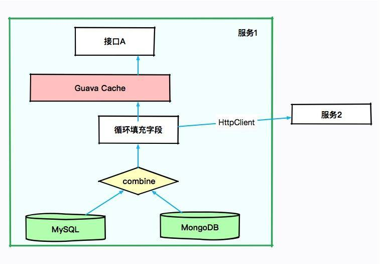
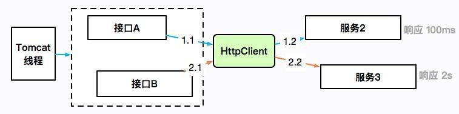
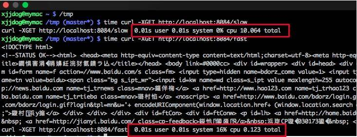
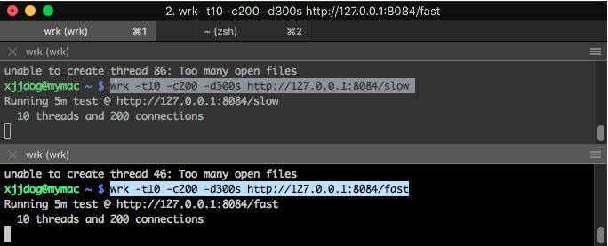
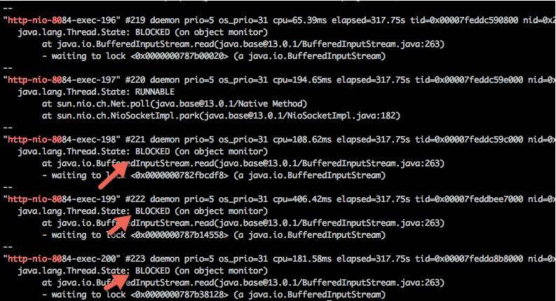
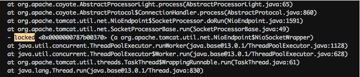
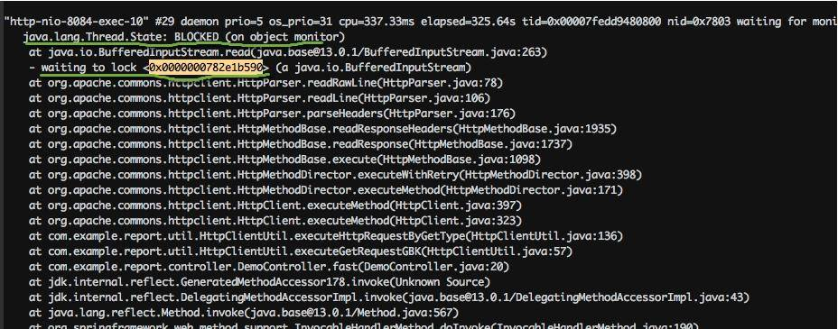
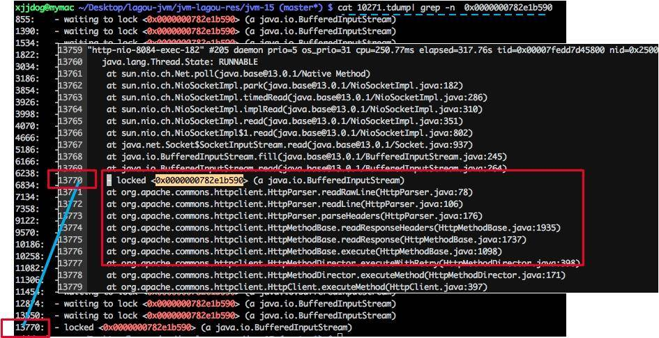
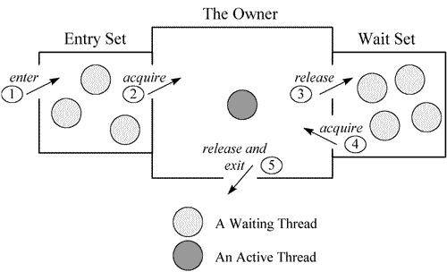
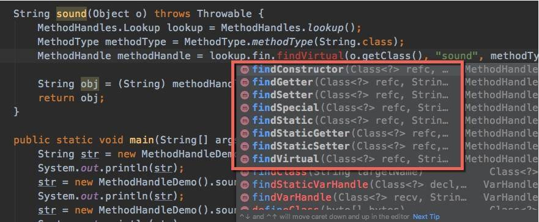

# 16 案例分析：一个高死亡率的报表系统的优化之路

本课时我们主要分析一个案例，那就是一个“高死亡率”报表系统的优化之路。

传统观念上的报表系统，可能访问量不是特别多，点击一个查询按钮，后台 SQL 语句的执行需要等数秒。如果使用 `jstack` 来查看执行线程，会发现大多数线程都阻塞在数据库的 I/O 上。

上面这种是非常传统的报表。还有一种类似于大屏监控一类的实时报表，这种报表的并发量也是比较可观的，但由于它的结果集都比较小，所以我们可以像对待一个高并发系统一样对待它，问题不是很大。

本课时要讲的，就是传统观念上的报表。除了处理时间比较长以外，报表系统每次处理的结果集，普遍都比较大，这给 JVM 造成了非常大的压力。

下面我们以一个综合性的实例，来看一下一个“病入膏肓”的报表系统的优化操作。

有一个报表系统，频繁发生内存溢出，在高峰期间使用时，还会频繁的发生拒绝服务，这是不可忍受的。

## 服务背景

本次要优化的服务是一个 SaaS 服务，使用 Spring Boot 编写，采用的是 CMS 垃圾回收器。如下图所示，有些接口会从 MySQL 中获取数据，有些则从 MongoDB 中获取数据，涉及的结果集合都比较大。

由于有些结果集的字段不是太全，因此需要对结果集合进行循环，可通过 HttpClient 调用其他服务的接口进行数据填充。也许你会认为某些数据可能会被复用，于是使用 Guava 做了 JVM 内缓存。

大体的服务依赖可以抽象成下面的图。



初步排查，JVM 的资源太少。当接口 A 每次进行报表计算时，都要涉及几百兆的内存，而且在内存里驻留很长时间，同时有些计算非常耗 CPU，特别的“吃”资源。而我们分配给 JVM 的内存只有 3 GB，在多人访问这些接口的时候，内存就不够用了，进而发生了 OOM。在这种情况下，即使连最简单的报表都不能用了。

没办法，只有升级机器。把机器配置升级到 4core8g，给 JVM 分配 6GB 的内存，这样 OOM 问题就消失了。但随之而来的是频繁的 GC 问题和超长的 GC 时间，平均 GC 时间竟然有 5 秒多。

## 初步优化

我们前面算过，6GB 大小的内存，年轻代大约是 2GB，在高峰期，每几秒钟则需要进行一次 Minor GC。报表系统和高并发系统不太一样，它的对象，存活时长大得多，并不能仅仅通过增加年轻代来解决；而且，如果增加了年轻代，那么必然减少了老年代的大小，由于 CMS 的碎片和浮动垃圾问题，我们可用的空间就更少了。虽然服务能够满足目前的需求，但还有一些不太确定的风险。

第一，了解到程序中有很多缓存数据和静态统计数据，为了减少 Minor GC 的次数，通过分析 GC 日志打印的对象年龄分布，把 `MaxTenuringThreshold` 参数调整到了 3（请根据你自己的应用情况设置）。**这个参数是让年轻代的这些对象，赶紧回到老年代去，不要老呆在年轻代里**。

第二，我们的 GC 时间比较长，就一块开了参数 `CMSScavengeBeforeRemark`，使得在 CMS remark 前，先执行一次 Minor GC 将新生代清掉。同时配合上个参数，其效果还是比较好的，一方面，对象很快晋升到了老年代，另一方面，年轻代的对象在这种情况下是有限的，在整个 Major GC 中占的时间也有限。

第三，由于缓存的使用，有大量的弱引用，拿一次长达 10 秒的 GC 来说。我们发现在 GC 日志里，处理 `weak refs` 的时间较长，达到了 4.5 秒。

```shell
2020-01-28T12:13:32.876+0800: 526569.947: [weak refs processing, 4.5240649 secs]
```

所以加入了参数 `ParallelRefProcEnabled` 来并行处理 Reference，以加快处理速度，缩短耗时。

同时还加入了其他一些优化参数，比如通过调整触发 GC 的参数来进行优化：

```shell
-Xmx6g -Xms6g -XX:MaxTenuringThreshold=3 -XX:+AlwaysPreTouch -XX:+ParallelRefProcEnabled -XX:+CMSScavengeBeforeRemark -XX:+UseConcMarkSweepGC -XX:CMSInitiatingOccupancyFraction=80 -XX:+UseCMSInitiatingOccupancyOnly -XX:MetaspaceSize=256M -XX:MaxMetaspaceSize=256M
```

优化之后，效果不错，但并不是特别明显。经过评估，针对高峰时期的情况进行调研，我们决定再次提升机器性能，改用 8core16g 的机器。但是，这会带来另外一个问题。**高性能的机器带来了非常大的服务吞吐量**，通过 `jstat` 进行监控，能够看到年轻代的分配速率明显提高，但随之而来的 Minor GC 时长却变的不可控，有时候会超过 1 秒。累积的请求造成了更加严重的后果。

这是由于堆空间明显加大造成的回收时间加长。为了获取较小的停顿时间，我们在堆上采用了 G1 垃圾回收器，把它的目标设定在 200ms。G1 是一款非常优秀的垃圾收集器，不仅适合堆内存大的应用，同时也简化了调优的工作。通过主要的参数初始和最大堆空间、以及最大容忍的 GC 暂停目标，就能得到不错的性能。所以为了照顾大对象的生成，我们把小堆区的大小修改为 16M。修改之后，虽然 GC 更加频繁了一些，但是停顿时间都比较小，应用的运行较为平滑。

```shell
-Xmx12g -Xms12g -XX:+UseG1GC -XX:InitiatingHeapOccupancyPercent=45 -XX:MaxGCPauseMillis=200 -XX:G1HeapRegionSize=16m -XX:MetaspaceSize=256m -XX:MaxMetaspaceSize=256m
```

这个时候，任务来了：业务部门发力，预计客户增长量增长 10 ~ 100 倍，报表系统需要评估其可行性，以便进行资源协调。可问题是，这个“千疮百孔”的报表系统，稍微一压测，就宕机，那如何应对十倍百倍的压力呢？

使用 MAT 分析堆快照，发现很多地方可以通过代码优化，那些占用内存特别多的对象，都是我们需要优化的。

## 代码优化

我们使用扩容硬件的方式，暂时缓解了 JVM 的问题，但是根本问题并没有触及到。为了减少内存的占用，肯定要清理无用的信息。通过对代码的仔细分析，首先要改造的就是 SQL 查询语句。

很多接口，其实并不需要把数据库的每个字段都查询出来，当你在计算和解析的时候，它们会不知不觉地“吃掉”你的内存。所以我们只需要获取所需的数据就够了，也就是把 `select *` 这种方式修改为具体的查询字段，对于报表系统来说这种优化尤其明显。

再一个就是 Cache 问题，通过排查代码，会发现一些命中率特别低，占用内存又特别大的对象，放到了 JVM 内的 Cache 中，造成了无用的浪费。

解决方式，就是把 Guava 的 Cache 引用级别改成弱引用（`WeakKeys`），尽量去掉无用的应用缓存。对于某些使用特别频繁的小 key，使用分布式的 Redis 进行改造即可。

为了找到更多影响因子大的问题，我们部署了独立的环境，然后部署了 JVM 监控。在回放某个问题请求后，观察 JVM 的响应，通过这种方式，发现了更多的优化可能。

报表系统使用了 POI 组件进行导入导出功能的开发，结果客户在没有限制的情况下上传、下载了条数非常多的文件，直接让堆内存飙升。为了解决这种情况，我们在导入功能加入了文件大小的限制，强制客户进行拆分；在下载的时候指定范围，严禁跨度非常大的请求。

在完成代码改造之后，再把机器配置降级回 4core8g，依然采用 G1 垃圾回收器，再也没有发生 OOM 的问题了，GC 问题也得到了明显的缓解。

## 拒绝服务问题

上面解决的是 JVM 的内存问题，可以看到除了优化 JVM 参数、升级机器配置以外，代码修改带来的优化效果更加明显，但这个报表服务还有一个严重的问题。

刚开始我们提到过，由于没有微服务体系，有些数据需要使用 HttpClient 来获取进行补全。提供数据的服务有的响应时间可能会很长，也有可能会造成服务整体的阻塞。



如上图所示，接口 A 通过 HttpClient 访问服务 2，响应 100ms 后返回；接口 B 访问服务 3，耗时 2 秒。HttpClient 本身是有一个最大连接数限制的，如果服务 3 迟迟不返回，就会造成 HttpClient 的连接数达到上限，最上层的 Tomcat 线程也会一直阻塞在这里，进而连响应速度比较快的接口 A 也无法正常提供服务。

这是出现频率非常高的一类故障，在工作中你会大概率遇见。**概括来讲，就是同一服务，由于一个耗时非常长的接口，进而引起了整体的服务不可用。** 这个时候，通过 `jstack` 打印栈信息，会发现大多数竟然阻塞在了接口 A 上，而不是耗时更长的接口 B。这是一种错觉，其实是因为接口 A 的速度比较快，在问题发生点进入了更多的请求，它们全部都阻塞住了。

证据本身具有非常强的迷惑性。由于这种问题发生的频率很高，排查起来又比较困难，我这里专门做了一个小工程，用于还原解决这种问题的一个方式，参见 `report-demo` 工程。

demo 模拟了两个使用同一个 HttpClient 的接口。如下图所示，fast 接口用来访问百度，很快就能返回；slow 接口访问谷歌，由于众所周知的原因，会阻塞直到超时，大约 10s。



使用 `wrk` 工具对这两个接口发起压测：

```shell
wrk -t10 -c200 -d300s http://127.0.0.1:8084/slow
wrk -t10 -c200 -d300s http://127.0.0.1:8084/fast
```



此时访问一个简单的接口，耗时竟然能够达到 20 秒：

```shell
$ time curl http://localhost:8084/stat
fast:648,slow:1
curl http://localhost:8084/stat  0.01s user 0.01s system 0% cpu 20.937 total
```

### 堆栈 Dump 分析

首先使用 `jps` 命令找到进程号，然后把结果重定向到文件（可以参考 `10271.jstack` 文件）。

过滤一下 nio 关键字，可以查看 Tomcat 相关的线程，足足有 200 个，这和 Spring Boot 默认的 `maxThreads` 个数不谋而合。更要命的是，有大多数线程，都处于 BLOCKED 状态，说明线程等待资源超时。

```shell
cat 10271.jstack | grep http-nio-80 -A 3
```



使用脚本分析，发现有大量的线程阻塞在 fast 方法上。我们上面也说过，这是一个假象，可能你到了这一步，会心生存疑，以至于无法再向下分析。

```shell
cat 10271.jstack | grep fast | wc -l
# 137

cat 10271.jstack | grep slow | wc -l
# 63
```

分析栈信息，你可能会直接查找 locked 关键字，如下图所示，但是这样的方法一般没什么用，我们需要做更多的统计。



注意下图中有一个处于 BLOCKED 状态的线程，它阻塞在对锁的获取上（`waiting to lock`）。大体浏览一下 DUMP 文件，会发现多处这种状态的线程，可以使用如下脚本进行统计：



```shell
cat 10271.tdump | grep "waiting to lock " | awk '{print $5}' | sort | uniq -c | sort -k1 -r
26 <0x0000000782e1b590>
18 <0x0000000787b00448>
16 <0x0000000787b38128>
10 <0x0000000787b14558>
 8 <0x0000000787b25060>
 4 <0x0000000787b2da18>
 4 <0x0000000787b00020>
 2 <0x0000000787b6e8e8>
 2 <0x0000000787b03328>
 2 <0x0000000782e8a660>
 1 <0x0000000787b6ab18>
 1 <0x0000000787b2ae00>
 1 <0x0000000787b0d6c0>
 1 <0x0000000787b073b8>
 1 <0x0000000782fbcdf8>
 1 <0x0000000782e11200>
 1 <0x0000000782dfdae0>
```

我们找到给 `0x0000000782e1b590` 上锁的执行栈，可以发现全部卡在了 HttpClient 的读操作上。在实际场景中，可以看下排行比较靠前的几个锁地址，找一下共性。



返回头去再看一下代码。我们发现 HttpClient 是共用了一个连接池，当连接数超过 100 的时候，就会阻塞等待。它的连接超时时间是 10 秒，这和 slow 接口的耗时不相上下。

```java
private final static HttpConnectionManager httpConnectionManager = new SimpleHttpConnectionManager(true);

static {
    HttpConnectionManagerParams params = new HttpConnectionManagerParams();
    params.setMaxTotalConnections(100);
    params.setConnectionTimeout(1000 * 10);
    params.setSoTimeout(defaultTimeout);
    httpConnectionManager.setParams(params);
}
```

slow 接口和 fast 接口同时在争抢这些连接，让它时刻处在饱满的状态，进而让 Tomcat 的线程等待、占满，造成服务不可用。

问题找到了，解决方式就简单多了。我们希望 slow 接口在阻塞的时候，并不影响 fast 接口的运行。这就可以对某一类接口进行限流，或者对不重要的接口进行熔断处理，这里不再深入讲解（具体可参考 Spring Boot 的限流熔断处理）。

现实情况是，对于一个运行的系统，我们并不知道是 slow 接口慢还是 fast 接口慢，这就需要加入一些额外的日志信息进行排查。当然，如果有一个监控系统能够看到这些数据是再好不过了。

项目中的 `HttpClientUtil2` 文件，是改造后的一个版本。除了调大了连接数，它还使用了多线程版本的 **连接管理器**（`MultiThreadedHttpConnectionManager`），这个管理器根据请求的 host 进行划分，每个 host 的最大连接数不超过 20。还提供了 `getConnectionsInPool` 函数，用于查看当前连接池的统计信息。采用这些辅助的手段，可以快速找到问题服务，这是典型的情况。由于其他应用的服务水平低而引起的连锁反应，一般的做法是熔断、限流等，在此不多做介绍了。

## jstack 常见线程状态分析

为了观测一些状态，我上传了几个 Java 类，你可以实际运行一下，然后使用 `jstack` 来看一下它的状态。

### 1. waiting on condition

示例参见 `SleepDemo.java`：

```java
public class SleepDemo {
    public static void main(String[] args) {
        new Thread(() -> {
            try {
                Thread.sleep(Integer.MAX_VALUE);
            } catch (InterruptedException e) {
                e.printStackTrace();
            }
        }, "sleep-demo").start();
    }
}
```

这个状态出现在线程等待某个条件的发生，来把自己唤醒，或者调用了 `sleep` 函数，常见的情况就是等待网络读写，或者等待数据 I/O。如果发现大多数线程都处于这种状态，证明后面的资源遇到了瓶颈。

此时线程状态大致分为以下两种：

- `java.lang.Thread.State: WAITING (parking)`：一直等待条件发生；
- `java.lang.Thread.State: TIMED_WAITING (parking 或 sleeping)`：定时的，即使条件不触发，也将定时唤醒。

```shell
"sleep-demo" #12 prio=5 os_prio=31 cpu=0.23ms elapsed=87.49s tid=0x00007fc7a7965000 nid=0x6003 waiting on condition  [0x000070000756d000]
   java.lang.Thread.State: TIMED_WAITING (sleeping)
        at java.lang.Thread.sleep(java.base@13/Native Method)
        at SleepDemo.lambda$main$0(SleepDemo.java:5)
        at SleepDemo$$Lambda$16/0x0000000800b45040.run(Unknown Source)
        at java.lang.Thread.run(java.base@13/Thread.java:830)
```

值得注意的是，Java 中的可重入锁，也会让线程进入这种状态，但通常带有 `parking` 字样，`parking` 指线程处于挂起中，要注意区别。代码可参见 `LockDemo.java`：

```java
import java.util.concurrent.locks.Lock;
import java.util.concurrent.locks.ReentrantLock;

public class LockDemo {
    public static void main(String[] args) {
        Lock lock = new ReentrantLock();
        lock.lock();
        new Thread(() -> {
            try {
                lock.lock();
            } finally {
                lock.unlock();
            }
        }, "lock-demo").start();
    }
}
```

堆栈代码如下：

```shell
"lock-demo" #12 prio=5 os_prio=31 cpu=0.78ms elapsed=14.62s tid=0x00007ffc0b949000 nid=0x9f03 waiting on condition  [0x0000700005826000]
   java.lang.Thread.State: WAITING (parking)
        at jdk.internal.misc.Unsafe.park(java.base@13/Native Method)
        - parking to wait for  <0x0000000787cf0dd8> (a java.util.concurrent.locks.ReentrantLock$NonfairSync)
        at java.util.concurrent.locks.LockSupport.park(java.base@13/LockSupport.java:194)
        at java.util.concurrent.locks.AbstractQueuedSynchronizer.parkAndCheckInterrupt(java.base@13/AbstractQueuedSynchronizer.java:885)
        at java.util.concurrent.locks.AbstractQueuedSynchronizer.acquireQueued(java.base@13/AbstractQueuedSynchronizer.java:917)
        at java.util.concurrent.locks.AbstractQueuedSynchronizer.acquire(java.base@13/AbstractQueuedSynchronizer.java:1240)
        at java.util.concurrent.locks.ReentrantLock.lock(java.base@13/ReentrantLock.java:267)
        at LockDemo.lambda$main$0(LockDemo.java:11)
        at LockDemo$$Lambda$14/0x0000000800b44840.run(Unknown Source)
        at java.lang.Thread.run(java.base@13/Thread.java:830)
```

### 2. waiting for monitor entry

我们上面提到的 HttpClient 例子，就是大部分处于这种状态，线程都是 BLOCKED 的。这意味着它们都在等待进入一个临界区，需要重点关注。

```shell
"http-nio-8084-exec-120" #143 daemon prio=5 os_prio=31 cpu=122.86ms elapsed=317.88s tid=0x00007fedd8381000 nid=0x1af03 waiting for monitor entry  [0x00007000150e1000]
   java.lang.Thread.State: BLOCKED (on object monitor)
        at java.io.BufferedInputStream.read(java.base@13/BufferedInputStream.java:263)
        - waiting to lock <0x0000000782e1b590> (a java.io.BufferedInputStream)
        at org.apache.commons.httpclient.HttpParser.readRawLine(HttpParser.java:78)
        at org.apache.commons.httpclient.HttpParser.readLine(HttpParser.java:106)
        at org.apache.commons.httpclient.HttpConnection.readLine(HttpConnection.java:1116)
        at org.apache.commons.httpclient.HttpMethodBase.readStatusLine(HttpMethodBase.java:1973)
        at org.apache.commons.httpclient.HttpMethodBase.readResponse(HttpMethodBase.java:1735)
```

### 3. in Object.wait()

示例代码参见 `WaitDemo.java`：

```java
public class WaitDemo {
    public static void main(String[] args) throws Exception {
        Object o = new Object();
        new Thread(() -> {
            try {
                synchronized (o) {
                    o.wait();
                }
            } catch (InterruptedException e) {
                e.printStackTrace();
            }
        }, "wait-demo").start();
        Thread.sleep(1000);
        synchronized (o) {
            o.wait();
        }
    }
}
```

说明在获得了监视器之后，又调用了 `java.lang.Object.wait()` 方法。

关于这部分的原理，可以参见一张经典的图。每个监视器（Monitor）在某个时刻，只能被一个线程拥有，该线程就是“Active Thread”，而其他线程都是“Waiting Thread”，分别在两个队列“Entry Set”和“Wait Set”里面等候。在“Entry Set”中等待的线程状态是“Waiting for monitor entry”，而在“Wait Set”中等待的线程状态是“in Object.wait()”。



```shell
"wait-demo" #12 prio=5 os_prio=31 cpu=0.14ms elapsed=12.58s tid=0x00007fb66609e000 nid=0x6103 in Object.wait()  [0x000070000f2bd000]
   java.lang.Thread.State: WAITING (on object monitor)
        at java.lang.Object.wait(java.base@13/Native Method)
        - waiting on <0x0000000787b48300> (a java.lang.Object)
        at java.lang.Object.wait(java.base@13/Object.java:326)
        at WaitDemo.lambda$main$0(WaitDemo.java:7)
        - locked <0x0000000787b48300> (a java.lang.Object)
        at WaitDemo$$Lambda$14/0x0000000800b44840.run(Unknown Source)
        at java.lang.Thread.run(java.base@13/Thread.java:830)
```

### 4. 死锁

代码参见 `DeadLockDemo.java`：

```java
public class DeadLockDemo {
    public static void main(String[] args) {
        Object object1 = new Object();
        Object object2 = new Object();

        Thread t1 = new Thread(() -> {
            synchronized (object1) {
                try {
                    Thread.sleep(200);
                } catch (InterruptedException e) {
                    e.printStackTrace();
                }
                synchronized (object2) {
                }
            }
        }, "deadlock-demo-1");
        t1.start();

        Thread t2 = new Thread(() -> {
            synchronized (object2) {
                synchronized (object1) {
                }
            }
        }, "deadlock-demo-2");
        t2.start();
    }
}
```

死锁属于比较严重的一种情况，`jstack` 会以明显的信息进行提示：

```shell
Found one Java-level deadlock:
=============================
"deadlock-demo-1":
  waiting to lock monitor 0x00007fe5e406f500 (object 0x0000000787cecd78, a java.lang.Object),
  which is held by "deadlock-demo-2"
"deadlock-demo-2":
  waiting to lock monitor 0x00007fe5e406d500 (object 0x0000000787cecd68, a java.lang.Object),
  which is held by "deadlock-demo-1"

Java stack information for the threads listed above:
===================================================
"deadlock-demo-1":
        at DeadLockDemo.lambda$main$0(DeadLockDemo.java:13)
        - waiting to lock <0x0000000787cecd78> (a java.lang.Object)
        - locked <0x0000000787cecd68> (a java.lang.Object)
        at DeadLockDemo$$Lambda$14/0x0000000800b44c40.run(Unknown Source)
        at java.lang.Thread.run(java.base@13/Thread.java:830)

"deadlock-demo-2":
        at DeadLockDemo.lambda$main$1(DeadLockDemo.java:21)
        - waiting to lock <0x0000000787cecd68> (a java.lang.Object)
        - locked <0x0000000787cecd78> (a java.lang.Object)
        at DeadLockDemo$$Lambda$16/0x0000000800b45040.run(Unknown Source)
        at java.lang.Thread.run(java.base@13/Thread.java:830)

Found 1 deadlock
```

当然，关于线程的 dump，也有一些线上分析工具可以使用。下图是 [fastthread](https://fastthread.io/) 的一个分析结果，但也需要你先了解这些情况发生的意义：



## 小结

本课时主要介绍了一个处处有问题的报表系统，并逐步解决了它的 OOM 问题，同时定位到了拒绝服务的原因。

在研发资源不足的时候，我们简单粗暴的进行了硬件升级，并切换到了更加优秀的 G1 垃圾回收器，还通过代码手段进行了问题的根本解决：

- 缩减查询的字段，减少常驻内存的数据；
- 去掉不必要的、命中率低的堆内缓存，改为分布式缓存；
- 从产品层面限制了单次请求对内存的无限制使用。

在这个过程中，使用 MAT 分析堆数据进行问题代码定位，帮了大忙。代码优化的手段是最有效的，改造完毕后，可以节省更多的硬件资源。事实上，使用了 G1 垃圾回收器之后，那些乱七八糟的调优参数越来越少用了。

接下来，我们使用 `jstack` 分析了一个出现频率非常非常高的问题，主要是不同速度的接口在同一应用中的资源竞争问题，我们发现一些成熟的微服务框架，都会对这些资源进行限制和隔离。

最后，以 4 个简单的示例，展示了 `jstack` 输出内容的一些意义。代码都在 git 仓库里，你可以实际操作一下，希望对你有所帮助。
