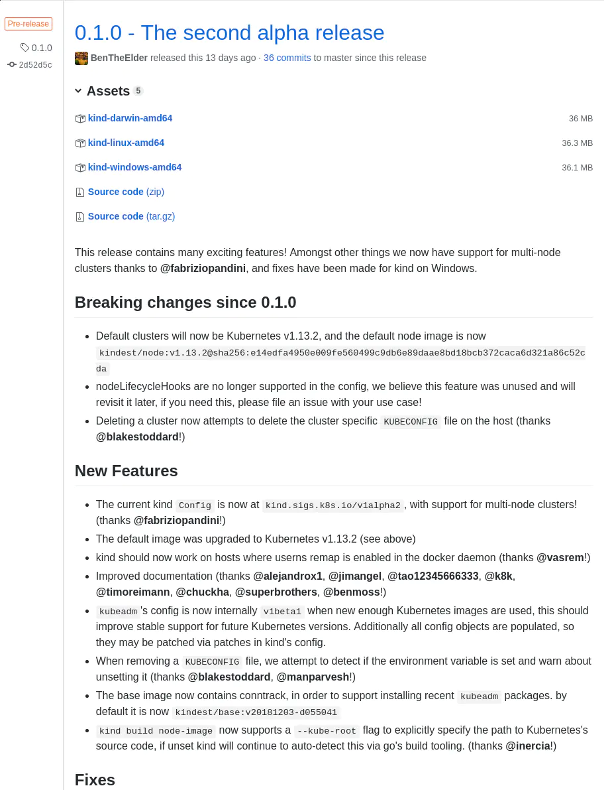
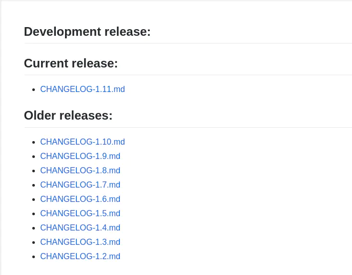
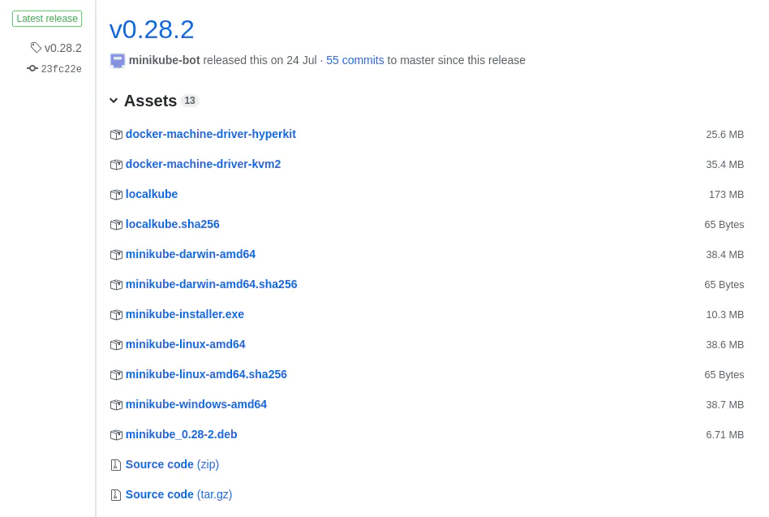
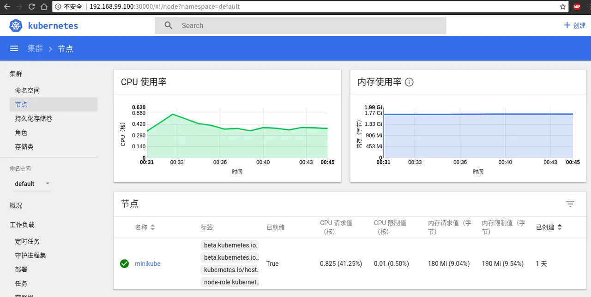

# 04 搭建 Kubernetes 集群 - 本地快速搭建

通过之前的学习，我们已经知道了 K8S 中有一些组件是必须的，集群中有不同的角色。本节，我们在本地快速搭建一个集群，以加深我们学习到的东西。

## 方案选择

在上一节中，我们知道 K8S 中有多种功能组件，而这些组件要在本地全部搭建好，需要一些基础知识，以及在搭建过程中会浪费不少的时间，从而可能会影响我们正常的搭建集群的目标。

所以，我们这里提供两个最简单，最容易实现我们目标的工具

- [KIND](https://github.com/kubernetes-sigs/kind/) 。
- [Minikube](https://github.com/kubernetes/minikube) 。

## KIND

### 介绍

KIND（Kubernetes in Docker）是为了能提供更加简单，高效的方式来启动 K8S 集群，目前主要用于比如 `Kubernetes` 自身的 CI 环境中。

### 安装

- 可以直接在项目的 [Release 页面](https://github.com/kubernetes-sigs/kind/releases) 下载已经编译好的二进制文件。(下文中使用的是 v0.1.0 版本的二进制包)

注意：如果不直接使用二进制包，而是使用 `go get sigs.k8s.io/kind` 的方式下载，则与下文中的配置文件不兼容。**请参考使用 Kind 搭建你的本地 Kubernetes 集群** 这篇文章。

更新（2020 年 2 月 5 日）：KIND 已经发布了 v0.7.0 版本，如果你想使用新版本，建议参考 [使用 Kind 在离线环境创建 K8S 集群](https://zhuanlan.zhihu.com/p/105173589) ，这篇文章使用了最新版本的 KIND。



### 创建集群 **在使用 KIND 之前，你需要本地先安装好 Docker 的环境**，此处暂不做展开

由于网络问题，我们此处也需要写一个配置文件，以便让 `kind` 可以使用国内的镜像源。（KIND 最新版本中已经内置了所有需要的镜像，无需此操作）

```plaintext
apiVersion: kind.sigs.k8s.io/v1alpha1
kind: Config
kubeadmConfigPatches:
- |
  apiVersion: kubeadm.k8s.io/v1alpha3
  kind: InitConfiguration
  nodeRegistration:
  kubeletExtraArgs:
    pod-infra-container-image: registry.aliyuncs.com/google_containers/pause-amd64:3.1
- |
  apiVersion: kubeadm.k8s.io/v1alpha3
  kind: ClusterConfiguration
  imageRepository: registry.aliyuncs.com/google_containers
  kubernetesVersion: v1.12.2
  networking:
    serviceSubnet: 10.0.0.0/16
```

将上面的内容保存成 `kind-config.yaml` 文件，执行以下命令即可。

```plaintext
kind create cluster --image kindest/node:v1.12.2 --config kind-config.yaml --name moelove                  
```

下面为在我机器上执行的程序输出：

```shell
(MoeLove) ➜  kind ✗ kind create cluster --image kindest/node:v1.12.2 --config kind-config.yaml --name moelove                  
Creating cluster 'kind-moelove' ...
 ✓ Ensuring node image (kindest/node:v1.12.2) 🖼
 ✓ [kind-moelove-control-plane] Creating node container 📦                                                         
 ✓ [kind-moelove-control-plane] Fixing mounts 🗻
 ✓ [kind-moelove-control-plane] Starting systemd 🖥
 ✓ [kind-moelove-control-plane] Waiting for docker to be ready 🐋                                                  
 ✓ [kind-moelove-control-plane] Starting Kubernetes (this may take a minute) ☸                                     
Cluster creation complete. You can now use the cluster with:
export KUBECONFIG="$(kind get kubeconfig-path --name="moelove")"
kubectl cluster-info
```

这里，通过传递上面的 `kind-config.yaml` 文件给 `kind create cluster`, 并传递了一个名字通过 `--name` 参数。

我们按照程序输出的提示进行操作：

```plaintext
export KUBECONFIG="$(kind get kubeconfig-path --name="moelove")"
kubectl cluster-info
```

下面为在我机器上执行的程序输出：

```shell
(MoeLove) ➜  kind ✗ export KUBECONFIG="$(kind get kubeconfig-path --name="moelove")"
(MoeLove) ➜  kind ✗ kubectl cluster-info
Kubernetes master is running at https://localhost:35911
KubeDNS is running at https://localhost:35911/api/v1/namespaces/kube-system/services/kube-dns:dns/proxy
To further debug and diagnose cluster problems, use 'kubectl cluster-info dump'.
(MoeLove) ➜  kind ✗ kubectl version
Client Version: version.Info{Major:"1", Minor:"11", GitVersion:"v1.11.3", GitCommit:"a4529464e4629c21224b3d52edfe0ea91b072862", GitTreeState:"clean", BuildDate:"2018-09-09T18:02:47Z", GoVersion:"go1.10.3", Compiler:"gc", Platform:"linux/amd64"}
Server Version: version.Info{Major:"1", Minor:"12", GitVersion:"v1.12.2", GitCommit:"17c77c7898218073f14c8d573582e8d2313dc740", GitTreeState:"clean", BuildDate:"2018-10-24T06:43:59Z", GoVersion:"go1.10.4", Compiler:"gc", Platform:"linux/amd64"}
```

注意，这里需要安装 `kubectl`。 `kubectl` 的安装可参考下面的内容。

当你执行 `kubectl cluster-info` 如果可以看到类似我上面的输出，那你本地的 K8S 集群就已经部署好了。你可以直接阅读第 5 节或者第 6 节的内容。

如果你已经对 K8S 有所了解，并且对 Dashboard 有比较强烈需求的话, 可直接参考第 20 节的内容。

## Minikube

### 介绍

Minikube 是 K8S 官方为了开发者能在个人电脑上运行 K8S 而提供的一套工具。实现上是通过 Go 语言编写，通过调用虚拟化管理程序，创建出一个运行在虚拟机内的单节点集群。

注：从这里也可以看出，对于 K8S 集群的基本功能而言，节点数并没有什么限制。只有一个节点同样可以创建集群。

### 前期准备

- 首先需要确认 BIOS 已经开启了 `VT-x` 或者 `AMD-v` 虚拟化的支持。具体方式可参考 [确认是否已开启 BIOS 虚拟化](https://www.shaileshjha.com/how-to-find-out-if-intel-vt-x-or-amd-v-virtualization-technology-is-supported-in-windows-10-windows-8-windows-vista-or-windows-7-machine/), [开启 BIOS 虚拟化支持](https://www.howtogeek.com/213795/how-to-enable-intel-vt-x-in-your-computers-bios-or-uefi-firmware/) 这两篇文章。
- 其次我们需要安装一个虚拟化管理程序，这里的选择可根据你实际在用的操作系统来决定。官方推荐如下:
  - macOS: [VirtualBox](https://www.virtualbox.org/wiki/Downloads) 或 [VMware Fusion](https://www.vmware.com/products/fusion) 或 [HyperKit](https://github.com/moby/hyperkit)。如果使用 Hyperkit 需要注意系统必须是 `OS X 10.10.3 Yosemite` 及之后版本的。
  - Linux: [VirtualBox](https://www.virtualbox.org/wiki/Downloads) 或 [KVM](http://www.linux-kvm.org/)。
  - Windows: [VirtualBox](https://www.virtualbox.org/wiki/Downloads) 或 [Hyper-V](https://msdn.microsoft.com/en-us/virtualization/hyperv_on_windows/quick_start/walkthrough_install)。

我个人推荐无论你在以上哪种操作系统中使用 Minikube 都选择用 `Virtualbox` 作为虚拟化管理程序，1. Virtualbox 无论操作体验还是安装都比较简单 2. Minikube 对其支持更完备，并且也已经经过大量用户测试，相关问题均已基本修复。

_如果你是在 Linux 系统上面，其实还有一个选择，便是将 Minikube 的 --vm-driver 参数设置为 none ，并且在本机已经正确安装 Docker。 这种方式是无需虚拟化支持的。_

### 安装 kubectl

上一节我们已经学到 K8S 集群是典型的 C/S 架构，有一个官方提供的名为 `kubectl` 的 CLI 工具。在这里，我们要安装 `kubectl` 以便后续我们可以对搭建好的集群进行管理。

**注：由于 API 版本兼容的问题，尽量保持 kubectl 版本与 K8S 集群版本保持一致，或版本相差在在一个小版本内。** 官方文档提供了 `macOS`, `Linux`, `Windows` 等操作系统上的安装方式，且描述很详细，这里不过多赘述，[文档地址](https://kubernetes.io/docs/tasks/tools/install-kubectl/#install-kubectl)。**此处提供一个不同于官方文档中的安装方式。**

- 访问 K8S 主仓库的 [CHANGELOG 文件](https://github.com/kubernetes/kubernetes/blob/master/CHANGELOG.md.html) 找到你所需要的版本。 由于我们将要使用的 Minikube 是官方最新的稳定版 v0.28.2，而它内置的 Kubernetes 的版本是 v1.10 所以，我们选择使用对应的 [1.10 版本](https://github.com/kubernetes/kubernetes/blob/master/CHANGELOG-1.10.md.html)的 `kubectl`。当然，我们也可以通过传递参数的方式来创建不同版本的集群。如 `minikube start --kubernetes-version v1.11.3` 用此命令创建 `v1.11.3` 版本的集群，当然 `kubectl` 的版本也需要相应升级。



点击[Client Binaries](https://github.com/kubernetes/kubernetes/blob/master/CHANGELOG-1.10.md#client-binaries) 找到你符合所需系统架构的对应包下载即可。这里我以 [Linux 下 64 位的包](https://dl.k8s.io/v1.10.7/kubernetes-client-linux-amd64.tar.gz)为例。

```plaintext
➜  wget https://dl.k8s.io/v1.10.7/kubernetes-client-linux-amd64.tar.gz
➜  echo '169b57c6707ed8d8be9643b0088631e5c0c6a37a5e99205f03c1199cd32bc61e  kubernetes-client-linux-amd64.tar.gz' | sha256sum -c -
kubernetes-client-linux-amd64.tar.gz: 成功
➜  tar zxf kubernetes-client-linux-amd64.tar.gz
➜  sudo mv kubernetes/client/bin/kubectl /usr/local/bin/kubectl
➜  /usr/local/bin/kubectl version --client
Client Version: version.Info{Major:"1", Minor:"10", GitVersion:"v1.10.7", GitCommit:"0c38c362511b20a098d7cd855f1314dad92c2780", GitTreeState:"clean", BuildDate:"2018-08-20T10:09:03Z", GoVersion:"go1.9.3", Compiler:"gc", Platform:"linux/amd64"}
```

执行以上命令即可完成 `kubectl` 的安装，最后一步会看到当前安装的版本信息等。

### 安装 Minikube

先查看 Minikube 的 [Release 页面](https://github.com/kubernetes/minikube/releases)，当前最新的稳定版本是 v0.28.2，找到你所需系统的版本，点击下载，并将下载好的可执行文件加入你的 PATH 中。



**注：当前 Windows 系统下的安装包还处于实验性质，如果你是在 Windows 环境下，同样是可以下载安装使用的**

以 Linux 下的安装为例：

```plaintext
➜  wget -O minikube https://github.com/kubernetes/minikube/releases/download/v0.28.2/minikube-linux-amd64
➜  chmod +x minikube
➜  sudo mv minikube /usr/local/bin/minikube
➜  /usr/local/bin/minikube version
minikube version: v0.28.2
```

最后一步可查看当前已安装好的 Minikube 的版本信息。如果安装成功将会看到和我上面内容相同的结果。

### 创建第一个 K8S 集群

使用 Minikube 创建集群，只要简单的执行 `minikube start` 即可。正常情况下，你会看到和我类似的输出。

```python
➜  ~ minikube start
Starting local Kubernetes v1.10.0 cluster...
Starting VM...
Getting VM IP address...
Moving files into cluster...
Setting up certs...
Connecting to cluster...
Setting up kubeconfig...
Starting cluster components...
Kubectl is now configured to use the cluster.
Loading cached images from config file.
➜  ~ minikube status
minikube: Running
cluster: Running
kubectl: Correctly Configured: pointing to minikube-vm at 192.168.99.100         
```

为了验证我们的集群目前是否均已配置正确，可以执行以下命令查看。

```shell
➜  ~ kubectl cluster-info 
Kubernetes master is running at https://192.168.99.100:8443
KubeDNS is running at https://192.168.99.100:8443/api/v1/namespaces/kube-system/services/kube-dns:dns/proxy
To further debug and diagnose cluster problems, use 'kubectl cluster-info dump'.
➜  ~ kubectl get nodes
NAME       STATUS    ROLES     AGE       VERSION
minikube   Ready     master    1d       v1.10.0
```

如果出现类似拒绝连接之类的提示，那可能是因为你的 `kubectl` 配置不正确，可查看 `$HOME/.kube/config` 文件检查配置。示例输出如下：

```plaintext
➜  ~ cat .kube/config
apiVersion: v1
clusters:
- cluster:
    certificate-authority: /home/tao/.minikube/ca.crt
    server: https://192.168.99.100:8443
  name: minikube
contexts:
- context:
    cluster: minikube
    user: minikube
  name: minikube
current-context: minikube
kind: Config
preferences: {}
users:
- name: minikube
  user:
    client-certificate: /home/tao/.minikube/client.crt
    client-key: /home/tao/.minikube/client.key
```

如果没有该文件，可按上面示例内容进行创建，替换掉其中的路径及 `server` 地址配置。 `server` 地址可通过 `minikube status` 或者 `minikube ip` 查看或检查。

```plaintext
(Tao) ➜  ~ minikube ip
192.168.99.100
(Tao) ➜  ~ minikube status
minikube: Running
cluster: Running
kubectl: Correctly Configured: pointing to minikube-vm at 192.168.99.100
```

### 通过 Dashboard 查看集群当前状态

使用 `Minikube` 的另一个好处在于，你可以不用关注太多安装方面的过程，直接在终端下输入 `minikube dashboard` 打开系统 Dashboard 并通过此来查看集群相关状态。

执行 `minikube dashboard` 后会自动打开浏览器，默认情况下监听在通过 `minikube ip` 所获得 IP 的 3000 端口。如下图所示：



### 相关链接

- [安装 VirtualBox](https://websiteforstudents.com/installing-virtualbox-ubuntu-17-04/)
- [使用 Kind 搭建你的本地 Kubernetes 集群](https://juejin.im/post/6844903807562989582)

## 总结

本节中，我们为了能更快的体验到 K8S 集群，避免很多繁琐的安装步骤，我们选择了使用官方提供的 `Minikube` 工具来搭建一个本地集群。

Minikube 的本质其实是将一套 “定制化” 的 K8S 集群打包成 ISO 镜像，当执行 `minikube start` 的时候，便通过此镜像启动一个虚拟机，在此虚拟机上通过 `kubeadm` 工具来搭建一套只有一个节点的 K8S 集群。关于 `kubeadm` 工具，我们在下节进行讲解。

同时，会通过虚拟机的相关配置接口拿到刚才所启动虚拟机的地址信息等，并完成本地的 `kubectl` 工具的配置，以便于让用户通过 `kubectl` 工具对集群进行操作。

事实上，当前 Docker for Mac 17.12 CE Edge 和 Docker for Windows 18.02 CE Edge ，以及这两种平台更高的 Edge 版本, 均已内置了对 K8S 的支持，但均为 Edge 版本，此处暂不做过多介绍。
