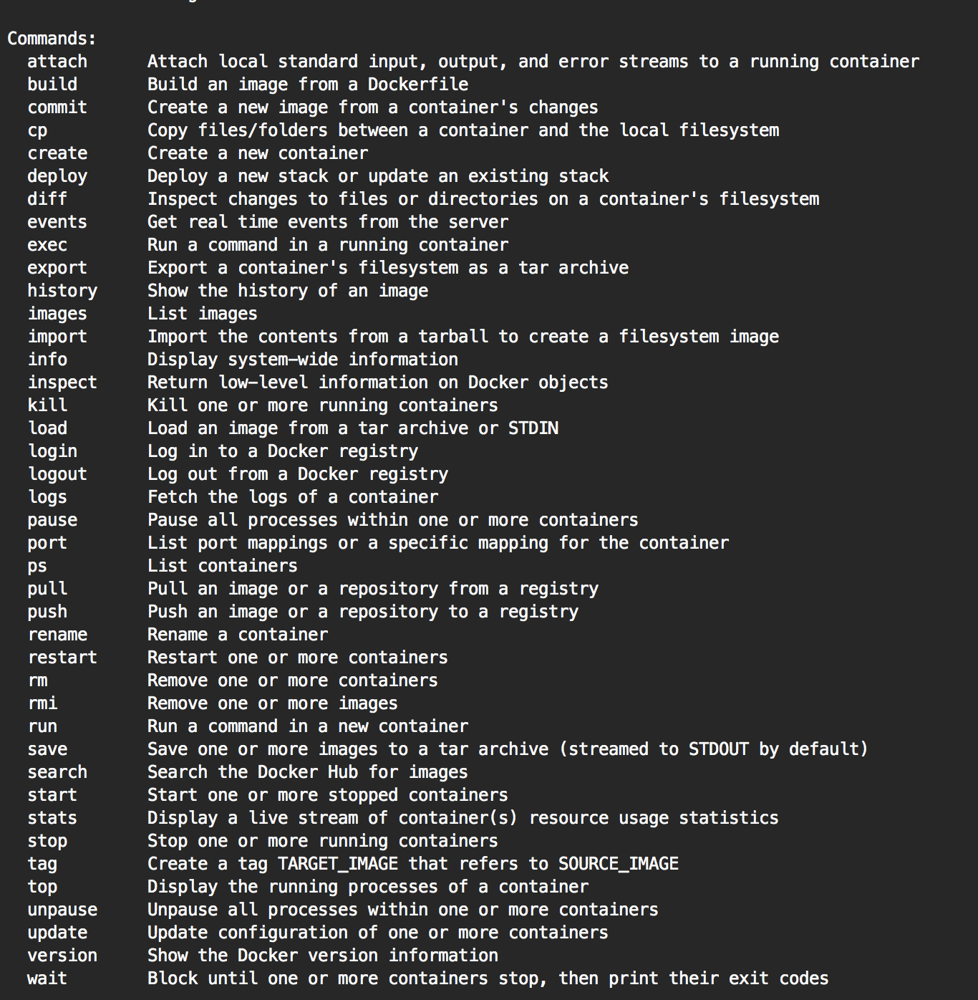

# 02 Docker 命令行实践

Docker 官方为了让用户快速上手，提供了一个 [交互式教程](https://docs.docker.com/get-started/)。随着 Docker 技术的快速演进，命令子集已日趋丰富。我们可以通过运行 `docker` 或 `docker --help` 获取完整的命令帮助清单：

```shell
sudo docker
```



Docker 子命令已达到 40 余个，其中核心子命令（如 `run`）还包含丰富的选项参数。按照功能和应用场景，可将 Docker 命令行划分为以下四大核心模块：

| 功能划分模块 | 包含的核心子命令 |
| --- | --- |
| **环境信息相关** | `info`, `version` |
| **系统运维相关** | `attach`, `build`, `commit`, `cp`, `diff`, `images`, `export/import/save/load`, `inspect`, `kill`, `port`, `pause/unpause`, `ps`, `rm`, `rmi`, `run`, `start/stop/restart`, `tag`, `top`, `wait`, `rename`, `stats`, `update`, `exec`, `deploy`, `create` |
| **日志与事件相关** | `events`, `history`, `logs` |
| **Docker Hub 服务相关** | `login/logout`, `pull/push`, `search` |

---

## 命令行参数约定

1. **单字符选项组合**：单个字符的短参数可以组合配置，例如：
   ```shell
   docker run -t -i --name test busybox sh
   ```
   等同于：
   ```shell
   docker run -ti --name test busybox sh
   ```
2. **布尔值约定**：Boolean 参数如 `-d=false`。若显示声明 `-d=true`（或直接使用 `-d`），容器将在后台守护进程方式运行。
3. **字符串与数字**：如 `--name="test"` 定义字符串参数，只能定义一次；如 `-c=0` 定义数字参数。

---

## 后台引擎守护进程 (dockerd)

Docker 的守护进程是一个常驻后台的系统进程，目前已独立拆分为 `dockerd` 运行。运行 `dockerd --help` 可以查看其参数配置：

```text
Usage: dockerd COMMAND
A self-sufficient runtime for containers.

Options:
      --add-runtime runtime                   Register an additional OCI compatible runtime
      --config-file string                    Daemon configuration file (default "/etc/docker/daemon.json")
      --data-root string                      Root directory of persistent Docker state (default "/var/lib/docker")
  -H, --host list                             Daemon socket(s) to connect to
  -l, --log-level string                      Set the logging level ("debug", "info", "warn", "error", "fatal")
```

核心后台引擎 `dockerd` 常用参数解析如下表：

| 参数名称 | 参数类型/默认值 | 作用与功能说明 |
| --- | --- | --- |
| **`--add-runtime`** | `runtime` | 注册额外的 OCI 兼容容器运行时（默认 `containerd`） |
| **`--allow-nondistributable-artifacts`** | `list` | 配置允许分发受限受保护基础镜像的私有 Registry 地址 |
| **`--api-cors-header`** | `string` | 设置 Engine API 响应的 CORS 跨域请求头 |
| **`--authorization-plugin`** | `list` | 配置鉴权扩展插件 |
| **`--bip`** | `string` | 指定网桥 `docker0` 的 IP 地址与掩码 |
| **`-b, --bridge`** | `string` | 将容器连接到指定的网桥 |
| **`--cgroup-parent`** | `string` | 设置所有容器的父 Cgroup 节点 |
| **`--config-file`** | `string` | 守护进程配置文件路径（默认 `/etc/docker/daemon.json`） |
| **`--containerd`** | `string` | 指定 `containerd` Socket 套接字路径 |
| **`--data-root`** | `string` | Docker 数据持久化根目录（默认 `/var/lib/docker`） |
| **`-D, --debug`** | boolean | 开启 Debug 调试模式 |
| **`--default-gateway`** | `ip` | 容器默认 IPv4 网关 |
| **`--default-runtime`** | `string` | 默认 OCI 运行时（默认 `runc`） |
| **`--default-ulimit`** | `ulimit` | 容器默认的最大文件句柄及 Limit 限制 |
| **`--dns`** | `list` | 容器默认使用的 DNS 服务器地址 |
| **`--experimental`** | boolean | 开启实验性特性支持 |
| **`-H, --host`** | `list` | 守护进程监听的 Socket 地址（如 `unix:///var/run/docker.sock`） |
| **`--insecure-registry`** | `list` | 配置允许非 HTTPS 通信的私有镜像仓库地址 |
| **`--live-restore`** | boolean | 开启容器热恢复特性（守护进程重启时保持容器继续运行） |
| **`--log-driver`** | `string` | 默认日志驱动（默认 `json-file`） |
| **`-l, --log-level`** | `string` | 日志输出级别（`debug`, `info`, `warn`, `error`, `fatal`） |
| **`--registry-mirror`** | `list` | 配置优先使用的 Docker 镜像加速器镜像站点 |
| **`-s, --storage-driver`** | `string` | 指定存储驱动（如 `overlay2`） |

---

## Docker 核心命令行探秘

### 1. 环境信息相关

#### `info`
- **使用方法**：`docker info`
- **使用说明**：展示系统级配置、已运行容器数、镜像数、存储驱动、内核版本等。在提交 Bug 或反馈排查时非常实用。

```shell
$ sudo docker -D info
Containers: 0
Images: 32
Storage Driver: devicemapper
 Pool Name: docker-252:1-130159-pool
 Execution Driver: native-0.2
Kernel Version: 3.11.10-301.fc20.x86_64
Debug mode (server): false
Debug mode (client): true
```

#### `version`
- **使用方法**：`docker version`
- **使用说明**：显示 Docker 客户端与服务端 Engine 的版本号、API 版本、Git Commit 及 Go 编译器版本。

---

### 2. 系统运维相关

#### `attach`
- **使用方法**：`docker attach [OPTIONS] CONTAINER`
- **使用说明**：附加进入正在后台运行的容器主终端，观察容器内主进程的运行输出。

```shell
$ ID=$(sudo docker run -d ubuntu /usr/bin/top -b)
$ sudo docker attach $ID
top - 17:21:49 up  5:53,  0 users,  load average: 0.63, 1.15, 0.78
Tasks:   1 total,   1 running,   0 sleeping,   0 stopped,   0 zombie
```

#### `build`
- **使用方法**：`docker build [OPTIONS] PATH | URL | -`
- **使用说明**：从指定路径下的 Dockerfile 源码构建新的镜像层。

```shell
$ docker build -t my-app:v1 .
Uploading context 18.829 MB
Step 1/2 : FROM busybox
Step 2/2 : CMD echo Hello world
Successfully built 99cc1ad10469
```

#### `commit`
- **使用方法**：`docker commit [OPTIONS] CONTAINER [REPOSITORY[:TAG]]`
- **使用说明**：将变动后的容器持久化提交为一个新的本地镜像（适用于调试临时环境，正式部署推荐使用 Dockerfile）。

```shell
$ docker commit c3f279d17e0a myuser/testimage:version3
sha256:f5283438590d...
```

#### `cp`
- **使用方法**：`docker cp CONTAINER:PATH HOSTPATH` 或 `docker cp HOSTPATH CONTAINER:PATH`
- **使用说明**：在容器文件系统与宿主机文件系统之间复制文件或目录。

#### `diff`
- **使用方法**：`docker diff CONTAINER`
- **使用说明**：查看容器文件系统相对于底层镜像的改动清单（`A` 新增，`D` 删除，`C` 修改）。

```shell
$ sudo docker diff 7bb0e258aefe
C /dev
A /dev/kmsg
C /etc
A /etc/mtab
```

#### `images`
- **使用方法**：`docker images [OPTIONS] [REPOSITORY[:TAG]]`
- **使用说明**：列出本地的镜像列表。

```shell
$ docker images
REPOSITORY          TAG                 IMAGE ID            CREATED             SIZE
ubuntu              18.04               4c108a981567        2 weeks ago         64.2MB
busybox             latest              beae888d3e92        1 month ago         1.24MB
```

#### `export` / `import` / `save` / `load`
- **使用方法**：
  ```shell
  # 导出/导入容器快照
  docker export container_id > container.tar
  docker import container.tar myimage:v1

  # 归档/加载镜像包
  docker save -o image.tar image_name
  docker load -i image.tar
  ```
- **使用说明**：`export/import` 针对容器快照（丢弃历史层），`save/load` 针对完整镜像历史层包。

#### `inspect`
- **使用方法**：`docker inspect [OPTIONS] NAME|ID [NAME|ID...]`
- **使用说明**：以 JSON 格式返回容器或镜像的高维底层元数据。

```shell
$ docker inspect --format='{{.NetworkSettings.IPAddress}}' my_container
172.17.0.2
```

#### `kill`
- **使用方法**：`docker kill [OPTIONS] CONTAINER [CONTAINER...]`
- **使用说明**：向容器发送 `SIGKILL` 信号立即强行终止运行。

#### `port`
- **使用方法**：`docker port CONTAINER [PRIVATE_PORT[/PROTO]]`
- **使用说明**：查看容器内部端口与宿主机端口的 NAT 映射关系。

#### `pause` / `unpause`
- **使用方法**：`docker pause CONTAINER` / `docker unpause CONTAINER`
- **使用说明**：利用 Cgroups Freezer 子系统暂停/恢复容器内的所有进程。

#### `ps`
- **使用方法**：`docker ps [OPTIONS]`
- **使用说明**：列出容器列表（`-a` 参数可列出包含已终结的全部历史容器）。

```shell
$ docker ps
CONTAINER ID        IMAGE               COMMAND             CREATED             STATUS              PORTS               NAMES
4c01db0b339c        ubuntu:18.04        "bash"              17 seconds ago      Up 16 seconds                           webapp
```

#### `rm` / `rmi`
- **使用方法**：`docker rm CONTAINER` / `docker rmi IMAGE`
- **使用说明**：`rm` 用于删除指定的容器；`rmi` 用于删除指定的镜像。

#### `run`
- **使用方法**：`docker run [OPTIONS] IMAGE [COMMAND] [ARG...]`
- **使用说明**：核心命令，创建并启动一个新的容器。

#### `start` / `stop` / `restart`
- **使用方法**：`docker start/stop/restart CONTAINER`
- **使用说明**：控制已存在容器的启动、优雅停止（`SIGTERM`）与重启。

#### `tag`
- **使用方法**：`docker tag SOURCE_IMAGE[:TAG] TARGET_IMAGE[:TAG]`
- **使用说明**：为本地镜像打一个新的标记（Tag），常用于推送到镜像仓库前的命名整理。

#### `top`
- **使用方法**：`docker top CONTAINER`
- **使用说明**：查看指定容器内部正在运行的进程列表。

#### `wait`
- **使用方法**：`docker wait CONTAINER`
- **使用说明**：阻塞当前终端，直到目标容器停止运行并打印其退出码。

#### `rename`
- **使用方法**：`docker rename CONTAINER NEW_NAME`
- **使用说明**：为现有容器重新命名。

#### `stats`
- **使用方法**：`docker stats [CONTAINER...]`
- **使用说明**：实时动态流式输出容器的 CPU、内存、网络及磁盘 I/O 占用资源监控指标。

#### `update`
- **使用方法**：`docker update [OPTIONS] CONTAINER`
- **使用说明**：动态更新运行中容器的 Cgroup 资源限额（如 CPU 时间片、Memory 上限）。

#### `exec`
- **使用方法**：`docker exec [OPTIONS] CONTAINER COMMAND [ARG...]`
- **使用说明**：在正在运行的容器内部启动一个新的独立的命令进程（如 `docker exec -it container_id /bin/bash`）。

#### `create`
- **使用方法**：`docker create [OPTIONS] IMAGE [COMMAND] [ARG...]`
- **使用说明**：仅创建容器的文件系统与配置，但不立即启动它。

---

### 3. 日志信息与事件相关

#### `events`
- **使用方法**：`docker events [OPTIONS]`
- **使用说明**：实时监听并打印 Docker 引擎发生的系统事件（如容器创建、启动、销毁、挂载等）。

#### `history`
- **使用方法**：`docker history IMAGE`
- **使用说明**：查看指定镜像的各构建层历史指令与所占空间大小。

```shell
$ docker history ubuntu:18.04
IMAGE               CREATED             CREATED BY                                      SIZE
4c108a981567        2 weeks ago         /bin/sh -c #(nop)  CMD ["bash"]                 0B
<missing>           2 weeks ago         /bin/sh -c #(nop) ADD file:5d10d18... in /      64.2MB
```

#### `logs`
- **使用方法**：`docker logs [OPTIONS] CONTAINER`
- **使用说明**：获取或持续追踪（`-f`）容器的标准输出与错误日志。

---

### 4. Docker Hub 服务相关

#### `login` / `logout`
- **使用方法**：`docker login [SERVER]` / `docker logout [SERVER]`
- **使用说明**：登录或注销镜像仓库认证凭据（默认 Docker Hub）。

#### `pull` / `push`
- **使用方法**：`docker pull NAME[:TAG]` / `docker push NAME[:TAG]`
- **使用说明**：从远程 Registry 拉取镜像或将本地镜像上传分享到远程仓库。

#### `search`
- **使用方法**：`docker search TERM`
- **使用说明**：在官方 Docker Hub 仓库中按关键字搜索公共镜像。

---

## 总结

熟练掌握 Docker 命令行是进行容器化架构改造与日常 DevOps 运维的基础。通过客户端与服务端架构的解耦设计，相同的 Docker CLI 可以在本地高效管控远程容器引擎。在实际生产实践中，建议结合 Dockerfile 与 Compose 编排文件将命令行操作配置化与自动化。
