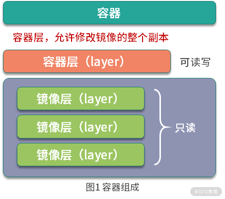
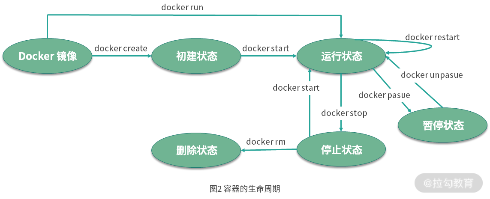

# 04 容器操作：得心应手掌握 Docker 容器基本操作

面试中经常会被问到“容器和镜像的区别是什么”。简单来说，镜像是一个包含完整根文件系统的静态只读模板；而容器则是基于镜像创建的、包含了可写层的动态运行实例。

本课时将深入讲解容器的本质概念、生命周期模型以及生产实践中的核心操作命令。

## 1. 容器（Container）是什么？

容器是基于镜像创建的可运行实例，独立且隔离。当运行容器化环境时，实际上是在镜像只读层（Read-Only Layer）之上添加了一个全新的可写层（Read-Write Container Layer），允许在容器内部修改整个文件系统的副本。



*图 1 容器结构组成*

## 2. 容器的生命周期

容器的生命周期包含以下 5 种状态：

1. **created**：初建状态（容器已创建但未启动进程）；
2. **running**：运行状态（容器主进程在后台或前台正常运行）；
3. **stopped**：停止/终止状态（主进程已退出或被终止）；
4. **paused**：暂停状态（进程通过 Cgroups Freezer 被冻结挂起）；
5. **deleted**：删除状态（容器文件系统及元数据被彻底物理删除）。

容器生命周期转换关系如下图所示：



*图 2 容器生命周期状态转换*

状态转化关系：
- `docker create` 创建容器 -> **created**；
- `docker start` 启动容器 -> **running**；
- `docker stop` 停止容器 -> **stopped**；
- `docker pause` 暂停容器 -> **paused**；
- `docker unpause` 恢复容器 -> **running**；
- `docker rm` 强制或正常清除容器 -> **deleted**。

---

## 3. 容器的核心操作

容器的操作包含五个核心步骤：创建与启动、终止与重启、进入容器、删除容器、导入与导出容器。

### 3.1 创建并启动容器

容器极其轻量，可以快速创建与销毁。

#### 1. 创建容器 (`docker create`)

```shell
docker create -it --name=busybox busybox
```

终端输出示例：

```text
Unable to find image 'busybox:latest' locally
latest: Pulling from library/busybox
61c5ed1cbdf8: Pull complete
Digest: sha256:4f47c01fa91355af2865ac10fef5bf6ec9c7f42ad2321377c21e844427972977
Status: Downloaded newer image for busybox:latest
2c2e919c2d6dad1f1712c65b3b8425ea656050bd5a0b4722f8b01526d5959ec6
```

查看已创建的容器列表：

```shell
$ docker ps -a | grep busybox
2c2e919c2d6d        busybox             "sh"                     34 seconds ago      Created                                         busybox
```

#### 2. 启动已创建的容器 (`docker start`)

```shell
docker start busybox
```

使用 `docker ps` 查看处于运行状态的容器：

```shell
$ docker ps
CONTAINER ID        IMAGE               COMMAND             CREATED             STATUS              PORTS               NAMES
d6f3d364fad3        busybox             "sh"                16 seconds ago      Up 8 seconds                            busybox
```

#### 3. 新建并启动容器 (`docker run`)

`docker run` 相当于组合执行了 `docker create` 和 `docker start`：

```shell
docker run -it --name=busybox busybox
```

`docker run` 后台执行流程：
1. 检查本地是否存在指定镜像，若无则从 Docker Hub 自动拉取；
2. 基于镜像创建并启动容器；
3. 为容器分配独占的文件系统，在只读层之上挂载一个可写层；
4. 从 Docker 虚拟网络 Bridge 中分配一个独立 IP；
5. 执行用户的入口启动命令（如 `/bin/sh`）。

参数 `-t` 分配伪终端，`-i` 打开容器的 `STDIN` 输入流，组合 `-it` 可直接进入容器的交互模式：

```shell
/ # ps aux
PID   USER     TIME  COMMAND
    1 root      0:00 sh
    6 root      0:00 ps aux
```

容器内部的 1 号进程即为启动命令 `sh`。在 Docker 架构中，**当容器内部的 1 号主进程退出时，容器也会随之终止。**

### 3.2 终止与重启容器

#### 1. 停止运行中的容器 (`docker stop`)

```shell
docker stop busybox
```

`docker stop` 首先向容器 1 号进程发送 `SIGTERM` 优雅终止信号。若在默认超时时间（10秒）内未响应，则发送 `SIGKILL` 强行终止。

查看已停止的容器状态：

```shell
$ docker ps -a
CONTAINER ID        IMAGE               COMMAND             CREATED             STATUS                     PORTS               NAMES
28d477d3737a        busybox             "sh"                26 minutes ago      Exited (137) About a minute ago                       busybox
```

#### 2. 重启容器 (`docker restart`)

`docker restart` 会直接停止并重新启动容器：

```shell
docker restart busybox
```

### 3.3 进入容器

#### 1. 使用 `docker attach` 附加进容器

```shell
$ docker attach busybox
/ # ps aux
PID   USER     TIME  COMMAND
    1 root      0:00 sh
    7 root      0:00 ps aux
```

> **注意**：`docker attach` 直接挂载到容器的 1 号进程。当多个终端同时使用 `attach` 时，所有窗口会完全同步屏显；一旦阻塞其他终端也无法输入。若在终端使用 `exit` 退出，会导致容器 1 号进程终止而使容器关闭。因此生产中一般不推荐使用 `attach`。

#### 2. 使用 `docker exec` 启动新进程进入（推荐）

`docker exec` 可以在已运行的容器内派生启动一个全新的独立进程：

```shell
docker exec -it busybox sh
```

在容器内查看进程列表：

```shell
/ # ps aux
PID   USER     TIME  COMMAND
    1 root      0:00 sh
    7 root      0:00 sh
   12 root      0:00 ps aux
```

可以看到新启动了一个独立的 PID 为 7 的 `sh` 进程。退出该 `sh` 窗口不会影响容器 1 号主进程的运行。

### 3.4 删除容器

#### 1. 删除已停止的容器

```shell
docker rm busybox
```

#### 2. 强制删除正在运行的容器 (`-f`)

```shell
docker rm -f busybox
```

开启 `-f` 参数后，Docker 会首先向容器发送 `SIGKILL` 强行杀掉进程，随后清理其存储与元数据。

### 3.5 导出与导入容器

#### 1. 导出容器 (`docker export`)

不管容器当前是否处于运行状态，均可将其文件系统整体导出为 Tar 压缩归档：

先在容器内创建一个测试文件：

```shell
docker exec -it busybox sh
cd /tmp && touch test_file.txt
exit
```

执行导出命令：

```shell
docker export busybox > busybox.tar
```

#### 2. 导入容器快照为镜像 (`docker import`)

使用 `docker import` 可以将导出的容器快照文件直接导入为本地镜像：

```shell
docker import busybox.tar busybox:imported
```

查看导入后镜像的内容：

```shell
$ docker run -it busybox:imported sh
/ # ls -l /tmp/
-rw-r--r--    1 root     root             0 Jul 30 14:30 test_file.txt
```

可以看到之前在容器内部新建的临时文件被完好无损地迁移到了新的镜像中，从而实现了容器数据与镜像的跨机器迁移。

---

## 结语

本课时讲解了容器的本质概念、生命周期的 5 种状态，以及 `create`、`start`、`run`、`exec`、`stop`、`rm`、`export/import` 等核心操作命令。

> **思考题**：
> 为什么容器的文件系统要设计成 Copy-on-Write（写时复制）的分层架构（如图 1 所示），而不是为每个容器完整单独复制一份镜像文件？
> 欢迎在留言区讨论。
