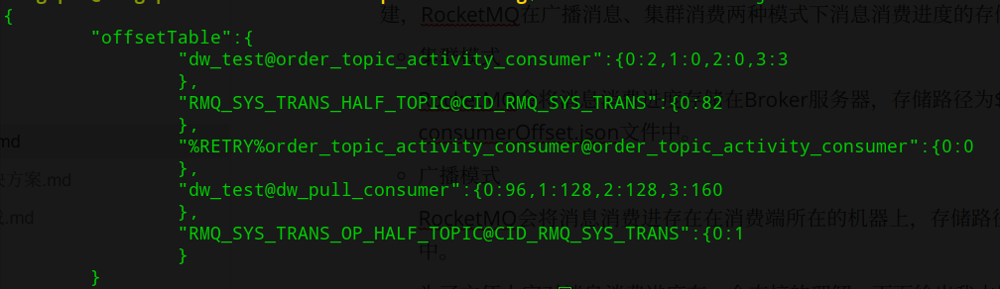
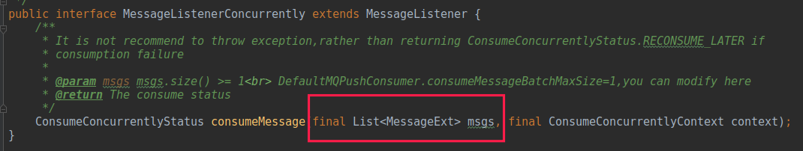
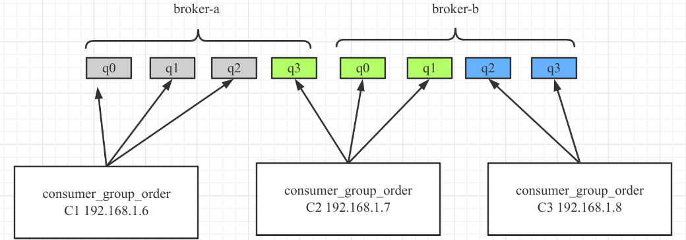
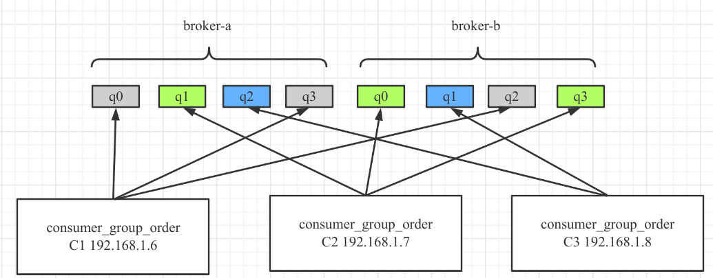
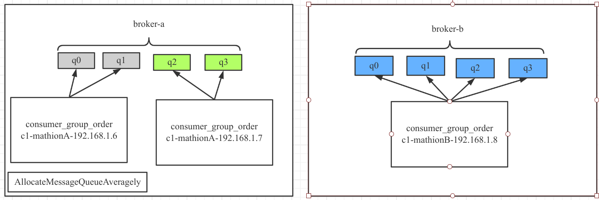
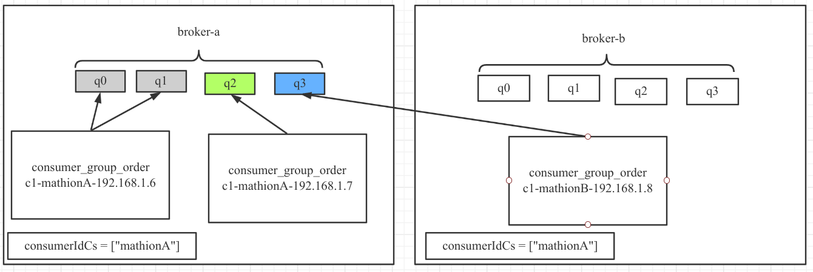
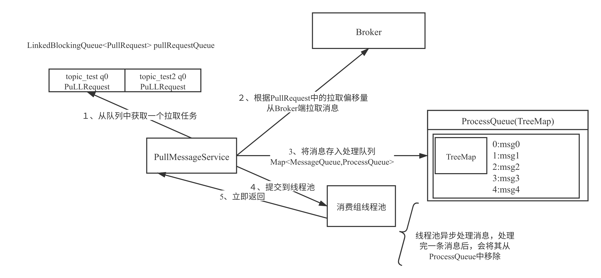
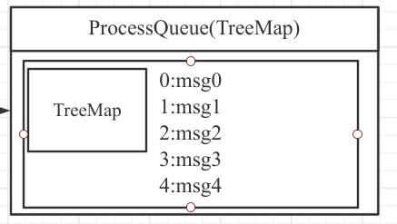
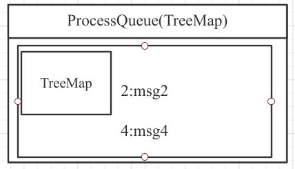
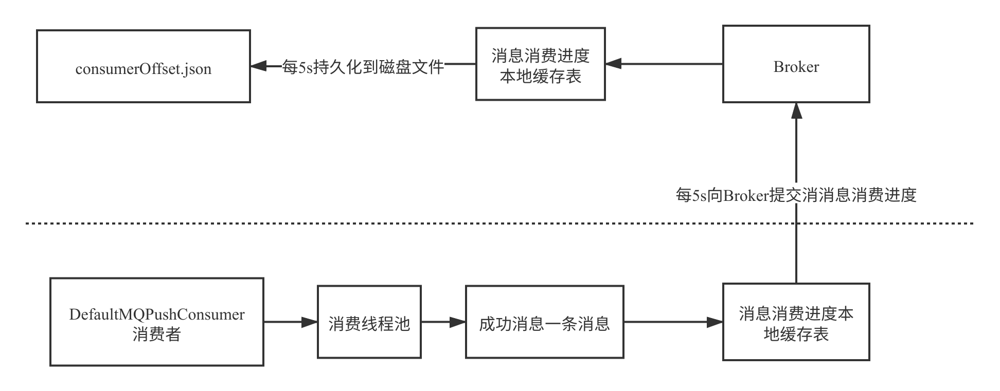

# 09 DefaultMQPushConsumer 核心参数与工作原理

PUSH 模式是对 PULL 模式的封装，类似于一个高级 API，用户使用起来将非常简单，基本将消息消费所需要解决的问题都封装好了，故使用起来将变得简单。与此同时，需要将其用好，那还是需要了解其内部的工作原理以及 PUSH 模式支持哪些参数，这些参数是如何工作的，在使用时有什么注意的呢？

## DefaultMQPushConsumer 核心参数一览与内部原理

DefaultMQPushConsumer 的核心参数一览如下。

**`InternalLogger log`**

消费者用于记录 RocketMQ Consumer 运行日志的 `final` 属性。日志默认路径为 `{user.home}/logs/rocketmqlogs/rocketmq_cliente.log`。

**`String consumerGroup`**

消费组名称。一个消费组是独立的消费隔离单位；多个消费组订阅同一个 Topic 时，各自的消费进度互不影响。

**`MessageModel messageModel`**

消息消费模式，支持集群模式和广播模式：

- 集群模式：同一消费组内的多个消费者共同消费一个 Topic，一条消息只由其中一个消费者处理；
- 广播模式：同一消费组内的每个消费者都消费 Topic 中的全部消息。

**`ConsumeFromWhere consumeFromWhere`**

当消费者首次启动，且消费进度管理器中没有该消费组的进度时，决定从哪里开始消费：

- CONSUME_FROM_LAST_OFFSET：从最新的消息开始消费。
- CONSUME_FROM_FIRST_OFFSET：从最早的位点开始消费。
- CONSUME_FROM_TIMESTAMP：从指定的时间戳开始消费，这里的实现思路是从 Broker 服务器寻找消息的存储时间小于或等于指定时间戳中最大的消息偏移量的消息，从这条消息开始消费。

**`String consumeTimestamp`**

指定开始消费的时间戳，格式为 `yyyyMMddHHmmss`，默认值为当前时间前 30 分钟。只有当 `consumeFromWhere` 为 `CONSUME_FROM_TIMESTAMP` 时生效。

**`AllocateMessageQueueStrategy allocateMessageQueueStrategy`**

消息队列负载算法，主要解决消费队列在各个消费者之间的负载均衡问题。例如，一个 Topic 有 8 个队列，一个消费组有 3 个消费者，需要决定每个消费者分别处理哪些队列。

RocketMQ 默认提供了如下负载均衡算法：

- AllocateMessageQueueAveragely：平均连续分配算法。
- AllocateMessageQueueAveragelyByCircle：平均轮流分配算法。
- AllocateMachineRoomNearby：机房内优先就近分配。
- AllocateMessageQueueByConfig：手动指定，这个通常需要配合配置中心，在消费者启动时，首先先创建 AllocateMessageQueueByConfig 对象，然后根据配置中心的配置，再根据当前的队列信息，进行分配，即该方法不具备队列的自动负载，在 Broker 端进行队列扩容时，无法自动感知，需要手动变更配置。
- AllocateMessageQueueByMachineRoom：消费指定机房中的队列。需要先调用 `setConsumeridcs(Set<String> consumerIdCs)` 设置目标机房，再对筛选出的队列采用平均连续分配算法。

**`AllocateMessageQueueConsistentHash`**：一致性 Hash 算法。

**`OffsetStore offsetStore`**

消息进度存储管理器，该属性为私有属性，不能通过 API 进行修改，该参数主要是根据消费模式在内部自动创建，RocketMQ 在广播消息、集群消费两种模式下消息消费进度的存储策略会有所不同。

- 集群模式：RocketMQ 会将消息消费进度存储在 Broker 服务器，存储路径为 `${ROCKET_HOME}/store/config/ consumerOffset.json` 文件中。
- 广播模式：RocketMQ 会将消息消费进度存储在消费者所在机器上，路径为 `${user.home}/.rocketmq_offsets`。

为了方便大家对消息消费进度有一个直接的理解，下面给出我本地测试时 Broker 集群中的消息消费进度文件，其截图如下：



消息消费进度，首先使用 topic@consumerGroup 为键，其值是一个 Map，键为 Topic 的队列序列，值为当前的消息消费位点。

```java
int consumeThreadMin
```

消费者每一个消费组线程池中最小的线程数量，默认为 20。在 RocketMQ 消费者中，会为每一个消费者创建一个独立的线程池。

```java
int consumeThreadMax
```

消费者最大线程数量，在当前的 RocketMQ 版本中，该参数通常与 consumeThreadMin 保持一致，大于没有意义，因为 RocketMQ 创建的线程池内部创建的队列为一个无界队列。

```java
int consumeConcurrentlyMaxSpan
```

并发消费时，处理队列中最大偏移量与最小偏移量之间的差值阈值。差值超过该值后会触发消费端限流，具体表现为不再向 Broker 拉取该队列的消息，默认值为 2000。

```java
int pullThresholdForQueue
```

消费端允许单个队列积压的消息数量。如果处理队列超过该值，就会触发消费端限流。默认值为 1000，通常不建议修改。

```java
long pullThresholdSizeForQueue
```

消费端允许单个队列积压的消息体大小，默认为 100 MB。

```java
int pullThresholdForTopic
```

按 Topic 级别限制消息数量，默认不开启（值为 -1）。如果设置该值，会用它除以分配给当前消费者的队列数，得到每个消费队列的消息阈值，从而改变 `pullThresholdForQueue`。

```java
long pullThresholdSizeForTopic
```

按 Topic 级别限制消息体大小，默认不开启，最终通过改变 `pullThresholdSizeForQueue` 达到限流效果。

```java
long pullInterval = 0
```

消息拉取的间隔，默认 0 表示，消息客户端在拉取一批消息提交到线程池后立即向服务端拉取下一批，PUSH 模式不建议修改该值。

```java
int pullBatchSize = 32
```

一次消息拉取请求最多从 Broker 返回的消息条数，默认为 32。

```java
int consumeMessageBatchMaxSize
```

一次消息消费最多处理的消息条数，即下图参数 `List<MessageExt> msgs` 中允许的最大消息数量。



```java
int maxReconsumeTimes
```

消息消费重试次数。并发消费模式下默认重试 16 次后进入死信队列；顺序消费模式下，重试次数为 `Integer.MAX_VALUE`。

```java
long suspendCurrentQueueTimeMillis
```

消费模式为顺序消费时设置每一次重试的间隔时间，提高重试成功率。

```java
long consumeTimeout = 15
```

消息消费超时时间，默认为 15 分钟。

### 核心参数工作原理

#### 消息消费队列负载算法

本节通过图解介绍 RocketMQ 默认提供的消息消费队列负载机制。

**`AllocateMessageQueueAveragely`：平均连续分配算法**

主要特点是分配给同一个消费者的消息队列保持连续。



**`AllocateMessageQueueAveragelyByCircle`：平均轮流分配算法**

分配示例如下：



**`AllocateMachineRoomNearby`：机房内优先就近分配**

分配示例如下：



上述场景中，MQ 集群的两台 Broker 分别部署在不同机房，每个机房都部署了一些消费者。队列优先分配给同机房的消费者，也可以指定其他分配算法，例如示例中的平均分配。如果 B 机房的消费者全部宕机，该机房的队列会由其他机房的消费者接管。

**`AllocateMessageQueueByConfig`：手动指定**

通常需要配合配置中心使用。消费者启动时创建 `AllocateMessageQueueByConfig` 对象，再根据配置和当前队列信息进行分配。该策略不具备自动负载能力，Broker 扩容队列后无法自动感知，需要手动更新配置。

**`AllocateMessageQueueByMachineRoom`：按机房分配**

先调用 `setConsumeridcs(Set<String> consumerIdCs)` 设置目标机房，再对筛选出的队列采用平均连续分配算法。分配示例如下：



由于 `consumerIdCs` 设置为 A 机房，B 机房中的队列不会被当前消费者消费。

**`AllocateMessageQueueConsistentHash`：一致性 Hash 算法**

对于消息队列负载分配而言，一致性 Hash 的实际收益通常有限；它更适合 Redis 缓存等需要稳定节点映射的场景。

#### PUSH 模型消息拉取机制

在介绍消息消费端限流机制时，首先用如下简图简单介绍一下 RocketMQ 消息拉取执行模型



其核心关键点如下：

1. 队列负载完成后，当前消费者会获得若干队列。一个消费组可以订阅多个主题，例如 `pullRequestQueue` 中同时包含 `topic_test` 和 `topic_test1` 的队列。
2. 轮流从 `pullRequestQueue` 取出一个 `PullRequest`，根据其中的拉取偏移量向 Broker 发起请求。默认每次拉取 32 条消息，可通过 `pullBatchSize` 调整；请求还会更新下一次拉取的偏移量。
3. 收到 Broker 返回的消息后，先放入 `ProcessQueue`。该队列内部使用 `TreeMap`，key 是消息在 consumequeue 中的偏移量，value 是消息对象。
4. 将消息提交到消费组线程池后立即返回，并把 `PullRequest` 放回 `pullRequestQueue`，继续处理下一个请求。由此可见，消息拉取与消息消费由不同线程执行。
5. 线程池处理完消息后，从 `ProcessQueue` 移除消息，并向 Broker 汇报消费进度，以便下次重启时从上次位置继续消费。

#### 消息消费进度提交

通过上面的介绍，读者应该已经对消息消费进度有了直观认识。下面继续介绍 RocketMQ PUSH 模式的消费进度提交机制。

从消息拉取模型可以看出，消费组线程池处理完一条消息后，会将消息从 `ProcessQueue` 移除，并向 Broker 汇报消费进度。先思考下面这个问题：



例如现在处理队列中有 5 条消息，并且是线程池并发消费，那如果消息偏移量为 3 的消息（3:msg3）先于偏移量为 0、1、2 的消息处理完，那向 Broker 如何汇报消息消费进度呢？

有读者朋友说，消息 msg3 处理完，当然是向 Broker 汇报 msg3 的偏移量作为消息消费进度呀。但细心思考一下，发现如果提交 msg3 的偏移量为消息消费进度，那汇报完毕后如果消费者发生内存溢出等问题导致 JVM 异常退出，msg1 的消息还未处理，然后重启消费者，由于消息消费进度文件中存储的是 msg3 的消息偏移量，会继续从 msg3 开始消费，会造成 **消息丢失**。显然这种方式并不可取。

RocketMQ 的做法是：处理完 msg3 后将其从消息处理队列中移除，但向 Broker 汇报进度时，**取 `ProcessQueue` 中最小的偏移量作为消费进度**，因此此时汇报的进度仍然是 0。



如果处理队列如上图所示，提交的消息进度就是 2。但这种方案也并非完美：如果发生内存溢出等异常，消费者重启后会从偏移量 2 开始消费，msg3 可能被重复消费。因此，**RocketMQ 不保证消息不重复消费**。

消息消费进度具体的提交流程如下图所示：



由此可见，为减少消费者与 Broker 的网络交互，消费进度会先写入本地缓存，再定时上报到 Broker；Broker 同样会先写入本地缓存，再定时刷写到磁盘。

### 小结

本篇详细介绍了 DefaultMQPushConsumer 的所有可配置参数以及消息消费中消息队列负载机制、消息拉取机制、消息消费进度提交这三个非常重要的点，为后续的实践与问题排查打下坚实的基础。
