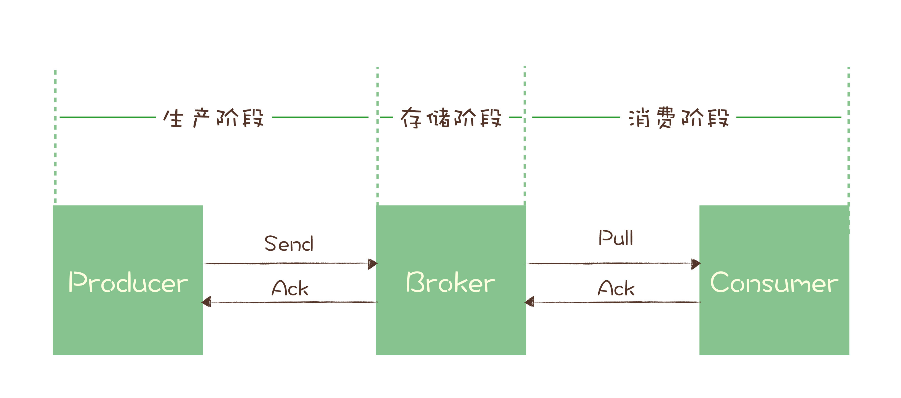

# 05 如何确保消息不会丢失

对于刚接触消息队列的开发者，最常遇到也最令人头疼的问题就是“丢消息”。在大多数业务系统中，丢消息意味着数据丢失或状态不一致，是完全无法接受的。

事实上，现代主流消息队列（Kafka、RocketMQ、RabbitMQ 等）都提供了非常完善的消息可靠性保证机制。只要配置与使用得当，即使面对网络中断或硬件故障，也能做到消息的零丢失。

本文将深入分析消息队列保证消息可靠传递的核心原理，帮助开发者写出高可用的可靠代码。

---

## 1. 检测消息丢失的方法

用消息队列最危险的情况不是丢消息，而是 **消息丢了系统却毫不知情**。在分布式系统中监控消息是否丢失，有以下两种常用手段：

### 方案 A：链路追踪系统

在 IT 基础设施完善的企业中，可以使用分布式链路追踪系统（如 SkyWalking、Zipkin、Jaeger）对每一条消息的发送、存储与消费全生命周期进行 Trace 标记与实时监控。

### 方案 B：利用消息序号连续性检测

若缺少链路追踪系统，可以利用消息队列的 **有序性** 快速检测消息丢失：

1. **Producer 端注入**：在发送消息前（可以利用 Client 端的 Interceptor 拦截器机制），为发送的每条消息附加一个递增的序列号（如 `seq`）；
2. **Consumer 端校验**：在消费消息时校验序列号的连续性（检查当前 `seq == prev_seq + 1`）。若序列号出现断层，则说明发生了丢消息，缺失的序号还能精确定位是哪条消息丢失。

> **注意事项**：
>
> - **分区独立检测**：对于 Kafka、RocketMQ 等只保证 Partition/Queue 内单调有序的消息队列，必须为每个分区独立生成与校验递增序号；
> - **Producer 标识**：若 Producer 为多实例集群，每个 Producer 需附加 `ProducerID` 标识，并在 Consumer 端按 Producer 分别校验序号连续性。

---

## 2. 确保消息可靠传递（三大阶段分析）

一条消息从生产到消费完成，可以划分为三个核心阶段：



1. **生产阶段**：消息在 Producer 端创建，经网络传输发送到 Broker 端；
2. **存储阶段**：消息在 Broker 节点落盘存储，或在集群节点间同步复制副本；
3. **消费阶段**：Consumer 从 Broker 拉取/接收消息，执行业务逻辑并返回确认。

以下针对这三个阶段分别给出防丢失保障策略：

### 2.1 生产阶段：请求确认与异常重试机制

生产阶段依靠 **请求确认（ACK）** 机制保证传递可靠性。Producer 调用发送 API 后，Broker 在成功接收并持久化（或完成副本同步）后返回 ACK 确认响应。

**代码规范**：开发者必须正确处理发送结果的返回值，或捕获发送失败异常，严禁忽略发送结果。

以 Kafka 为例：

#### 同步发送模式（捕获异常）

```java
try {
    RecordMetadata metadata = producer.send(record).get();
    System.out.println("消息发送成功，Offset: " + metadata.offset());
} catch (Throwable e) {
    System.err.println("消息发送失败！执行重试或告警逻辑");
    e.printStackTrace();
}
```

#### 异步发送模式（在 Callback 回调中检查）

```java
producer.send(record, (metadata, exception) -> {
    if (exception == null && metadata != null) {
        System.out.println("消息发送成功，Offset: " + metadata.offset());
    } else {
        System.err.println("异步发送失败！需记录日志并重试");
        exception.printStackTrace();
    }
});
```

### 2.2 存储阶段：同步刷盘与多副本复制

在存储阶段，若 Broker 遭遇进程崩溃或物理宕机，可能会导致内存中的未落盘数据丢失。

**高可靠配置参数**：

1. **单节点刷盘策略**：修改 Broker 参数，要求收到消息后必须执行 **同步刷盘（Sync Flush）** 后再给 Producer 返回 ACK。例如在 RocketMQ 中将 `flushDiskType` 配置为 `SYNC_FLUSH`；
2. **集群副本同步**：在 Broker 集群中，要求消息必须写入至少 2 个以上的副本节点后再给 Producer 返回 ACK（如 Kafka 的 `min.insync.replicas` 与 `acks=all` 配置）。

### 2.3 消费阶段：业务处理完成后再提交 ACK

消费阶段通过 **消费确认（ACK）** 机制保证可靠性。客户端拉取消息后执行业务逻辑，**只有在业务逻辑完全成功（如成功入库）之后，才向 Broker 发送消费确认 ACK**。若中途崩溃或未发送 ACK，Broker 将超时重投该消息。

以 Python 消费 RabbitMQ 消息为例：

```python
def callback(ch, method, properties, body):
    print(" [x] 收到消息 %r" % body)
    
    # 1. 首先执行真正的业务逻辑（如落库）
    database.save(body)
    print(" [x] 业务处理完成")
    
    # 2. 业务处理成功后，显式发送消费确认 ACK
    ch.basic_ack(delivery_tag=method.delivery_tag)

channel.basic_consume(queue='hello', on_message_callback=callback)
```

若 `database.save(body)` 执行失败抛出异常，就不会触发 `basic_ack`，该消息下次依然会被重新推送到客户端进行重试，确保不会因消费端崩溃而丢消息。

---

## 3. 总结

保证消息传递全链路零丢失的核心原则总结如下：

- **生产阶段**：绝不盲目异步发送，必须显式检查 ACK 返回状态或在 Callback 回调中捕获异常并安排重试；
- **存储阶段**：开启 Broker 同步刷盘（`SYNC_FLUSH`）与多副本强一致写入（`acks=all`），消除宕机隐患；
- **消费阶段**：严格遵守 **先执行业务逻辑，后提交 ACK** 的原则，严禁预先自动 Ack。
