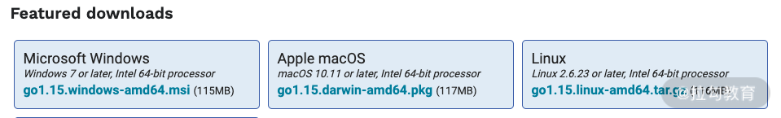

# 01 基础入门：编写你的第一个 Go 语言程序

从这节课开始，我将带你走进 Go 语言的世界。我会用通俗易懂的语言介绍 Go 语言的各个知识点，让你可以从零开始逐步学习并深入其核心。

现在，让我们以经典的“Hello World”为例，带你入门 Go 语言并了解它是如何运行起来的。

## Hello, 世界

如果你学过 C 语言，对这个经典的例子应该不会陌生。我们通过它来大概了解 Go 语言的核心理念与整体代码风格：

示例文件：`ch01/main.go`

```go
package main

import "fmt"

func main() {
    fmt.Println("Hello, 世界")
}
```

在终端运行该程序：

```shell
$ go run ch01/main.go
Hello, 世界
```

代码中的 `go` 是 Go 语言开发工具包提供的可执行命令。它可以帮助你运行 Go 语言代码、进行编译以及生成二进制文件等。

`run` 在这里是 `go` 的子命令，表示“运行 Go 语言代码”。最后的 `ch01/main.go` 是源码文件路径。整条命令 `go run ch01/main.go` 表示直接编译并运行 `main.go` 里的 Go 语言代码。

### 程序结构分析

要让一个 Go 语言程序成功运行起来，只需要 `package main` 和 `main` 函数这两个核心部分：

- `package main` 代表当前文件是一个可独立运行的应用程序；
- `main` 函数则是整个应用程序的主入口。

下面逐一分析核心概念：

1. **`package main`**：声明当前的 `main.go` 文件属于 `main` 包。在 Go 语言中，`main` 包是一个特殊的包，代表项目是一个可运行的应用程序，而不是供其他项目引用的类库。
2. **`import "fmt"`**：使用 `import` 关键字导入标准库中的 `fmt` 包，目的是为了使用该包提供的格式化输入输出函数。
3. **`func main()`**：使用 `func` 关键字定义一个函数，函数名为 `main`，空括号 `()` 表示不接受任何参数。在 Go 中，`main` 函数代表整个程序的总入口，程序启动时会率先调用它。
4. **`fmt.Println("Hello, 世界")`**：通过 `fmt` 包的 `Println` 函数将“Hello, 世界”文本输出到标准输出。
5. **大括号 `{}`**：包裹 `main` 函数体的代码块。

**总结**：Go 语言的代码风格非常简洁完整，只需 `package`、`import` 和 `func main` 即可完成核心逻辑。

---

## Go 语言环境搭建

搭建 Go 语言开发环境需要先下载 Go 语言开发包（SDK）。你可以从官网 [https://golang.org/dl/](https://golang.org/dl/) 或国内镜像 [https://golang.google.cn/dl/](https://golang.google.cn/dl/) 下载。

请根据操作系统选择相应的安装包（Windows、macOS 或 Linux）：



### 1. Windows 安装 (MSI)

选择 `go1.15.windows-amd64.msi` 双击运行，按提示一步步安装即可。默认会被安装到 `C:\Go` 目录，安装程序会自动将 `C:\Go\bin` 添加到系统的 `PATH` 环境变量中。

### 2. Linux 安装 (Tar.gz)

根据系统架构下载 `go1.15.linux-amd64.tar.gz`，解压到 `/usr/local` 目录：

```shell
sudo tar -C /usr/local -xzf go1.15.linux-amd64.tar.gz
```

把以下环境变量配置添加到 `/etc/profile` 或 `~/.profile` 文件中：

```shell
export PATH=$PATH:/usr/local/go/bin
```

保存后执行 `source ~/.profile` 使其生效。

### 3. macOS 安装 (PKG)

下载 `go1.15.darwin-amd64.pkg` 双击按照引导安装即可。安装器会自动将 `/usr/local/go/bin` 添加至系统的 `PATH` 环境变量中。

### 4. 验证安装与关键环境变量设置

打开终端输入 `go version` 验证安装：

```shell
$ go version
go version go1.15 darwin/amd64
```

安装完成后，还需要配置两个关键环境变量：`GOPATH` 和 `GOBIN`：

- **`GOPATH`**：Go 语言的工作区目录，用于存放下载的第三方依赖包等；
- **`GOBIN`**：通过 `go install` 编译生成的二进制可执行文件的安装目录。

在 Linux / macOS 的 `~/.profile` 或 `~/.bashrc` 中添加：

```shell
export GOPATH=/Users/flysnow/go
export GOBIN=$GOPATH/bin
export PATH=$PATH:$GOBIN
```

---

## Go Module 项目结构

采用 Go Module 可以在任意目录创建 Go 项目。假设项目目录为 `/Users/flysnow/git/gotour`：

```shell
cd /Users/flysnow/git/gotour
go mod init gotour
```

初始化后的典型 Go Module 项目结构如下：

```text
.
├── go.mod
├── lib
└── main.go
```

---

## 编译与发布

完成代码编写后，可以将其编译为二进制可执行文件：

```shell
$ go build main.go
$ ./main
Hello, 世界
```

也可以使用 `go install` 命令将可执行文件发布安装到 `$GOBIN` 目录中，方便在终端任意位置直接调用：

```shell
go install main.go
```

---

## 跨平台编译

Go 语言内置强大的跨平台编译支持。你可以选择在 macOS 下开发，直接编译出在 Linux 或 Windows 上运行的二进制文件。

跨平台编译通过两个关键环境变量控制：

| 环境变量名称 | 含义与作用 | 常见可选取值 | 典型跨平台编译命令示范 |
| --- | --- | --- | --- |
| **`GOOS`** | 目标操作系统 | `linux`, `windows`, `darwin` | `CGO_ENABLED=0 GOOS=linux GOARCH=amd64 go build main.go` |
| **`GOARCH`** | 目标 CPU 架构 | `amd64`, `arm64`, `386` | `CGO_ENABLED=0 GOOS=windows GOARCH=amd64 go build main.go` |

---

## Go 编辑器选型推荐

主流 Go 语言开发工具对比总结如下：

| 编辑器 / IDE 名称 | 出品公司 | 授权模式 | 优势特点与核心功能 | 适用开发者场景 |
| --- | --- | --- | --- | --- |
| **VS Code + Go 插件** | Microsoft | 免费开源 | 占用内存低、插件生态极佳、配置灵活 | 全栈开发者、轻量化开发场景 |
| **GoLand** | JetBrains | 商业付费 | 开箱即用、智能补全与重构极致、内置调试器 | 专职 Go 后端开发、追求极致效率团队 |

---

## 总结

本课时介绍了如何编写第一个 Go 语言程序、搭建开发环境、创建 Go Module 项目以及跨平台编译的技巧。

> **本课作业**：
> 修改“Hello, 世界”的代码，在终端中打印出你自己的名字。
