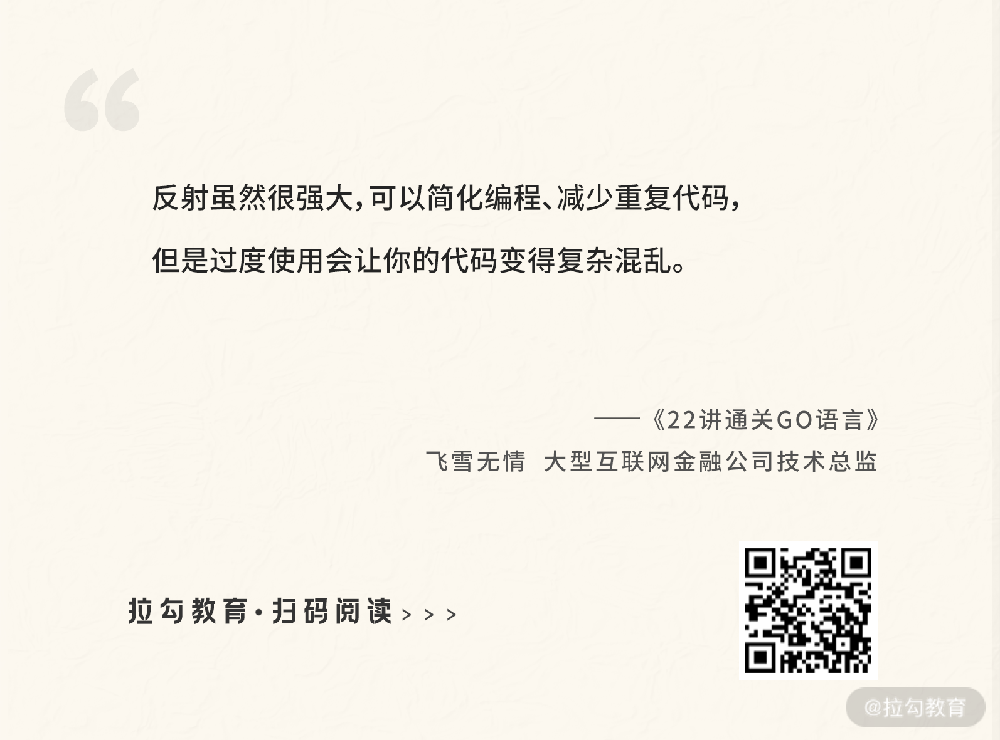

# 15 运行时反射：字符串和结构体之间如何转换？

我们在开发中会接触很多字符串和结构体之间的转换，尤其是在调用 API 的时候，你需要把 API 返回的 JSON 字符串转换为 struct 结构体，便于操作。那么一个 JSON 字符串是如何转换为 struct 结构体的呢？这就需要用到反射的知识，这节课我会基于字符串和结构体之间的转换，一步步地为你揭开 Go 语言运行时反射的面纱。

## 反射是什么？

和 Java 语言一样，Go 语言也有运行时反射，这为我们提供了一种可以在运行时操作任意类型对象的能力。比如查看一个接口变量的具体类型、看看一个结构体有多少字段、修改某个字段的值等。

Go 语言是静态编译类语言，比如在定义一个变量的时候，已经知道了它是什么类型，那么为什么还需要反射呢？这是因为有些事情只有在运行时才知道。比如你定义了一个函数，它有一个 **interface{}** 类型的参数，这也就意味着调用者可以传递任何类型的参数给这个函数。在这种情况下，如果你想知道调用者传递的是什么类型的参数，就需要用到反射。如果你想知道一个结构体有哪些字段和方法，也需要反射。

还是以我常用的函数 `fmt.Println` 为例，如下所示：

_**src/fmt/print.go**_

```go
func Println(a ...interface{}) (n int, err error) {
    return Fprintln(os.Stdout, a...)
}
```

### reflect.Value 和 reflect.Type

在 Go 语言的反射定义中，任何接口都由两部分组成：接口的具体类型，以及具体类型对应的值。比如 `var i int = 3`，因为 `interface{}` 可以表示任何类型，所以变量 `i` 可以转为 `interface{}`。你可以把变量 `i` 当成一个接口，那么这个变量在 Go 反射中的表示就是 `<Value, Type>`。其中 `Value` 为变量的值，即 `3`，而 `Type` 为变量的类型，即 `int`。

> 小提示：`interface{}` 是空接口，可以表示任何类型，也就是说你可以把任何类型转换为空接口，它通常用于反射、类型断言，以减少重复代码，简化编程。

在 Go 反射中，标准库为我们提供了两种类型 `reflect.Value` 和 `reflect.Type` 来分别表示变量的值和类型，并且提供了两个函数 `reflect.ValueOf` 和 `reflect.TypeOf` 分别获取任意对象的 `reflect.Value` 和 `reflect.Type`。

我用下面的代码进行演示：

_**ch15/main.go**_

```go
func main() {
    i := 3
    iv := reflect.ValueOf(i)
    it := reflect.TypeOf(i)
    fmt.Println(iv, it) // 3 int
}
```

### reflect.Value

`reflect.Value` 可以通过函数 `reflect.ValueOf` 获得，下面我将为你介绍它的结构和用法。

#### 结构体定义

在 Go 语言中，`reflect.Value` 被定义为一个 `struct` 结构体，它的定义如下面的代码所示：

```go
type Value struct {
    typ *rtype
    ptr unsafe.Pointer
    flag
}
```

其提供的常用 API 方法分类如下所示：

```plaintext
// 以下是用于获取对应的值
Bool
Bytes
Complex
Float
Int
String
Uint
CanSet // 是否可以修改对应的值

// 以下是用于修改对应的值
Set
SetBool
SetBytes
SetComplex
SetFloat
SetInt
SetString
Elem // 获取指针指向的值，一般用于修改对应的值

// 以下 Field 系列方法用于获取 struct 类型中的字段
Field
FieldByIndex
FieldByName
FieldByNameFunc
Interface // 获取对应的原始类型
IsNil     // 值是否为 nil
IsZero    // 值是否是零值
Kind      // 获取对应的类型类别，比如 Array、Slice、Map 等

// 获取对应的方法
Method
MethodByName
NumField  // 获取 struct 类型中字段的数量
NumMethod // 类型上方法集的数量
Type      // 获取对应的 reflect.Type
```

下面我通过几个例子讲解如何使用它们。

#### 获取原始类型

在上面的例子中，我通过 `reflect.ValueOf` 函数把任意类型的对象转为一个 `reflect.Value`，而如果想逆向转回来也可以，`reflect.Value` 为我们提供了 `Interface` 方法，如下面的代码所示：

_**ch15/main.go**_

```go
func main() {
    i := 3
    // int to reflect.Value
    iv := reflect.ValueOf(i)
    // reflect.Value to int
    i1 := iv.Interface().(int)
    fmt.Println(i1)
}
```

#### 修改对应的值

已经定义的变量可以通过反射在运行时修改，比如上面的示例 `i=3`，修改为 `4`，如下所示：

_**ch15/main.go**_

```go
func main() {
    i := 3
    ipv := reflect.ValueOf(&i)
    ipv.Elem().SetInt(4)
    fmt.Println(i)
}
```

要修改一个变量的值，有几个关键点：传递指针（可寻址），通过 `Elem` 方法获取指向的值，才可以保证值可以被修改，`reflect.Value` 为我们提供了 `CanSet` 方法判断是否可以修改该变量。

那么如何修改 struct 结构体字段的值呢？参考变量的修改方式，可总结出以下步骤：

1. 传递一个 struct 结构体的指针，获取对应的 `reflect.Value`；
2. 通过 `Elem` 方法获取指针指向的值；
3. 通过 `Field` 方法获取要修改的字段；
4. 通过 `Set` 系列方法修改成对应的值。

运行下面的代码，你会发现变量 `p` 中的 `Name` 字段已经被修改为张三了。

_**ch15/main.go**_

```go
type person struct {
    Name string
    Age  int
}

func main() {
    p := person{Name: "飞雪无情", Age: 20}
    ppv := reflect.ValueOf(&p)
    ppv.Elem().Field(0).SetString("张三")
    fmt.Println(p)
}
```

反射修改变量值的 3 大要点：

1. 可被寻址，通俗地讲就是要向 `reflect.ValueOf` 函数传递一个指针作为参数。
2. 如果要修改 struct 结构体字段值的话，该字段需要是可导出的，而不是私有的，也就是该字段的首字母为大写。
3. 记得使用 `Elem` 方法获得指针指向的值，这样才能调用 `Set` 系列方法进行修改。

记住以上规则，你就可以在程序运行时通过反射修改一个变量或字段的值。

#### 获取对应的底层类型

底层类型是什么意思呢？其实对应的主要是基础类型，比如接口、结构体、指针......因为我们可以通过 `type` 关键字声明很多新的类型。比如在上面的例子中，变量 `p` 的实际类型是 `person`，但是 `person` 对应的底层类型是 `struct` 这个结构体类型，而 `&p` 对应的则是指针类型。我们来通过下面的代码进行验证：

_**ch15/main.go**_

```go
func main() {
    p := person{Name: "飞雪无情", Age: 20}
    ppv := reflect.ValueOf(&p)
    fmt.Println(ppv.Kind())
    pv := reflect.ValueOf(p)
    fmt.Println(pv.Kind())
}
```

输出结果：

```plaintext
ptr
struct
```

底层 Kind 类型在标准库中定义如下：

```go
type Kind uint

const (
    Invalid Kind = iota
    Bool
    Int
    Int8
    Int16
    Int32
    Int64
    Uint
    Uint8
    Uint16
    Uint32
    Uint64
    Uintptr
    Float32
    Float64
    Complex64
    Complex128
    Array
    Chan
    Func
    Interface
    Map
    Ptr
    Slice
    String
    Struct
    UnsafePointer
)
```

### reflect.Type

`reflect.Value` 可以用于与值有关的操作中，而如果是和变量类型本身有关的操作，则最好使用 `reflect.Type`，比如要获取结构体对应的字段名称或方法。

要反射获取一个变量的 `reflect.Type`，可以通过函数 `reflect.TypeOf`。

#### 接口定义

和 `reflect.Value` 不同，`reflect.Type` 是一个接口，而不是一个结构体，所以也只能使用它的方法。

以下是 `reflect.Type` 接口常用的方法：

```go
type Type interface {
    Implements(u Type) bool
    AssignableTo(u Type) bool
    ConvertibleTo(u Type) bool
    Comparable() bool

    // 以下这些方法和 Value 结构体的功能相同
    Kind() Kind
    Method(int) Method
    MethodByName(string) (Method, bool)
    NumMethod() int
    Elem() Type
    Field(i int) StructField
    FieldByIndex(index []int) StructField
    FieldByName(name string) (StructField, bool)
    FieldByNameFunc(match func(string) bool) (StructField, bool)
    NumField() int
}
```

核心 API 作用说明：

1. `Implements` 方法用于判断是否实现了接口 `u`；
2. `AssignableTo` 方法用于判断是否可以赋值给类型 `u`，其实就是是否可以使用 `=` 赋值运算符；
3. `ConvertibleTo` 方法用于判断是否可以转换成类型 `u`，其实就是是否可以进行类型转换；
4. `Comparable` 方法用于判断该类型是否是可比较的，其实就是是否可以使用关系运算符进行比较。

我同样会通过一些示例来讲解 `reflect.Type` 的使用。

#### 遍历结构体的字段和方法

我还是采用上面示例中的 `person` 结构体进行演示，不过需要修改一下，为它增加一个方法 `String`，如下所示：

```go
func (p person) String() string {
    return fmt.Sprintf("Name is %s, Age is %d", p.Name, p.Age)
}
```

你可以通过 `NumField` 方法获取结构体字段的数量，然后使用 `for` 循环，通过 `Field` 方法就可以遍历结构体的字段，并打印出字段名称。同理，遍历结构体的方法也是同样的思路，代码也类似，如下所示：

_**ch15/main.go**_

```go
func main() {
    p := person{Name: "飞雪无情", Age: 20}
    pt := reflect.TypeOf(p)

    // 遍历 person 的字段
    for i := 0; i < pt.NumField(); i++ {
        fmt.Println("字段：", pt.Field(i).Name)
    }

    // 遍历 person 的方法
    for i := 0; i < pt.NumMethod(); i++ {
        fmt.Println("方法：", pt.Method(i).Name)
    }
}
```

输出结果：

```plaintext
字段： Name
字段： Age
方法： String
```

> 小技巧：你可以通过 `FieldByName` 方法获取指定的字段，也可以通过 `MethodByName` 方法获取指定的方法，这在需要获取某个特定的字段或者方法时非常高效，而不是使用遍历。

#### 是否实现某接口

通过 `reflect.Type` 还可以判断是否实现了某接口。我还是以 `person` 结构体为例，判断它是否实现了接口 `fmt.Stringer` 和 `io.Writer`，如下面的代码所示：

```go
func main() {
    p := person{Name: "飞雪无情", Age: 20}
    pt := reflect.TypeOf(p)

    stringerType := reflect.TypeOf((*fmt.Stringer)(nil)).Elem()
    writerType := reflect.TypeOf((*io.Writer)(nil)).Elem()

    fmt.Println("是否实现了fmt.Stringer：", pt.Implements(stringerType))
    fmt.Println("是否实现了io.Writer：", pt.Implements(writerType))
}
```

这个示例通过 `Implements` 方法来判断是否实现了 `fmt.Stringer` 和 `io.Writer` 接口，运行它，你可以看到如下结果：

```plaintext
是否实现了fmt.Stringer： true
是否实现了io.Writer： false
```

### 字符串和结构体互转

在字符串和结构体互转的场景中，使用最多的就是 JSON 和 struct 互转。在这个小节中，我会用 JSON 和 struct 讲解 struct tag 这一功能的使用。

#### JSON 和 Struct 互转

Go 语言的标准库有一个 `json` 包，通过它可以把 JSON 字符串转为一个 `struct` 结构体，也可以把一个 `struct` 结构体转为一个 JSON 字符串。下面我还是以 `person` 这个结构体为例，讲解 JSON 和 struct 的相互转换。如下面的代码所示：

```go
func main() {
    p := person{Name: "飞雪无情", Age: 20}

    // struct to json
    jsonB, err := json.Marshal(p)
    if err == nil {
        fmt.Println(string(jsonB))
    }

    // json to struct
    respJSON := `{"Name":"李四","Age":40}`
    json.Unmarshal([]byte(respJSON), &p)
    fmt.Println(p)
}
```

运行以上代码，你会看到如下结果输出：

```plaintext
{"Name":"飞雪无情","Age":20}
Name is 李四, Age is 40
```

#### Struct Tag

顾名思义，struct tag 是一个添加在 struct 字段上的标记，使用它进行辅助，可以完成一些额外的操作，比如 JSON 和 struct 互转。在上面的示例中，如果想把输出的 JSON 字符串的 Key 改为小写的 `name` 和 `age`，可以通过为 struct 字段添加 tag 的方式，示例代码如下：

```go
type person struct {
    Name string `json:"name"`
    Age  int    `json:"age"`
}
```

> 小提示：`json` 作为 Key，是 Go 语言自带的 `json` 包解析 JSON 的一种约定，它会通过 `json` 这个 Key 找到对应的值，用于 JSON 的 Key 值。

我们已经通过 struct tag 指定了可以使用 `name` 和 `age` 作为 JSON 的 Key。

结构体的字段可以有多个 tag，用于不同的场景，比如 JSON 转换、bson 转换、orm 解析等。如果有多个 tag，要使用空格分隔。采用不同的 Key 可以获得不同的 tag，如下面的代码所示：

```go
type person struct {
    Name string `json:"name" bson:"b_name"`
    Age  int    `json:"age" bson:"b_age"`
}

func main() {
    pt := reflect.TypeOf(person{})
    for i := 0; i < pt.NumField(); i++ {
        sf := pt.Field(i)
        fmt.Printf("字段 %s 上, json tag 为 %s\n", sf.Name, sf.Tag.Get("json"))
        fmt.Printf("字段 %s 上, bson tag 为 %s\n", sf.Name, sf.Tag.Get("bson"))
    }
}
```

输出结果：

```plaintext
字段 Name 上, json tag 为 name
字段 Name 上, bson tag 为 b_name
字段 Age 上, json tag 为 age
字段 Age 上, bson tag 为 b_age
```

#### 实现 Struct 转 JSON

相信你已经理解了什么是 struct tag，下面我再通过一个 struct 转 json 的例子演示它的使用：

```go
func main() {
    p := person{Name: "飞雪无情", Age: 20}
    pv := reflect.ValueOf(p)
    pt := reflect.TypeOf(p)

    // 自己实现的 struct to json
    jsonBuilder := strings.Builder{}
    jsonBuilder.WriteString("{")
    num := pt.NumField()
    for i := 0; i < num; i++ {
        jsonTag := pt.Field(i).Tag.Get("json")
        jsonBuilder.WriteString("\"" + jsonTag + "\"")
        jsonBuilder.WriteString(":")
        // 获取字段的值
        jsonBuilder.WriteString(fmt.Sprintf("\"%v\"", pv.Field(i)))
        if i < num - 1 {
            jsonBuilder.WriteString(",")
        }
    }
    jsonBuilder.WriteString("}")
    fmt.Println(jsonBuilder.String()) // 打印 json 字符串
}
```

输出结果：

```plaintext
{"name":"飞雪无情","age":"20"}
```

### 反射定律

反射是计算机语言中程序检视其自身结构的一种方法，它属于元编程的一种形式。反射灵活、强大，但也存在不安全。它可以绕过编译器的很多静态检查，如果过多使用便会造成混乱。为了帮助开发者更好地理解反射，Go 语言的作者在博客上总结了[反射的三大定律](https://blog.golang.org/laws-of-reflection)：

| 反射定律序号 | 核心定律法则                                                                       | 关键实现 API / 机制                       |
|--------------|------------------------------------------------------------------------------------|-------------------------------------------|
| **定律一**   | 任何接口值 `interface{}` 都可以转换成反射对象（`reflect.Value` 和 `reflect.Type`） | `reflect.ValueOf()` 与 `reflect.TypeOf()` |
| **定律二**   | 反射对象（`reflect.Value`）也可以反向还原为 `interface{}` 接口变量                 | `reflect.Value.Interface()`               |
| **定律三**   | 要在运行时修改反射的对象，该值必须可设置（即必须传指针、可寻址）                   | `reflect.ValueOf(&x).Elem().Set...()`     |

> 小提示：任何类型的变量都可以转换为空接口 `interface{}`，所以第 1 条定律中函数 `reflect.ValueOf` 和 `reflect.TypeOf` 的参数就是 `interface{}`。在第 2 条定律中，`reflect.Value` 结构体的 `Interface` 方法返回的值也是 `interface{}`。一旦你理解了这三大定律，就可以更好地理解和使用 Go 语言反射。

### 总结

在反射中，`reflect.Value` 对应的是变量的值，如果你需要进行和变量的值有关的操作，应该优先使用 `reflect.Value`，比如获取变量的值、修改变量的值等。`reflect.Type` 对应的是变量的类型，如果你需要进行和变量的类型本身有关的操作，应该优先使用 `reflect.Type`，比如获取结构体内的字段、类型拥有的方法集等。

此外我要再次强调：反射虽然很强大，可以简化编程、减少重复代码，但是过度使用会让你的代码变得复杂混乱。所以除非非常必要，否则尽可能少地使用它们。



课后作业：自己写代码运行通过反射调用结构体的方法。下节课我将介绍“非类型安全：让你既爱又恨的 unsafe”，记得来听课！
