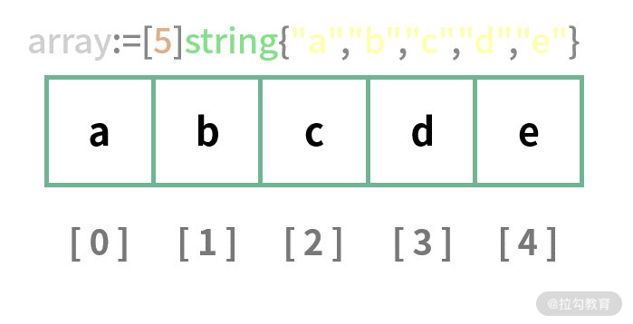
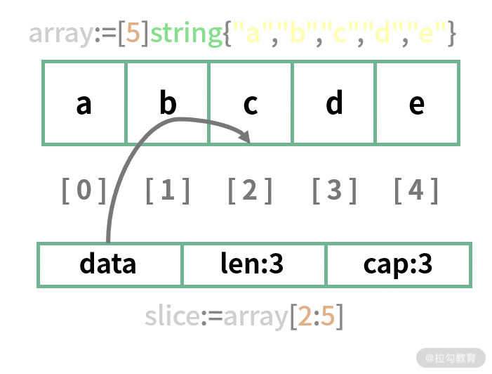

# 04 集合类型：如何正确使用 array、slice 和 map？

在上节课的思考题中，要求练习使用 `for` 循环中的 `continue` 关键字。`continue` 用于跳过本次循环并直接进入下一次循环。下面以计算 100 以内的偶数之和为例演示其用法：

```go
package main

import "fmt"

func main() {
    sum := 0
    for i := 1; i <= 100; i++ {
        if i%2 != 0 {
            continue
        }
        sum += i
    }
    fmt.Println("the sum is", sum) // 输出: the sum is 2550
}
```

本课时我们将详细讲解 Go 语言的三大核心集合类型：**数组（Array）、切片（Slice）和映射（Map）**。

---

## 1. Array（数组）

数组是具有 **固定长度**、存放 **相同数据类型** 且内存连续的元素集合。数组元素的类型可以是基础类型、自定义结构体等。

### 数组声明与初始化

声明一个字符串数组，长度为 5：

```go
package main

import "fmt"

func main() {
    // 声明并初始化长度为 5 的字符串数组
    array := [5]string{"a", "b", "c", "d", "e"}
    fmt.Println(array)
}
```

> **注意**：`[5]string` 和 `[4]string` 是不同的数据类型，数组的 **长度是数组类型定义的一部分**。

数组结构内存示意图：



数组的元素连续存放，通过索引（Index）访问，索引从 `0` 开始（最大索引为 `len - 1`）：

```go
array := [5]string{"a", "b", "c", "d", "e"}
fmt.Println(array[2]) // 输出: c
```

若声明数组未显式初始化，未指定的元素将被填充为类型的零值（如 `string` 为 `""`，`int` 为 `0`）。

### 遍历数组

可以使用传统的 `for` 循环，也可以使用更推荐的 `for range` 循环：

```go
package main

import "fmt"

func main() {
    array := [5]string{"a", "b", "c", "d", "e"}

    // 1. 使用传统的 for 循环
    for i := 0; i < len(array); i++ {
        fmt.Printf("数组索引:%d, 对应值:%s
", i, array[i])
    }

    // 2. 使用 for range 循环 (推荐)
    for i, v := range array {
        fmt.Printf("数组索引:%d, 对应值:%s
", i, v)
    }

    // 3. 使用下划线 _ 忽略索引
    for _, v := range array {
        fmt.Printf("对应值:%s
", v)
    }
}
```

---

## 2. Slice（切片）

切片是基于数组封装的 **动态数组**。切片的底层是一个真实的数组，通过对数组进行截取操作，可以非常方便地获得切片。

### 基于数组生成切片

语法格式：`array[start:end]`（左闭右开区间，包含 `start` 索引，不包含 `end` 索引）：

```go
package main

import "fmt"

func main() {
    array := [5]string{"a", "b", "c", "d", "e"}
    slice := array[2:5]
    fmt.Println(slice) // 输出: [c d e]
}
```

切片内部由三个字段组成：**指向底层数组的指针 `data`、长度 `len` 以及容量 `cap`**：



截取小技巧：
- `array[:4]`：等价于 `array[0:4]`
- `array[1:]`：等价于 `array[1:len(array)]`
- `array[:]`：等价于 `array[0:len(array)]`

### 切片的修改与共享底层数组

切片修改元素会影响其底层的真实数组：

```go
package main

import "fmt"

func main() {
    array := [5]string{"a", "b", "c", "d", "e"}
    slice := array[2:5] // [c d e]
    
    slice[1] = "f" // 修改切片索引 1 的元素
    
    fmt.Println("slice:", slice) // 输出: [c f e]
    fmt.Println("array:", array) // 输出: [a b c f e] (底层数组同步被修改)
}
```

### 使用 `make` 或字面量直接声明切片

除了基于已有数组切片外，还可以使用内置的 `make` 函数新建切片：

```go
// 创建一个元素为 string、长度 len 为 4、容量 cap 为 8 的切片
slice1 := make([]string, 4, 8)
```

或使用字面量直接初始化切片（无需在 `[]` 中指定长度）：

```go
slice1 := []string{"a", "b", "c", "d", "e"}
fmt.Println(len(slice1), cap(slice1)) // 输出: 5 5
```

### 动态追加元素 (`append`)

使用内置 `append` 函数向切片追加元素：

```go
package main

import "fmt"

func main() {
    slice1 := []string{"a", "b", "c"}
    
    // 追加单个元素
    slice2 := append(slice1, "d")
    
    // 追加多个元素
    slice3 := append(slice2, "e", "f")
    
    // 追加另一个切片 (展开运算符 ...)
    slice4 := append(slice3, slice1...)
    
    fmt.Println(slice4)
}
```

> **最佳实践**：在创建切片时，若能预估元素量，尽量让容量 `cap` 等于长度 `len`，或提前分配好容量，避免后续触发多次扩容和内存重新分配。

---

## 3. Map（映射）

`map` 是一个无序的 K-V 键值对集合，定义格式为 `map[K]V`。Key 的类型必须支持 `==` 比较运算符。

### Map 的声明与初始化

使用 `make` 函数声明或使用字面量直接初始化：

```go
package main

import "fmt"

func main() {
    // 方式 1: 使用 make 函数声明
    nameAgeMap := make(map[string]int)
    nameAgeMap["飞雪无情"] = 20

    // 方式 2: 使用字面量声明并初始化
    nameAgeMap2 := map[string]int{
        "飞雪无情": 20,
        "张三":   18,
    }

    fmt.Println(nameAgeMap, nameAgeMap2)
}
```

### Map 值的获取、Key 存在性判断与删除

使用 `[]` 访问 `map` 的 Key：

```go
package main

import "fmt"

func main() {
    nameAgeMap := map[string]int{"飞雪无情": 20}

    // 访问 Key，支持双返回值模式
    age, ok := nameAgeMap["飞雪无情"]
    if ok {
        fmt.Println("获取到的年龄:", age) // 输出: 获取到的年龄: 20
    }

    // 访问不存在的 Key
    age2, ok2 := nameAgeMap["不存在的Key"]
    fmt.Println("age2:", age2, "ok2:", ok2) // 输出: age2: 0 ok2: false

    // 使用 delete 内置函数删除指定的 Key
    delete(nameAgeMap, "飞雪无情")
    fmt.Println("删除后 map 大小:", len(nameAgeMap)) // 输出: 删除后 map 大小: 0
}
```

### 遍历 Map

使用 `for range` 循环遍历 `map` 的键值对：

```go
package main

import "fmt"

func main() {
    nameAgeMap := map[string]int{
        "飞雪无情":  20,
        "飞雪无情1": 21,
        "飞雪无情2": 22,
    }

    // 遍历 key 和 value
    for k, v := range nameAgeMap {
        fmt.Println("Key is", k, ", Value is", v)
    }

    // 仅遍历 key
    for k := range nameAgeMap {
        fmt.Println("Key is", k)
    }
}
```

---

## 4. 字符串与字节切片 (`[]byte`)

在 Go 语言中，`string` 底层是由只读的字节序列组成的。`string` 与 `[]byte` 切片可以互相转换：

```go
package main

import "fmt"

func main() {
    s := "Hello飞雪"

    // 字符串转字节切片
    bs := []byte(s)
    fmt.Println("字节切片:", bs)

    // 字符串按字节访问
    fmt.Println("字符串长度(字节数):", len(s)) // 输出: 11 (中文字符占 3 个字节)

    // 使用 for range 遍历字符串 (自动按 Unicode rune 字符解码)
    for i, r := range s {
        fmt.Printf("索引:%d, 字符:%c, Unicode码点:%U
", i, r, r)
    }
}
```

---

## 总结

本课时深入讲解了 Go 语言中三大集合类型：
1. **Array**：固定长度、连续内存，长度属于类型定义的一部分；
2. **Slice**：基于数组的动态切片，包含 `data` 指针、`len` 和 `cap`，是 Go 开发中最常使用的集合类型；
3. **Map**：无序 K-V 键值对集合，支持 `make` 声明、`delete` 删除与双返回值校验。

> **思考题**：
> 尝试在本地代码中创建一个二维切片（如 `[][]int`）或二维数组（如 `[3][3]int`），并编写循环为其赋值和打印。
