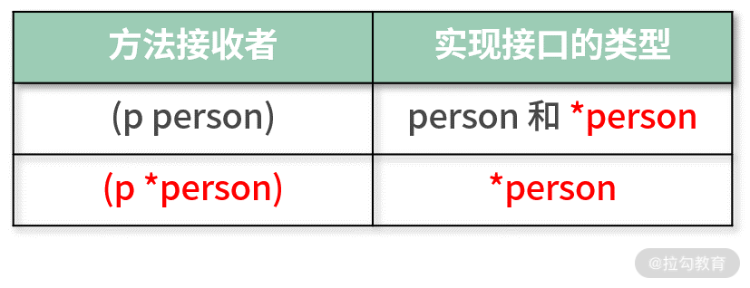

# 06 struct 和 interface

：结构体与接口都实现了哪些功能？

上节课我留了一个思考题：方法是否可以赋值给一个变量？如果可以，要怎么调用它呢？答案是完全可以，方法赋值给变量称为方法表达式，如下面的代码所示：

```plaintext
//方法赋值给变量，方法表达式
sm:=Age.String
//通过变量，要传一个接收者进行调用也就是age
sm(age)
```go

> 小提示：不管方法是否有参数，通过方法表达式调用，第一个参数必须是接收者，然后才是方法自身的参数。

下面开始我们今天的课程。之前讲到的类型如整型、字符串等只能描述单一的对象，如果是聚合对象，就无法描述了，比如一个人具备的名字、年龄和性别等信息。因为人作为对象是一个聚合对象，要想描述它需要使用这节课要讲的结构体。

## 结构体

#### 结构体定义

结构体是一种聚合类型，里面可以包含任意类型的值，这些值就是我们定义的结构体的成员，也称为字段。在 Go 语言中，要自定义一个结构体，需要使用 type+struct 关键字组合。

在下面的例子中，我自定义了一个结构体类型，名称为 person，表示一个人。这个 person 结构体有两个字段：name 代表这个人的名字，age 代表这个人的年龄。

_**ch06/main.go**_

```plaintext
    name string
    age uint
}
```go

结构体的成员字段并不是必需的，也可以一个字段都没有，这种结构体成为空结构体。

根据以上信息，我们可以总结出结构体定义的表达式，如下面的代码所示：

```plaintext
    fieldName typeName
    ....
    ....
}
```go

- type 和 struct 是 Go 语言的关键字，二者组合就代表要定义一个新的结构体类型。
- structName 是结构体类型的名字。
- fieldName 是结构体的字段名，而 typeName 是对应的字段类型。
- 字段可以是零个、一个或者多个。

> 小提示：结构体也是一种类型，所以以后自定义的结构体，我会称为某结构体或某类型，两者是一个意思。比如 person 结构体和 person 类型其实是一个意思。

定义好结构体后就可以使用了，因为它是一个聚合类型，所以比普通的类型可以携带更多数据。

#### 结构体声明使用

结构体类型和普通的字符串、整型一样，也可以使用同样的方式声明和初始化。

在下面的例子中，我声明了一个 person 类型的变量 p，因为没有对变量 p 初始化，所以默认会使用结构体里字段的零值。

```go
var p person
```go

```plaintext

```go

声明了一个结构体变量后就可以使用了，下面我们运行以下代码，验证 name 和 age 的值是否和初始化的一样。

```plaintext

```go

采用字面量初始化结构体时，初始化值的顺序很重要，必须和字段定义的顺序一致。

在 person 这个结构体中，第一个字段是 string 类型的 name，第二个字段是 uint 类型的 age，所以在初始化的时候，初始化值的类型顺序必须一一对应，才能编译通过。也就是说，在示例 {"飞雪无情",30} 中，表示 name 的字符串飞雪无情必须在前，表示年龄的数字 30 必须在后。

那么是否可以不按照顺序初始化呢？**当然可以，只不过需要指出字段名称**，如下所示：

```plaintext

```go

有没有发现，这种方式和 map 类型的初始化很像，都是采用冒号分隔。Go 语言尽可能地重用操作，不发明新的表达式，便于我们记忆和使用。

当然你也可以只初始化字段 age，字段 name 使用默认的零值，如下面的代码所示，仍然可以编译通过。

```plaintext

```go

结构体的字段可以是任意类型，也包括自定义的结构体类型，比如下面的代码：

_**ch06/main.go**_

```plaintext
    name string
    age uint
    addr address
}
type address struct {
    province string
    city string
}
```go

通过这种方式，用代码描述现实中的实体会更匹配，复用程度也更高。对于嵌套结构体字段的结构体，其初始化和正常的结构体大同小异，只需要根据字段对应的类型初始化即可，如下面的代码所示：

_**ch06/main.go**_

```plaintext
        age:30,
        name:"飞雪无情",
        addr:address{
            province: "北京",
            city:     "北京",
        },
    }
```go

_**ch06/main.go**_

```plaintext

```go

### 接口

#### 接口的定义

接口是和调用方的一种约定，它是一个高度抽象的类型，不用和具体的实现细节绑定在一起。接口要做的是定义好约定，告诉调用方自己可以做什么，但不用知道它的内部实现，这和我们见到的具体的类型如 int、map、slice 等不一样。

接口的定义和结构体稍微有些差别，虽然都以 type 关键字开始，但接口的关键字是 interface，表示自定义的类型是一个接口。也就是说 Stringer 是一个接口，它有一个方法 String() string，整体如下面的代码所示：

_**src/fmt/print.go**_

```plaintext
    String() string
}
```go

针对 Stringer 接口来说，它会告诉调用者可以通过它的 String() 方法获取一个字符串，这就是接口的约定。至于这个字符串怎么获得的，长什么样，接口不关心，调用者也不用关心，因为这些是由接口实现者来做的。

#### 接口的实现

接口的实现者必须是一个具体的类型，继续以 person 结构体为例，让它来实现 Stringer 接口，如下代码所示：

_**ch06/main.go**_

```plaintext
    return fmt.Sprintf("the name is %s,age is %d",p.name,p.age)
}
```go

> 注意：如果一个接口有多个方法，那么需要实现接口的每个方法才算是实现了这个接口。

实现了 Stringer 接口后就可以使用了。首先我先来定义一个可以打印 Stringer 接口的函数，如下所示：

_**ch06/main.go**_

```plaintext
    fmt.Println(s.String())
}
```go

printString 这个函数的优势就在于它是面向接口编程的，只要一个类型实现了 Stringer 接口，都可以打印出对应的字符串，而不用管具体的类型实现。

因为 person 实现了 Stringer 接口，所以变量 p 可以作为函数 printString 的参数，可以用如下方式打印：

```plaintext

```go

```plaintext

```go

_**ch06/main.go**_

```plaintext
    return fmt.Sprintf("the addr is %s%s",addr.province,addr.city)
}
```go

```plaintext
//输出：the addr is 北京北京
```go

#### 值接收者和指针接收者

我们已经知道，如果要实现一个接口，必须实现这个接口提供的所有方法，而且在上节课讲解方法的时候，我们也知道定义一个方法，有值类型接收者和指针类型接收者两种。二者都可以调用方法，因为 Go 语言编译器自动做了转换，所以值类型接收者和指针类型接收者是等价的。但是在接口的实现中，值类型接收者和指针类型接收者不一样，下面我会详细分析二者的区别。

在上一小节中，已经验证了结构体类型实现了 Stringer 接口，那么结构体对应的指针是否也实现了该接口呢？我通过下面这个代码进行测试：

```plaintext

```go

示例中值接收者（p person）实现了 Stringer 接口，那么类型 person 和它的指针类型\*person 就都实现了 Stringer 接口。

现在，我把接收者改成指针类型，如下代码所示：

```plaintext
    return fmt.Sprintf("the name is %s,age is %d",p.name,p.age)
}
```go

```plaintext
    person does not implement fmt.Stringer (String method has pointer receiver)
```go

我用如下表格为你总结这两种接收者类型的接口实现规则：



可以这样解读：

- 当值类型作为接收者时，person 类型和\*person 类型都实现了该接口。
- 当指针类型作为接收者时，只有\*person 类型实现了该接口。

可以发现，实现接口的类型都有\*person，这也表明指针类型比较万能，不管哪一种接收者，它都能实现该接口。

### 工厂函数

工厂函数一般用于创建自定义的结构体，便于使用者调用，我们还是以 person 类型为例，用如下代码进行定义：

```plaintext
    return &person{name:name}
}
```go

通过工厂函数创建自定义结构体的方式，可以让调用者不用太关注结构体内部的字段，只需要给工厂函数传参就可以了。

用下面的代码，即可创建一个\*person 类型的变量 p1：

```plaintext

```go

现在我以 errors.New 这个 Go 语言自带的工厂函数为例，演示如何通过工厂函数创建一个接口，并隐藏其内部实现，如下代码所示：

_**errors/errors.go**_

```plaintext
func New(text string) error {
    return &errorString{text}
}
//结构体，内部一个字段s，存储错误信息
type errorString struct {
    s string
}
//用于实现error接口
func (e *errorString) Error() string {
    return e.s
}
```go

这就是面向接口的编程，假设重构代码，哪怕换一个其他结构体实现 error 接口，对调用者也没有影响，因为接口没变。

### 继承和组合

在 Go 语言中没有继承的概念，所以结构、接口之间也没有父子关系，Go 语言提倡的是组合，利用组合达到代码复用的目的，这也更灵活。

我同样以 Go 语言 io 标准包自带的接口为例，讲解类型的组合（也可以称之为嵌套），如下代码所示：

```plaintext
    Read(p []byte) (n int, err error)
}
type Writer interface {
    Write(p []byte) (n int, err error)
}
//ReadWriter是Reader和Writer的组合
type ReadWriter interface {
    Reader
    Writer
}
```go

不止接口可以组合，结构体也可以组合，现在把 address 结构体组合到结构体 person 中，而不是当成一个字段，如下所示：

_**ch06/main.go**_

```plaintext
    name string
    age uint
    address
}
```go

```plaintext
        age:30,
        name:"飞雪无情",
        address:address{
            province: "北京",
            city:     "北京",
        },
    }
//像使用自己的字段一样，直接使用
fmt.Println(p.province)
```go

类型组合后，外部类型不仅可以使用内部类型的字段，也可以使用内部类型的方法，就像使用自己的方法一样。如果外部类型定义了和内部类型同样的方法，那么外部类型的会覆盖内部类型，这就是方法的覆写。关于方法的覆写，这里不再进行举例，你可以自己试一下。

> 小提示：方法覆写不会影响内部类型的方法实现。

### 类型断言

有了接口和实现接口的类型，就会有类型断言。类型断言用来判断一个接口的值是否是实现该接口的某个具体类型。

还是以我们上面小节的示例演示，我们先来回忆一下它们，如下所示：

```plaintext
    return fmt.Sprintf("the name is %s,age is %d",p.name,p.age)
}
func (addr address) String()  string{
    return fmt.Sprintf("the addr is %s%s",addr.province,addr.city)
}
```go

```go
    var s fmt.Stringer
    s = p1
    p2:=s.(*person)
    fmt.Println(p2)
```go

> 小提示：这里返回的 p2 已经是 \*person 类型了，也就是在类型断言的时候，同时完成了类型转换。

在上面的示例中，因为 s 的确是一个 \*person，所以不会异常，可以正常返回 p2。但是如果我再添加如下代码，对 s 进行 address 类型断言，就会出现一些问题：

```plaintext
    fmt.Println(a)
```go

```plaintext

```go

```plaintext
    if ok {
        fmt.Println(a)
    }else {
        fmt.Println("s不是一个address")
    }
```go

### 总结

这节课虽然只讲了结构体和接口，但是所涉及的知识点很多，整节课比较长，希望你可以耐心地学完。

结构体是对现实世界的描述，接口是对某一类行为的规范和抽象。通过它们，我们可以实现代码的抽象和复用，同时可以面向接口编程，把具体实现细节隐藏起来，让写出来的代码更灵活，适应能力也更强。
