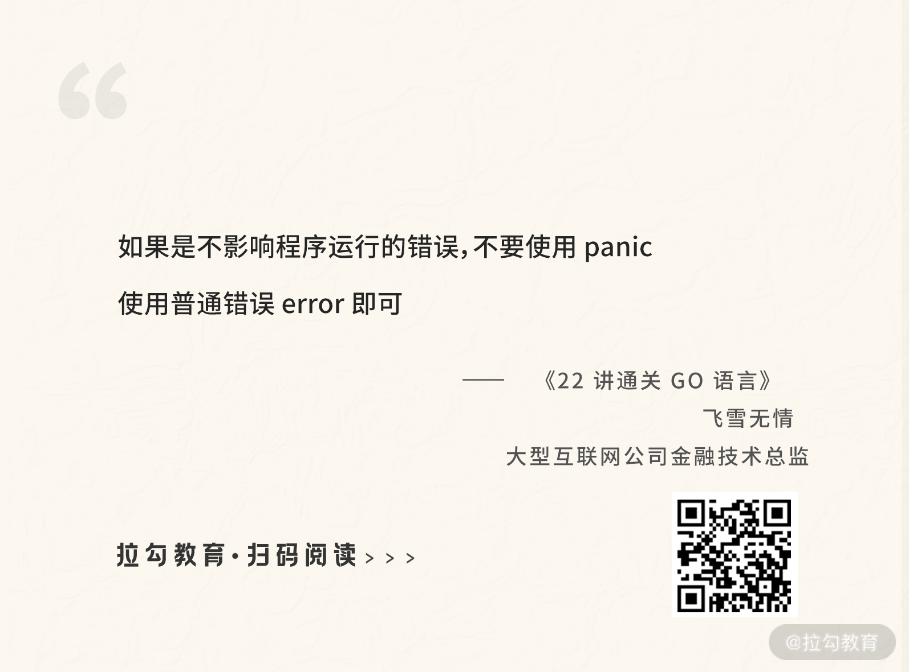

# 07 错误处理

：如何通过 error、deferred、panic 等处理错误？

上节课我为你讲解了结构体和接口，并留了一个小作业，让你自己练习实现有两个方法的接口。现在我就以“人既会走也会跑”为例进行讲解。

首先定义一个接口 WalkRun，它有两个方法 Walk 和 Run，如下面的代码所示：

```plaintext
   Walk()
   Run()
}
```go

```plaintext
   fmt.Printf("%s能走\n",p.name)
}
func (p *person) Run(){
   fmt.Printf("%s能跑\n",p.name)
}
```go

> 提示：%s 是占位符，和 p.name 对应，也就是 p.name 的值，具体可以参考 fmt.Printf 函数的文档。

下面进行本节课的讲解。这节课我会带你学习 Go 语言的错误和异常，在我们编写程序的时候，可能会遇到一些问题，该怎么处理它们呢？

## 错误

在 Go 语言中，错误是可以预期的，并且不是非常严重，不会影响程序的运行。对于这类问题，可以用返回错误给调用者的方法，让调用者自己决定如何处理。

#### error 接口

在 Go 语言中，错误是通过内置的 error 接口表示的。它非常简单，只有一个 Error 方法用来返回具体的错误信息，如下面的代码所示：

```plaintext
   Error() string
}
```go

_**ch07/main.go**_

```plaintext
   i,err:=strconv.Atoi("a")
   if err!=nil {
      fmt.Println(err)
   }else {
      fmt.Println(i)
   }
}
```go

```plaintext

```go

```plaintext

```go

> 小提示：因为方法和函数基本上差不多，区别只在于有无接收者，所以以后当我称方法或函数，表达的是一个意思，不会把这两个名字都写出来。

#### error 工厂函数

除了可以使用其他函数，自己定义的函数也可以返回错误信息给调用者，如下面的代码所示：

_**ch07/main.go**_

```plaintext
   if a<0 || b<0 {
      return 0,errors.New("a或者b不能为负数")
   }else {
      return a+b,nil
   }
}
```go

下面的 add 函数示例，是使用 errors.New 这个工厂函数生成的错误信息，它接收一个字符串参数，返回一个 error 接口，这些在上节课的结构体和接口部分有过详细介绍，不再赘述。

_**ch07/main.go**_

```plaintext
if err!=nil {
   fmt.Println(err)
}else {
   fmt.Println(sum)
}
```go

你可能会想，上面采用工厂返回错误信息的方式只能传递一个字符串，也就是携带的信息只有字符串，如果想要携带更多信息（比如错误码信息）该怎么办呢？这个时候就需要自定义 error 。

自定义 error 其实就是先自定义一个新类型，比如结构体，然后让这个类型实现 error 接口，如下面的代码所示：

_**ch07/main.go**_

```plaintext
   errorCode int //错误码
   errorMsg string //错误信息
}
func (ce *commonError) Error() string{
   return ce.errorMsg
}
```go

_**ch07/main.go**_

```plaintext
   errorCode: 1,
   errorMsg:  "a或者b不能为负数"}
```go

#### error 断言

有了自定义的 error，并且携带了更多的错误信息后，就可以使用这些信息了。你需要先把返回的 error 接口转换为自定义的错误类型，用到的知识是上节课的类型断言。

下面代码中的 err.(\*commonError) 就是类型断言在 error 接口上的应用，也可以称为 error 断言。

_**ch07/main.go**_

```plaintext
if cm,ok:=err.(*commonError);ok{
   fmt.Println("错误代码为:",cm.errorCode,"，错误信息为：",cm.errorMsg)
} else {
   fmt.Println(sum)
}
```go

### 错误嵌套

#### Error Wrapping

error 接口虽然比较简洁，但是功能也比较弱。想象一下，假如我们有这样的需求：基于一个存在的 error 再生成一个 error，需要怎么做呢？这就是错误嵌套。

这种需求是存在的，比如调用一个函数，返回了一个错误信息 error，在不想丢失这个 error 的情况下，又想添加一些额外信息返回新的 error。这时候，我们首先想到的应该是自定义一个 struct，如下面的代码所示：

```plaintext
    err error
    msg string
}
```go

现在让 MyError 这个 struct 实现 error 接口，然后在初始化 MyError 的时候传递存在的 error 和新的错误信息，如下面的代码所示：

```plaintext
    return e.err.Error() + e.msg
}
func main() {
    //err是一个存在的错误，可以从另外一个函数返回
    newErr := MyError{err, "数据上传问题"}
}
```go

_**ch07/main.go**_

```plaintext
w := fmt.Errorf("Wrap了一个错误:%w", e)
fmt.Println(w)
```go

#### errors.Unwrap 函数

既然 error 可以包裹嵌套生成一个新的 error，那么也可以被解开，即通过 errors.Unwrap 函数得到被嵌套的 error。

Go 语言提供了 errors.Unwrap 用于获取被嵌套的 error，比如以上例子中的错误变量 w ，就可以对它进行 unwrap，获取被嵌套的原始错误 e。

下面我们运行以下代码：

```plaintext

```go

```plaintext

```go

有了 Error Wrapping 后，你会发现原来用的判断两个 error 是不是同一个 error 的方法失效了，比如 Go 语言标准库经常用到的如下代码中的方式：

```plaintext

```go

于是 Go 语言为我们提供了 errors.Is 函数，用来判断两个 error 是否是同一个，如下所示：

```plaintext

```go

- 如果 err 和 target 是同一个，那么返回 true。
- 如果 err 是一个 wrapping error，target 也包含在这个嵌套 error 链中的话，也返回 true。

可以简单地概括为，两个 error 相等或 err 包含 target 的情况下返回 true，其余返回 false。我们可以用上面的示例判断错误 w 中是否包含错误 e，试试运行下面的代码，来看打印的结果是不是 true。

```plaintext

```go

同样的原因，有了 error 嵌套后，error 断言也不能用了，因为你不知道一个 error 是否被嵌套，又嵌套了几层。所以 Go 语言为解决这个问题提供了 errors.As 函数，比如前面 error 断言的例子，可以使用 errors.As 函数重写，效果是一样的，如下面的代码所示：

_**ch07/main.go**_

```go
if errors.As(err,&cm){
   fmt.Println("错误代码为:",cm.errorCode,"，错误信息为：",cm.errorMsg)
} else {
   fmt.Println(sum)
}
```go

### Deferred 函数

在一个自定义函数中，你打开了一个文件，然后需要关闭它以释放资源。不管你的代码执行了多少分支，是否出现了错误，文件是一定要关闭的，这样才能保证资源的释放。

如果这个事情由开发人员来做，随着业务逻辑的复杂会变得非常麻烦，而且还有可能会忘记关闭。基于这种情况，Go 语言为我们提供了 defer 函数，可以保证文件关闭后一定会被执行，不管你自定义的函数出现异常还是错误。

下面的代码是 Go 语言标准包 ioutil 中的 ReadFile 函数，它需要打开一个文件，然后通过 defer 关键字确保在 ReadFile 函数执行结束后，f.Close() 方法被执行，这样文件的资源才一定会释放。

```plaintext
   f, err := os.Open(filename)
   if err != nil {
      return nil, err
   }
   defer f.Close()
   //省略无关代码
   return readAll(f, n)
}
```go

以上面的 ReadFile 函数为例，被 defer 修饰的 f.Close 方法延迟执行，也就是说会先执行 readAll(f, n)，然后在整个 ReadFile 函数 return 之前执行 f.Close 方法。

defer 语句常被用于成对的操作，如文件的打开和关闭，加锁和释放锁，连接的建立和断开等。不管多么复杂的操作，都可以保证资源被正确地释放。

### Panic 异常

Go 语言是一门静态的强类型语言，很多问题都尽可能地在编译时捕获，但是有一些只能在运行时检查，比如数组越界访问、不相同的类型强制转换等，这类运行时的问题会引起 panic 异常。

除了运行时可以产生 panic 外，我们自己也可以抛出 panic 异常。假设我需要连接 MySQL 数据库，可以写一个连接 MySQL 的函数 connectMySQL，如下面的代码所示：

_**ch07/main.go**_

```plaintext
   if ip =="" {
      panic("ip不能为空")
   }
   //省略其他代码
}
```go

panic 是 Go 语言内置的函数，可以接受 interface{} 类型的参数，也就是任何类型的值都可以传递给 panic 函数，如下所示：

```plaintext

```go

panic 异常是一种非常严重的情况，会让程序中断运行，使程序崩溃，所以 **如果是不影响程序运行的错误，不要使用 panic，使用普通错误 error 即可。**

### Recover 捕获 Panic 异常

通常情况下，我们不对 panic 异常做任何处理，因为既然它是影响程序运行的异常，就让它直接崩溃即可。但是也的确有一些特例，比如在程序崩溃前做一些资源释放的处理，这时候就需要从 panic 异常中恢复，才能完成处理。

在 Go 语言中，可以通过内置的 recover 函数恢复 panic 异常。因为在程序 panic 异常崩溃的时候，只有被 defer 修饰的函数才能被执行，所以 recover 函数要结合 defer 关键字使用才能生效。

下面的示例是通过 defer 关键字 + 匿名函数 + recover 函数从 panic 异常中恢复的方式。

_**ch07/main.go**_

```plaintext
   defer func() {
      if p:=recover();p!=nil{
         fmt.Println(p)
      }
   }()
   connectMySQL("","root","123456")
}
```go

```plaintext

```go

### 总结

这节课主要讲了 Go 语言的错误处理机制，包括 error、defer、panic 等。在 error、panic 这两种错误机制中，Go 语言更提倡 error 这种轻量错误，而不是 panic。
