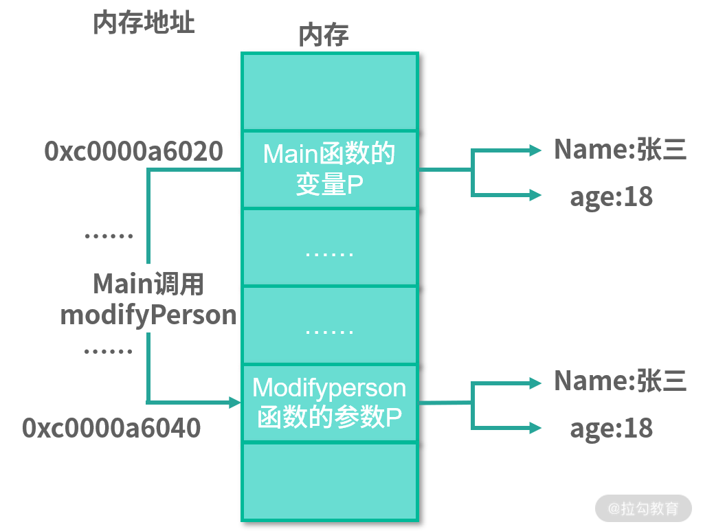
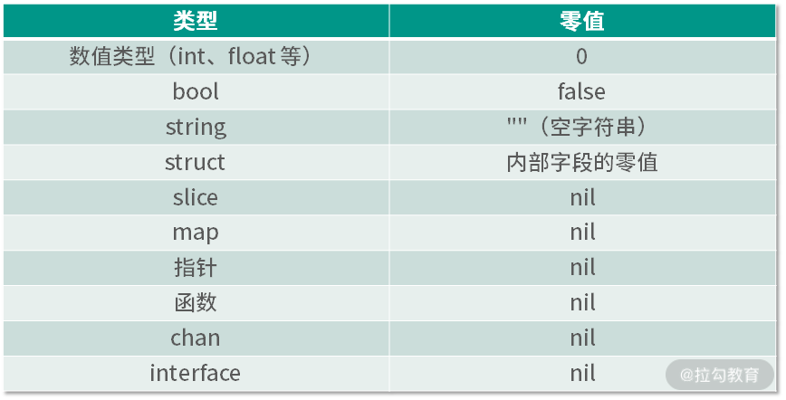

# 13 参数传递

：值、引用及指针之间的区别？

上节课我留了一个思考题，关于指向接口的指针的思考。在[“第 6 讲| struct 和 interface：结构体与接口都实现了哪些功能？”]中，你已经知道了如何实现一个接口，并且也知道如果值接收者实现了接口，那么值的指针也就实现了该接口。现在我们再一起来复习一下接口实现的知识，然后再解答关于指向接口的指针的思考题。

在下面的代码中，值类型 address 作为接收者实现了接口 fmt.Stringer，那么它的指针类型 \*address 也就实现了接口 fmt.Stringer。

_**ch13/main.go**_

```plaintext
   province string
   city string
}
func (addr address) String()  string{
   return fmt.Sprintf("the addr is %s%s",addr.province,addr.city)
}

```go

_**ch13/main.go**_

```plaintext
   add := address{province: "北京", city: "北京"}
   printString(add)
   printString(&add)
}
func printString(s fmt.Stringer) {
   fmt.Println(s.String())
}

```go

_**ch13/main.go**_

```go
var si fmt.Stringer =address{province: "上海",city: "上海"}
printString(si)
sip:=&si
printString(sip)

```go

接着你可以使用 sip:=&si 这样的操作获得一个指向接口的指针，这是没有问题的。不过最终你无法把指向接口的指针 sip 作为参数传递给函数 printString，Go 语言的编译器会提示你如下错误信息：

```plaintext
 *fmt.Stringer is pointer to interface, not interface

```go

所以你几乎从不需要一个指向接口的指针，把它忘掉吧，不要让它在你的代码中出现。

通过这个思考题，相信你也对 Go 语言的值类型、引用类型和指针等概念有了一定的了解，但可能也存在一些迷惑。这节课我将更深入地分析这些概念。

## 修改参数

假设你定义了一个函数，并在函数里对参数进行修改，想让调用者可以通过参数获取你最新修改的值。我仍然以前面课程用到的 person 结构体举例，如下所示：

_**ch13/main.go**_

```plaintext
   p:=person{name: "张三",age: 18}
   modifyPerson(p)
   fmt.Println("person name:",p.name,",age:",p.age)
}
func modifyPerson(p person)  {
   p.name = "李四"
   p.age = 20
}
type person struct {
   name string
   age int
}

```go

```plaintext

```go

```plaintext
func modifyPerson(p *person)  {
   p.name = "李四"
   p.age = 20
}

```go

```plaintext

```go

在上面的小节中，我定义的普通变量 p 是 person 类型的。在 Go 语言中，person 是一个值类型，而 &p 获取的指针是 \*person 类型的，即指针类型。那么为什么值类型在参数传递中无法修改呢？这也要从内存讲起。

在上节课中，我们已经知道变量的值是存储在内存中的，而内存都有一个编号，称为内存地址。所以要想修改内存中的数据，就要找到这个内存地址。现在，我来对比值类型变量在函数内外的内存地址，如下所示：

_**ch13/main.go**_

```plaintext
   p:=person{name: "张三",age: 18}
   fmt.Printf("main函数：p的内存地址为%p\n",&p)
   modifyPerson(p)
   fmt.Println("person name:",p.name,",age:",p.age)
}
func modifyPerson(p person)  {
   fmt.Printf("modifyPerson函数：p的内存地址为%p\n",&p)
   p.name = "李四"
   p.age = 20
}

```go

```plaintext
modifyPerson函数：p的内存地址为0xc0000a6040
person name: 张三 ,age: 18

```go

导致这种结果的原因是 **Go 语言中的函数传参都是值传递。** 值传递指的是传递原来数据的一份拷贝，而不是原来的数据本身。



（main 函数调用 modifyPerson 函数传参内存示意图）

以 modifyPerson 函数来说，在调用 modifyPerson 函数传递变量 p 的时候，Go 语言会拷贝一个 p 放在一个新的内存中，这样新的 p 的内存地址就和原来不一样了，但是里面的 name 和 age 是一样的，还是张三和 18。这就是副本的意思，变量里的数据一样，但是存放的内存地址不一样。

除了 struct 外，还有浮点型、整型、字符串、布尔、数组，这些都是值类型。

### 指针类型

指针类型的变量保存的值就是数据对应的内存地址，所以在函数参数传递是传值的原则下，拷贝的值也是内存地址。现在对以上示例稍做修改，修改后的代码如下：

```plaintext
   p:=person{name: "张三",age: 18}
   fmt.Printf("main函数：p的内存地址为%p\n",&p)
   modifyPerson(&p)
   fmt.Println("person name:",p.name,",age:",p.age)
}
func modifyPerson(p *person)  {
   fmt.Printf("modifyPerson函数：p的内存地址为%p\n",p)
   p.name = "李四"
   p.age = 20
}

```go

```plaintext
modifyPerson函数：p的内存地址为0xc0000a6020
person name: 李四 ,age: 20

```go

> 小提示：值传递的是指针，也是内存地址。通过内存地址可以找到原数据的那块内存，所以修改它也就等于修改了原数据。

### 引用类型

下面要介绍的是引用类型，包括 map 和 chan。

#### map

对于上面的例子，假如我不使用自定义的 person 结构体和指针，能不能用 map 达到修改的目的呢？

下面我来试验一下，如下所示：

_**ch13/main.go**_

```plaintext
   m:=make(map[string]int)
   m["飞雪无情"] = 18
   fmt.Println("飞雪无情的年龄为",m["飞雪无情"])
   modifyMap(m)
   fmt.Println("飞雪无情的年龄为",m["飞雪无情"])
}
func modifyMap(p map[string]int)  {
   p["飞雪无情"] =20
}

```go

```plaintext
飞雪无情的年龄为 20

```go

要想解答这个问题，就要从 make 这个 Go 语言内建的函数说起。在 Go 语言中，任何创建 map 的代码（不管是字面量还是 make 函数）最终调用的都是 runtime.makemap 函数。

> 小提示：用字面量或者 make 函数的方式创建 map，并转换成 makemap 函数的调用，这个转换是 Go 语言编译器自动帮我们做的。

从下面的代码可以看到，makemap 函数返回的是一个 \*hmap 类型，也就是说返回的是一个指针，所以我们创建的 map 其实就是一个 \*hmap。

_**src/runtime/map.go**_

```go
// makemap implements Go map creation for make(map[k]v, hint).
func makemap(t *maptype, hint int, h *hmap) *hmap{
  //省略无关代码
}

```go

为了进一步验证创建的 map 就是一个指针，我修改上述示例，打印 map 类型的变量和参数对应的内存地址，如下面的代码所示：

```plaintext
  //省略其他没有修改的代码
  fmt.Printf("main函数：m的内存地址为%p\n",m)
}
func modifyMap(p map[string]int)  {
   fmt.Printf("modifyMap函数：p的内存地址为%p\n",p)
   //省略其他没有修改的代码
}

```go

```plaintext
main函数：m的内存地址为0xc000060180
modifyMap函数：p的内存地址为0xc000060180
飞雪无情的年龄为 20

```go

所以在这里，Go 语言通过 make 函数或字面量的包装为我们省去了指针的操作，让我们可以更容易地使用 map。其实就是语法糖，这是编程界的老传统了。

> 注意：这里的 map 可以理解为引用类型，但是它本质上是个指针，只是可以叫作引用类型而已。在参数传递时，它还是值传递，并不是其他编程语言中所谓的引用传递。

#### chan

还记得我们在 Go 语言并发模块中学的 channel 吗？它也可以理解为引用类型，而它本质上也是个指针。

通过下面的源代码可以看到，所创建的 chan 其实是个 \*hchan，所以它在参数传递中也和 map 一样。

```plaintext
    //省略无关代码
}

```go

> 小提示：指针类型也可以理解为是一种引用类型。

### 类型的零值

在 Go 语言中，定义变量要么通过声明、要么通过 make 和 new 函数，不一样的是 make 和 new 函数属于显式声明并初始化。如果我们声明的变量没有显式声明初始化，那么该变量的默认值就是对应类型的零值。

从下面的表格可以看到，可以称为引用类型的零值都是 nil。



(各种类型的零值)

### 总结

在 Go 语言中，**函数的参数传递只有值传递**，而且传递的实参都是原始数据的一份拷贝。如果拷贝的内容是值类型的，那么在函数中就无法修改原始数据；如果拷贝的内容是指针（或者可以理解为引用类型 map、chan 等），那么就可以在函数中修改原始数据。


所以我们在创建一个函数的时候，要根据自己的真实需求决定参数的类型，以便更好地服务于我们的业务。

这节课中，我讲解 chan 的时候没有举例，你自己可以自定义一个有 chan 参数的函数，作为练习题。

下节课我将介绍“内存分配：new 还是 make？什么情况下该用谁？”记得来听课！
