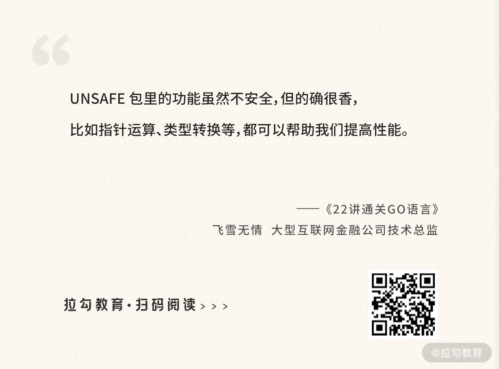

# 16 非类型安全

：让你既爱又恨的 unsafe

上节课我留了一个小作业，让你练习一下如何使用反射调用一个方法，下面我来进行讲解。

还是以 person 这个结构体类型为例。我为它增加一个方法 Print，功能是打印一段文本，示例代码如下：

```plaintext
   fmt.Printf("%s:Name is %s,Age is %d\n",prefix,p.Name,p.Age)
}
```go

```plaintext
   p:=person{Name: "飞雪无情",Age: 20}
   pv:=reflect.ValueOf(p)
   //反射调用person的Print方法
   mPrint:=pv.MethodByName("Print")
   args:=[]reflect.Value{reflect.ValueOf("登录")}
   mPrint.Call(args)
}
```go

运行以上代码，可以看到如下结果：

```plaintext

```go

下面我们继续深入 Go 的世界，这节课会介绍 Go 语言自带的 unsafe 包的高级用法。

顾名思义，unsafe 是不安全的。Go 将其定义为这个包名，也是为了让我们尽可能地不使用它。不过虽然不安全，它也有优势，那就是可以绕过 Go 的内存安全机制，直接对内存进行读写。所以有时候出于性能需要，还是会冒险使用它来对内存进行操作。

## 指针类型转换

Go 的设计者为了编写方便、提高效率且降低复杂度，将其设计成一门强类型的静态语言。强类型意味着一旦定义了，类型就不能改变；静态意味着类型检查在运行前就做了。同时出于安全考虑，Go 语言是不允许两个指针类型进行转换的。

我们一般使用 \*T 作为一个指针类型，表示一个指向类型 T 变量的指针。为了安全的考虑，两个不同的指针类型不能相互转换，比如 \*int 不能转为 \*float64。

我们来看下面的代码：

```go
func main() {
   i:= 10
   ip:=&i
   var fp *float64 = (*float64)(ip)
   fmt.Println(fp)
}
```go

### unsafe.Pointer

unsafe.Pointer 是一种特殊意义的指针，可以表示任意类型的地址，类似 C 语言里的 void\* 指针，是全能型的。

正常情况下，\*int 无法转换为 \*float64，但是通过 unsafe.Pointer 做中转就可以了。在下面的示例中，我通过 unsafe.Pointer 把 \*int 转换为 \*float64，并且对新的 \*float64 进行 3 倍的乘法操作，你会发现原来变量 i 的值也被改变了，变为 30。

_**ch16/main.go**_

```go
func main() {
   i:= 10
   ip:=&i
   var fp *float64 = (*float64)(unsafe.Pointer(ip))
   *fp = *fp * 3
   fmt.Println(i)
}
```go

```plaintext
// only and is not actually part of the unsafe package.
// It represents the type of an arbitrary Go expression.
type ArbitraryType int
type Pointer *ArbitraryType
```go

### uintptr 指针类型

uintptr 也是一种指针类型，它足够大，可以表示任何指针。它的类型定义如下所示：

```plaintext
// to hold the bit pattern of any pointer.
type uintptr uintptr
```go

在下面的代码中，我以通过指针偏移修改 struct 结构体内的字段为例，演示 uintptr 的用法。

```plaintext
   p :=new(person)
   //Name是person的第一个字段不用偏移，即可通过指针修改
   pName:=(*string)(unsafe.Pointer(p))
   *pName="飞雪无情"
   //Age并不是person的第一个字段，所以需要进行偏移，这样才能正确定位到Age字段这块内存，才可以正确的修改
   pAge:=(*int)(unsafe.Pointer(uintptr(unsafe.Pointer(p))+unsafe.Offsetof(p.Age)))
   *pAge = 20
   fmt.Println(*p)
}
type person struct {
   Name string
   Age int
}
```go

下面我详细介绍操作步骤。

1. 先使用 new 函数声明一个 \*person 类型的指针变量 p。
2. 然后把 \*person 类型的指针变量 p 通过 unsafe.Pointer，转换为 \*string 类型的指针变量 pName。
3. 因为 person 这个结构体的第一个字段就是 string 类型的 Name，所以 pName 这个指针就指向 Name 字段（偏移为 0），对 pName 进行修改其实就是修改字段 Name 的值。
4. 因为 Age 字段不是 person 的第一个字段，要修改它必须要进行指针偏移运算。所以需要先把指针变量 p 通过 unsafe.Pointer 转换为 uintptr，这样才能进行地址运算。既然要进行指针偏移，那么要偏移多少呢？这个偏移量可以通过函数 unsafe.Offsetof 计算出来，该函数返回的是一个 uintptr 类型的偏移量，有了这个偏移量就可以通过 + 号运算符获得正确的 Age 字段的内存地址了，也就是通过 unsafe.Pointer 转换后的 \*int 类型的指针变量 pAge。
5. 然后需要注意的是，如果要进行指针运算，要先通过 unsafe.Pointer 转换为 uintptr 类型的指针。指针运算完毕后，还要通过 unsafe.Pointer 转换为真实的指针类型（比如示例中的 \*int 类型），这样可以对这块内存进行赋值或取值操作。
6. 有了指向字段 Age 的指针变量 pAge，就可以对其进行赋值操作，修改字段 Age 的值了。

运行以上示例，你可以看到如下结果：

```plaintext

```go

```plaintext
   p :=new(person)
   p.Name = "飞雪无情"
   p.Age = 20
   fmt.Println(*p)
}
```go

### 指针转换规则

你已经知道 Go 语言中存在三种类型的指针，它们分别是：常用的 \*T、unsafe.Pointer 及 uintptr。通过以上示例讲解，可以总结出这三者的转换规则：

1. 任何类型的 \*T 都可以转换为 unsafe.Pointer；
2. unsafe.Pointer 也可以转换为任何类型的 \*T；
3. unsafe.Pointer 可以转换为 uintptr；
4. uintptr 也可以转换为 unsafe.Pointer。


(指针转换示意图)

可以发现，unsafe.Pointer 主要用于指针类型的转换，而且是各个指针类型转换的桥梁。uintptr 主要用于指针运算，尤其是通过偏移量定位不同的内存。

### unsafe.Sizeof

Sizeof 函数可以返回一个类型所占用的内存大小，这个大小只与类型有关，和类型对应的变量存储的内容大小无关，比如 bool 型占用一个字节、int8 也占用一个字节。

通过 Sizeof 函数你可以查看任何类型（比如字符串、切片、整型）占用的内存大小，示例代码如下：

```plaintext
fmt.Println(unsafe.Sizeof(int8(0)))
fmt.Println(unsafe.Sizeof(int16(10)))
fmt.Println(unsafe.Sizeof(int32(10000000)))
fmt.Println(unsafe.Sizeof(int64(10000000000000)))
fmt.Println(unsafe.Sizeof(int(10000000000000000)))
fmt.Println(unsafe.Sizeof(string("飞雪无情")))
fmt.Println(unsafe.Sizeof([]string{"飞雪u无情","张三"}))
```go

对于和平台有关的 int 类型，要看平台是 32 位还是 64 位，会取最大的。比如我自己测试以上输出，会发现 int 和 int64 的大小是一样的，因为我用的是 64 位平台的电脑。

> 小提示：一个 struct 结构体的内存占用大小，等于它包含的字段类型内存占用大小之和。

### 总结

unsafe 包里最常用的就是 Pointer 指针，通过它可以让你在 \*T、uintptr 及 Pointer 三者间转换，从而实现自己的需求，比如零内存拷贝或通过 uintptr 进行指针运算，这些都可以提高程序效率。

unsafe 包里的功能虽然不安全，但的确很香，比如指针运算、类型转换等，都可以帮助我们提高性能。不过我还是建议尽可能地不使用，因为它可以绕开 Go 语言编译器的检查，可能会因为你的操作失误而出现问题。当然如果是需要提高性能的必要操作，还是可以使用，比如 []byte 转 string，就可以通过 unsafe.Pointer 实现零内存拷贝，下节课我会详细讲解。  unsafe 包还有一个函数我这节课没有讲，它是 Alignof，功能就是函数名字字面的意思，比较简单，你可以自己练习使用一下，这也是这节课的思考题。记得来听下节课哦！
