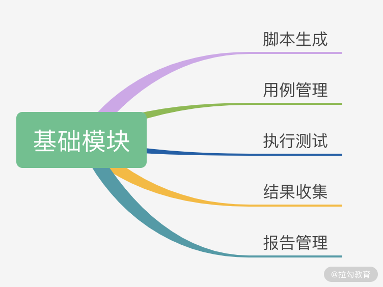
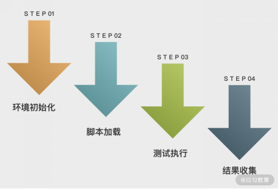
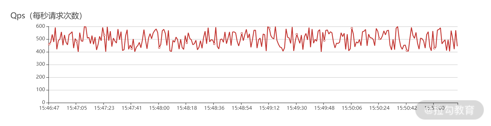

# 05 如何基于 JMeter API 开发性能测试平台？

上一讲带你学习了 JMeter 的二次开发，通过重写 JMeter 接口或抽象类可以自定义插件。这一讲我们将探讨如何基于 JMeter API 开发一个企业级的性能测试平台。

开发性能测试平台能有效减少重复劳动、提升协同效率，并实现测试数据的统一归档。对于资深测试工程师而言，具备性能测试平台的研发能力也是提升个人技术竞争力的核心加分项。

基于 JMeter API 开发性能测试平台，通常需要掌握以下知识技能：
- **扎实的 Java 开发能力**：JMeter 本身基于 Java 编写并提供了丰富的 OpenAPI；
- **前端开发能力**：平台界面通常基于 Web 呈现，主流前端框架如 Vue/React 极其实用；
- **熟悉 JMeter 源码结构与核心 API**：理解测试树 `HashTree`、采样器 `Sampler` 与监听器 `ResultCollector` 的内部运作机制。

---

## 1. 构建性能测试平台的必要性

在没有统一压测平台的情况下，团队经常面临以下痛点：
1. **沟通与同步成本高**：脚本文件通过邮件或 IM 单独发送，更新后难以实时同步；
2. **测试结果碎片化**：依靠手动截图或局部报告，信息容易缺失且难以直观比较；
3. **历史数据追溯难**：缺少统一存档与数据统计分析大屏。

打造一个具备协作共享、实时监控、历史追溯的压测平台具有重要意义。性能测试平台的基础功能架构如下图所示：



*图 1 性能测试平台基础功能*

市面上大多数性能测试平台均基于 JMeter API 搭建，其底层核心运作流程如下图所示：



*图 2 性能测试平台核心流程*

接下来我们按照 **环境初始化 -> 脚本加载 -> 测试执行 -> 结果收集** 4 个核心阶段逐一拆解。

---

## 2. 环境初始化

JMeter API 在运行时需要读取主配置文件及目录组件。环境初始化核心包含两个步骤：
1. 加载 `jmeter.properties` 主配置文件属性至 `JMeterUtils`；
2. 设置 JMeter 安装根目录（以便加载 `saveservice.properties` 等运行依赖）。

配置代码如下：

```java
// 1. 加载 JMeter 主配置文件
JMeterUtils.loadJMeterProperties("C:/Program Files/JMeter/bin/jmeter.properties");
// 2. 设置 JMeter 安装目录
JMeterUtils.setJMeterHome("C:/Program Files/JMeter");
// 3. 初始化语言资源环境
JMeterUtils.initLocale();
```

---

## 3. 脚本加载与 HashTree 构建

`HashTree` 是 JMeter 中最核心的数据结构。脚本加载有两种常见方式：**解析本地 JMX 脚本** 与 **纯代码 API 动态创建**。

### 方式 A：解析本地已有 JMX 文件

通过 `SaveService.loadTree` 将 JMX 文件直接加载为内存中的 `HashTree`：

```java
// 解析并加载本地 .jmx 脚本文件
File jmxFile = new File("C:/test/demo.jmx");
HashTree jmxTree = SaveService.loadTree(jmxFile);
```

### 方式 B：纯代码 API 动态构建 JMX 脚本文件

创建 JMX 脚本的整体流转步骤如下图所示：


*图 3 脚本文件创建步骤*

在 JMX 的树形结构中，最外层是 `TestPlan`，其节点下挂载 `ThreadGroup`、`LoopController`、`HTTPSamplerProxy` 和 `ResultCollector`。通过 API 构建脚本包含以下 6 个步骤：

#### 步骤 1：创建测试计划 (TestPlan)

```java
TestPlan testPlan = new TestPlan("自动化压测计划");
testPlan.setProperty(TestElement.TEST_CLASS, TestPlan.class.getName());
testPlan.setProperty(TestElement.GUI_CLASS, TestPlanGui.class.getName());
testPlan.setUserDefinedVariables((Arguments) new ArgumentsPanel().createTestElement());
```

#### 步骤 2：创建线程组 (ThreadGroup)

```java
ThreadGroup threadGroup = new ThreadGroup();
threadGroup.setName("并发用户线程组");
threadGroup.setNumThreads(10); // 设置并发线程数
threadGroup.setRampUp(2);       // 设置 Ramp-up 时间 (秒)
threadGroup.setProperty(TestElement.TEST_CLASS, ThreadGroup.class.getName());
threadGroup.setProperty(TestElement.GUI_CLASS, ThreadGroupGui.class.getName());
```

#### 步骤 3：创建循环控制器 (LoopController)

```java
LoopController loopController = new LoopController();
loopController.setLoops(1); // 设置循环次数 (1次)
loopController.setFirst(true);
loopController.setProperty(TestElement.TEST_CLASS, LoopController.class.getName());
loopController.setProperty(TestElement.GUI_CLASS, LoopControlPanel.class.getName());
loopController.initialize();

threadGroup.setSamplerController(loopController);
```

#### 步骤 4：创建 HTTP 采样器 (HTTPSamplerProxy)

```java
HTTPSamplerProxy httpSamplerProxy = new HTTPSamplerProxy();
httpSamplerProxy.setName("HTTP 接口测试采样器");
httpSamplerProxy.setDomain("127.0.0.1");
httpSamplerProxy.setPort(8080);
httpSamplerProxy.setPath("/index");
httpSamplerProxy.setMethod("GET");
httpSamplerProxy.setProperty(TestElement.TEST_CLASS, HTTPSamplerProxy.class.getName());
httpSamplerProxy.setProperty(TestElement.GUI_CLASS, HttpTestSampleGui.class.getName());
```

#### 步骤 5：创建结果收集器 (ResultCollector)

```java
ResultCollector resultCollector = new ResultCollector();
resultCollector.setName("结果收集器");
resultCollector.setProperty(TestElement.TEST_CLASS, ResultCollector.class.getName());
resultCollector.setProperty(TestElement.GUI_CLASS, TestBeanGUI.class.getName());
```

#### 步骤 6：组装 HashTree 并生成 JMX 脚本文件

```java
try {
    // 1. 构建子哈希树
    HashTree subTree = new HashTree();
    subTree.add(httpSamplerProxy);
    subTree.add(loopController);
    subTree.add(threadGroup);
    subTree.add(resultCollector);

    // 2. 挂载到父节点 TestPlan 下
    HashTree tree = new HashTree();
    tree.add(testPlan, subTree);

    // 3. 持久化导出为 test.jmx 文件
    SaveService.saveTree(tree, new FileOutputStream("test.jmx"));
} catch (IOException e) {
    e.printStackTrace();
}
```

---

## 4. 测试执行

获取到 `HashTree` 结构后，可直接驱动 `StandardJMeterEngine` 引擎进行底层压测：

```java
// 实例化 JMeter 引擎并加载配置树
StandardJMeterEngine engine = new StandardJMeterEngine();
engine.configure(jmxTree);

// 启动执行测试 (非阻塞或阻塞运行)
engine.run();
```

---

## 5. 实时结果收集与指标推送

压测平台需要实时展示 QPS、响应耗时、错误率等指标。其结果收集架构如下图所示：


*图 4 结果收集流程图*

### 核心实现原理：继承 `ResultCollector` 重写 `sampleOccurred`

JMeter 每次 Loop 完成一个请求后都会触发 `ResultCollector.sampleOccurred(SampleEvent event)` 回调。我们可以通过重写该方法获取单次请求的指标数据并推送至消息中间件（如 Kafka），再由后端消费后通过 WebSocket 实时推送到前端 Dashboard 展示。

#### 1. 扩展 `ResultCollector` （基于 Kafka 发送实时数据）

```java
public class CCTestResultCollector extends ResultCollector {
    public static final String REQUEST_COUNT = "requestCount";

    public CCTestResultCollector() {
        super();
    }

    public CCTestResultCollector(Summariser summer) {
        super(summer);
    }

    @Override
    public void sampleOccurred(SampleEvent event) {
        super.sampleOccurred(event);
        
        // 从 SampleEvent 提取请求数据并写入 Kafka
        if (event.getResult() != null) {
            long responseTime = event.getResult().getTime();
            boolean success = event.getResult().isSuccessful();
            
            // 将实时采样数据发送至 Kafka
            producer.send(new ProducerRecord<>("monitorData", "requestCount", 1));
        }
    }
}
```

#### 2. 后端接收并计算指标

```java
@RestController
@RequestMapping("/api/monitor")
public class MonitorController {

    @PostMapping("/getMonitorData")
    public Result getMonitorData(@RequestBody MonitorDataReq monitorDataReq) {
        Map<String, Object> monitorDataMap = new HashMap<>();

        // 轮询消费 Kafka 队列中的指标数据
        ConsumerRecords<String, String> records = consumer.poll(Duration.ofMillis(1000));
        for (ConsumerRecord<String, String> r : records) {
            if ("requestCount".equals(r.key())) {
                // 计算实时 QPS，汇总放入 monitorDataMap
                monitorDataMap.put("qps", r.value());
            }
        }

        return Result.resultSuccess(monitorDataMap);
    }
}
```

实时看板最终展示效果如下图所示：



*图 5 压测平台实时渲染效果*

---

## 总结

本讲介绍了性能测试平台的模块设计，以及 JMeter API 核心的 4 个阶段：**环境初始化、脚本加载、测试执行和结果收集**。同时对基于 `ResultCollector` 和 Kafka 的实时指标采集方案做了详细剖析与紧凑的代码示范。

借助 JMeter API，技术团队可以轻松打造出高可定制、可协同共享的企业级性能测试平台。
