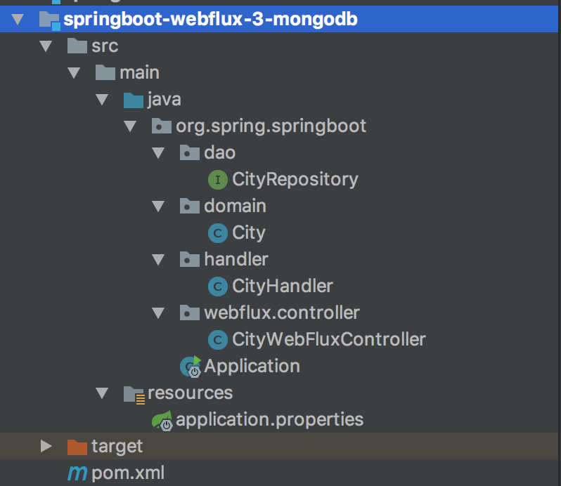
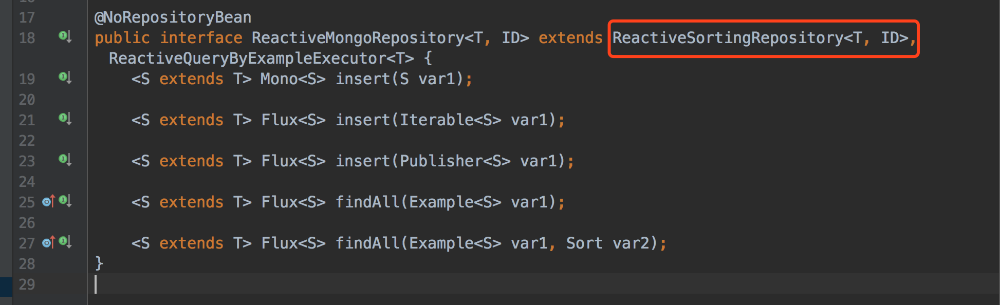
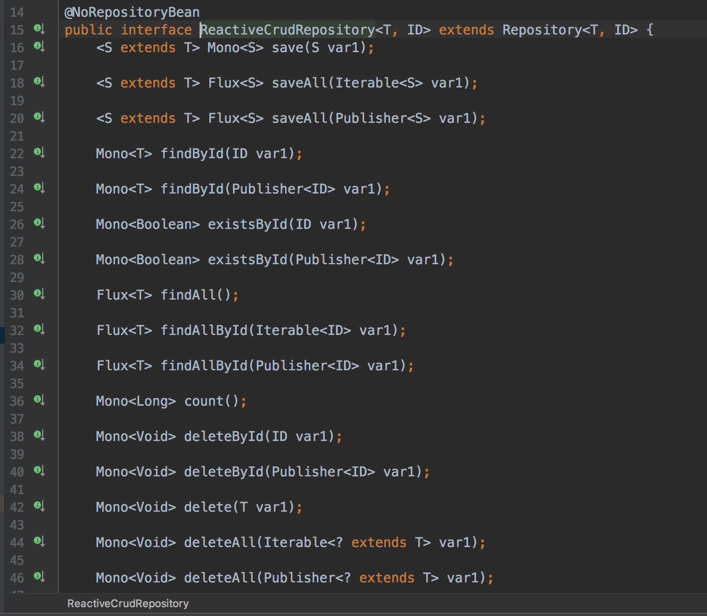
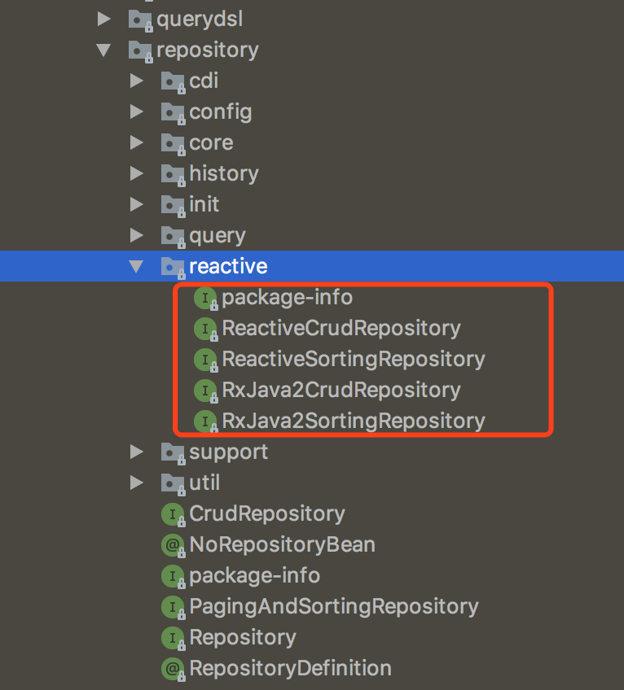
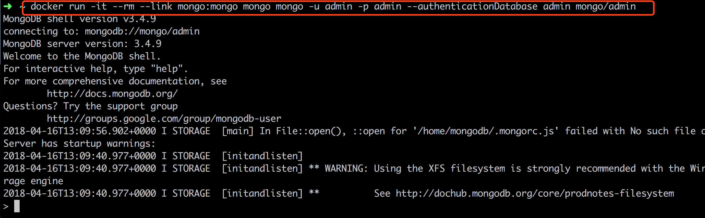
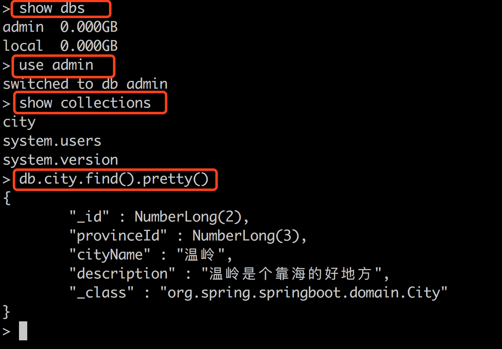

# 04 WebFlux 整合 MongoDB

上一课的内容讲解了用 Map 数据结构在内存中存储数据，这种方式数据无法持久化。本文我们将使用 MongoDB 来实现 WebFlux 响应式数据源的持久化操作。

## 1. 前言与环境准备

### 什么是 MongoDB？

[MongoDB](https://www.mongodb.com/) 是一个基于分布式文件存储的 NoSQL 数据库，由 C++ 语言编写，旨在为 Web 应用提供可扩展的高性能数据存储解决方案。MongoDB 介于关系型与非关系型数据库之间，是非关系型数据库中功能最丰富、最像关系型数据库的产品。

为方便演示，本文使用 Docker 启动一个 MongoDB 服务：

#### 1. 创建数据卷挂载目录

```shell
docker volume create mongo_data_db
docker volume create mongo_data_configdb
```

#### 2. 启动 MongoDB 容器

```shell
docker run -d     --name mongo     -v mongo_data_configdb:/data/configdb     -v mongo_data_db:/data/db     -p 27017:27017     mongo     --auth
```

#### 3. 初始化管理员账号

```shell
docker exec -it mongo mongo admin
```

在 MongoDB Shell 中创建最高权限 root 用户：

```js
db.createUser({ user: 'admin', pwd: 'admin', roles: [ { role: "root", db: "admin" } ] });
```

#### 4. 测试连通性

```shell
docker run -it --rm --link mongo:mongo mongo mongo -u admin -p admin --authenticationDatabase admin mongo/admin
```

### MongoDB 常用基础命令

在 MongoDB Shell 中常用命令如下：

```javascript
// 显示数据库列表
show dbs

// 切换到指定数据库
use admin

// 显示集合（表）列表
show collections

// 格式化显示 city 集合内容
db.city.find().pretty()
```

---

## 2. 工程结构与 POM 依赖

新建一个 WebFlux 整合 MongoDB 的示例工程，目录结构如下：



核心文件分布：
- `pom.xml`：Maven 依赖配置；
- `application.properties`：数据库连接配置文件；
- `dao`：响应式数据访问层（Reactive Repository）。

### 引入 Reactive MongoDB 依赖

在 `pom.xml` 中添加 Spring Boot 响应式 MongoDB 依赖：

```xml
<dependency>
    <groupId>org.springframework.boot</groupId>
    <artifactId>spring-boot-starter-data-mongodb-reactive</artifactId>
</dependency>
```

### 配置 `application.properties`

在 `application.properties` 中添加连接配置：

```properties
spring.data.mongodb.host=localhost
spring.data.mongodb.port=27017
spring.data.mongodb.database=admin
spring.data.mongodb.username=admin
spring.data.mongodb.password=admin
```

> **为什么响应式选型推荐 MongoDB 而非传统 JDBC MySQL？**
> 
> Spring Data Reactive Repositories 强调的是 **全链路非阻塞（Reactive / Non-blocking）** 特性。目前官方支持 NoSQL 数据库（Mongo、Cassandra、Redis、Couchbase）。而传统 JDBC 基于阻塞式 I/O 模型，每个数据库 Connection 操作都会阻塞底层调用线程。

---

## 3. 实体类定义

创建 `City` 城市实体对象：

```java
package org.spring.springboot.domain;

import org.springframework.data.annotation.Id;

/**
 * 城市实体类
 */
public class City {

    /** 城市编号，@Id 标识主键 */
    @Id
    private Long id;

    /** 省份编号 */
    private Long provinceId;

    /** 城市名称 */
    private String cityName;

    /** 描述 */
    private String description;

    public Long getId() {
        return id;
    }

    public void setId(Long id) {
        this.id = id;
    }

    public Long getProvinceId() {
        return provinceId;
    }

    public void setProvinceId(Long provinceId) {
        this.provinceId = provinceId;
    }

    public String getCityName() {
        return cityName;
    }

    public void setCityName(String cityName) {
        this.cityName = cityName;
    }

    public String getDescription() {
        return description;
    }

    public void setDescription(String description) {
        this.description = description;
    }
}
```

---

## 4. 响应式 DAO 层设计 (`CityRepository`)

创建 `CityRepository` 接口，继承 `ReactiveMongoRepository`：

```java
package org.spring.springboot.dao;

import org.spring.springboot.domain.City;
import org.springframework.data.mongodb.repository.ReactiveMongoRepository;
import org.springframework.stereotype.Repository;

@Repository
public interface CityRepository extends ReactiveMongoRepository<City, Long> {
}
```

继承 `ReactiveMongoRepository` 后，默认继承了丰富响应式 CRUD 方法：

```java
<S extends T> Mono<S> insert(S entity);
<S extends T> Flux<S> insert(Iterable<S> entities);
<S extends T> Flux<S> insert(Publisher<S> entities);
<S extends T> Flux<S> findAll(Example<S> example);
<S extends T> Flux<S> findAll(Example<S> example, Sort sort);
```

类继承关系结构图：





### Spring Data 方法命名规范表

Spring Data 框架支持根据接口方法名推导查询语句，规则如下：

| 关键字 | 方法命名示范 | 生成的表达式语义 |
| --- | --- | --- |
| **And** | `findByNameAndPwd` | `where name = ? and pwd = ?` |
| **Or** | `findByNameOrSex` | `where name = ? or sex = ?` |
| **Is** | `findById` | `where id = ?` |
| **Between** | `findByIdBetween` | `where id between ? and ?` |
| **Like** | `findByNameLike` | `where name like ?` |
| **NotLike** | `findByNameNotLike` | `where name not like ?` |
| **OrderBy** | `findByIdOrderByXDesc` | `where id = ? order by x desc` |
| **Not** | `findByNameNot` | `where name <> ?` |

复杂 Query 查询声明示例：

```java
public interface PersonRepository extends ReactiveMongoRepository<Person, String> {

    Flux<Person> findByLastname(String lastname);

    @Query("{ 'firstname': ?0, 'lastname': ?1}")
    Mono<Person> findByFirstnameAndLastname(String firstname, String lastname);

    // 支持响应式类型参数延迟执行
    Flux<Person> findByLastname(Mono<String> lastname);

    @Tailable // 开启可追踪游标 (Tailable Cursor)
    Flux<Person> findWithTailableCursorBy();
}
```

源码抽象结构包路径：



---

## 5. Handler 与 WebFlux Controller 层实现

### 1. 业务处理类 `CityHandler`

```java
package org.spring.springboot.handler;

import org.spring.springboot.dao.CityRepository;
import org.spring.springboot.domain.City;
import org.springframework.beans.factory.annotation.Autowired;
import org.springframework.stereotype.Component;
import reactor.core.publisher.Flux;
import reactor.core.publisher.Mono;

@Component
public class CityHandler {

    private final CityRepository cityRepository;

    @Autowired
    public CityHandler(CityRepository cityRepository) {
        this.cityRepository = cityRepository;
    }

    public Mono<City> save(City city) {
        return cityRepository.save(city);
    }

    public Mono<City> findCityById(Long id) {
        return cityRepository.findById(id);
    }

    public Flux<City> findAllCity() {
        return cityRepository.findAll();
    }

    public Mono<City> modifyCity(City city) {
        return cityRepository.save(city);
    }

    public Mono<Long> deleteCity(Long id) {
        return cityRepository.deleteById(id)
                .then(Mono.just(id));
    }
}
```

### 2. 控制器类 `CityWebFluxController`

```java
package org.spring.springboot.controller;

import org.spring.springboot.domain.City;
import org.spring.springboot.handler.CityHandler;
import org.springframework.beans.factory.annotation.Autowired;
import org.springframework.web.bind.annotation.*;
import reactor.core.publisher.Flux;
import reactor.core.publisher.Mono;

@RestController
@RequestMapping(value = "/city")
public class CityWebFluxController {

    @Autowired
    private CityHandler cityHandler;

    @GetMapping(value = "/{id}")
    public Mono<City> findCityById(@PathVariable("id") Long id) {
        return cityHandler.findCityById(id);
    }

    @GetMapping
    public Flux<City> findAllCity() {
        return cityHandler.findAllCity();
    }

    @PostMapping
    public Mono<City> saveCity(@RequestBody City city) {
        return cityHandler.save(city);
    }

    @PutMapping
    public Mono<City> modifyCity(@RequestBody City city) {
        return cityHandler.modifyCity(city);
    }

    @DeleteMapping(value = "/{id}")
    public Mono<Long> deleteCity(@PathVariable("id") Long id) {
        return cityHandler.deleteCity(id);
    }
}
```

---

## 6. 运行工程与接口验证

### 1. Maven 构建项目

```shell
cd springboot-webflux-3-mongodb
mvn clean install
```

控制台成功输出：

```text
[INFO] ------------------------------------------------------------------------
[INFO] BUILD SUCCESS
[INFO] ------------------------------------------------------------------------
[INFO] Total time: 01:30 min
[INFO] Finished at: 2026-07-30T10:00:54+08:00
[INFO] Final Memory: 31M/174M
[INFO] ------------------------------------------------------------------------
```

### 2. 启动应用

在主程序类中运行，控制台输出 Netty 启动在 8080 端口：

```text
2026-07-30 08:43:39.932  INFO 2052 --- [ctor-http-nio-1] r.ipc.netty.tcp.BlockingNettyContext     : Started HttpServer on /0:0:0:0:0:0:0:0:8080
2026-07-30 08:43:39.935  INFO 2052 --- [           main] o.s.b.web.embedded.netty.NettyWebServer  : Netty started on port(s): 8080
2026-07-30 08:43:39.960  INFO 2052 --- [           main] org.spring.springboot.Application        : Started Application in 6.547 seconds
```

### 3. 使用 Postman 发送请求测试

新增城市信息 POST 请求 `http://127.0.0.1:8080/city`：


### 4. 验证 MongoDB 中的数据

再次连接 MongoDB 容器验证：

```shell
docker run -it --rm --link mongo:mongo mongo mongo -u admin -p admin --authenticationDatabase admin mongo/admin
```



在 MongoDB 中查询新增数据：

```javascript
use admin
db.city.find().pretty()
```



---

## 总结

本文介绍了如何基于 Spring WebFlux 整合响应式 MongoDB 实现非阻塞的数据持久化 CRUD 操作。掌握这一模式后，整合 Cassandra、Redis 等其他响应式数据源同样大同小异。下一课我们将学习整合 Thymeleaf 实现视图层的高效响应式渲染。
