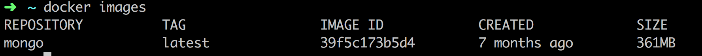
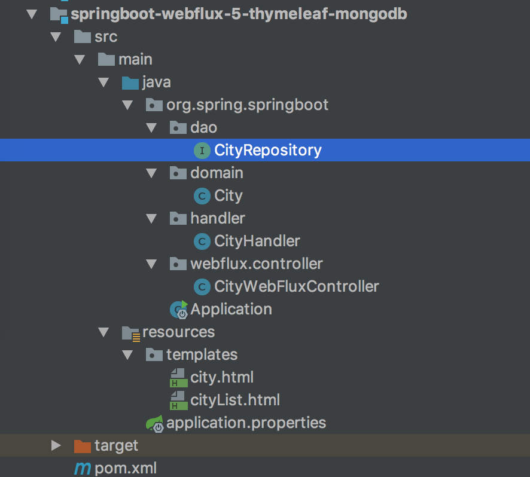
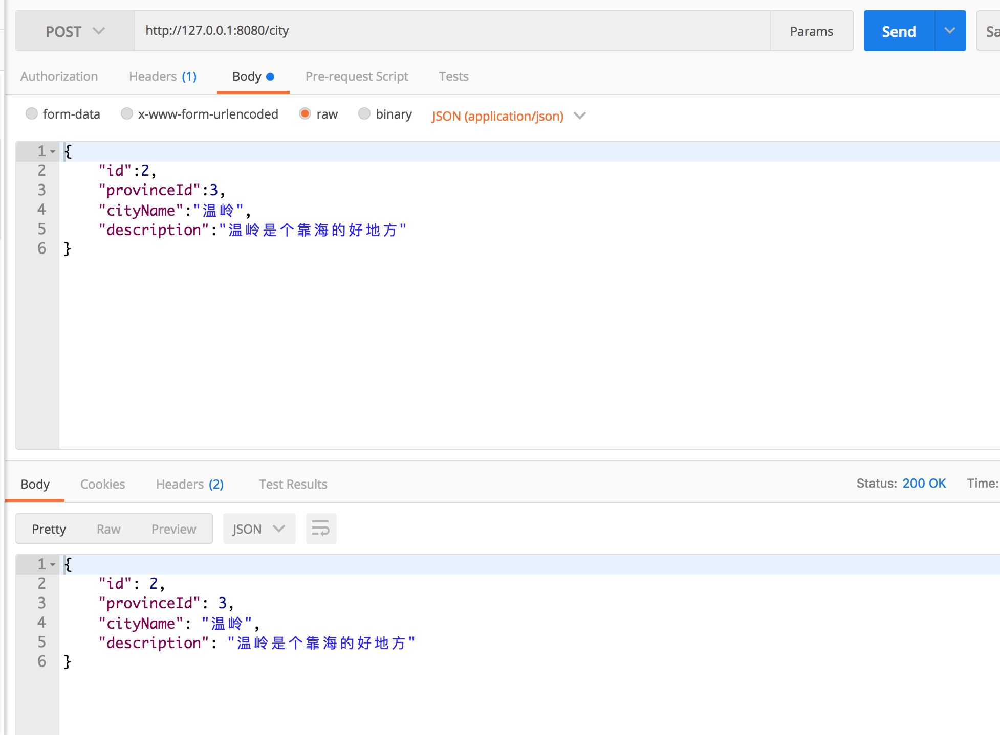
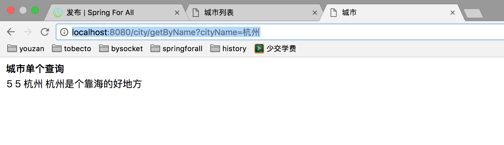
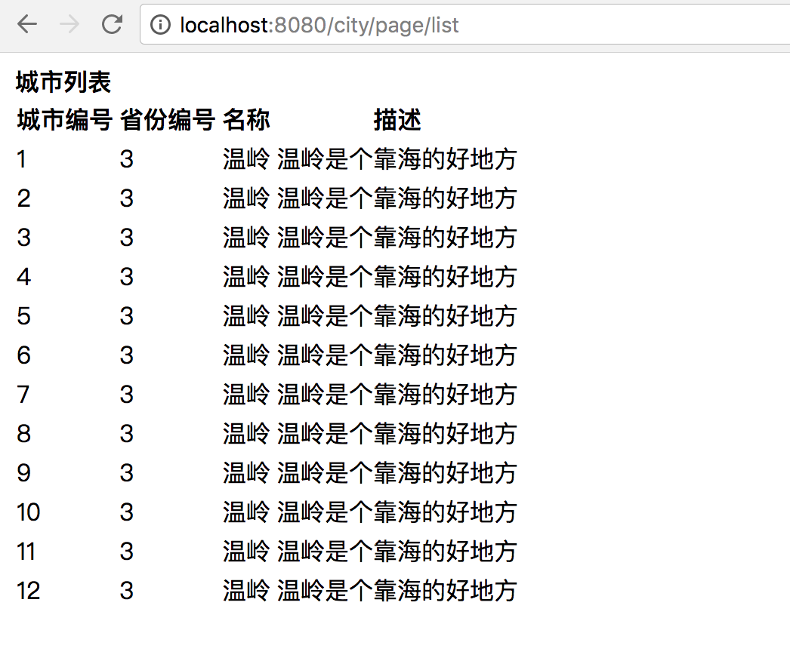

# 06 WebFlux 中 Thymeleaf 和 MongoDB 实践

## 前言

本节内容主要还是总结上面两篇内容的操作，并实现一个复杂查询的小案例，那么没安装 MongoDB 的可以进行下面的安装流程。

下面使用 Docker 安装并启动 MongoDB。

（1）创建挂载目录：

```shell
docker volume create mongo_data_db
docker volume create mongo_data_configdb
```

（2）启动 MongoDB：

```shell
docker run -d \
    --name mongo \
    -v mongo_data_configdb:/data/configdb \
    -v mongo_data_db:/data/db \
    -p 27017:27017 \
    mongo \
    --auth
```

（3）初始化管理员账号：

```shell
docker exec -it mongo mongo admin
```

进入 MongoDB Shell 后，创建最高权限用户：

```javascript
db.createUser({ user: 'admin', pwd: 'admin', roles: [ { role: "root", db: "admin" } ] });
```

（4）测试连通性：

```shell
docker run -it --rm --link mongo:mongo mongo mongo -u admin -p admin --authenticationDatabase admin mongo/admin
```

## MongoDB 基本操作

MongoDB Shell 的常用操作如下。

显示数据库列表：

```shell
show dbs
```

使用某数据库：

```shell
use admin
```

显示表列表：

```shell
show collections
```

如果存在 city 表，格式化显示 city 表内容：

```shell
db.city.find().pretty()
```

如果已经安装过 MongoDB，只需重新启动容器即可。

查看已有的镜像：

```shell
 docker images
```



然后执行 `docker start mongo` 即可。这里的 `mongo` 是容器名称。

## 结构

类似上面讲的工程搭建，新建一个工程编写此案例，工程如图：



核心目录如下：

- pom.xml Maven 依赖配置
- `application.properties` 配置文件，设置 MongoDB 连接属性
- dao 数据访问层
- controller 展示层实现

## 新增 POM 依赖与配置

在 `pom.xml` 中新增以下依赖：

```xml
    <!-- Spring Boot 响应式 MongoDB 依赖 -->
    <dependency>
      <groupId>org.springframework.boot</groupId>
      <artifactId>spring-boot-starter-data-mongodb-reactive</artifactId>
    </dependency>
    <!-- 模板引擎 Thymeleaf 依赖 -->
    <dependency>
      <groupId>org.springframework.boot</groupId>
      <artifactId>spring-boot-starter-thymeleaf</artifactId>
    </dependency>
```

配置依赖后，还需要在 `application.properties` 中配置 MongoDB 连接信息。

下面示例使用 `admin` 数据库，用户名和密码也都为 `admin`：

```properties
spring.data.mongodb.host=localhost
spring.data.mongodb.database=admin
spring.data.mongodb.port=27017
spring.data.mongodb.username=admin
spring.data.mongodb.password=admin
```

## MongoDB 数据访问层 CityRepository

修改 CityRepository 类，代码如下：

```java
import org.spring.springboot.domain.City;
import org.springframework.data.mongodb.repository.ReactiveMongoRepository;
import org.springframework.stereotype.Repository;
@Repository
public interface CityRepository extends ReactiveMongoRepository<City, Long> {
    Mono<City> findByCityName(String cityName);
}
```

CityRepository 接口只要继承 ReactiveMongoRepository 类即可。

这里实现了通过城市名找出唯一的城市对象方法：

```java
Mono<City> findByCityName(String cityName);
```

复杂查询也很简单：只要遵循 Spring Data 的接口命名规范，就可以生成类似 MySQL `WHERE` 条件的查询。`findByXxx` 中的 `Xxx` 可以映射任意实体字段，包括主键。

接口命名遵循固定规范，常用关键字和示例如下：

| 关键字 | 方法命名示例 | 含义 |
| --- | --- | --- |
| `And` | `findByNameAndPwd` | 同时满足多个条件 |
| `Or` | `findByNameOrSex` | 满足任意一个条件 |
| `Is` | `findById` | 等值查询（`Is` 通常可以省略） |
| `Between` | `findByIdBetween` | 查询指定范围内的值 |
| `Like` | `findByNameLike` | 模糊匹配 |
| `NotLike` | `findByNameNotLike` | 排除模糊匹配结果 |
| `OrderBy` | `findByIdOrderByXDesc` | 按指定字段排序 |
| `Not` | `findByNameNot` | 不等于指定值 |

## 处理器类 Handler 和控制器类 Controller

修改下 Handler，代码如下：

```java
@Component
public class CityHandler {
    private final CityRepository cityRepository;
    @Autowired
    public CityHandler(CityRepository cityRepository) {
        this.cityRepository = cityRepository;
    }
    public Mono<City> save(City city) {
        return cityRepository.save(city);
    }
    public Mono<City> findCityById(Long id) {
        return cityRepository.findById(id);
    }
    public Flux<City> findAllCity() {
        return cityRepository.findAll();
    }
    public Mono<City> modifyCity(City city) {
        return cityRepository.save(city);
    }
    public Mono<Long> deleteCity(Long id) {
        cityRepository.deleteById(id);
        return Mono.create(cityMonoSink -> cityMonoSink.success(id));
    }
    public Mono<City> getByCityName(String cityName) {
        return cityRepository.findByCityName(cityName);
    }
}
```

新增对应的方法，直接返回 Mono 对象，不需要对 Mono 进行转换，因为 Mono 本身是个对象，可以被 View 层渲染。继续修改控制器类 Controller，代码如下：

```java
    @Autowired
    private CityHandler cityHandler;
    @GetMapping(value = "/{id}")
    @ResponseBody
    public Mono<City> findCityById(@PathVariable("id") Long id) {
        return cityHandler.findCityById(id);
    }
    @GetMapping()
    @ResponseBody
    public Flux<City> findAllCity() {
        return cityHandler.findAllCity();
    }
    @PostMapping()
    @ResponseBody
    public Mono<City> saveCity(@RequestBody City city) {
        return cityHandler.save(city);
    }
    @PutMapping()
    @ResponseBody
    public Mono<City> modifyCity(@RequestBody City city) {
        return cityHandler.modifyCity(city);
    }
    @DeleteMapping(value = "/{id}")
    @ResponseBody
    public Mono<Long> deleteCity(@PathVariable("id") Long id) {
        return cityHandler.deleteCity(id);
    }
    private static final String CITY_LIST_PATH_NAME = "cityList";
    private static final String CITY_PATH_NAME = "city";
    @GetMapping("/page/list")
    public String listPage(final Model model) {
        final Flux<City> cityFluxList = cityHandler.findAllCity();
        model.addAttribute("cityList", cityFluxList);
        return CITY_LIST_PATH_NAME;
    }
    @GetMapping("/getByName")
    public String getByCityName(final Model model,
                                @RequestParam("cityName") String cityName) {
        final Mono<City> city = cityHandler.getByCityName(cityName);
        model.addAttribute("city", city);
        return CITY_PATH_NAME;
    }
```

新增 getByName 路径，指向了新的页面 city。使用 @RequestParam 接收 GET 请求入参，接收的参数为 cityName，城市名称。视图返回值 Mono 或者 String 都行。

## Thymeleaf 视图

然后编写两个视图 city 和 cityList，代码分别如下。

`city.html`：

```html
<!DOCTYPE html>
<html lang="zh-CN">
<head>
    <meta charset="UTF-8"/>
    <title>城市</title>
</head>
<body>
<div>
    <table>
        <caption>城市单个查询</caption>
        <tbody>
        <tr>
            <td th:text="${city.id}"></td>
            <td th:text="${city.provinceId}"></td>
            <td th:text="${city.cityName}"></td>
            <td th:text="${city.description}"></td>
        </tr>
        </tbody>
    </table>
</div>
</body>
</html>
```

`cityList.html`：

```html
<!DOCTYPE html>
<html lang="zh-CN">
<head>
    <meta charset="UTF-8"/>
    <title>城市列表</title>
</head>
<body>
<div>
    <table>
        <caption>城市列表</caption>
        <thead>
        <tr>
            <th>城市编号</th>
            <th>省份编号</th>
            <th>名称</th>
            <th>描述</th>
        </tr>
        </thead>
        <tbody>
        <tr th:each="city : ${cityList}">
            <td th:text="${city.id}"></td>
            <td th:text="${city.provinceId}"></td>
            <td th:text="${city.cityName}"></td>
            <td th:text="${city.description}"></td>
        </tr>
        </tbody>
    </table>
</div>
</body>
</html>
```

## 运行工程

一个 CRUD 的 Spring Boot Webflux 工程就开发完毕了，下面运行工程验证一下。使用 IDEA 右侧工具栏，单击 Maven Project Tab 按钮，然后单击使用下 Maven 插件的 install 命令；或者使用命令行的形式，在工程根目录下，执行 Maven 清理和安装工程的指令：

```shell
cd springboot-webflux-5-thymeleaf-mongodb
mvn clean install
```

在控制台中看到成功的输出：

```shell
... 省略
[INFO] ------------------------------------------------------------------------
[INFO] BUILD SUCCESS
[INFO] ------------------------------------------------------------------------
[INFO] Total time: 01:30 min
[INFO] Finished at: 2017-10-15T10:00:54+08:00
[INFO] Final Memory: 31M/174M
[INFO] ------------------------------------------------------------------------
```

在 IDEA 中运行 `Application` 类，可以选择普通模式或 Debug 模式。控制台应看到类似以下输出：

```shell
... 省略
2018-04-10 08:43:39.932  INFO 2052 --- [ctor-http-nio-1] r.ipc.netty.tcp.BlockingNettyContext     : Started HttpServer on /0:0:0:0:0:0:0:0:8080
2018-04-10 08:43:39.935  INFO 2052 --- [           main] o.s.b.web.embedded.netty.NettyWebServer  : Netty started on port(s): 8080
2018-04-10 08:43:39.960  INFO 2052 --- [           main] org.spring.springboot.Application        : Started Application in 6.547 seconds (JVM running for 9.851)
```

打开 Postman，执行以下请求进行验证。

新增城市信息：`POST http://127.0.0.1:8080/city`



打开浏览器，访问 `http://localhost:8080/city/getByName?cityName=杭州`，可以看到如下响应：



继续访问 `http://localhost:8080/city/page/list`。如果列表为空，可以按照上一篇文章的内容插入几条数据后再访问：



## 总结

本节完成了 Thymeleaf、MongoDB 与 WebFlux 的基础整合，并实现了城市数据的增删改查和页面查询。下一篇将继续整合 Redis，实现常用的缓存与锁功能。
